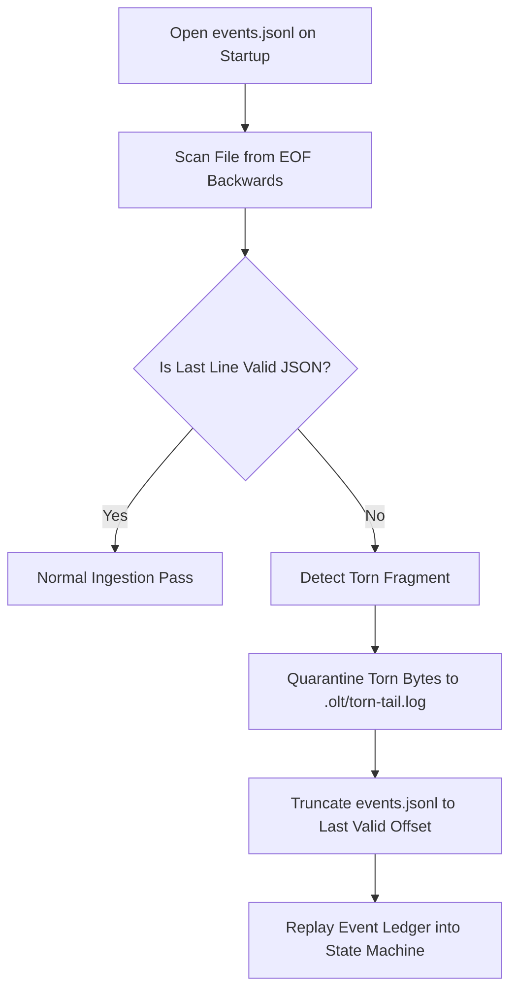

# Deduplication & Stream Hashing: Content-Addressable Storage, Rolling Digests & Immutable Event Ledgers

> **Status**: Authoritative Architecture Specification  
> **Topic**: Content-Addressable Storage (CAS), SHA-256 Rolling Stream Digests, and Cryptographic Ledger Integrity  
> **Audience**: Storage Engineers, Distributed Systems Architects, Forensic Recovery Developers

---

## 1. Executive Summary & Conceptual Overview

Large-scale multi-agent execution generates gigabytes of raw telemetry: tool invocations, shell outputs, high-resolution DOM snapshots, test coverage matrices, and intermediate code revisions. If stored naively in monolithic JSON files or mutable filesystem structures, multi-agent systems suffer from **data corruption, torn writes, merge conflicts, and unbounded storage bloat**.

The OLT storage architecture is built upon three immutable pillars:

1. **Content-Addressable Storage (CAS)**: All artifacts, receipts, AST snapshots, and screenshots are indexed by their raw cryptographic hash ($\text{SHA-256}$), achieving automatic global deduplication.
2. **Rolling Stream Digests**: High-throughput telemetry and tool stdout streams are processed using chunked rolling digests, guaranteeing in-flight integrity without memory buffering overhead.
3. **Merkle-Chained Event Ledger (`events.jsonl`)**: State transitions are appended to an immutable, POSIX-locked, `fdatasync`-guaranteed JSON-Lines ledger with cryptographic parent-hash chaining and torn-write auto-recovery.

```
                  Agent Telemetry & Artifact Stream
                                  │
                                  ▼
         ┌─────────────────────────────────────────────────┐
         │     Chunked Streaming & Rolling SHA-256         │
         │     $h_k = \text{SHA256}(h_{k-1} \parallel c_k)$│
         └────────────────────────┬────────────────────────┘
                                  │
                 ┌────────────────┴────────────────┐
                 ▼                                 ▼
   ┌───────────────────────────┐     ┌───────────────────────────┐
   │ Content-Addressable (CAS) │     │   Immutable Event Ledger  │
   │  .olt/cas/3f/8a/3f8a...   │     │        events.jsonl       │
   │ - Global Deduplication    │     │ - Merkle Hash Chaining    │
   │ - Immutable Payloads      │     │ - POSIX flock + fdatasync │
   │ - Zero Bloat              │     │ - Torn-Tail Recovery      │
   └───────────────────────────┘     └───────────────────────────┘
```

---

## 2. Content-Addressable Storage (CAS) Mechanics

### 2.1 Mathematical Addressing & Partitioning

Let $B$ be a binary blob representing an artifact (e.g. a screenshot PNG, a test coverage receipt, or an AST snapshot). The storage key $K(B)$ is computed via the standard SHA-256 cryptographic hash function:

$$K(B) = \text{SHA-256}(B) \in \{0, 1\}^{256} \xrightarrow{\text{hex}} [0-9a-f]^{64}$$

To avoid filesystem directory inode exhaustion (where filesystems degrade when a single directory holds $> 50,000$ files), OLT partitions CAS blobs using a two-tier fan-out directory structure:

$$\text{CAS Path: } \texttt{.olt/cas/} \parallel K[0..1] \parallel \texttt{/} \parallel K[2..3] \parallel \texttt{/} \parallel K[0..63] \parallel \texttt{.blob}$$

For example, a file with hash `3f8a91b2c4...` is stored at:

```text
.olt/cas/3f/8a/3f8a91b2c4...blob
```

```typescript
export function computeBlobDigest(buffer: Uint8Array): string {
  const hasher = new Bun.CryptoHasher("sha256");
  hasher.update(buffer);
  return hasher.digest("hex");
}

export function getCasStoragePath(casRoot: string, digest: string): string {
  const tier1 = digest.slice(0, 2);
  const tier2 = digest.slice(2, 4);
  return join(casRoot, tier1, tier2, `${digest}.blob`);
}
```

---

### 2.2 Global Invariant Deduplication

In multi-agent task waves, identical artifacts are frequently re-emitted (e.g. 5 subagents inspecting the same baseline `package.json` AST or identical CSS bundles across viewport tests).

```
   Task 1 Submission ──> Blob SHA: e3b0c442... ──┐
   Task 2 Submission ──> Blob SHA: e3b0c442... ──┼──> Store Single CAS File: .olt/cas/e3/b0/e3b0...
   Task 3 Submission ──> Blob SHA: e3b0c442... ──┘    (Physical Disk Savings: 66.7%)
```

Before writing a blob, OLT performs an atomic stat check. If the CAS node already exists, the filesystem write is skipped entirely, and only the 64-character hash pointer is recorded in the task receipt.

---

## 3. Rolling Stream Hashing for Large Payloads

For high-throughput tool outputs, streaming trace logs, and continuous command streams ($> 100\text{MB}$), loading entire payloads into memory causes garbage collection pauses and token bloat.

OLT processes streams in discrete chunks $C = (c_1, c_2, \dots, c_m)$ using **Incremental Rolling Digests**:

$$h_0 = \text{InitState}_{\text{SHA-256}}$$
$$h_k = \text{Update}(h_{k-1}, c_k) \quad \text{for } k = 1, \dots, m$$
$$H_{\text{final}} = \text{Finalize}(h_m)$$

```typescript
export async function streamHashPayload(
  readableStream: ReadableStream<Uint8Array>,
  targetPath: string,
): Promise<{ sha256: string; totalBytes: number }> {
  const hasher = new Bun.CryptoHasher("sha256");
  const writer = Bun.file(targetPath).writer();
  let totalBytes = 0;

  const reader = readableStream.getReader();
  while (true) {
    const { done, value } = await reader.read();
    if (done) break;
    if (value) {
      hasher.update(value);
      writer.write(value);
      totalBytes += value.byteLength;
    }
  }
  await writer.end();
  const sha256 = hasher.digest("hex");
  return { sha256, totalBytes };
}
```

---

## 4. Immutable Event Ledger (`events.jsonl`)

The lifecycle of an OLT run is recorded in `events.jsonl`. Every state change (task claims, tool invocations, reviews, gate proofs) is an append-only JSON line.

### 4.1 Merkle Event Chaining

To ensure tamper-evidence and prevent historical revisionism by rogue subagents, each event record embeds the SHA-256 hash of its immediate predecessor:

$$\text{Event}_k.\text{prev\_hash} = \text{SHA-256}(\text{RawBytes}(\text{Event}_{k-1}))$$

```
  ┌────────────────────────┐       ┌────────────────────────┐
  │ Event 101              │       │ Event 102              │
  │ id: "evt_000101"       │       │ id: "evt_000102"       │
  │ type: "TASK_CLAIMED"   │ ────> │ type: "TOOL_EXEC"      │
  │ prev_hash: "a4f8...12" │       │ prev_hash: "b9c3...84" │
  │ hash: "b9c3...84"      │       │ hash: "d1e7...99"      │
  └────────────────────────┘       └────────────────────────┘
```

If an adversary alters a historical line in `events.jsonl`, all subsequent hashes in the chain break immediately during `store:verify`.

---

### 4.2 POSIX File Locking (`flock`) & `fdatasync` Durability

Concurrent parallel subagents writing to `events.jsonl` simultaneously could interleave partial JSON fragments. OLT enforces thread-safe serialization and hardware durability:

```typescript
export function atomicAppendEvent(runRoot: string, event: OltEvent): void {
  const eventsPath = join(runRoot, "events.jsonl");
  const fd = openSync(eventsPath, "a");

  try {
    // 1. Acquire exclusive advisory lock
    flockSync(fd, "exclusive");

    // 2. Format single-line payload with trailing newline
    const payload = JSON.stringify(event) + "\n";
    writeSync(fd, Buffer.from(payload, "utf-8"));

    // 3. Flush dirty OS page cache buffers to physical disk
    fdatasyncSync(fd);
  } finally {
    // 4. Release lock and close
    flockSync(fd, "unlock");
    closeSync(fd);
  }
}
```

---

## 5. Torn-Tail Detection & Forensic Recovery

In distributed systems, process kills (`SIGKILL`), power loss, or host restarts can leave a partial JSON fragment at the end of `events.jsonl`.

```
  Line 498: {"id":"evt_000498","type":"TASK_SUBMIT",...}\n  (VALID)
  Line 499: {"id":"evt_000499","type":"GATE_PASS",...}\n    (VALID)
  Line 500: {"id":"evt_000500","type":"RUN_COMPLETE","ti    (TORN FRAGMENT - NO NEWLINE)
```

The OLT **Forensic Tail Engine** (`forensic-tail.ts`, `event-stream.ts`) detects and repairs torn lines on startup:



```typescript
export function repairTornTail(eventsPath: string): { repaired: boolean; droppedBytes: number } {
  const stat = statSync(eventsPath);
  const fd = openSync(eventsPath, "r+");

  // Read last 4KB chunk
  const bufferSize = Math.min(stat.size, 4096);
  const buffer = Buffer.alloc(bufferSize);
  readSync(fd, buffer, 0, bufferSize, stat.size - bufferSize);

  const content = buffer.toString("utf-8");
  const lastNewline = content.lastIndexOf("\n");

  if (lastNewline !== -1 && lastNewline < content.length - 1) {
    const tornBytes = content.length - 1 - lastNewline;
    const validLength = stat.size - tornBytes;
    ftruncateSync(fd, validLength);
    closeSync(fd);
    return { repaired: true, droppedBytes: tornBytes };
  }

  closeSync(fd);
  return { repaired: false, droppedBytes: 0 };
}
```

---

## 6. CLI Invocations & Verification Commands

### Verifying CAS Integrity & Hash Chains

```bash
bun olt/scripts/harness.ts store:verify --run .olt/capsules/35-comprehensive-olt-documentation-overhaul
```

### Forensic Tail Inspection (Live Stream)

```bash
bun olt/scripts/harness.ts events:tail --follow --run .olt/capsules/35-comprehensive-olt-documentation-overhaul
```

### Garbage Collecting Unreferenced CAS Blobs

```bash
bun olt/scripts/harness.ts cas:gc --dry-run
```

---

## 7. Summary of Core Invariants

> [!IMPORTANT]
>
> 1. **Content-Addressed Immutability**: All stored artifacts must be referenced by raw SHA-256 digest; in-place file mutation in `.olt/cas/` is prohibited.
> 2. **Deduplication Invariant**: Emitting duplicate byte content must resolve to existing CAS nodes without allocating new disk blocks.
> 3. **Merkle Ledger Integrity**: Every line in `events.jsonl` must chain to the previous line's hash; broken hashes invalidate the run.
> 4. **Crash Durability**: Appends to `events.jsonl` must execute POSIX `flock` and `fdatasync` before returning to caller.
