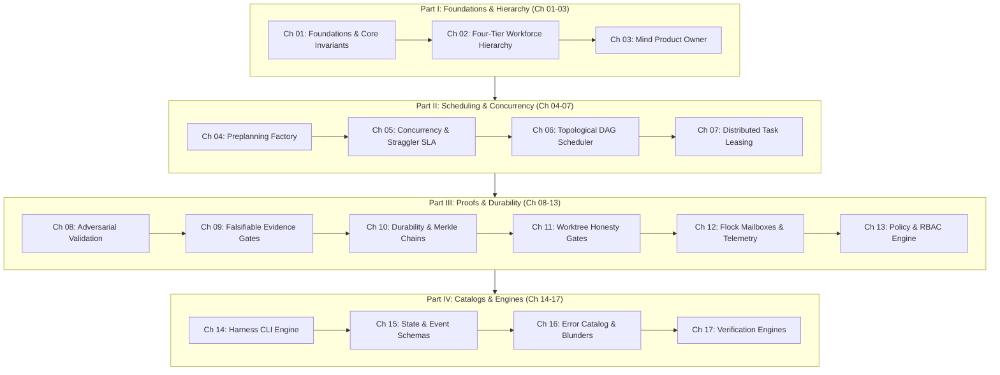

# OLT Architecture Book: Master Chapters Index

---

[Previous: Master Documentation Hub](../README.md) | [Chapter Index](index.md) | [All Chapters Index](index.md) | [Next: Chapter 01: Foundations](01-foundations/index.md)

---

## 1. Executive Overview & Architecture Topology

Welcome to the **OLT Architecture Book**. This book serves as the authoritative, deep technical reference for the **OLT (Orchestrating Long Tasks)** autonomous multi-agent engineering engine.

Grounding its pedagogy in Daniele Procida's **Diátaxis Documentation Framework** and the **Open Agent Skills Standard (`agentskills.io`)**, the Architecture Book provides mathematical formulations, algorithmic proofs, state machine schemas, and high-density visual diagrams across 17 structured chapters.

```text
+--------------------------------------------------------------------------------------------------+
│                                 OLT ARCHITECTURE TOPOLOGY MAP                                    │
+--------------------------------------------------------------------------------------------------+
│                                                                                                  │
│   PART I: FOUNDATIONS & WORKFORCE HIERARCHY                                                      │
│   • Chapter 01: Foundations & Core Invariants (Zero-Assumption Philosophy, Hard Zeros)           │
│   • Chapter 02: Four-Tier Workforce Hierarchy (Mind, Orchestrator, Coordinator, Workforce)       │
│   • Chapter 03: Mind Product Owner & Infinite Cadence (10 Discovery Sources, 6 Admission Gates)  │
│                                                                                                  │
│   PART II: PREPLANNING, SCHEDULING & CONCURRENCY                                                 │
│   • Chapter 04: Continuous Preplanning Factory (Prompt Sealing, 100% Line Coverage, Clustering)  │
│   • Chapter 05: Concurrency Scaling & Straggler SLA (Brent Work-Span Theorem, Width Bounds)      │
│   • Chapter 06: Topological DAG Scheduler (Kahn Toposort, Tarjan SCC Cycles, Sugiyama Layout)    │
│   • Chapter 07: Distributed Task Leasing & Execution (Monotonic Leases, Anti-Theft, Sanitization)│
│                                                                                                  │
│   PART III: VALIDATION, PROOFS & DURABILITY                                                      │
│   • Chapter 08: Adversarial Validation & Monotonic Repair (Dual-Channel Proofs, 7 Heuristics)   │
│   • Chapter 09: Falsifiable Evidence & Completion Gates (PNG IHDR Binary, APCA Math, Sealing)    │
│   • Chapter 10: Durability, Recovery & Merkle Chains (Capsule FS, SHA-256 Chains, POSIX flock)  │
│   • Chapter 11: Worktree Branching & Honesty Gates (Out-of-Repo Worktrees, Anti-Batching)        │
│   • Chapter 12: Flock Mailboxes & Telemetry (POSIX Directory IPC, Non-Blocking Message Queues)  │
│   • Chapter 13: Policy, RBAC & Fail-Closed Engine (Mechanical RBAC, 10 AST Rules, Confinement)  │
│                                                                                                  │
│   PART IV: REFERENCE CATALOGS & ENGINES                                                          │
│   • Chapter 14: Harness CLI & Command Engine (15-Domain Command Dictionary & Lifecycles)         │
│   • Chapter 15: State Schemas & Event Ledger (Draft 2020-12 State & Event JSON Contracts)        │
│   • Chapter 16: Error Catalog & Empirical Blunders (12 Error Codes, 28 Agentic Blunders)         │
│   • Chapter 17: Verification Engines & Gate Provers (Typecheck, APCA Engine, PNG Binary Prover)  │
│                                                                                                  │
+--------------------------------------------------------------------------------------------------+
```

---

## 2. Complete 17-Chapter Architecture Directory

```text
+---------+----------------------------------------------+-----------------------------------------+
| Chapter | Chapter Title & Scope                        | Primary Theoretical Concepts            |
+---------+----------------------------------------------+-----------------------------------------+
| Ch 01   | Foundations & Core Invariants                | Zero-Assumption, 4 Hard Zeros, SSoT     |
| Ch 02   | Four-Tier Workforce Hierarchy                | 4-Tier Model, Naming EBNF, Adapters     |
| Ch 03   | Mind Product Owner & Infinite Cadence        | 10 Discovery Sources, 6 Gates, Rotation |
| Ch 04   | Continuous Preplanning Factory               | Prompt Ingestion, 100% Coverage, Waves  |
| Ch 05   | Concurrency Scaling & Straggler SLA          | Brent Theorem, Coffman-Graham, 5m SLA   |
| Ch 06   | Topological DAG Scheduler                    | Kahn Algorithm, Tarjan SCC, Sugiyama    |
| Ch 07   | Distributed Task Leasing & Execution         | Monotonic HMAC Leases, Anti-Theft Guard |
| Ch 08   | Adversarial Validation & Monotonic Repair    | Dual-Channel Verification, 7 Heuristics |
| Ch 09   | Falsifiable Evidence & Completion Gates      | Evidence Classes, PNG Entropy, APCA     |
| Ch 10   | Durability, Recovery & Merkle Chains         | Capsule FS, Merkle Chains, POSIX flock  |
| Ch 11   | Worktree Branching & Honesty Gates           | Out-of-Repo Worktrees, Anti-Batching    |
| Ch 12   | Flock Mailboxes & Telemetry                  | Directory IPC, Non-Blocking Mailboxes   |
| Ch 13   | Policy, RBAC & Fail-Closed Engine            | Mechanical RBAC, 10 AST Purity Rules    |
| Ch 14   | Harness CLI & Command Engine                 | 15-Domain CLI Dictionary & Lifecycles   |
| Ch 15   | State Schemas & Event Ledger                 | Draft 2020-12 State & Event Contracts   |
| Ch 16   | Error Catalog & Empirical Blunders           | 12 Error Codes, 28 Agentic Blunders     |
| Ch 17   | Verification Engines & Gate Provers          | Typecheck, AST Linter, APCA, PNG Prover |
+---------+----------------------------------------------+-----------------------------------------+
```

---

## 3. Chapter Summaries & Detailed Links

### [Chapter 01: Foundations & Core Invariants](01-foundations/index.md)

Establishes the epistemic bedrock of OLT: state must be observed and proven rather than inferred. Explores the 4 Hard Zeros ($Z_{\text{hallucination}}=0$, $Z_{\text{mutation}}=0$, $Z_{\text{scope}}=0$, $Z_{\text{assumption}}=0$), the 15 system invariants ($\mathcal{C}_{1 \dots 15}$), the capsule state machine, and reflog safety.

### [Chapter 02: Four-Tier Workforce Hierarchy](02-four-tier-hierarchy/index.md)

Deconstructs workforce specialization across Tier 0 (Mind), Tier 1 (Orchestrator), Tier 2 (Coordinator), and Tier 3 (Specialized Workforce). Codifies the EBNF Subagent Naming Grammar, the Universal Host Adapter Interface, and modular file sizing budgets ($\le 300$ lines).

### [Chapter 03: Mind Product Owner & Infinite Cadence](03-mind-product-owner/index.md)

Details the autonomous Product Owner daemon that operates perpetually across 10 discovery sources, evaluates candidates against 6 admission gates, and executes generational archival rotation.

### [Chapter 04: Continuous Preplanning Factory](04-continuous-preplanning-factory/index.md)

Formalizes verbatim prompt ingestion and SHA-256 sealing, the 100% Prompt Line Coverage Invariant ($\Phi_{\text{cov}} = 1.000$), authority-gated obligations, and thematic roadmap clustering.

### [Chapter 05: Concurrency Scaling & Straggler SLA](05-concurrency-straggler-sla/index.md)

Explores the Brent Work-Span Theorem ($P = \lceil W / S \rceil$), Coffman-Graham width bounds, the 5-minute straggler SLA rule, and dynamic load throttling under Cowan context envelopes ($<150{,}000$ tokens).

### [Chapter 06: Topological DAG Scheduler](06-topological-scheduler-dags/index.md)

Details Kahn's topological sorting algorithm ($\mathcal{O}(|V|+|E|)$), Tarjan's SCC cycle detection and automated cuts, dynamic wave decoupling, and the Sugiyama 4-phase layered layout engine.

### [Chapter 07: Distributed Task Leasing & Execution](07-distributed-leasing-execution/index.md)

Formalizes monotonic HMAC lease tokens, lock-free private mailbox heartbeats, anti-theft task locks, zombie worker recovery, and stdout sanitization.

### [Chapter 08: Adversarial Validation & Monotonic Repair](08-adversarial-validation-repair/index.md)

Details orthogonal validator pairing, the Cognitive Validator Command Hard-Lock (0 commands), the Meta-Auditor's 7 Forensic Heuristics, and bounded monotonic repair cycles ($k \le 5$).

### [Chapter 09: Falsifiable Evidence & Completion Gates](09-falsifiable-evidence-gates/index.md)

Deconstructs the 4 falsifiable evidence classes, raw PNG 32-byte IHDR and Shannon entropy inspection ($H(X) \ge 3.0$), APCA perceptual contrast mathematics (WCAG 3.0), and `gate:prove`.

### [Chapter 10: Durability, Recovery & Merkle Chains](10-durability-recovery-capsules/index.md)

Details the capsule filesystem anatomy, recursive SHA-256 Merkle event chaining ($H_i = \text{SHA-256}(H_{i-1} \parallel e_i)$), kernel-level POSIX advisory locking (`flock`), and projection state reconstruction with torn-tail auto-healing.

### [Chapter 11: Worktree Branching & Honesty Gates](11-worktree-branching-honesty/index.md)

Formalizes out-of-repo Git worktrees (`.olt/worktrees/<task_id>/`), the strict 1:1 anti-batching invariant, physical honesty verification gates, and the Agent Grant Ledger.

### [Chapter 12: Flock Mailboxes & Live TUI Telemetry](12-flock-mailboxes-and-tui/index.md)

Deconstructs the hierarchical POSIX inode mailbox directory IPC protocol, atomic `rename(2)` message delivery, and real-time telemetry streaming.

### [Chapter 13: Policy, RBAC & Fail-Closed Engine](13-policy-rbac-failclosed-engine/index.md)

Details the mechanical RBAC compiler, the 10 static AST purity rules, default-deny permission gates, and the supervisor zero-file-edit rule.

### [Chapter 14: Harness CLI & Command Engine](14-harness-cli-and-command-engine/index.md)

Catalogues the complete 15-domain CLI capability dictionary, command lifecycles, execution arguments, and output schemas.

### [Chapter 15: State Schemas & Event Ledger](15-state-schemas-and-event-ledger/index.md)

Provides the Draft 2020-12 JSON Schema contracts for capsule manifests, requirements, events, state projections, and inter-agent mailboxes.

### [Chapter 16: Error Catalog & Empirical Blunders](16-error-catalog-and-blunders/index.md)

Catalogues the Unix process exit status hierarchy, 12 `HarnessError` codes, 28 empirical agentic blunders, and operational recovery playbooks.

### [Chapter 17: Verification Engines & Gate Provers](17-verification-engines-and-gates/index.md)

Details the implementation of the 5 internal verification engines: Typecheck, AST Linter, APCA Engine, PNG Binary Prover, and Merkle Gate Prover.

---

## 4. Architectural Pedagogical Flowchart



---

## 5. Cross-Chapter Pathways & Reading Guides

```text
+-------------------------+-----------------------------------+------------------------------------+
| Operator Archetype      | Recommended Reading Sequence      | Key Practical Takeaways            |
+-------------------------+-----------------------------------+------------------------------------+
| Autonomous Implementer  | Ch 01 -> Ch 02 -> Ch 07 -> Ch 09  | Worktree isolation & evidence gates|
| Systems Architect       | Ch 04 -> Ch 05 -> Ch 06 -> Ch 10  | Toposort, Brent theorem & Merkle   |
| Security & Safety Lead  | Ch 08 -> Ch 11 -> Ch 13 -> Ch 17  | Cognitive lock, AST purity & RBAC  |
| Platform Operator       | Ch 14 -> Ch 15 -> Ch 16 -> Ref    | CLI dictionary & error mitigation  |
+-------------------------+-----------------------------------+------------------------------------+
```

---

[Previous: Master Documentation Hub](../README.md) | [Chapter Index](index.md) | [All Chapters Index](index.md) | [Next: Chapter 01: Foundations](01-foundations/index.md)

---
