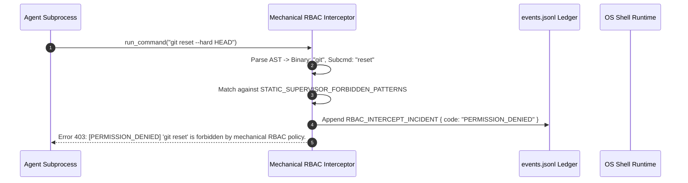

# Mechanical RBAC Compiler: AST Shell Parse-Tree Sandboxing & Tool Capability Interception

> **Status**: Authoritative Architecture Specification  
> **Topic**: Deterministic AST Sandboxing, Mechanical Role-Based Access Control, and Shell Interception  
> **Audience**: Security Architects, Runtime Systems Engineers, Multi-Agent Governance Developers

---

## 1. Executive Summary & Conceptual Overview

Traditional LLM agent orchestration relies heavily on "system prompt guidelines" (e.g. telling an agent _"Please do not execute destructive git commands or edit files outside your directory"_). In practice, prompt-level constraints are probabilistic, susceptible to prompt injection, cognitive drift, and model hallucination.

The OLT runtime replaces probabilistic prompt constraints with a deterministic **Mechanical RBAC Compiler & AST Sandboxing Engine** (`rbac-engine.ts`, `repo-policy.ts`).

Every tool call and shell command (`run_command`) is intercepted at the runtime boundary, parsed into an Abstract Syntax Tree (AST), evaluated against compiled role deny-lists, and checked against active task lease scopes before a single system call or process spawn occurs.

```
       [Agent Invocations: `run_command(cmd)`]
                         │
                         ▼
        ┌─────────────────────────────────┐
        │   Lexical Tokenizer & AST Parse │
        │   POSIX Shell Grammar Parser    │
        └─────────────────────────────────┘
                         │
                         ▼
        ┌─────────────────────────────────┐
        │   Subshell & Eval Interdictor   │
        │   Bans unshielded `sh -c`,      │
        │   `bash`, `eval`, `node -e`     │
        └─────────────────────────────────┘
                         │
                         ▼
        ┌─────────────────────────────────┐
        │   Role-Based Deny-List Matcher  │
        │   - Supervisor Rules            │
        │   - Implementer Rules           │
        │   - Validator Rules             │
        └─────────────────────────────────┘
                         │
                         ▼
        ┌─────────────────────────────────┐
        │   Write Scope Authority Guard   │
        │   Cross-reference active lease  │
        └─────────────────────────────────┘
                         │
        ┌────────────────┴────────────────┐
        ▼                                 ▼
  [PERMITTED]                       [INTERCEPTED & BLOCKED]
  Spawn OS Process                  Raise `PERMISSION_DENIED`
  Record in `events.jsonl`          Log Security Incident
```

---

## 2. AST Tokenization & Shell Parse-Tree Grammar

Attack vectors in LLM command execution frequently exploit shell metacharacters, subshell wrapping, and command chaining (e.g. `echo safe && rm -rf .git`, or `sh -c "git push"`).

To prevent subshell evasion, the OLT parser constructs a strict token stream and parse tree:

```typescript
export interface ParsedShellCommand {
  readonly raw: string;
  readonly binary: string;
  readonly argv: readonly string[];
  readonly chainedCommands: readonly ParsedShellCommand[];
  readonly hasSubshellNesting: boolean;
  readonly redirectionTargets: readonly string[];
}
```

```
                Command: "bun test && git push origin main"
                                     │
                                (AST Split)
                                     │
                ┌────────────────────┴────────────────────┐
                ▼                                         ▼
   Node 1: Binary="bun", Argv=["test"]       Node 2: Binary="git", Argv=["push", "origin", "main"]
   Evaluated against RBAC Rules              Evaluated against RBAC Rules
   Result: PERMITTED (Implementer)           Result: BLOCKED (Implementer Forbidden)
```

---

## 3. Role-Based Deny-List Compilation

The RBAC compiler maintains specialized static regex matrices and AST rules tailored to the OLT Three-Tier Agent Hierarchy:

```typescript
export const STATIC_SUPERVISOR_FORBIDDEN_PATTERNS: readonly RegExp[] = [
  /^git\s+(commit|push|reset|checkout\s+-b|merge|rebase)/i,
  /write_to_file/i,
  /replace_file/i,
  /^bun\s+test\b/i,
  /^npm\s+test\b/i,
  /^vitest\b/i,
  /^pytest\b/i,
  /^cargo\s+test\b/i,
];

export const STATIC_IMPLEMENTER_FORBIDDEN_PATTERNS: readonly RegExp[] = [
  /^git\s+(commit|push|reset|checkout(\s+-b)?|rebase|merge)/i,
  /^bun\s+harness.*task:review/i,
  /^bun\s+harness.*run:complete/i,
  /^bun\s+harness.*mind:/i,
];

export const FORBIDDEN_SUBSHELL_AND_EVAL_PATTERNS: readonly RegExp[] = [
  /^(ba|z|fi|k|c|tc)?sh(\.exe)?(\s+-(c|e|i|s)|\s*$|\s+)/i,
  /^eval\b/i,
  /^exec\b/i,
  /^(node|bun|deno)(\.exe)?\s+(-e|--eval)\b/i,
  /^(python|python3|perl|ruby)(\.exe)?\s+(-c|-e)\b/i,
];
```

---

## 4. Deep Teardown of Role Capabilities & Restrictions

### 4.1 Supervisor / Coordinator Restrictions

- **Zero Direct Mutation**: Supervisors/Coordinators cannot invoke file edit tools (`write_to_file`, `replace_file_content`). All code changes must be delegated to leased Implementer agents.
- **Zero Unit Test Execution**: Supervisors are barred from executing unit test suites (`bun test`, `pytest`, etc.). Test execution belongs 100% to Implementers, while static validation belongs to Mechanic Validators.
- **Restricted Git**: Supervisors cannot execute git commits, pushes, or branch switches directly; lifecycle completion is managed atomically by the harness engine.

### 4.2 Implementer Restrictions

- **Write Scope Lockdown**: Implementers can only mutate files within their leased `write_scope`. Any mutation outside the assigned scope triggers immediate rejection.
- **Lifecycle Protection**: Implementers cannot invoke `task:review`, `run:complete`, or `mind:*` lifecycle transitions.
- **Unit Test Ownership**: Implementers have exclusive authority to run local unit test runners (`bun test`, `cargo test`, `pytest`).

### 4.3 Cognitive & Mechanic Validator Isolation

- **Cognitive Validators**: Execute **ZERO** terminal commands (0 `run:exec`, 0 shell tools). They operate purely on artifacts, diffs, and structured evidence.
- **Mechanic Validators**: Banned from re-running implementer unit tests. They execute **ONLY** compiler typechecks (`tsc --noEmit`), AST invariant scanners (0 `any`, 0 suppressions), and Adversarial Gate Proofs (AGP counterfactuals).

---

## 5. Subshell & Dynamic Evaluator Interdiction

A common attack or drift vector occurs when an agent attempts to execute an unshielded subshell string:

```bash
bash -c "npm install && npm run build"
```

The RBAC engine intercepts and blocks all unshielded subshell spawns:

```typescript
export function hasUnshieldedSubshellOrChaining(
  commandStr: string,
  argv: readonly string[],
): { detected: boolean; reason?: string } {
  const firstToken = (argv[0] ?? "").toLowerCase();

  const subshellBinaries = new Set([
    "sh",
    "bash",
    "zsh",
    "fish",
    "ksh",
    "csh",
    "tcsh",
    "dash",
    "sh.exe",
    "bash.exe",
    "zsh.exe",
  ]);

  if (subshellBinaries.has(firstToken)) {
    return {
      detected: true,
      reason: `Subshell binary invocation detected: '${firstToken}'`,
    };
  }

  if (firstToken === "eval" || firstToken === "exec") {
    return {
      detected: true,
      reason: `Direct evaluator invocation detected: '${firstToken}'`,
    };
  }

  if (
    (firstToken === "node" || firstToken === "bun" || firstToken === "deno") &&
    argv.some((arg) => arg === "-e" || arg === "--eval")
  ) {
    return {
      detected: true,
      reason: `Dynamic code evaluation detected: '${firstToken} -e'`,
    };
  }

  return { detected: false };
}
```

```
[UNSHIELDED_COMMAND_DEFECT] Command blocked by Mechanical RBAC Sandbox.
Reason: Subshell binary invocation detected: 'bash -c ...'
Rule: Agents must execute binaries directly without shell wrapper indirection.
```

---

## 6. Known Test Runner Grammar Matrix

The RBAC compiler incorporates deep semantic knowledge of standard testing toolchains to differentiate between isolated unit testing and unsafe global commands:

| Runner         | Canonical Prefix             | Mode Keywords             | Valid Flags with Arguments                     |
| :------------- | :--------------------------- | :------------------------ | :--------------------------------------------- |
| **pytest**     | `pytest`, `python -m pytest` | N/A                       | `-m`, `-k`, `-c`, `-o`                         |
| **bun test**   | `bun test`                   | N/A                       | `--timeout`, `-t`, `--preload`, `--filter`     |
| **cargo test** | `cargo test`                 | N/A                       | `--package`, `-p`, `--bin`, `--test`           |
| **go test**    | `go test`                    | N/A                       | `-run`, `-bench`, `-tags`, `-timeout`          |
| **vitest**     | `vitest`, `npx vitest`       | `run`, `related`, `watch` | `-t`, `--testNamePattern`, `-c`                |
| **jest**       | `jest`, `npx jest`           | `run`, `watch`            | `-t`, `--testNamePattern`, `--testPathPattern` |
| **dotnet**     | `dotnet test`                | N/A                       | `--filter`, `-f`, `-c`, `--logger`             |
| **maven**      | `mvn test`                   | N/A                       | `-Dtest`, `-DfailIfNoTests`, `-pl`             |

---

## 7. Execution Interception & Event Logging

When a tool or command execution is evaluated, the result is recorded in the immutable ledger (`events.jsonl`):



---

## 8. CLI Invocations & Verification Commands

### Auditing Active RBAC Policy & Permissions

```bash
bun olt/scripts/harness.ts rbac:audit --agent implementer-3
```

### Checking Command Authorization Dry-Run

```bash
bun olt/scripts/harness.ts policy:check --role implementer --command "bun test tests/unit/auth.test.ts"
```

#### Sample Output

```text
=== RBAC Policy Check ===
Command: "bun test tests/unit/auth.test.ts"
Role: implementer
Status: AUTHORIZED
AST Category: KNOWN_TEST_RUNNER (bun test)
Scope Check: N/A (Read-only execution)
```

---

## 9. Summary of Core Invariants

> [!IMPORTANT]
>
> 1. **Zero Prompt Trust**: Security and role boundaries are enforced mechanically at the AST level, never via system prompt prompts alone.
> 2. **Supervisor Purity**: Supervisors cannot execute code edits or unit tests; mutations belong to Implementers, static proofs to Mechanics.
> 3. **Subshell Ban**: Unshielded subshell execution (`sh -c`, `bash`, `eval`, `node -e`) is blocked unconditionally.
> 4. **Scope Interlock**: Mutations targeting paths outside the active task lease are rejected with `INVALID_SCOPE`.
