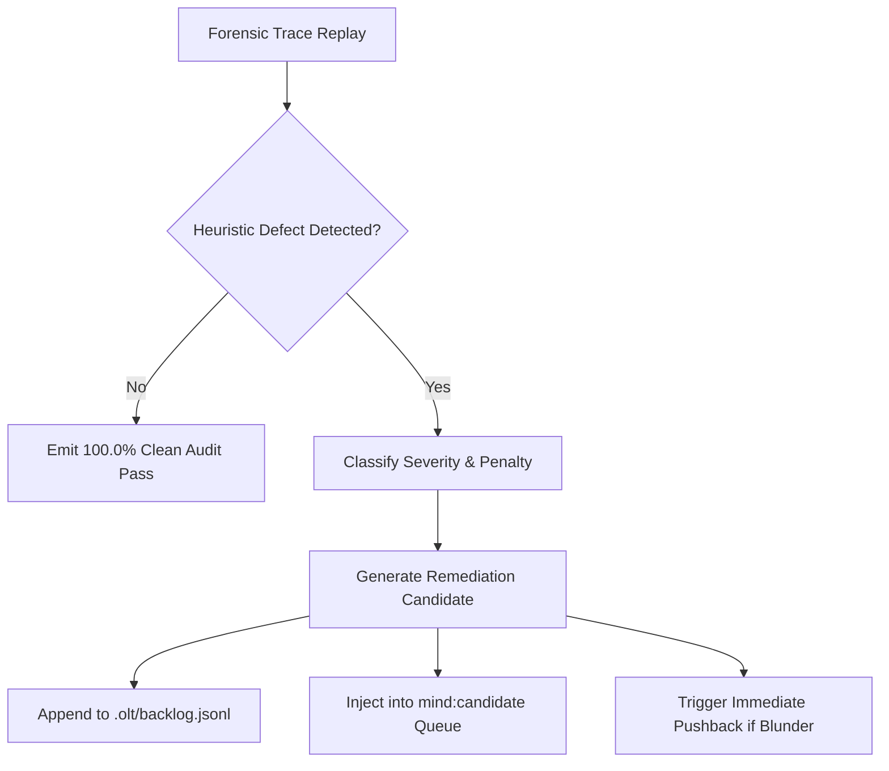

# Meta-Auditor Forensics Engine: The 7 Behavioral Heuristics & Deterministic Root-Cause Analysis

> **Status**: Authoritative Architecture Specification  
> **Topic**: Autonomous Multi-Agent Behavioral Auditing, Telemetry Replay, and Invariant Heuristics  
> **Audience**: Meta-Auditors, Safety & Alignment Engineers, Autonomous Systems Architects

---

## 1. Executive Summary & Forensic Architecture

In complex multi-agent execution topologies, silent failures rarely stem from explicit compile errors. Instead, they manifest as **cognitive drift, false serialization, phantom progress, hallucinated test passes, and ungrounded supervisory approvals**.

The **Tier 2 Meta-Auditor Forensics Engine** (`agents/meta-auditor.yaml`, `meta-auditor.ts`, `meta-audit`) operates as an independent, deterministic auditor over all agent transcripts, tool executions, and state ledgers (`events.jsonl`). It continuously evaluates execution telemetry against **7 Root-Cause Behavioral Heuristics**, computes objective efficiency scores (0.0%–100.0%), and autonomously injects corrective remediations into `.olt/backlog.jsonl` and `mind:candidate`.

```
  ┌─────────────────────────────────────────────────────────┐
  │              Execution Telemetry Stream                 │
  │   - Immutable Event Log (`events.jsonl`)                │
  │   - Agent Interaction Transcripts                       │
  │   - State Snapshots (`state.json`, `leases/`)           │
  └────────────────────────────┬────────────────────────────┘
                               │
                               ▼
  ┌─────────────────────────────────────────────────────────┐
  │             Meta-Auditor Forensics Pipeline             │
  │                                                         │
  │  [H1] FALSE_SERIALIZATION_BLUNDER                       │
  │  [H2] GHOST_LEASES                                      │
  │  [H3] ORPHAN_EVIDENCE                                   │
  │  [H4] SILENT_TOOL_HALLUCINATION                         │
  │  [H5] TOKEN_BLOAT_OVERRUN                               │
  │  [H6] LEASE_DRIFT                                       │
  │  [H7] UNGROUNDED_APPROVAL                               │
  └────────────────────────────┬────────────────────────────┘
                               │
                               ▼
  ┌─────────────────────────────────────────────────────────┐
  │                 Scoring & Remediation                   │
  │   - Deterministic Efficiency Score: 0.0% – 100.0%       │
  │   - Autonomous Injection to `.olt/backlog.jsonl`        │
  │   - Plan Remediation via `mind:candidate` & `todo:add`  │
  └─────────────────────────────────────────────────────────┘
```

---

## 2. Mathematical Scoring Model

The Meta-Auditor evaluates overall run health using a weighted penalty deduction model:

$$\text{Efficiency Score} = \max\left(0.0, \, 100.0 - \sum_{i=1}^{7} w_i \cdot \text{Penalty}(H_i)\right)$$

where:

- $H_i \in \{H_1, \dots, H_7\}$ represents each of the 7 heuristics.
- $w_i$ is the assigned category weight ($w_{\text{critical}} = 25.0, w_{\text{high}} = 15.0, w_{\text{medium}} = 8.0$).
- $\text{Penalty}(H_i) = \min\left(1.0, \, \frac{N_{\text{incidents}}(H_i)}{\text{Threshold}(H_i)}\right)$ scales linearly with incident count.

```
Efficiency Score Bands:
  [95.0% - 100.0%]  OPTIMAL     (Zero critical defects, maximal Brent concurrency)
  [80.0% -  94.9%]  ACCEPTABLE  (Minor token bloat or isolated lease stalls)
  [60.0% -  79.9%]  DEGRADED    (False serialization or ungrounded approvals detected)
  [ 0.0% -  59.9%]  CRITICAL    (Tool hallucination, scope drift, or ghost leases)
```

---

## 3. Deep Teardown of the 7 Behavioral Heuristics

---

### Heuristic 1: `FALSE_SERIALIZATION_BLUNDER`

#### Definition & Root Cause

Occurs when a wave contains $N \ge 2$ ready tasks with mutually disjoint write scopes, but the supervisor dispatches them sequentially across consecutive timestamps instead of dispatching all $N$ subagents in parallel.

#### Mathematical Trigger Condition

$$\exists W_m \text{ such that } |W_{m,\text{ready}}| \ge 2 \quad \land \quad \forall (u, v) \in W_{m,\text{ready}}, \, \Omega(u) \cap \Omega(v) = \emptyset \quad \land \quad \Delta t_{\text{dispatch}}(u, v) > t_{\text{parallel\_batch\_window}}$$

```
     Faulty Serial Dispatch (FALSE_SERIALIZATION_BLUNDER):
     T0: Dispatch Task 1 ─────────> Complete (10m)
                                     T10: Dispatch Task 2 ─────────> Complete (10m)
                                                                     Total: 20m

     Correct Parallel Dispatch (Brent Concurrency P=2):
     T0: Dispatch [Task 1, Task 2] ────────────────────────────────> Complete (10m)
                                                                     Total: 10m
```

#### Forensic Detection Logic

The auditor scans `events.jsonl` for sequential `TASK_LEASED` events belonging to the same DAG wave where scopes do not overlap.

#### Autonomous Remediation Trigger

- Flags `FALSE_SERIALIZATION_BLUNDER` in audit report.
- Injects a DAG optimization candidate (`mind:candidate`) to rebalance task grouping.
- Throws an execution-time interlock error blocking single-thread simulation.

---

### Heuristic 2: `GHOST_LEASES`

#### Definition & Root Cause

A task lease is held by an agent, but no tool executions, file mutations, or heartbeat signals are recorded for a period exceeding the lease inactivity timeout $\Delta t_{\text{ghost}} = 5\text{ minutes}$.

#### Mathematical Trigger Condition

$$\text{State}(T) = \text{LEASED} \quad \land \quad (t_{\text{current}} - t_{\text{last\_activity}}) > \Delta t_{\text{ghost}} \quad \land \quad \text{LeaseState} \neq \text{SUSPENDED}$$

```
     Time ─────────────────────────────────────────────────────────>
     [Lease Claimed] ────> [Activity] ──────> ( No Telemetry > 5m ) ──────> [GHOST LEASE DETECTED]
     T=0                   T=1m               T=6m                          Action: Force Reap
```

#### Forensic Detection Logic

The auditor scans `.olt/leases/*.json` against the tail of `events.jsonl`. If an active lease token is not referenced in any `TOOL_CALL`, `HEARTBEAT`, or `FILE_WRITE` event within the TTL window, it is classified as a ghost lease.

#### Autonomous Remediation Trigger

- Emits `GHOST_LEASE_REAP_RECOMMENDED`.
- Triggers `bun harness.ts task:reap --task <id>` to return the task to the ready queue.
- Issues a warning penalty to the holding agent grant.

---

### Heuristic 3: `ORPHAN_EVIDENCE`

#### Definition & Root Cause

Evidence receipts, test logs, DOM snapshots, or verification artifacts exist in the filesystem or evidence directories, but are disconnected from any task submission, unreferenced in `evidence.jsonl`, or lack verifiable cryptographic linkage to the target task ID.

#### Mathematical Trigger Condition

$$\exists e \in \mathcal{E}_{\text{artifacts}} \quad \text{such that} \quad e.\text{taskId} \notin V_{\text{DAG}} \quad \lor \quad e.\text{sha256} \notin \text{LedgerHashes}(\text{events.jsonl})$$

```
     Evidence Storage (`.olt/evidence/`)        Task Submission Ledger (`evidence.jsonl`)
     ┌───────────────────────────────────┐      ┌───────────────────────────────────┐
     │ receipt-task-auth-123.json        │ ───> │ Referenced by Task 'task-auth'    │ (VALID)
     │ orphan-test-dump-892.json         │ ───x │ [NO REFERENCE IN LEDGER]          │ (ORPHAN)
     └───────────────────────────────────┘      └───────────────────────────────────┘
```

#### Forensic Detection Logic

Performs a set difference between all physical files in the evidence store and the set of content-addressed hashes recorded during official `task:submit` events.

#### Autonomous Remediation Trigger

- Rejects task completion gates relying on disconnected proof.
- Directs the validator to re-execute mechanical proof collection.
- Moves unlinked evidence to `.olt/quarantine/`.

---

### Heuristic 4: `SILENT_TOOL_HALLUCINATION`

#### Definition & Root Cause

An agent's natural language response claims that a tool or command was executed (e.g. _"I executed `bun test` and all 54 tests passed successfully"_), but the immutable event ledger `events.jsonl` contains **zero** corresponding `run_command` or tool execution events.

#### Mathematical Trigger Condition

$$\text{TranscriptClaimsExecution}(Agent_k, Cmd) = \text{true} \quad \land \quad \text{LedgerEventExists}(Cmd, t_{\text{window}}) = \text{false}$$

```
     Agent Transcript:
     "I ran `bun test --coverage` and verified 100% pass rate."
                             │
                             ▼ (Audit Comparison)
     Events Ledger (`events.jsonl`):
     [LINE 102] Agent Message Sent
     [LINE 103] Task Submit Invoked (ZERO `run_command` records!)
                             │
                             ▼
     [CRITICAL ALARM: SILENT_TOOL_HALLUCINATION]
```

#### Forensic Detection Logic

The Meta-Auditor parses transcript text for execution assertions (`ran`, `executed`, `tested`, `verified with command`) and performs exact timestamp-bounded correlation against `events.jsonl` tool invocations.

#### Autonomous Remediation Trigger

- Deducts 25.0 points (Critical Severity).
- Issues an ungrounded pushback (`review:pushback`) rejecting the submission.
- Escalate to Tier 0 Mind Supervisor for persona grounding.

---

### Heuristic 5: `TOKEN_BLOAT_OVERRUN`

#### Definition & Root Cause

An agent accumulates excessive context size or repeats whole-file contents across turns without making proportional implementation progress, driving token consumption past efficiency budgets.

#### Mathematical Trigger Condition

$$\frac{\Delta \text{TokensConsumed}}{\Delta \text{CodeDiffBytes}} > \Theta_{\text{bloat}} \quad (\text{Threshold } \Theta_{\text{bloat}} = 250 \text{ tokens/byte modified})$$

```
     Context Expansion vs Value Created:
     Turn 1: Context 12k  ──> +50 lines code
     Turn 2: Context 45k  ──> +2 lines code
     Turn 3: Context 98k  ──> +0 lines code (Repeating full file in transcript)
     [TOKEN_BLOAT_OVERRUN Triggered]
```

#### Forensic Detection Logic

Computes the ratio of consumed input/output tokens (from API telemetry) to the net AST diff generated in the task write scope.

#### Autonomous Remediation Trigger

- Injects packet slicing recommendations into the task stream.
- Replaces raw file dumps with targeted diff snippets.
- Instructs coordinator to enforce modular branch execution.

---

### Heuristic 6: `LEASE_DRIFT`

#### Definition & Root Cause

An implementer holding a lease for write scope $\Omega(T_A)$ modifies, creates, or deletes files in directory paths belonging to scope $\Omega(T_B)$ or unassigned repository paths.

#### Mathematical Trigger Condition

$$\exists f \in \text{ModifiedFiles}(Agent_k) \quad \text{such that} \quad f \notin \Omega(T_{\text{leased}})$$

```
     Assigned Write Scope:  docs/olt/architecture/
     Attempted Mutation:    src/engine/scheduler/dag.ts
                                    │
                                    ▼
     [FATAL DEFECT: LEASE_DRIFT - UNAUTHORIZED WRITE ATTEMPT]
```

#### Forensic Detection Logic

Scans `git status --porcelain` and filesystem mutation events against the exact `write_scope` glob set in the active lease descriptor.

#### Autonomous Remediation Trigger

- Reverts unauthorized changes via restricted git rollback.
- Revokes active lease token.
- Throws `INVALID_SCOPE` defect.

---

### Heuristic 7: `UNGROUNDED_APPROVAL`

#### Definition & Root Cause

A Cognitive Validator, Mechanic Validator, or Coordinator issues a passing review (`task:review --verdict pass` or `gate:pass`) without providing concrete quantitative evidence (e.g. exit code 0, DOM bounding boxes, APCA contrast ratios, screenshot bytes $\ge 1024\text{B}$, or counterfactual falsifiability proofs).

#### Mathematical Trigger Condition

$$\text{Verdict} = \text{PASS} \quad \land \quad (\text{ProofMetricsPresent} = \text{false} \quad \lor \quad \text{ScreenshotBytes} < 1024)$$

```
     Validator Review:
     "Everything looks great! The code is clean and adheres to guidelines. PASS."
                             │
                             ▼ (Audit Check)
     Missing: Exit code receipts, DOM metrics, APCA Lc, Counterfactual proof.
                             │
                             ▼
     [REJECT: UNGROUNDED_APPROVAL - EVIDENCE REQUIRED]
```

#### Forensic Detection Logic

Inspects validation payloads in `.olt/reviews/` for mandatory schema fields: `exitCode`, `stdoutSnapshot`, `apcaContrast`, `screenshotBytes`, and `counterfactualReceipt`.

#### Autonomous Remediation Trigger

- Invalidates the passing verdict.
- Issues `review:pushback` requiring empirical proof.
- Enforces two-key validator pairing.

---

## 4. Remediation Synthesis & Backlog Injection

When heuristics detect defects, the Meta-Auditor does not merely log warnings; it synthesizes structured remediation proposals:



### Backlog Proposal Schema (`.olt/backlog.jsonl`)

```json
{
  "id": "prop-meta-false-serial-042",
  "timestamp": "2026-08-24T10:25:00.000Z",
  "heuristic": "FALSE_SERIALIZATION_BLUNDER",
  "severity": "HIGH",
  "penalty": 15.0,
  "affectedTasks": ["task-docs-auth", "task-docs-db"],
  "rootCause": "Coordinator dispatched task-docs-db 12 minutes after task-docs-auth despite disjoint scopes docs/olt/auth and docs/olt/db.",
  "remediation": "Recompile wave 1 with Subagents: [task-docs-auth, task-docs-db] to achieve P=2 Brent concurrency.",
  "actionableCommand": "bun olt/scripts/harness.ts dag:rebalance --wave 1"
}
```

---

## 5. CLI Forensics Commands

### Running Full Meta-Audit

```bash
bun olt/scripts/harness.ts meta-audit --run .olt/capsules/35-comprehensive-olt-documentation-overhaul
```

### Forensic Tail Replay (Last 100 Events)

```bash
bun olt/scripts/harness.ts meta-audit --run .olt/capsules/35-comprehensive-olt-documentation-overhaul --forensic-tail 100
```

### Inspecting Forensic Score & Incident Matrix

```bash
bun olt/scripts/harness.ts meta-audit:summary --verbose
```

---

## 6. Summary of Core Invariants

> [!IMPORTANT]
>
> 1. **Immutable Ledger Authority**: `events.jsonl` is the sole source of truth; natural language claims unbacked by event records are treated as `SILENT_TOOL_HALLUCINATION`.
> 2. **Anti-Serialization Interlock**: Disjoint wave tasks must be dispatched in parallel arrays; serial execution triggers `FALSE_SERIALIZATION_BLUNDER`.
> 3. **Lease Scope Isolation**: Agents mutating files outside declared scopes trigger immediate `LEASE_DRIFT` revocation.
> 4. **Empirical Approval Proof**: Reviews without quantitative metrics (exit codes, DOM bounds, APCA Lc, counterfactuals) are rejected as `UNGROUNDED_APPROVAL`.
