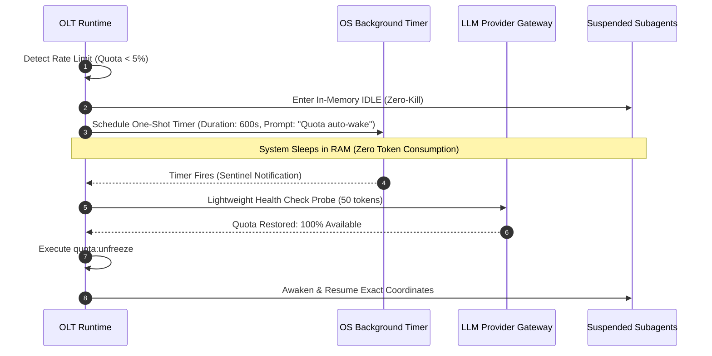

# Quota Freeze & Auto-Wake Mechanics: The Zero-Kill Invariant & Sentinel Polling

> **Status**: Authoritative Architecture Specification  
> **Topic**: Provider Rate Limit Circuit Breaking, In-Memory Idle State Preservation, and Autonomous Sentinel Wakeup  
> **Audience**: Site Reliability Engineers, Autonomous Swarm Operators, Distributed Runtime Developers

---

## 1. Executive Summary & Conceptual Overview

Large-scale multi-agent software engineering swarms consume significant token throughput across prompt evaluation and code generation. When an LLM API provider's rate limit is reached (e.g. hitting Tokens Per Minute [TPM] ceilings or sliding-window quota drops below 5%), naive multi-agent systems often fail catastrophically:

1. **Blind Worker Termination**: Supervisors kill subagents mid-turn, losing uncommitted in-memory edits, torn AST modifications, and test scratch states.
2. **Lease Expiration / Reaper Cascades**: Inactive workers get flagged as "dead" or "stale", causing leases to be reaped and assigned to other agents who overwrite half-finished work.
3. **Infinite Polling Waste**: Agents repeatedly retry failed requests in tight loops, burning further rate limit quota.

The OLT engine resolves token exhaustion through **Pillar 16: Quota Freeze & Auto-Wake Mechanics**.

When quota drops below $5\%$ or a `429 Too Many Requests` circuit breaker trips, OLT executes an orderly, non-destructive **Quota Freeze (`quota:freeze`)**. Active subagents are preserved in memory under the **Zero-Kill Invariant**, lease clocks are paused, unstaged files remain untouched on disk, and a single non-polling **Sentinel Timer** is registered to resume execution automatically once provider quotas replenish.

```
                   Token Quota Telemetry / 429 Trigger
                                  │
                                  ▼ (Quota < 5%)
         ┌──────────────────────────────────────────────────┐
         │              Quota Freeze Triggered              │
         │  1. Halt recurring background crons              │
         │  2. Pause worker lease clocks (`suspended_at`)   │
         │  3. Enforce Zero-Kill Invariant (Keep workers)   │
         │  4. Preserve unstaged / stashed git working tree │
         │  5. Serialize `.olt/quota-dag-snapshot.json`     │
         └────────────────────────┬─────────────────────────┘
                                  │
                                  ▼
         ┌──────────────────────────────────────────────────┐
         │             State: FROZEN_IDLE                   │
         │        - Zero API token consumption              │
         │        - Subprocesses sleep in RAM               │
         │        - OS Sentinel Timer armed ($t_{reset}$)   │
         └────────────────────────┬─────────────────────────┘
                                  │
                                  ▼ (Sentinel Alarm Fires)
         ┌──────────────────────────────────────────────────┐
         │             Auto-Wake Resume Protocol            │
         │  1. Probe quota health (Verify quota > 20%)      │
         │  2. Restore DAG coordinates from snapshot        │
         │  3. Unpause lease clocks (`suspended_at = null`) │
         │  4. Re-register crons & awaken worker processes  │
         └──────────────────────────────────────────────────┘
```

---

## 2. The Zero-Kill Invariant (Pillar 16)

The foundational principle of OLT quota resilience is the **Zero-Kill Invariant**:

> [!CAUTION]
> Under Quota Freeze, active subagents are NEVER terminated or killed. Invoking `manage_subagents kill` or issuing `SIGKILL` during a quota suspension is a critical system violation.

### Why Zero-Kill Is Mandatory:

- **In-Flight Epistemic State**: An LLM agent may have spent 30 minutes reading codebase architecture into its short-term context window. Killing the process destroys this epistemic context, forcing a catastrophic re-read upon restart.
- **Unstaged Working Tree Safety**: An implementer may be mid-way through a multi-file refactoring. Terminating the worker risks leaving half-written syntax errors on disk.
- **Lease Continuity**: The worker's lease token remains valid but suspended in time; no other agent can claim the workspace.

```
     Worker Subprocess Status:
     Normal:   [RUNNING] ──> API Call ──> File Edit ──> Test
     Freeze:   [PAUSED / SLEEP IN RAM] (Zero Token Burn, Context Preserved)
     Resume:   [UNPAUSED] ──> Resume immediate execution at exact step
```

---

## 3. Finite State Machine (FSM) Transitions

The Quota Freeze lifecycle is governed by a deterministic 5-state automaton:

```
  ┌─────────────┐       Quota < 5% / 429        ┌──────────────┐
  │   RUNNING   │ ────────────────────────────> │   FREEZING   │
  └─────────────┘                               └──────────────┘
         ▲                                             │ Snapshot Saved
         │                                             ▼
  ┌─────────────┐       Sentinel Wakes &        ┌──────────────┐
  │  RESUMING   │ <──────────────────────────── │ FROZEN_IDLE  │
  └─────────────┘       Quota Healthy (>20%)    └──────────────┘
```

### State Specifications

| State             | Primary Activity                                         | Token Consumption                 | Lease Clock                                                             |
| :---------------- | :------------------------------------------------------- | :-------------------------------- | :---------------------------------------------------------------------- |
| **`RUNNING`**     | Normal parallel DAG task execution, heartbeat emission.  | Normal ($> 0\text{ tpm}$)         | Active ($\Delta t = t - t_{\text{start}}$)                              |
| **`FREEZING`**    | Halt crons, lock state, write snapshot to disk.          | Transient ($< 100\text{ tokens}$) | Freezing                                                                |
| **`FROZEN_IDLE`** | Subprocesses sleep in RAM; OS timer armed.               | **Zero ($0.0\text{ tpm}$)**       | **Suspended** (`suspended_at = T_{\text{freeze}}`)                      |
| **`AUTO_WAKING`** | Sentinel alarm wakes; executes single lightweight probe. | Minimal ($< 50\text{ tokens}$)    | Suspended                                                               |
| **`RESUMING`**    | Restore snapshot, adjust lease offsets, restart crons.   | Normal                            | Resumed ($\text{TTL} \leftarrow \text{TTL} + \Delta t_{\text{frozen}}$) |

---

## 4. Quota Snapshot Serialization (`.olt/quota-dag-snapshot.json`)

During the `FREEZING` phase, the runtime serializes a complete state snapshot:

```json
{
  "snapshot_version": "1.0",
  "snapshot_id": "snap-freeze-20260824-102500",
  "frozen_at": "2026-08-24T10:25:00.000Z",
  "reason": "PROVIDER_RATE_LIMIT_429",
  "remaining_quota_percent": 3.2,
  "active_run": ".olt/capsules/35-comprehensive-olt-documentation-overhaul",
  "generation_epoch": 2,
  "suspended_leases": [
    {
      "task_id": "task-docs-architecture",
      "agent_id": "implementer-3",
      "lease_token": "xdBgP86hfa63LfbipvZsMOA5kOc5-qXnQeVwGIT3iVQ",
      "assigned_scope": "docs/olt/architecture",
      "lease_acquired_at": "2026-08-24T10:19:30.000Z",
      "suspended_at": "2026-08-24T10:25:00.000Z",
      "remaining_ttl_seconds": 870
    }
  ],
  "halted_crons": [{ "id": "cron-mind-auditor", "expression": "*/5 * * * *" }],
  "git_working_tree_hash": "a4f8b2c91d3e"
}
```

```typescript
export function executeQuotaFreeze(runRoot: string, force = false): QuotaFreezeResult {
  const telemetry = probeQuotaTelemetry();
  if (!force && telemetry.remainingPercent >= 5.0) {
    return { frozen: false, message: "Quota is healthy. Use --force to override." };
  }

  // 1. Suspend active lease clocks
  const activeLeases = loadActiveLeases(runRoot);
  const now = new Date().toISOString();
  for (const lease of activeLeases) {
    lease.suspended_at = now;
    saveLeaseDescriptor(runRoot, lease);
  }

  // 2. Halt background crons
  haltRecurringCrons();

  // 3. Write snapshot
  const snapshot: QuotaSnapshot = {
    snapshot_version: "1.0",
    snapshot_id: `snap-freeze-${Date.now()}`,
    frozen_at: now,
    reason: telemetry.is429 ? "PROVIDER_RATE_LIMIT_429" : "LOW_QUOTA_CIRCUIT_BREAKER",
    remaining_quota_percent: telemetry.remainingPercent,
    active_run: runRoot,
    suspended_leases: activeLeases,
  };

  const snapshotPath = join(runRoot, ".olt", "quota-dag-snapshot.json");
  writeFileSync(snapshotPath, JSON.stringify(snapshot, null, 2), "utf-8");

  // 4. Log event
  atomicAppendEvent(runRoot, {
    id: generateEventId("evt_freeze"),
    type: "QUOTA_FREEZE_INITIATED",
    snapshotPath,
    timestamp: now,
  });

  return { frozen: true, snapshotPath };
}
```

---

## 5. Auto-Wake Sentinel Polling & Lease Adjustment

Rather than burning tokens with repetitive polling loops, OLT schedules a non-polling OS timer (`schedule` tool) calculated from the provider's rate limit reset window:

$$t_{\text{sleep}} = \max\left(60\text{s}, \, t_{\text{provider\_reset}} + \Delta t_{\text{safety\_buffer}}\right)$$



### Lease Offset Adjustment on Resume

When resuming, the lease manager computes the total frozen duration $\Delta t_{\text{frozen}} = t_{\text{resume}} - t_{\text{freeze}}$ and adds it directly to the worker's deadline:

$$t_{\text{deadline, new}} = t_{\text{deadline, old}} + \Delta t_{\text{frozen}}$$

This ensures that workers are never unfairly penalized or reaped for time spent waiting in quota suspension.

---

## 6. CLI Invocations & Verification Commands

### Manually Freezing Operations (Dry-Run / Force)

```bash
# Graceful freeze if circuit breaker tripped
bun olt/scripts/harness.ts quota:freeze

# Force freeze for planned maintenance or testing
bun olt/scripts/harness.ts quota:freeze --force
```

### Checking Quota Circuit Breaker Status

```bash
bun olt/scripts/harness.ts quota:status
```

#### Sample Output

```text
=== Quota & Circuit Breaker Telemetry ===
Status: FROZEN_IDLE
Frozen Since: 2026-08-24T10:25:00.000Z (Duration: 4m 12s)
Reason: LOW_QUOTA_CIRCUIT_BREAKER (Remaining: 3.2% < 5.0% threshold)
Zero-Kill Status: 3 subagents preserved in RAM (0 killed)
Suspended Leases: 3 active (Deadlines adjusted: +4m 12s)
Sentinel Alarm: Scheduled to wake at 2026-08-24T10:35:00.000Z
```

### Resuming from Quota Freeze

```bash
bun olt/scripts/harness.ts quota:unfreeze
```

---

## 7. Summary of Core Invariants

> [!IMPORTANT]
>
> 1. **Zero-Kill Invariant**: Active subagents must NEVER be terminated during quota freeze; all workers sleep in memory.
> 2. **Lease Clock Freezing**: The lease manager must pause expiration clocks (`suspended_at`) during freeze and apply linear offset extensions upon resume.
> 3. **Non-Polling Sentinel**: Resumption must be triggered via scheduled OS timer notifications, not tight token-burning polling loops.
> 4. **Working Tree Preservation**: Unstaged and stashed changes must remain untouched on disk across freeze and resume cycles.
