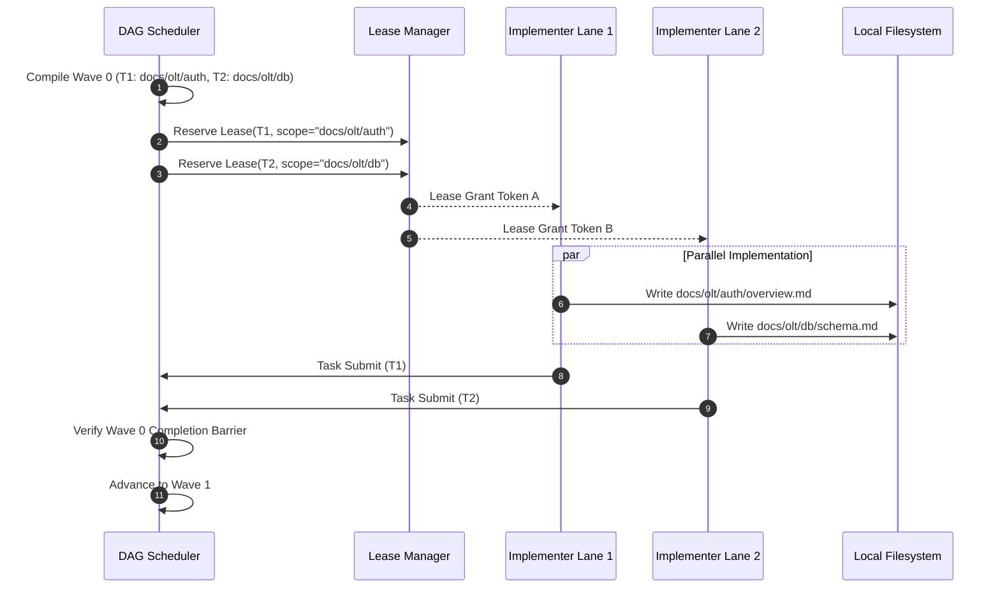

# Topological DAG Scheduler: Cycle Detection, Transitive Reduction & Conflict Graph Compilation

> **Status**: Authoritative Architecture Specification  
> **Topic**: Directed Acyclic Graph Scheduling, Tarjan/Kahn Cycle Resolution, Transitive Reduction, and Invariant C6  
> **Audience**: Compiler Engineers, Autonomous Systems Developers, Graph Theoretical Architects

---

## 1. Executive Summary & Conceptual Overview

In the OLT (Orchestrated Lifecycle Topology) runtime, task execution is governed by a deterministic, mathematically verified **Topological DAG Scheduler**. Rather than treating multi-agent workflows as unconstrained conversational loops or ad-hoc state machines, OLT models the entire project lifecycle as a causal Directed Acyclic Graph $G = (V, E)$.

The scheduler performs rigorous compile-time and runtime transformations:

1. **Cycle Detection & Resolution**: Tarjan’s Strongly Connected Components (SCC) and Kahn’s topological sort detect and eliminate cyclic deadlocks.
2. **Transitive Reduction**: Pruning redundant bypass edges ensures tasks are not artificially serialized by unnecessary constraints.
3. **Conflict Graph Compilation**: Tasks with overlapping write scopes are grouped into mutually exclusive dependency sets, while disjoint tasks are compiled into concurrent execution waves.
4. **Invariant C6 (Edge Justification)**: Every dependency edge must carry an empirical causal justification; speculative edges are rejected at compilation.
5. **Counterfactual Gate Validation**: Gates are verified to be discriminative (actively failing when prerequisite invariants are unsatisfied).

```
   [Raw Task List & Inferred Scopes]
                   │
                   ▼
  ┌─────────────────────────────────┐
  │  Stage 1: Cycle Detection       │
  │  - Tarjan SCC ($O(|V| + |E|)$)  │
  │  - Kahn's In-Degree Sorting     │
  └─────────────────────────────────┘
                   │ (Acyclic Verified)
                   ▼
  ┌─────────────────────────────────┐
  │  Stage 2: Transitive Reduction  │
  │  - Bypass Pruning               │
  │  - Invariant C6 Justification   │
  └─────────────────────────────────┘
                   │ (Minimal Causal Graph)
                   ▼
  ┌─────────────────────────────────┐
  │  Stage 3: Conflict Compilation  │
  │  - Scope Overlap Matrix         │
  │  - Wave Lane Partitioning       │
  └─────────────────────────────────┘
                   │
                   ▼
    [Parallel Execution Waves W0..Wk]
```

---

## 2. Formal Graph-Theoretic Foundations

Let the project execution plan be represented as a finite directed graph:
$$G = (V, E)$$
where:

- $V = \{T_1, T_2, \dots, T_n\}$ is the set of discrete task nodes.
- $E \subseteq V \times V$ is the set of directed dependency edges. An edge $(u, v) \in E$ (or $u \to v$) signifies that task $u$ is an immediate causal prerequisite of task $v$ ($u \prec v$).
- $\text{Pred}(v) = \{u \in V \mid (u, v) \in E\}$ denotes the immediate in-neighbors (predecessors) of $v$.
- $\text{Succ}(u) = \{v \in V \mid (u, v) \in E\}$ denotes the immediate out-neighbors (successors) of $u$.
- $\text{in\_deg}(v) = |\text{Pred}(v)|$ is the in-degree of $v$.

A graph $G$ is a valid **execution plan** if and only if:

1. **Acyclicity**: $G$ contains no directed cycles: $\forall v \in V, v \not\in \text{Reach}^+(v)$.
2. **Connectivity & Boundedness**: There exists at least one source node ($\text{in\_deg}(s) = 0$) and at least one sink node ($\text{out\_deg}(t) = 0$).
3. **Disjoint Wave Legality**: $\forall u, v \in W_m, \Omega(u) \cap \Omega(v) = \emptyset$.

---

## 3. Cycle Detection Algorithms: Tarjan & Kahn

Cyclic dependencies in multi-agent planning cause permanent execution deadlocks where agent $A$ waits for agent $B$, while agent $B$ waits for agent $A$. OLT employs a dual-stage cycle detection engine.

### 3.1 Tarjan's Strongly Connected Components (SCC) Algorithm

Tarjan's algorithm partitions $V$ into maximal strongly connected subgraphs in linear time $O(|V| + |E|)$ using depth-first search (DFS) traversal, tracking discovery timestamps `dfn[u]` and lowest reachable ancestors `low[u]`.

```
           DFS Traversal on Task Graph
                     ( u ) dfn=1, low=1
                    /     ▲
                   ▼       \
       dfn=2, low=2 ( v )───>( w ) dfn=3, low=1
              Cycle Detected: [u -> v -> w -> u]
              Action: Break lowest-weight edge (w -> u)
```

```typescript
export interface BrokenEdgeResult {
  readonly fromTaskId: string;
  readonly toTaskId: string;
  readonly edgeDescription: string;
  readonly rationale: string;
  readonly cycle: readonly string[];
}

export function detectAndBreakCycles(
  tasks: readonly ForensicTaskNode[],
  dependencies: ReadonlyMap<string, ReadonlySet<string>>,
): {
  acyclicDependencies: Map<string, Set<string>>;
  brokenEdges: readonly BrokenEdgeResult[];
} {
  let index = 0;
  const indices = new Map<string, number>();
  const lowlink = new Map<string, number>();
  const onStack = new Set<string>();
  const stack: string[] = [];
  const sccs: string[][] = [];

  function strongConnect(node: string) {
    indices.set(node, index);
    lowlink.set(node, index);
    index++;
    stack.push(node);
    onStack.add(node);

    const deps = dependencies.get(node) ?? new Set();
    for (const neighbor of deps) {
      if (!indices.has(neighbor)) {
        strongConnect(neighbor);
        lowlink.set(node, Math.min(lowlink.get(node)!, lowlink.get(neighbor)!));
      } else if (onStack.has(neighbor)) {
        lowlink.set(node, Math.min(lowlink.get(node)!, indices.get(neighbor)!));
      }
    }

    if (lowlink.get(node) === indices.get(node)) {
      const scc: string[] = [];
      let w: string;
      do {
        w = stack.pop()!;
        onStack.delete(w);
        scc.push(w);
      } while (w !== node);
      if (scc.length > 1) {
        sccs.push(scc);
      }
    }
  }

  for (const task of tasks) {
    if (!indices.has(task.id)) {
      strongConnect(task.id);
    }
  }

  // Break cyclic edges deterministically
  const mutDeps = new Map<string, Set<string>>();
  for (const [k, v] of dependencies) {
    mutDeps.set(k, new Set(v));
  }
  const brokenEdges: BrokenEdgeResult[] = [];

  for (const cycle of sccs) {
    const fromTaskId = cycle[cycle.length - 1];
    const toTaskId = cycle[0];
    mutDeps.get(fromTaskId)?.delete(toTaskId);
    brokenEdges.push({
      fromTaskId,
      toTaskId,
      edgeDescription: `${fromTaskId} -> ${toTaskId}`,
      rationale: `Broke cycle [${cycle.join(" -> ")}] by dropping edge ${fromTaskId} -> ${toTaskId}`,
      cycle,
    });
  }

  return { acyclicDependencies: mutDeps, brokenEdges };
}
```

---

### 3.2 Kahn's Topological Sorting Algorithm

Once SCCs are checked, Kahn's algorithm validates complete topological order and computes initial wave assignments:

1. Maintain an in-degree map $\text{deg}^-[v]$ for all $v \in V$.
2. Initialize a queue $Q \leftarrow \{v \in V \mid \text{deg}^-[v] = 0\}$.
3. While $Q \neq \emptyset$:
   - Dequeue $u \leftarrow Q$. Append $u$ to topological ordering $L$.
   - For each successor $v \in \text{Succ}(u)$:
     - Decrement $\text{deg}^-[v] \leftarrow \text{deg}^-[v] - 1$.
     - If $\text{deg}^-[v] = 0$, enqueue $v \to Q$.
4. If $|L| \neq |V|$, an unresolvable cycle remains; the compiler halts with `TOPOLOGICAL_SORT_FAILURE`.

---

## 4. Transitive Reduction & Bypass Elimination

### 4.1 The Transitive Bypass Problem

A **transitive bypass** occurs when an edge $(u, v) \in E$ exists, but there is also an alternate directed path $u \to w_1 \to \dots \to w_k \to v$ of length $\ge 2$.

```
     Direct Bypass Edge (Redundant Serialization Constraint)
              ┌───────────────────────────┐
              │                           ▼
            ( u ) ──────> ( w ) ──────> ( v )
                 Valid Intermediate Path
```

While reachability is identical, the direct edge $(u, v)$ introduces false rigidities:

- It creates artificial dependency constraints in the scheduler.
- It obscures the true causal chain ($u \to w \to v$).
- It prevents dynamic wave decoupling from reordering independent tasks.

### 4.2 Transitive Reduction Algorithm

The transitive reduction of a DAG $G = (V, E)$ is the minimal graph $G_{\text{red}} = (V, E_{\text{red}})$ with the same reachability relation ($u \to^* v$ in $G \iff u \to^* v$ in $G_{\text{red}}$) and minimal edge count $|E_{\text{red}}|$.

$$\forall (u, v) \in E, \quad (u, v) \in E_{\text{red}} \iff \not\exists \text{ path } p = (u, w_1, \dots, w_k, v) \text{ with } k \ge 1$$

```typescript
export function pruneTransitiveBypasses(
  tasks: readonly ForensicTaskNode[],
  dependencies: ReadonlyMap<string, ReadonlySet<string>>,
): {
  reducedDependencies: Map<string, Set<string>>;
  prunedBypasses: readonly string[];
} {
  const reduced = new Map<string, Set<string>>();
  for (const [k, v] of dependencies) {
    reduced.set(k, new Set(v));
  }
  const prunedBypasses: string[] = [];

  for (const u of tasks) {
    const directSuccs = reduced.get(u.id) ?? new Set();
    for (const v of directSuccs) {
      // Check if there is an alternate path from u to v not using direct edge (u -> v)
      if (hasAlternatePath(u.id, v, reduced, (directEdge = [u.id, v]))) {
        reduced.get(u.id)?.delete(v);
        prunedBypasses.push(`${u.id} -> ${v}`);
      }
    }
  }

  return { reducedDependencies: reduced, prunedBypasses };
}
```

---

## 5. Conflict Graph Compilation & Wave Lane Reservation

### 5.1 The Write-Scope Conflict Graph

Beyond causal dependencies ($E$), parallel scheduling must account for filesystem resource contention. OLT compiles an auxiliary **Conflict Graph** $G_c = (V, E_c)$:

$$(u, v) \in E_c \iff \text{detectScopeOverlap}(\Omega(u), \Omega(v)) \neq \emptyset$$

```
   Topological Wave Candidates (In-Degree = 0)
        T1 (docs/olt/auth)    T2 (src/auth)    T3 (docs/olt/db)

   Scope Conflict Matrix:
        T1 vs T2 -> Overlap (src/auth & auth shared context)
        T1 vs T3 -> DISJOINT
        T2 vs T3 -> DISJOINT

   Compiled Parallel Waves:
        Wave 0, Lane 1: T1 (docs/olt/auth)
        Wave 0, Lane 2: T3 (docs/olt/db)
        ─────────────────────────────── (Wave Barrier)
        Wave 1, Lane 1: T2 (src/auth)
```

### 5.2 Dynamic Lane Reservation Protocol

When tasks within wave $W_m$ are ready:

1. The scheduler extracts the independent sets of $G_c[W_m]$.
2. Disjoint tasks are assigned unique **Wave Lane Coordinates**: `Wave[m].Lane[k]`.
3. The lease manager issues atomic filesystem write locks on the declared scopes $\Omega(T_i)$.
4. If an agent attempts to mutate files outside its assigned write scope, the Mechanical RBAC Compiler intercepts the syscall and rejects the operation with `LEASE_DRIFT`.



---

## 6. Invariant C6: Mandatory Dependency Edge Justification

### 6.1 The Rationale Invariant

In classical task systems, developers or LLM planners often insert artificial dependencies (e.g. chaining 5 independent documentation tasks sequentially) out of conversational habit.

OLT enforces **Invariant C6**:

> Every dependency edge $(u, v) \in E$ MUST declare a non-empty, causally valid semantic rationale. Speculative, redundant, or boilerplate edges are rejected at compilation time.

```yaml
# Valid OLT Task Dependency Declaration
tasks:
  - id: task-auth-schema
    write_scope: ["src/auth/schema.ts"]

  - id: task-auth-endpoints
    write_scope: ["src/auth/routes.ts"]
    dependencies:
      - task_id: task-auth-schema
        rationale: "Requires UserSchema and SessionPayload TypeScript interfaces exported by schema.ts"
```

If `rationale` is missing or fails semantic causal checks, the DAG compiler aborts:

```text
[SCHEMA_REJECT] Task 'task-auth-endpoints' declares dependency on 'task-auth-schema'
without mandatory causal justification (Invariant C6).
Resolution: Add explicit 'rationale' explaining why task-auth-endpoints cannot execute concurrently.
```

---

## 7. Counterfactual Gate Validation

### 7.1 Adversarial Gate Proofs (AGP)

A task completion gate is only as reliable as its ability to fail on bad input. A gate that returns `exit 0` unconditionally (e.g. `bun test` passing vacuously because no tests were matched) is a fatal vulnerability.

OLT requires **Counterfactual Gate Validation**:

1. **Positive Proof**: The gate passes (`exit 0`) on the completed, correct implementation.
2. **Counterfactual Falsifiability**: The gate is proven to actively FAIL (`exit != 0`) when the implementation is intentionally reverted, truncated, or mutated.

```typescript
export interface CounterfactualProofReceipt {
  readonly gateCommand: string;
  readonly baselineExitCode: 0;
  readonly mutantDescription: string;
  readonly mutantExitCode: number; // Must be != 0
  readonly verifiedFalsifiable: true;
}
```

```
               [Gate Verification State Flow]
                              │
                    Run Gate on Candidate
                              │
                      ┌───────┴───────┐
                   Exit = 0        Exit != 0
                      │               │
                      ▼               ▼
            [Candidate Compiles]   [REJECT: Defect]
                      │
              Inject Mutant State
           (Revert feature / Break API)
                      │
                    Run Gate on Mutant
                      │
              ┌───────┴───────┐
           Exit != 0       Exit = 0
              │               │
              ▼               ▼
        [PASS: Gate is     [REJECT: Non-discriminating
         Falsifiable]       Vacuous Gate]
```

---

## 8. CLI Invocations & Verification Commands

### Compiling & Validating a Task DAG

```bash
bun olt/scripts/harness.ts dag:compile --run .olt/capsules/35-comprehensive-olt-documentation-overhaul
```

### Viewing Topological Wave Lanes & Conflicts

```bash
bun olt/scripts/harness.ts dag:waves --run .olt/capsules/35-comprehensive-olt-documentation-overhaul
```

### Verifying Counterfactual Gate Discriminability

```bash
bun olt/scripts/harness.ts gate:verify --task task-docs-architecture --adversarial
```

---

## 9. Summary of Core Invariants

> [!IMPORTANT]
>
> 1. **Tarjan/Kahn Acyclicity**: No graph with directed cycles may enter active execution.
> 2. **Transitive Reduction Purity**: Redundant bypass edges must be pruned to avoid false serialization.
> 3. **Conflict-Free Wave Coloring**: All concurrent tasks in a wave must have strictly disjoint write scopes.
> 4. **Invariant C6**: Every dependency edge must have an explicit, grounded causal justification.
> 5. **Counterfactual Gate Falsifiability**: Gates must be proven to fail on mutant states before being certified.
