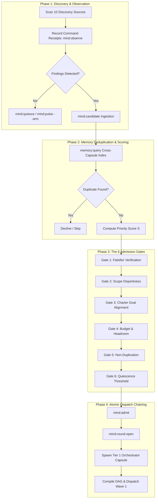
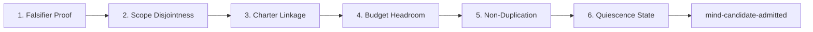

# How-To Guide: Autonomous Candidate Discovery, Evaluation & Admission in Tier 0 Mind

[⬅ Master Documentation Hub](../README.md) | [How-To: CLI Harness Usage](./cli-harness-usage.md) | [How-To: Custom Validators](./custom-validators.md)

---

## 🧭 Diátaxis Overview

| Quadrant         | Focus in this Document                                                                                                                                                                       | Target Audience                                            |
| :--------------- | :------------------------------------------------------------------------------------------------------------------------------------------------------------------------------------------- | :--------------------------------------------------------- |
| **How-To Guide** | Practical procedures for autonomous discovery scans, candidate ingestion, multi-factor scoring, deduplication against long-term memory, admission gating, and atomic orchestration chaining. | Tier 0 Mind Agents, System Supervisors, Platform Engineers |

In the OLT framework, **Tier 0 Mind** functions as the macro-strategic consciousness and autonomous Product Owner (PO). Operating at 30,000 feet, Mind continuously scans the codebase, discovers defects and architectural opportunities, scores and deduplicates candidates, evaluates the 6 Admission Gates, and chains admitted candidates directly into active orchestration capsules without human prompting.

---

## 🔄 1. The Autonomous Candidate Lifecycle Overview



---

## 🔍 2. Scanning the 10 Canonical Discovery Sources

Tier 0 Mind scans ten deterministic discovery sources across the workspace. Every observation must be backed by a recorded command execution receipt (`--command-id`).

### 2.1 The 10 Discovery Sources

| #      | Source ID                 | Scope & Target                                                            | Detection Command Example           |
| :----- | :------------------------ | :------------------------------------------------------------------------ | :---------------------------------- |
| **1**  | `intent-drift`            | Divergence between `olt/agents/mind.yaml` charter goals and active state. | `git log -n 20 --oneline`           |
| **2**  | `unassigned-todos`        | Unresolved `TODO`, `FIXME`, `HACK`, `XXX` comment markers in code.        | `grep -rnE "TODO                    | FIXME" src/` |
| **3**  | `coverage-gaps`           | Source files lacking corresponding unit or integration test suites.       | `bun test --coverage`               |
| **4**  | `dead-code`               | Unreferenced exported symbols, unreachable functions, orphaned files.     | `bun olt/scripts/harness.ts doctor` |
| **5**  | `type-errors`             | Strict TypeScript compiler errors, implicit `any` types, suppressions.    | `bun run typecheck`                 |
| **6**  | `lint-regressions`        | Code formatting errors, style deviations, linter warnings.                | `bun run lint`                      |
| **7**  | `security-alerts`         | Plaintext secrets, vulnerable dependencies, trust boundary flaws.         | `bun audit`                         |
| **8**  | `resource-leaks`          | Unclosed file handles, unhandled promise rejections, memory spikes.       | `node --trace-warnings`             |
| **9**  | `performance-regressions` | Slow benchmark iterations, quadratic loops, I/O bottlenecks.              | `bun test tests/bench/`             |
| **10** | `dependency-updates`      | Deprecated packages, breaking upstream semver updates.                    | `bun outdated`                      |

### 2.2 Recording Observations

When an observation scan finishes, record the result in the Mind event log:

```bash
MIND_RUN=".olt/capsules/mind-gen-1"

# 1. Run the scanning tool and capture receipt
CMD_RES=$(bun olt/scripts/harness.ts run:exec \
  --run "$MIND_RUN" \
  --actor mind-1 \
  -- "bun run typecheck" \
  --format json)

CMD_ID=$(echo "$CMD_RES" | jq -r '.command_id // "cmd-typecheck-1"')

# 2. Record the discovery observation
bun olt/scripts/harness.ts mind:observe \
  --run "$MIND_RUN" \
  --actor mind-1 \
  --source type-errors \
  --command-id "$CMD_ID" \
  --count 3
```

---

## 📝 3. Candidate Ingestion Protocol (`mind:candidate`)

Mind categorizes candidates into two distinct classes: **Defects** and **Proposals**.

### 3.1 Defect vs Proposal Requirements

```text
┌────────────────────────────────────────┬────────────────────────────────────────┐
│           DEFECT CANDIDATE             │          PROPOSAL CANDIDATE            │
├────────────────────────────────────────┼────────────────────────────────────────┤
│ • Objective regression or broken test  │ • Architectural enhancement or feature │
│ • MANDATORY: --witness <cmd_id>        │ • MANDATORY: --rationale "<why>"       │
│ • MANDATORY: --falsifier "<test_cmd>"  │ • Optional: --witness                  │
│ • MANDATORY: --write-scope <paths>     │ • MANDATORY: --write-scope <paths>     │
│ • MANDATORY: --charter-goal <G1..Gn>   │ • MANDATORY: --charter-goal <G1..Gn>   │
└────────────────────────────────────────┴────────────────────────────────────────┘
```

> [!IMPORTANT]
> A defect's `--falsifier` is a command string that **must exit non-zero (fail)** in the repository's current state, and **must exit zero (pass)** once the defect is repaired.

### 3.2 Ingestion Recipes

```bash
MIND_RUN=".olt/capsules/mind-gen-1"

# Scenario A: Ingesting a Defect Candidate
bun olt/scripts/harness.ts mind:candidate \
  --run "$MIND_RUN" \
  --actor mind-1 \
  --kind defect \
  --statement "Null pointer exception when parsing empty gRPC telemetry stream" \
  --witness "$CMD_ID" \
  --falsifier "bun test tests/unit/telemetry-parser.test.ts" \
  --write-scope "src/telemetry/" \
  --charter-goal G1

# Scenario B: Ingesting an Architectural Proposal Candidate
bun olt/scripts/harness.ts mind:candidate \
  --run "$MIND_RUN" \
  --actor mind-1 \
  --kind proposal \
  --statement "Implement zero-copy buffer pooling for streaming RPC gateway" \
  --rationale "Reduces GC pause times by 40% under high-throughput ingestion" \
  --write-scope "src/rpc/buffers/" \
  --charter-goal G2
```

---

## 🧮 4. Multi-Factor Scoring Matrix & Mathematical Prioritization

Before admission, Mind ranks candidates using a deterministic mathematical scoring formula to ensure maximum ROI on cognitive compute.

### 4.1 Prioritization Function

The priority score $S(C)$ of candidate $C$ is defined as:

$$S(C) = \frac{\text{Impact}(C) \times \text{Charter Alignment}(C)}{\text{Risk}(C) \times \text{Effort}(C)}$$

Where each factor is evaluated on an integer scale from 1 to 5:

- **$\text{Impact} \in [1, 5]$**: 1 (Cosmetic tweak) to 5 (Critical blocker / crash fix).
- **$\text{Charter Alignment} \in [1, 5]$**: Number and weight of satisfied Charter Goals.
- **$\text{Risk} \in [1, 5]$**: 1 (Isolated leaf module) to 5 (Core shared runtime interface).
- **$\text{Effort} \in [1, 5]$**: 1 ($\le 15$ min quick-fix) to 5 (Multi-hour architectural overhaul).

### 4.2 Brent Concurrency Allocation

When scheduling multiple admitted candidates, Mind computes the theoretical minimum completion time using Brent's Scheduling Principle:

$$W = \sum_{i \in \text{Candidates}} \text{Effort}_i, \quad S = \text{Critical Path Depth}, \quad P = \left\lceil \frac{W}{S} \right\rceil$$

- $W$ is total Work across all candidate tasks.
- $S$ is the Span (longest sequential dependency chain).
- $P$ is the recommended worker pool size to achieve linear speedup without cognitive contention.

---

## 🧠 5. Memory Deduplication Engine (`memory:query`)

To prevent duplicate candidate proposals and redundant work across long-horizon generational loops, Mind queries long-term cross-capsule memory before admission.

### 5.1 Deduplication Workflow

```bash
# 1. Query past runs and decisions for semantic similarity
QUERY_RES=$(bun olt/scripts/harness.ts memory:query \
  --query "zero-copy buffer pool streaming" \
  --limit 5 \
  --min-score 0.75 \
  --format json)

# 2. Inspect whether a matching proposal is already active or declined
DUPLICATE_COUNT=$(echo "$QUERY_RES" | jq '.matches | length')

if [ "$DUPLICATE_COUNT" -gt 0 ]; then
  echo "⚠️ Candidate matches existing memory document. Declining duplicate."
  bun olt/scripts/harness.ts mind:decline \
    --run "$MIND_RUN" \
    --actor mind-1 \
    --candidate cand-2 \
    --reason "Duplicate of previously completed objective obj-rpc-buffers"
fi
```

### 5.2 Cryptographic Title & Statement Fingerprinting

Mind computes a SHA-256 stream digest over candidate metadata:

$$\text{Fingerprint} = \text{SHA256}(\text{kind} \parallel \text{statement} \parallel \text{write\_scope})$$

If an identical fingerprint exists in `.olt/backlog.jsonl` or `state.candidates`, the ingestion engine automatically rejects the duplicate.

---

## 🛡️ 6. The 6 Admission Gates & Atomic Chaining (`mind:admit`)

When `mind:admit` is executed, the harness deterministically validates all six admission gates in sequence:



### 6.1 Gate Definitions

1. **Gate 1: Falsifier Verification**: For defects, the harness runs `--falsifier` in an isolated subshell. If it exits `0` (passes), admission is **refused** because the defect is non-reproducible.
2. **Gate 2: Scope Disjointness (`detectScopeOverlap`)**: The candidate's `--write-scope` must not intersect with any currently leased task across any active run capsule.
3. **Gate 3: Charter Goal Linkage**: Every `--charter-goal` ID must match an active goal defined in `olt/agents/mind.yaml`.
4. **Gate 4: Budget & Headroom Check**: Mind verifies that daily pulse limits and token consumption quotas have sufficient headroom.
5. **Gate 5: Non-Duplication Check**: The candidate must not match any open candidate or uncompleted backlog item.
6. **Gate 6: Quiescence Threshold**: All 10 discovery sources must have recorded clean scans or accounted observations.

### 6.2 Executing Admission & Chaining to Orchestration

```bash
MIND_RUN=".olt/capsules/mind-gen-1"
CANDIDATE_ID="cand-1"
OBJECTIVE_ID="obj-telemetry-null-fix"
NEW_RUN_ID="39-telemetry-null-fix"

# Step 1: Run Admission Gates
bun olt/scripts/harness.ts mind:admit \
  --run "$MIND_RUN" \
  --actor mind-1 \
  --candidate "$CANDIDATE_ID"

# Step 2: Open Multi-Pulse Round for the Objective
bun olt/scripts/harness.ts mind:round-open \
  --run "$MIND_RUN" \
  --actor mind-1 \
  --objective "$OBJECTIVE_ID" \
  --candidate "$CANDIDATE_ID" \
  --round 1

# Step 3: Atomically Bootstrap New Execution Run Capsule
bun olt/scripts/harness.ts orchestrate \
  --repo . \
  --run "$NEW_RUN_ID" \
  --prompt-file "specs/${OBJECTIVE_ID}.md"

echo "✅ Admitted candidate ${CANDIDATE_ID} and chained directly into run ${NEW_RUN_ID}."
```

---

## ⏳ 7. Stagnation Avoidance & Generational Rotation

Mind is designed for perpetual self-evolution. To avoid deadlocks, idle looping, or context exhaustion:

### 7.1 Anti-Idle Perpetual Pulsing

When no active candidates require immediate admission:

```bash
# Record all 10 sources as clean and quiesce
bun olt/scripts/harness.ts mind:quiesce \
  --run "$MIND_RUN" \
  --actor mind-1 \
  --source intent-drift:cmd-1:0 \
  --source unassigned-todos:cmd-2:0 \
  --source coverage-gaps:cmd-3:0 \
  --source dead-code:cmd-4:0 \
  --source type-errors:cmd-5:0 \
  --source lint-regressions:cmd-6:0 \
  --source security-alerts:cmd-7:0 \
  --source resource-leaks:cmd-8:0 \
  --source performance-regressions:cmd-9:0 \
  --source dependency-updates:cmd-10:0

# Arm next pulse interval (e.g. 15 minutes)
bun olt/scripts/harness.ts mind:pulse \
  --run "$MIND_RUN" \
  --actor mind-1 \
  --arm 15m \
  --arm-mechanism "antigravity-scheduler"
```

### 7.2 Generational Rotation (`mind:rotate`)

When a Mind capsule reaches milestone thresholds (e.g., 500 pulses or major charter updates), Mind rotates to the next generation (`mind-gen-2`), preserving charter pins, audit histories, and memory indices while pruning transient event streams:

```bash
bun olt/scripts/harness.ts mind:rotate \
  --run "$MIND_RUN" \
  --actor mind-1 \
  --next-mind-id mind-gen-2 \
  --reason "Generational milestone: 500 pulses completed; rotating active state"
```

---

## 📋 8. Complete Autonomous Mind Loop Script

```bash
#!/usr/bin/env bash
# File: scripts/mind-autonomous-loop.sh
# Purpose: Autonomous Tier 0 Mind discovery, admission, and dispatch loop

set -euo pipefail

MIND_RUN="${1:-.olt/capsules/mind-gen-1}"
ACTOR="mind-1"

echo "🧠 Initializing Tier 0 Mind Autonomous Cadence on ${MIND_RUN}..."

# 1. Autonomous Wakeup
bun olt/scripts/harness.ts mind:wake --run "$MIND_RUN"

# 2. Run Typecheck Discovery Scan
echo "🔍 Scanning discovery source: type-errors..."
TC_OUT=$(bun run typecheck 2>&1 || true)

if echo "$TC_OUT" | grep -q "error TS"; then
  echo "⚠️ Type errors detected! Ingesting candidate defect..."

  # Record command
  CMD_RES=$(bun olt/scripts/harness.ts run:exec \
    --run "$MIND_RUN" \
    --actor "$ACTOR" \
    -- "bun run typecheck" \
    --format json)
  CMD_ID=$(echo "$CMD_RES" | jq -r '.command_id')

  # Ingest Candidate
  CAND_RES=$(bun olt/scripts/harness.ts mind:candidate \
    --run "$MIND_RUN" \
    --actor "$ACTOR" \
    --kind defect \
    --statement "TypeScript compiler errors detected during autonomous scan" \
    --witness "$CMD_ID" \
    --falsifier "bun run typecheck" \
    --write-scope "src/" \
    --charter-goal G1 \
    --format json)

  CAND_ID=$(echo "$CAND_RES" | jq -r '.candidate.id // "cand-1"')

  # Evaluate Admission Gates and Admit
  echo "🛡️ Evaluating admission gates for candidate: ${CAND_ID}..."
  bun olt/scripts/harness.ts mind:admit \
    --run "$MIND_RUN" \
    --actor "$ACTOR" \
    --candidate "$CAND_ID"

  # Chain to active orchestration
  OBJ_ID="obj-fix-typecheck-$(date +%s)"
  bun olt/scripts/harness.ts mind:round-open \
    --run "$MIND_RUN" \
    --actor "$ACTOR" \
    --objective "$OBJ_ID" \
    --candidate "$CAND_ID" \
    --round 1

  echo "🚀 Autonomous admission and chaining complete for ${OBJ_ID}."
else
  echo "✨ Workspace is clean. Arming next pulse..."
  bun olt/scripts/harness.ts mind:pulse \
    --run "$MIND_RUN" \
    --actor "$ACTOR" \
    --arm 15m
fi
```
