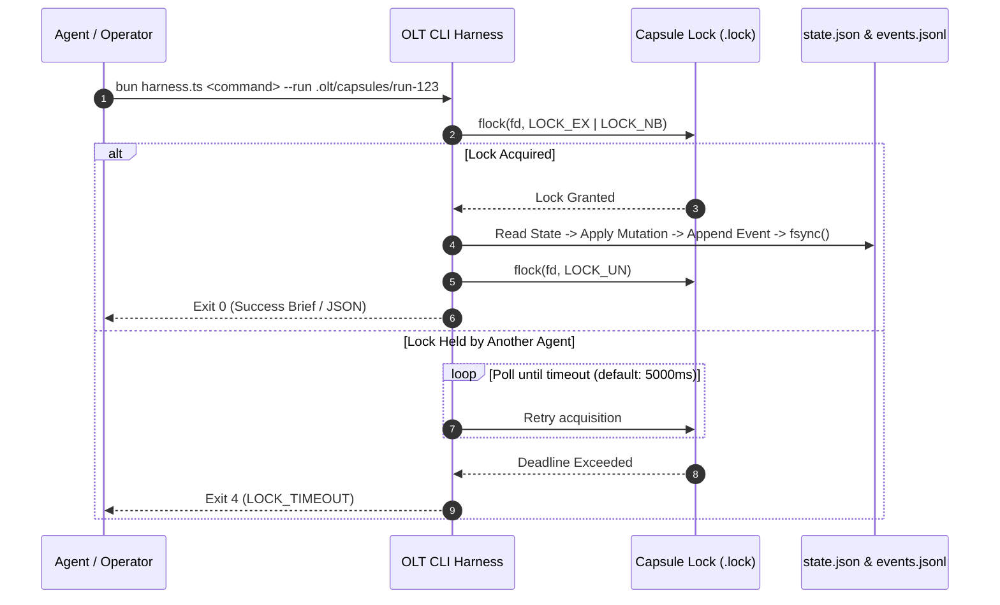
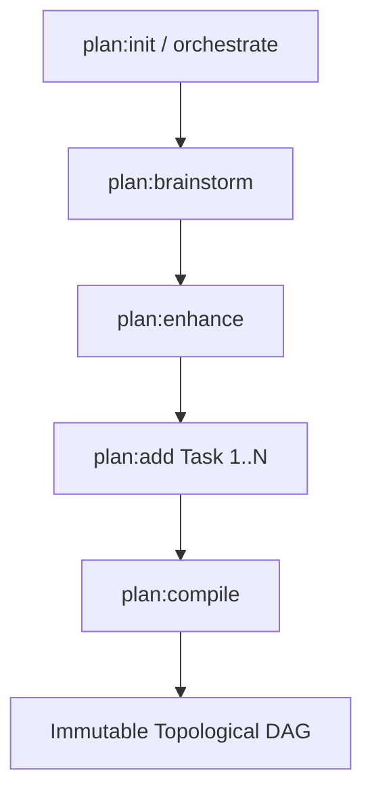
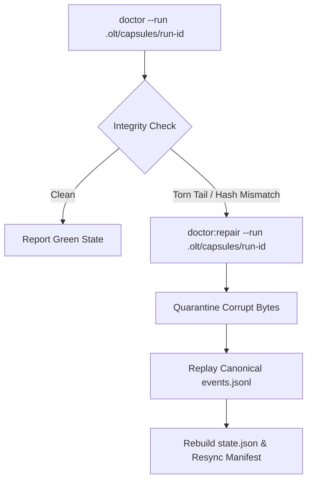

# How-To Guide: Operating the OLT CLI Harness & Orchestration Suite

[⬅ Master Documentation Hub](../README.md) | [How-To: Candidate Admission](./candidate-admission.md) | [How-To: Custom Validators](./custom-validators.md)

---

## 🧭 Diátaxis Overview

| Quadrant         | Focus in this Document                                                                                                  | Target Audience                                                  |
| :--------------- | :---------------------------------------------------------------------------------------------------------------------- | :--------------------------------------------------------------- |
| **How-To Guide** | Practical, problem-oriented operational recipes, copy-paste bash snippets, error recovery, and CLI automation patterns. | Operators, Lead Engineers, Automation Scripts, Autonomous Agents |

This guide provides operational workflows for the OLT CLI harness (`bun olt/scripts/harness.ts`). It covers command execution, stdin/stdout stream handling, JSON output processing, concurrency lock management, state inspection, and task lifecycle management.

---

## ⚡ 1. Core Invariants & CLI Execution Standards

Every harness invocation adheres to strict mechanical invariants designed for deterministic multi-agent execution.

### 1.1 Invocation Syntax

```bash
bun olt/scripts/harness.ts <command> [--flag value] [--boolean-flag]
```

- **Output Format**: By default, commands emit concise markdown briefs (maximum 30 lines) optimized for LLM context windows.
- **Structured JSON Mode**: Appending `--format json` or `--json` forces the harness to emit machine-readable JSON to `stdout` with exit code `0`.
- **Telemetry Separation**: Diagnostic information and fatal stack traces are isolated to `stderr`. `stdout` remains parseable.

### 1.2 Exit Code Reference Matrix

The harness returns deterministic exit codes to allow calling scripts to differentiate transient contention from permanent argument errors:

| Exit Code | Classification                                     | Meaning                                                             | Operator Action                                                      |
| :-------- | :------------------------------------------------- | :------------------------------------------------------------------ | :------------------------------------------------------------------- |
| `0`       | `SUCCESS`                                          | Command completed successfully. Payload emitted on `stdout`.        | Proceed to next DAG step.                                            |
| `3`       | `INVALID_ARGUMENT` / `INVALID_STATE` / `INTEGRITY` | Operation violated state machine rules, path boundaries, or schema. | Do not retry automatically. Inspect error payload and correct input. |
| `4`       | `LOCK_TIMEOUT`                                     | Advisory POSIX `flock` could not be acquired within the deadline.   | Retry with exponential backoff and jitter.                           |
| `70`      | `INTERNAL_ERROR` / `NOT_IMPLEMENTED`               | Unhandled exception or missing command handler.                     | Escalate to system supervisor; inspect capsule logs.                 |

---

## 🔒 2. Concurrency Control & POSIX Lock Timeout Handling

The harness uses advisory POSIX file locks (`flock`) on `.olt/capsules/<run-id>/.lock` to guarantee linearizable state mutations across concurrent agents.



### 2.1 Handling Lock Timeouts in Shell Scripts

When multiple agents execute concurrently against the same capsule, use a deterministic retry wrapper with exponential backoff:

```bash
#!/usr/bin/env bash
set -euo pipefail

run_with_retry() {
  local max_attempts=5
  local timeout_base=1
  local attempt=1
  local exit_code=0

  while [ "$attempt" -le "$max_attempts" ]; do
    set +e
    "$@"
    exit_code=$?
    set -e

    if [ "$exit_code" -eq 0 ]; then
      return 0
    elif [ "$exit_code" -eq 4 ]; then
      # Exit code 4 is LOCK_TIMEOUT: apply jittered backoff
      local sleep_time=$(( timeout_base * attempt ))
      echo "⚠️ [$(date +'%T')] Lock contention on capsule. Retrying in ${sleep_time}s (Attempt ${attempt}/${max_attempts})..." >&2
      sleep "$sleep_time"
      attempt=$(( attempt + 1 ))
    else
      echo "❌ Command failed with fatal exit code ${exit_code}." >&2
      return "$exit_code"
    fi
  done

  echo "❌ Failed to acquire lock after ${max_attempts} attempts." >&2
  return 4
}

# Usage Example:
run_with_retry bun olt/scripts/harness.ts task:heartbeat \
  --run .olt/capsules/35-docs-overhaul \
  --task task-docs-how-to \
  --agent implementer-2 \
  --token "9H1JUJj8tV95cUTx8GP5UGl8B7O4nYykkKny3_UU4xY"
```

### 2.2 Inspecting Active Capsule Locks

To inspect lock contention or identify stuck processes:

```bash
# Check lock state and held leases
bun olt/scripts/harness.ts inspect:lock --run .olt/capsules/35-docs-overhaul

# Output in JSON for programmatic parsing
bun olt/scripts/harness.ts inspect:lock --run .olt/capsules/35-docs-overhaul --format json | jq .
```

---

## 📥 3. Stdin Handling & Byte-for-Byte Prompt Capture

The harness enforces strict byte-for-byte prompt immutability to prevent terminal quoting bugs or shell expansion artifacts.

### 3.1 Capturing Prompts via Piped Stdin

The harness detects when `stdin` is piped (non-TTY) and consumes input without blocking interactive terminals.

```bash
# Method A: Direct pipe from command output
cat prompt.txt | bun olt/scripts/harness.ts orchestrate --repo . --run 36-feature-build

# Method B: Heredoc with exact whitespace preservation
cat << 'EOF' | bun olt/scripts/harness.ts plan:init --repo . --run 36-feature-build --prompt-stdin
Implement an LRU cache with:
1. O(1) get and set operations.
2. Thread-safe eviction listeners.
3. Zero external dependencies.
EOF
```

> [!IMPORTANT]
> When piping prompt bytes, pass `--prompt-stdin` if you want the command to fail loudly if `stdin` is empty, rather than falling through.

### 3.2 Capturing Prompts from Files

For large specification documents, use `--prompt-file` to record the SHA-256 digest of the source file directly into `manifest.json`:

```bash
bun olt/scripts/harness.ts plan:init \
  --repo . \
  --run 37-api-gateway \
  --prompt-file specs/api-gateway-v2.md \
  --capture-mode file \
  --source-verified true
```

---

## 🛠️ 4. Practical Operational Recipes by Domain

### 4.1 Domain: Planning & Decomposition (`plan`)

The planning domain initializes capsules, conducts Socratic prompt expansions, records enhanced repository observations, registers task declarations, and compiles topological DAGs.



#### Recipe: Initializing and Compiling a Complete Multi-Task Plan

```bash
CAPSULE_RUN=".olt/capsules/38-distributed-queue"

# 1. Initialize capsule
bun olt/scripts/harness.ts plan:init \
  --repo . \
  --run-id 38-distributed-queue \
  --prompt-file specs/queue-spec.md

# 2. Socratic 8-vector prompt expansion
bun olt/scripts/harness.ts plan:brainstorm \
  --run "$CAPSULE_RUN" \
  --rounds 3 \
  --actor planner-1

# 3. Enhance plan with repository observations (tagged agent_reported)
bun olt/scripts/harness.ts plan:enhance \
  --run "$CAPSULE_RUN" \
  --actor planner-1 \
  --summary "Build a persistent Raft-backed message queue" \
  --todo "Implement write-ahead log" \
  --todo "Implement Raft consensus module" \
  --todo "Implement client gRPC endpoints" \
  --risk "Disk fsync performance on cloud volumes" \
  --source "src/storage/wal.ts" \
  --source "src/consensus/raft.ts"

# 4. Declare Tasks with Disjoint Write Scopes and Dependency Reasons
bun olt/scripts/harness.ts plan:add \
  --run "$CAPSULE_RUN" \
  --actor planner-1 \
  --id task-wal \
  --label "Write-Ahead Log Engine" \
  --scope "src/storage/" \
  --gate "bun test tests/unit/wal.test.ts" \
  --goal "Zero-allocation WAL engine with cyclic CRC32 verification" \
  --priority 100 \
  --effort 3

bun olt/scripts/harness.ts plan:add \
  --run "$CAPSULE_RUN" \
  --actor planner-1 \
  --id task-raft \
  --label "Raft Consensus Module" \
  --scope "src/consensus/" \
  --gate "bun test tests/unit/raft.test.ts" \
  --deps "task-wal" \
  --dep-reason "task-wal:Raft log replication depends on WAL disk serialization format" \
  --goal "Leader election, log replication, and heartbeats" \
  --priority 80 \
  --effort 5

bun olt/scripts/harness.ts plan:add \
  --run "$CAPSULE_RUN" \
  --actor planner-1 \
  --id task-api \
  --label "gRPC API Gateway" \
  --scope "src/api/" \
  --gate "bun test tests/unit/grpc.test.ts" \
  --deps "task-raft" \
  --dep-reason "task-raft:API endpoints route RPC calls directly to active Raft leader" \
  --goal "Publish and subscribe endpoints" \
  --priority 60 \
  --effort 2

# 5. Compile and seal the plan (Freezes planning buffer into state.dag)
bun olt/scripts/harness.ts plan:compile \
  --run "$CAPSULE_RUN" \
  --actor coordinator-1
```

---

### 4.2 Domain: Task Execution & Lease Lifecycle (`task`)

Tasks transition through a state machine protected by bearer lease tokens:

```text
[ planned ] ──► [ ready ] ──► [ leased / executing ] ──► [ submitted ] ──► [ validating ] ──► [ validated ] ──► [ finished ]
                                       │                        ▲
                                       ▼                        │
                              [ changes_requested ] ────────────┘
```

#### Recipe: Agent Registration, Claiming, Heartbeating, and Submission

```bash
CAPSULE_RUN=".olt/capsules/38-distributed-queue"
AGENT_ID="implementer-wal"
TASK_ID="task-wal"

# 1. Register Agent Identity in Grant Ledger
bun olt/scripts/harness.ts agent:register \
  --run "$CAPSULE_RUN" \
  --agent "$AGENT_ID" \
  --role implementer \
  --host antigravity \
  --parent-agent coordinator-1 \
  --parent-task "$TASK_ID"

# 2. Claim Task Lease (Returns Lease Token & Write Scope)
CLAIM_JSON=$(bun olt/scripts/harness.ts task:claim \
  --run "$CAPSULE_RUN" \
  --task "$TASK_ID" \
  --agent "$AGENT_ID" \
  --format json)

# Extract Lease Token securely
LEASE_TOKEN=$(echo "$CLAIM_JSON" | jq -r '.lease_token // .token // empty')
echo "🔑 Leased ${TASK_ID} with token: ${LEASE_TOKEN}"

# 3. Send Periodic Heartbeat during Long Execution (Extends Lease Expiry)
bun olt/scripts/harness.ts task:heartbeat \
  --run "$CAPSULE_RUN" \
  --task "$TASK_ID" \
  --agent "$AGENT_ID" \
  --token "$LEASE_TOKEN"

# 4. Run Verification Checks before Submission
bun olt/scripts/harness.ts task:check \
  --run "$CAPSULE_RUN" \
  --task "$TASK_ID" \
  --file "src/storage/wal.ts" \
  --typecheck \
  --lint

# 5. Submit Completed Task with Cryptographic Evidence
bun olt/scripts/harness.ts task:submit \
  --run "$CAPSULE_RUN" \
  --task "$TASK_ID" \
  --agent "$AGENT_ID" \
  --token "$LEASE_TOKEN" \
  --summary "Implemented zero-allocation WAL engine with cyclic CRC32 framing" \
  --files-changed "src/storage/wal.ts"

# 6. Release Agent Grant upon Completion
bun olt/scripts/harness.ts agent:release \
  --run "$CAPSULE_RUN" \
  --agent "$AGENT_ID" \
  --reason "Implementation complete and submitted for validation"
```

#### Recipe: Submitting a No-Op Task

When an investigation determines that no file changes were necessary:

```bash
bun olt/scripts/harness.ts task:submit \
  --run "$CAPSULE_RUN" \
  --task "$TASK_ID" \
  --agent "$AGENT_ID" \
  --token "$LEASE_TOKEN" \
  --summary "Investigated crash dump; confirmed bug was resolved by prior WAL commit" \
  --no-op \
  --reason "Defect was a duplicate symptom of WAL truncation fixed in task-wal"
```

---

### 4.3 Domain: Queue Management & Wave Scheduling (`queue`)

The queue engine evaluates DAG dependencies, computes Brent Concurrency ($P = \lceil W/S \rceil$), and partitions tasks into parallel execution waves.

#### Recipe: Calculating and Dispatching Execution Waves

```bash
CAPSULE_RUN=".olt/capsules/38-distributed-queue"

# 1. View Current Queue Status and Ready Tasks
bun olt/scripts/harness.ts queue:status --run "$CAPSULE_RUN"

# 2. Get Next Claimable Task for an Agent
NEXT_TASK=$(bun olt/scripts/harness.ts queue:next \
  --run "$CAPSULE_RUN" \
  --format json | jq -r '.task.id // empty')

if [ -n "$NEXT_TASK" ]; then
  echo "🚀 Dispatching worker for task: $NEXT_TASK"
fi

# 3. Compute Full Wave Plan with Concurrency Width
bun olt/scripts/harness.ts queue:wave \
  --run "$CAPSULE_RUN" \
  --format json | jq '{
    wave_index: .current_wave,
    parallel_tasks: .ready_tasks,
    concurrency_target: .brent_concurrency
  }'
```

---

### 4.4 Domain: Task Validation & Dual-Channel Review (`task:review`)

Validation enforces independent review across standing checklist domains: `code-quality`, `security`, `system-design`, `ui-design`, `product`.

#### Recipe: Validating, Probing, and Passing a Task

```bash
CAPSULE_RUN=".olt/capsules/38-distributed-queue"
VALIDATOR_ID="validator-cq-1"
TASK_ID="task-wal"

# 1. Register Independent Validator Agent
bun olt/scripts/harness.ts agent:register \
  --run "$CAPSULE_RUN" \
  --agent "$VALIDATOR_ID" \
  --role validator \
  --host antigravity \
  --parent-agent coordinator-1 \
  --parent-task "$TASK_ID"

# 2. Start Validation Lease for 'code-quality' Domain
VAL_START_JSON=$(bun olt/scripts/harness.ts task:validate-start \
  --run "$CAPSULE_RUN" \
  --task "$TASK_ID" \
  --validator "$VALIDATOR_ID" \
  --validator-domain code-quality \
  --format json)

VAL_TOKEN=$(echo "$VAL_START_JSON" | jq -r '.validation_token // .token // empty')

# 3. Issue Socratic Cognitive Probes (Demands for Proof)
bun olt/scripts/harness.ts task:probe \
  --run "$CAPSULE_RUN" \
  --task "$TASK_ID" \
  --validator "$VALIDATOR_ID" \
  --token "$VAL_TOKEN" \
  --demand "Prove WAL recovers cleanly when corrupted byte occurs in record header"

# 4. Pass Review with Gate Evidence and Checklist Report
bun olt/scripts/harness.ts task:review \
  --run "$CAPSULE_RUN" \
  --task "$TASK_ID" \
  --validator "$VALIDATOR_ID" \
  --token "$VAL_TOKEN" \
  --status pass \
  --checks "C-wal-gate,C-wal-probe-1" \
  --summary "WAL engine meets all CQ standards; 0 any types, full error coverage"
```

#### Recipe: Rejecting a Task with Structured Finding

```bash
bun olt/scripts/harness.ts task:reject \
  --run "$CAPSULE_RUN" \
  --task "$TASK_ID" \
  --validator "$VALIDATOR_ID" \
  --token "$VAL_TOKEN" \
  --reason "Empty catch block in WAL recovery silently drops uncommitted segments" \
  --severity critical \
  --remediation "Wrap recovery errors in CorruptedSegmentError and rethrow"
```

---

### 4.5 Domain: Mind Operations (`mind`)

Tier 0 Mind governs continuous autonomous discovery, candidate admission, and multi-generational evolution.

#### Recipe: Initializing Mind, Pulsing, and Admitting Candidates

```bash
MIND_RUN=".olt/capsules/mind-gen-1"

# 1. Initialize Mind Capsule with Charter Pinning
bun olt/scripts/harness.ts mind:init \
  --repo . \
  --charter olt/agents/mind.yaml \
  --actor owner-1 \
  --mind-id mind-gen-1

# 2. Autonomous Pulse Wakeup & Health Check
bun olt/scripts/harness.ts mind:wake --run "$MIND_RUN"

# 3. Record Observations from Discovery Source Scans
bun olt/scripts/harness.ts mind:observe \
  --run "$MIND_RUN" \
  --actor mind-1 \
  --source type-errors \
  --command-id cmd-typecheck-1 \
  --count 2

# 4. Ingest Defect Candidate with Falsifier Proof
bun olt/scripts/harness.ts mind:candidate \
  --run "$MIND_RUN" \
  --actor mind-1 \
  --kind defect \
  --statement "Unchecked null dereference in telemetry parser" \
  --witness cmd-typecheck-1 \
  --falsifier "bun test tests/unit/telemetry.test.ts" \
  --charter-goal G1 \
  --write-scope "src/telemetry/"

# 5. Run the 6 Admission Gates and Admit Candidate
bun olt/scripts/harness.ts mind:admit \
  --run "$MIND_RUN" \
  --actor mind-1 \
  --candidate cand-1

# 6. Open Execution Round for Admitted Objective
bun olt/scripts/harness.ts mind:round-open \
  --run "$MIND_RUN" \
  --actor mind-1 \
  --objective obj-fix-telemetry \
  --candidate cand-1 \
  --round 1
```

---

### 4.6 Domain: Capsule Doctor & Recovery (`doctor`)

The doctor checks hash-chain integrity, detects torn tails from power failures/crashes, and rebuilds corrupted projections.



#### Recipe: Diagnosing and Repairing Broken Capsule State

```bash
CAPSULE_RUN=".olt/capsules/38-distributed-queue"

# 1. Run Doctor Health Diagnostics
bun olt/scripts/harness.ts doctor --run "$CAPSULE_RUN"

# 2. If errors or torn-tail warnings are reported, run atomic projection recovery
bun olt/scripts/harness.ts doctor:repair \
  --run "$CAPSULE_RUN" \
  --actor coordinator-1

# 3. Re-verify health status
bun olt/scripts/harness.ts doctor --run "$CAPSULE_RUN"
```

---

### 4.7 Domain: State Inspection & Visual Reporting (`report` / `inspect`)

#### Recipe: Generating Real-Time Visual Reports

```bash
CAPSULE_RUN=".olt/capsules/38-distributed-queue"

# 1. ASCII Topological Dependency DAG
bun olt/scripts/harness.ts report:dag --run "$CAPSULE_RUN"

# 2. ASCII Execution Gantt Chart
bun olt/scripts/harness.ts report:gantt --run "$CAPSULE_RUN"

# 3. Task Status Table with Leases and Gate Verifications
bun olt/scripts/harness.ts report:tasks --run "$CAPSULE_RUN"

# 4. Inspect Detailed JSON State of a Single Task
bun olt/scripts/harness.ts inspect:task \
  --run "$CAPSULE_RUN" \
  --task task-wal \
  --format json | jq .

# 5. Export Complete Run Summary Artifact
bun olt/scripts/harness.ts summary:export \
  --run "$CAPSULE_RUN" \
  --output "reports/run-38-summary.md"
```

---

## 🚀 5. Automated Multi-Agent Orchestration Script

The following production-ready bash script orchestrates a complete autonomous wave loop with error handling and retry mechanics:

```bash
#!/usr/bin/env bash
# File: scripts/olt-worker-loop.sh
# Purpose: Autonomous worker execution loop for OLT task claims

set -euo pipefail

RUN_ID="${1:-.olt/capsules/38-distributed-queue}"
AGENT_NAME="${2:-worker-$RANDOM}"

echo "🤖 Starting OLT Worker Loop [Agent: ${AGENT_NAME}, Capsule: ${RUN_ID}]"

while true; do
  # 1. Check for ready tasks
  NEXT_RAW=$(bun olt/scripts/harness.ts queue:next --run "$RUN_ID" --format json || true)
  TASK_ID=$(echo "$NEXT_RAW" | jq -r '.task.id // empty')

  if [ -z "$TASK_ID" ] || [ "$TASK_ID" = "null" ]; then
    echo "💤 No tasks currently ready. Sleeping 5 seconds..."
    sleep 5
    continue
  fi

  echo "📌 Found ready task: ${TASK_ID}"

  # 2. Register Agent
  bun olt/scripts/harness.ts agent:register \
    --run "$RUN_ID" \
    --agent "$AGENT_NAME" \
    --role implementer \
    --host antigravity \
    --parent-agent coordinator-1 \
    --parent-task "$TASK_ID"

  # 3. Claim Lease
  CLAIM_RES=$(bun olt/scripts/harness.ts task:claim \
    --run "$RUN_ID" \
    --task "$TASK_ID" \
    --agent "$AGENT_NAME" \
    --format json)

  TOKEN=$(echo "$CLAIM_RES" | jq -r '.lease_token // .token // empty')
  SCOPE=$(echo "$CLAIM_RES" | jq -r '.assigned_write_scope // .write_scope // empty')

  if [ -z "$TOKEN" ] || [ "$TOKEN" = "null" ]; then
    echo "⚠️ Failed to claim lease on ${TASK_ID}. Another worker may have acquired it."
    sleep 2
    continue
  fi

  echo "🔒 Acquired lease on ${TASK_ID} [Scope: ${SCOPE}]"

  # 4. Execute Implementation within Scope
  # (Simulated work step)
  echo "⚙️ Executing work in scope: ${SCOPE}..."
  sleep 2

  # 5. Run Incremental Checks
  bun olt/scripts/harness.ts task:check \
    --run "$RUN_ID" \
    --task "$TASK_ID" \
    --typecheck \
    --lint

  # 6. Submit Task
  bun olt/scripts/harness.ts task:submit \
    --run "$RUN_ID" \
    --task "$TASK_ID" \
    --agent "$AGENT_NAME" \
    --token "$TOKEN" \
    --summary "Automated implementation completed cleanly"

  # 7. Release Agent Grant
  bun olt/scripts/harness.ts agent:release \
    --run "$RUN_ID" \
    --agent "$AGENT_NAME" \
    --reason "Task completed"

  echo "✅ Task ${TASK_ID} submitted successfully."
done
```

---

## ❓ 6. Frequently Asked Troubleshooting Scenarios

### Q1: `Exit Code 3: INVALID_STATE - task is not in ready state`

**Cause**: The task has unfinished dependencies or is currently leased by another agent.
**Remedy**: Run `bun harness.ts inspect:task --run <run> --task <task-id>` to inspect unresolved prerequisites in `dependencies`.

### Q2: `Exit Code 4: LOCK_TIMEOUT`

**Cause**: Another agent or long-running command held the capsule lock beyond the timeout window.
**Remedy**: Use the retry loop in §2.1. If a crashed process left a stale lock file, run `bun harness.ts inspect:lock --run <run>` and `doctor:repair`.

### Q3: `Disjoint Write Scope Violation`

**Cause**: The implementer modified files outside the paths declared in `--scope` during `plan:add`.
**Remedy**: Revert files outside the write scope or request a plan revision (`plan:revise`) from the coordinator.
