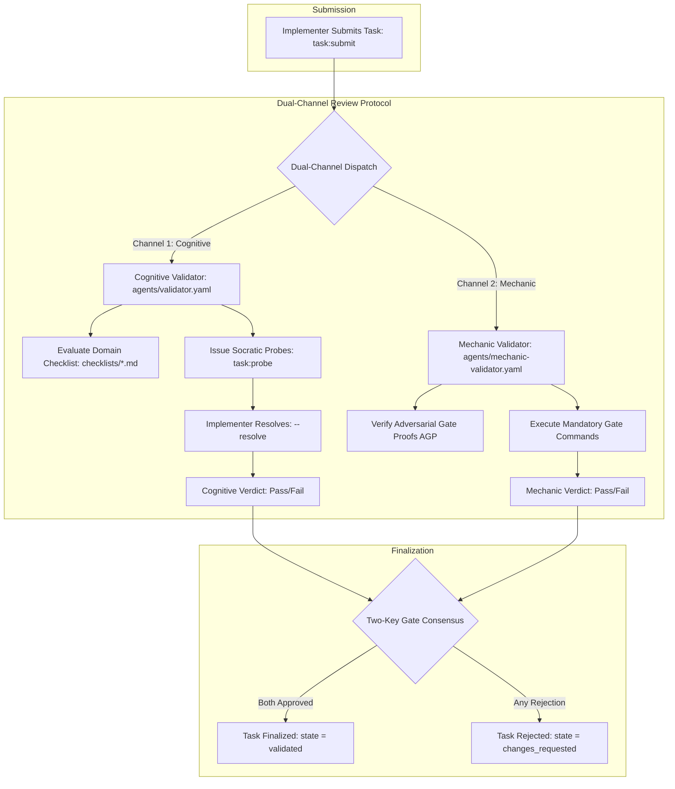
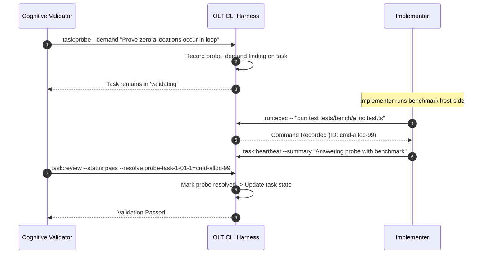

# How-To Guide: Implementing & Running Custom Cognitive and Mechanic Validators

[⬅ Master Documentation Hub](../README.md) | [How-To: CLI Harness Usage](./cli-harness-usage.md) | [How-To: Candidate Admission](./candidate-admission.md)

---

## 🧭 Diátaxis Overview

| Quadrant         | Focus in this Document                                                                                                                                                                                           | Target Audience                                                       |
| :--------------- | :--------------------------------------------------------------------------------------------------------------------------------------------------------------------------------------------------------------- | :-------------------------------------------------------------------- |
| **How-To Guide** | Step-by-step creation, registration, and execution of custom domain checklists, Cognitive and Mechanic validators, Socratic cognitive probing, Adversarial Gate Proofs (AGP), and Dual-Channel Review Protocols. | Quality Engineers, Security Auditors, Validation Agents, Coordinators |

In the OLT framework, validation is strictly decoupled into two complementary operational paradigms:

1. **Cognitive Validators** (`agents/validator.yaml`): Operate under the **Cognitive Hard-Lock Interlock** (0 file modifications, 0 arbitrary test execution commands). They perform pure semantic static inspection, AST audits, standing domain checklist evaluations, and Socratic probing.
2. **Mechanic Validators** (`agents/mechanic-validator.yaml`): Execute deterministic build tools, typecheckers, linters, unit tests, and verify Adversarial Gate Proofs (AGP).

---

## ⚖️ 1. Cognitive vs. Mechanic Validator Architecture



### 1.1 Comparison Matrix

| Property               | Cognitive Validator (`validator`)               | Mechanic Validator (`mechanic-validator`)                |
| :--------------------- | :---------------------------------------------- | :------------------------------------------------------- |
| **Write Scope**        | `READ-ONLY` (🔒 Strictly Enforced)              | `READ-ONLY` (🔒 Strictly Enforced)                       |
| **Command Execution**  | `0` commands (Hard-lock interlock)              | Authorized execution of gates & falsifiers               |
| **Inspection Medium**  | AST diffs, static types, checklists, logic flow | Compilers, test runners, benchmark suites                |
| **Feedback Mechanism** | Socratic probe demands (`task:probe`)           | Adversarial Gate Proof failures (`task:reject`)          |
| **Channel Capacity**   | Max 5 cognitive rounds (`cognitive_pushes: 5`)  | Max 20 adversarial rounds (`max_adversarial_pushes: 20`) |

---

## 📋 2. The 5 Standing Domain Checklists

Every task submitted in OLT binds to one or more standing checklist domains under `olt/checklists/`.

### 2.1 Domain Overview

```text
┌─────────────────┬────────────────────────────────────────────────────────────────────────┐
│ Domain          │ Core Inspection Focus & Verification Rules                             │
├─────────────────┼────────────────────────────────────────────────────────────────────────┤
│ code-quality    │ Single Responsibility (CQ-STRUCT-001), Meaningful Names (CQ-NAMING),   │
│                 │ Rule of Three (CQ-DUP), Wire vs. Delete (CQ-DEAD-001), 0 'any' types.  │
├─────────────────┼────────────────────────────────────────────────────────────────────────┤
│ security        │ Authenticate Every Request (SEC-AUTHN-001), BOLA Checks (SEC-AUTHZ),   │
│                 │ Secret Hygiene (SEC-SECRET-001), SQL/Shell Injection (SEC-INJ).       │
├─────────────────┼────────────────────────────────────────────────────────────────────────┤
│ system-design   │ Interface Decoupling (SYS-INTF), Concurrency Safety (SYS-CONCUR),      │
│                 │ Idempotency Invariants (SYS-IDEMP), Explicit Failure Modes (SYS-FAIL). │
├─────────────────┼────────────────────────────────────────────────────────────────────────┤
│ ui-design       │ APCA Contrast (Lc >= 60/75), 4 Viewports (1920, 1440, 768, 390),       │
│                 │ Optical Focus Rings (UI-A11Y-002), Cumulative Layout Shift (CLS < 0.1).│
├─────────────────┼────────────────────────────────────────────────────────────────────────┤
│ product         │ Charter Alignment, Acceptance Criteria Traceability, Non-Regression.   │
└─────────────────┴────────────────────────────────────────────────────────────────────────┘
```

### 2.2 Mathematical Checklist Standards

#### APCA (Advanced Perceptual Contrast Algorithm) Math for `ui-design`:

For text on background with luminance $Y_{\text{txt}}$ and $Y_{\text{bg}}$:

$$L^c = \left( Y_{\text{txt}}^{0.56} - Y_{\text{bg}}^{0.56} \right) \times 1.14 \times 100$$

- **Body Text**: Must achieve $|L^c| \ge 75$.
- **Large Headers / UI Controls**: Must achieve $|L^c| \ge 60$.

---

## ✍️ 3. Authoring Custom Domain Checklists

You can define custom checklists for specialized domains (e.g., `data-integrity`, `api-contracts`).

### 3.1 Checklist Schema Specification

Checklist files live in `olt/checklists/<domain-name>.md` and follow a strict Markdown format:

```markdown
# Data Integrity Checklist

Domain: data-integrity

## DI-TX-001

rule: All multi-row database mutations must execute inside an explicit ACID transaction block
rationale: Partial failures during multi-row updates leave persistent storage in a corrupted state
how-to-check: Inspect repository write operations; confirm mutations are wrapped in db.transaction()
severity: critical
sources:

- Designing Data-Intensive Applications (Martin Kleppmann), ch. 7 "Transactions"

## DI-IDEMP-001

rule: Message consumers must persist idempotent deduplication keys before applying state side-effects
rationale: At-least-once message brokers re-deliver payloads during network partitions
how-to-check: Verify incoming message IDs are recorded in an idempotent receipts table
severity: important
sources:

- Enterprise Integration Patterns (Gregor Hohpe)
```

---

## 🔬 4. Socratic Cognitive Probing Workflows (`task:probe`)

A Cognitive Validator uses Socratic probing to demand proof from the implementer without rejecting the task lease or consuming repair rounds.



### 4.1 Issuing Cognitive Probes

```bash
CAPSULE_RUN=".olt/capsules/38-distributed-queue"
TASK_ID="task-wal"
VAL_ID="validator-cog-1"
VAL_TOKEN="<validation-token>"

# Issue Socratic Probe Demand
bun olt/scripts/harness.ts task:probe \
  --run "$CAPSULE_RUN" \
  --task "$TASK_ID" \
  --validator "$VAL_ID" \
  --token "$VAL_TOKEN" \
  --demand "Prove WAL recovers without data loss when EOF is abruptly reached mid-record"
```

### 4.2 Resolving Probes with Command Evidence

The implementer runs the proving command, captures the command ID, and the validator marks the finding resolved during `task:review`:

```bash
# Validator records pass, explicitly answering the open probe ID
bun olt/scripts/harness.ts task:review \
  --run "$CAPSULE_RUN" \
  --task "$TASK_ID" \
  --validator "$VAL_ID" \
  --token "$VAL_TOKEN" \
  --status pass \
  --checks "C-gate-wal" \
  --resolve "probe-task-wal-01-1=cmd-wal-recovery-proof" \
  --summary "All checklist items pass and recovery proof verified"
```

---

## 🛡️ 5. Adversarial Gate Proofs (AGP) & Mechanic Validation

Mechanic Validators verify Adversarial Gate Proofs. An AGP requires:

1. **Falsification First**: The test must have demonstrated failure prior to implementation.
2. **Deterministic Execution**: The test command must execute in an isolated environment and exit with code `0`.
3. **No Suppressions**: 0 `@ts-ignore`, 0 `eslint-disable`, 0 implicit `any`.

### 5.1 Executing Gate Checks via CLI

```bash
# 1. Execute task gate command via harness run:exec
MEC_RUN_JSON=$(bun olt/scripts/harness.ts run:exec \
  --run "$CAPSULE_RUN" \
  --actor "validator-mec-1" \
  -- "bun test tests/unit/wal.test.ts" \
  --format json)

CMD_ID=$(echo "$MEC_RUN_JSON" | jq -r '.command_id')
EXIT_CODE=$(echo "$MEC_RUN_JSON" | jq -r '.exit_code')

if [ "$EXIT_CODE" -ne 0 ]; then
  # 2. Reject task if gate fails
  bun olt/scripts/harness.ts task:reject \
    --run "$CAPSULE_RUN" \
    --task "$TASK_ID" \
    --validator "validator-mec-1" \
    --token "$VAL_TOKEN" \
    --reason "Mandatory gate exited non-zero with CRC mismatch" \
    --severity critical \
    --remediation "Correct CRC32 polynomial computation in wal-header.ts" \
    --evidence "$CMD_ID"
fi
```

---

## 🔄 6. The Dual-Channel Review Protocol

The Dual-Channel Protocol prevents deadlocks by managing in-lease micro-cycles and formal rejections:

### 6.1 Protocol Configuration

```yaml
# Protocol Parameters
max_adversarial_pushes: 20 # Maximum mechanic validation cycles before escalation
cognitive_pushes: 5 # Maximum cognitive probe rounds per task attempt
micro_cycle_limit: 3 # In-lease fixes permitted before advancing repair round
```

### 6.2 In-Lease Micro-Cycles vs Formal Rejection

- **In-Lease Micro-Cycle (`--micro-cycle`)**: Used for minor lint/naming issues where the implementer can fix the defect within the current active lease without incrementing `repair_round`.
- **Formal Rejection (`task:reject`)**: Used for structural or security defects. The lease is revoked, `repair_round` increments, and the task returns to `changes_requested`.

```bash
# Recording an in-lease micro-cycle finding
bun olt/scripts/harness.ts task:reject \
  --run "$CAPSULE_RUN" \
  --task "$TASK_ID" \
  --validator "$VAL_ID" \
  --token "$VAL_TOKEN" \
  --reason "Identifier 'tmpBuf' violates CQ-NAMING-001" \
  --micro-cycle \
  --defect "naming-convention" \
  --max-rounds 3
```

---

## 👔 7. Coordinator Pushbacks (`coordinator:pushback`)

If a validator erroneously passes a defective task, the Tier 1 Coordinator can push back on the validator's verdict:

```text
┌─────────────────────────────────────────────────────────────────────────────┐
│                       COORDINATOR PUSHBACK PROTOCOL                         │
├─────────────────────────────────────────────────────────────────────────────┤
│                                                                             │
│  1. Procedural Pushback (--cause procedural)                                │
│     • Validator signed off without recording mandatory gate evidence.       │
│     • Task returns to 'validating' for a re-review; implementer unaffected. │
│                                                                             │
│  2. Substantive Pushback (--cause substantive)                              │
│     • Work is materially broken despite validator's pass.                   │
│     • Advances repair_round and moves task to 'changes_requested'.          │
│                                                                             │
└─────────────────────────────────────────────────────────────────────────────┘
```

### 7.1 Executing a Pushback

```bash
bun olt/scripts/harness.ts coordinator:pushback \
  --run "$CAPSULE_RUN" \
  --task "$TASK_ID" \
  --actor "coordinator-1" \
  --validator "validator-cq-1" \
  --domain "code-quality" \
  --cause procedural \
  --observation "Validator approved task without executing checklist items for CQ-DEAD-001" \
  --remediation "Re-verify all exports against caller call sites and resubmit review"
```

---

## 🚀 8. Complete Step-by-Step Custom Validator Implementation

Follow these 4 steps to deploy a custom validator for your project:

### Step 1: Create Validator Specification (`olt/agents/custom-sec-validator.yaml`)

```yaml
role: validator
name: custom-sec-validator
tier: 2
capabilities:
  - cognitive-auditing
  - security-checklist-evaluation
  - socratic-probing
rules:
  - "Must strictly enforce SEC-AUTHN and SEC-AUTHZ checklists."
  - "Must never modify workspace files or run non-deterministic mutations."
  - "Must demand cryptographic command receipts for all probe resolutions."
```

### Step 2: Register the Custom Validator Agent

```bash
bun olt/scripts/harness.ts agent:register \
  --run "$CAPSULE_RUN" \
  --agent "sec-validator-1" \
  --role validator \
  --host antigravity \
  --parent-agent coordinator-1 \
  --parent-task "$TASK_ID"
```

### Step 3: Author Checklist Coverage Report (`reports/checklist-sec.json`)

```json
{
  "items": [
    {
      "id": "SEC-AUTHN-001",
      "disposition": "checked",
      "reason": "Verified bearer token check runs on all endpoints"
    },
    {
      "id": "SEC-AUTHZ-001",
      "disposition": "checked",
      "reason": "Verified tenant ID isolation in database queries"
    },
    {
      "id": "SEC-SECRET-001",
      "disposition": "checked",
      "reason": "Grep confirmed 0 plaintext keys in repository"
    }
  ],
  "adjacent_findings": []
}
```

### Step 4: Submit Final Multi-Domain Review Verdict

```bash
bun olt/scripts/harness.ts task:review \
  --run "$CAPSULE_RUN" \
  --task "$TASK_ID" \
  --validator "sec-validator-1" \
  --token "$VAL_TOKEN" \
  --status pass \
  --checks "C-gate-sec-1" \
  --summary "Security domain fully audited; all checklist rules satisfied" \
  --checklist-domain security \
  --checklist-report reports/checklist-sec.json
```
