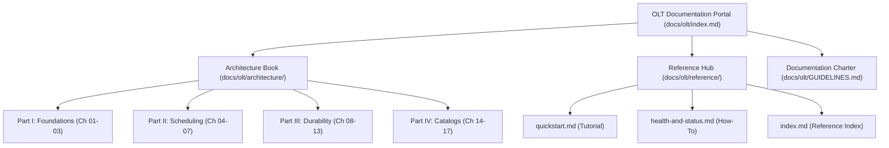

# OLT Documentation Ecosystem Portal

---

[Previous: Repository Root](../../README.md) | [Documentation Portal](index.md) | [All Chapters Index](architecture/index.md) | [Next: Architecture Index](architecture/index.md)

---

## 1. Welcome to the OLT Documentation Ecosystem

The **OLT (Orchestrating Long Tasks)** documentation ecosystem is the authoritative technical reference for the OLT autonomous multi-agent engineering engine.

Built upon Daniele Procida's **Diátaxis Documentation Framework** and the **Open Agent Skills Standard (`agentskills.io`)**, the OLT documentation ecosystem partitions technical knowledge across two primary hubs:

1. **The Architecture Book (`docs/olt/architecture/`)**: 17 exhaustive chapters exploring theoretical foundations, mathematical proofs, scheduling algorithms, and internal engine mechanics.
2. **The Reference Hub (`docs/olt/reference/`)**: Concise, copy-pasteable operator guides, quickstarts, diagnostic playbooks, and CLI capability dictionaries.

```text
+--------------------------------------------------------------------------------------------------+
│                                 THE OLT DOCUMENTATION ECOSYSTEM                                  │
+--------------------------------------------------+-----------------------------------------------+
│    ARCHITECTURE BOOK (Chapters 01-17)            │    REFERENCE MANUALS (Operator Guides)        │
│    Deep theoretical foundations, algorithms,     │    Concise, copy-pasteable operator guides    │
│    mathematical models, and visual topologies.   │    for running workflows & system checks.     │
+--------------------------------------------------+-----------------------------------------------+
│  * 01. Foundations & Core Invariants             │  * [Quickstart Tutorial](reference/quickstart.md)
│  * 02. Four-Tier Workforce Hierarchy             │  * [Health and Status](reference/health-and-status.md)
│  * 03. Mind Product Owner & Infinite Cadence     │  * [Reference Index](reference/index.md)      │
│  * 04. Continuous Preplanning Factory            │  * [Authoring Guide](reference/GUIDE.md)      │
│  * 05. Concurrency Scaling & Straggler SLA       │                                               │
│  * 06. Topological DAG Scheduler                 │                                               │
│  * 07. Distributed Task Leasing & Execution      │                                               │
│  * 08. Adversarial Validation & Monotonic Repair │                                               │
│  * 09. Falsifiable Evidence & Completion Gates   │                                               │
│  * 10. Durability, Recovery & Merkle Chains      │                                               │
│  * 11. Worktree Branching & Honesty Gates        │                                               │
│  * 12. Flock Mailboxes & Live TUI Telemetry      │                                               │
│  * 13. Policy, RBAC & Fail-Closed Engine         │                                               │
│  * 14. Harness CLI & Command Engine              │                                               │
│  * 15. State Schemas & Event Ledger              │                                               │
│  * 16. Error Catalog & Empirical Blunders        │                                               │
│  * 17. Verification Engines & Gate Provers       │                                               │
+--------------------------------------------------+-----------------------------------------------+
```

---

## 2. Theoretical Pedagogy & Standards Alignment

The OLT documentation ecosystem is grounded in three core engineering standards:

### A. The Diátaxis Documentation Framework

Technical documents are categorized according to their primary purpose:

- **Tutorials**: Learning-oriented onboarding walkthroughs ([Quickstart](reference/quickstart.md)).
- **How-To Guides**: Problem-oriented operational playbooks ([Health & Status](reference/health-and-status.md)).
- **Explanations**: Understanding-oriented architecture chapters ([Architecture Book](architecture/index.md)).
- **References**: Information-oriented schemas and command catalogs ([CLI Catalog](architecture/14-harness-cli-and-command-engine/index.md)).

### B. Progressive Disclosure Context Architecture

To respect LLM context windows (Cowan envelopes $< 150{,}000$ tokens), documentation is structured in three progressive tiers:

1. **Discovery**: Minimal frontmatter and summaries ($< 500$ tokens).
2. **Activation**: Focused procedural execution rules ($< 4{,}000$ tokens).
3. **Execution**: On-demand deep architectural references queried only when required.

### C. The Four Hard Zeros

Every specification and design pattern in OLT is bounded by the 4 Hard Zeros:

$$Z_{\text{hallucination}} = 0, \quad Z_{\text{mutation}} = 0, \quad Z_{\text{scope}} = 0, \quad Z_{\text{assumption}} = 0$$

---

## 3. Key Documentation Standards & Invariants

All documents authored across `docs/olt/` adhere strictly to the authoring rules codified in [GUIDELINES.md](GUIDELINES.md):

- **Sizing Envelope**: Maintained strictly within 250–800 lines for architecture topics (100–250 lines for indexes and guides).
- **Clean 4-Way Navigation**: Exactly ONE clean navigation bar at the top and bottom of each document with ZERO emojis.
- **Conceptual Depth**: Deep architectural prose, LaTeX mathematical formulations, and box-drawing ASCII diagrams over raw code dumps.
- **Link Integrity**: 100% of relative markdown links point to existing on-disk files.



---

## 4. Master Navigation Directory

- **[Documentation Engineering Charter (GUIDELINES.md)](GUIDELINES.md)**
- **[Architecture Book Master Index (architecture/index.md)](architecture/index.md)**
- **[Reference Hub Master Index (reference/index.md)](reference/index.md)**
- **[Quickstart & Onboarding Tutorial (reference/quickstart.md)](reference/quickstart.md)**
- **[Health & Diagnostics Reference (reference/health-and-status.md)](reference/health-and-status.md)**

---

[Previous: Repository Root](../../README.md) | [Documentation Portal](index.md) | [All Chapters Index](architecture/index.md) | [Next: Architecture Index](architecture/index.md)

---
