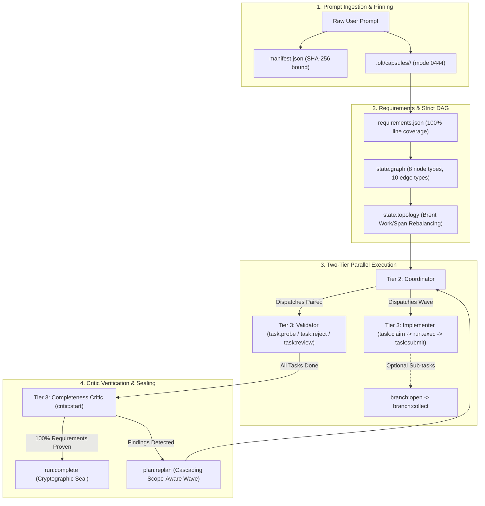

# Orchestrating Long Tasks (OLT) Documentation Hub

Welcome to the definitive architectural manual, developer guides, and reference specifications for the **OLT (Orchestrating Long Tasks)** autonomous agent skill.

OLT provides a deterministic runtime, state machine, and multi-agent coordination protocol designed to solve the fundamental failure modes of long-running coding agents: context window decay, sycophancy, hallucinated progress, race conditions, and catastrophic monolithic repair loops.

---

## 🏛️ The Diátaxis Documentation Framework

The OLT documentation is structured according to the **Diátaxis Documentation Framework**, organizing information across four distinct quadrants based on user intent and cognitive focus:

```text
┌─────────────────────────────────────────────────────────────────────────────┐
│                    THE DIÁTAXIS DOCUMENTATION FRAMEWORK                     │
├──────────────────────────────────────────────┬──────────────────────────────┤
│               PRACTICAL GOALS                │      THEORETICAL CONCEPTS    │
├──────────────────────────────────────────────┼──────────────────────────────┤
│  LEARNING-ORIENTED:                          │  UNDERSTANDING-ORIENTED:     │
│  [ TUTORIALS ]                               │  [ ARCHITECTURE ]            │
│  • Getting Started with OLT                  │  • Mental Model & Foundations│
│  • Building Your First Multi-Agent Task      │  • Brent Work/Span Scaling   │
│  • Complete End-to-End Walkthrough           │  • Tamper-Proof Hash Chains  │
│  • Autonomous Lifecycle Pulse                │  • Two-Tier Workforce Theory │
│                                              │                              │
│  👉 Read: docs/olt/tutorials/                │  👉 Read: docs/olt/architecture/│
├──────────────────────────────────────────────┼──────────────────────────────┤
│  PROBLEM-ORIENTED:                           │  INFORMATION-ORIENTED:       │
│  [ HOW-TO GUIDES ]                           │  [ REFERENCE ]               │
│  • Performing Dynamic Replanning             │  • Harness CLI Dictionary    │
│  • Writing Custom AST Enforcers              │  • Formal State Schemas      │
│  • Managing Agent Leases & Heartbeats        │  • Error & Blunder Catalog   │
│  • Resolving Adversarial Probes              │  • Role Contracts Matrix     │
│  • Recovering From Crashes & Stale Leases    │  • Verification Engines      │
│                                              │                              │
│  👉 Read: docs/olt/how-to/                   │  👉 Read: docs/olt/reference/│
└──────────────────────────────────────────────┴──────────────────────────────┘
```

---

## 🧭 Four-Quadrant Navigation Hub

### 1. 🎓 [Tutorials (`docs/olt/tutorials/`)](./tutorials/)

_Learning-oriented step-by-step lessons for developers and new agent implementations._

- **[01. Getting Started with OLT](./tutorials/)**: Initialize your first capsule, pin runtimes, and inspect event streams.
- **[02. Prompt to Sealed Run Walkthrough](./tutorials/)**: Follow a complete run from prompt ingestion (`orchestrate`) to terminal cryptographic sealing (`run:complete`).
- **[03. Autonomous Workforce Operations](./tutorials/)**: Learn how Tier 0 Mind and Tier 2 Coordinator agents drive high-concurrency wave dispatching.

### 2. 🛠️ [How-To Guides (`docs/olt/how-to/`)](./how-to/)

_Problem-oriented recipes for specific operational and developmental challenges._

- **[How to Execute Dynamic Replanning](./how-to/)**: Partition late-stage critic findings into clean, scope-isolated repair waves.
- **[How to Handle Adversarial Probes](./how-to/)**: Respond to validator probe demands with verified command receipts.
- **[How to Recover From Crashes & Expired Leases](./how-to/)**: Use `run:recover` and `watchdog:cleanup` to reclaim stalled tasks and heal torn event logs.
- **[How to Author Domain-Specific Validators](./how-to/)**: Build cognitive and mechanic validators for UI, security, and system architecture.

### 3. 🧠 [Architecture Explanations (`docs/olt/architecture/`)](./architecture/)

_Understanding-oriented deep dives into core theory, mathematical foundations, and system mechanics._

- **[Mental Model & Why Long Tasks Fail](./01-foundations/01-why-long-tasks-fail.md)**: Analysis of context degradation, sycophancy, and why memory is not proof.
- **[Dependency Graph Theory & Brent Scaling](./03-graph-scheduler/01-dependency-graph-theory.md)**: Mathematical optimization of concurrency using Brent's Work/Span theorem ($P = \lceil W/S \rceil$).
- **[Storage Model & POSIX flock Atomicity](./01-foundations/02-capsule-and-storage-model.md)**: Append-only hash chains, `events.jsonl`, projected `state.json`, and kernel concurrency.
- **[Adversarial Validation Philosophy](./06-validation-repair/01-adversarial-validation-philosophy.md)**: Independent validator isolation, probe/defect split, and context sanitization.

### 4. 📚 [Reference Manuals (`docs/olt/reference/`)](./reference/)

_Authoritative, information-oriented specifications, schemas, error tables, and contracts._

- **[Harness CLI Command Dictionary](./reference/harness-cli.md)**: Exhaustive flag tables, types, stdin handling, and exit statuses for every CLI command.
- **[State Schemas & Data Contracts](./reference/state-schemas.md)**: Formal JSON schemas and exemplars for `manifest.json`, `events.jsonl`, `state.json`, `requirements.json`, and command receipts.
- **[Error Codes & Blunder Catalog](./reference/error-codes.md)**: Complete catalog of exit statuses (0, 3, 4, 70), error classes, and empirical failure countermeasures.
- **[Role Contracts & Authority Matrix](./reference/role-contracts.md)**: Formal permissions, invariant prohibitions (`must_not`), command access, and packet limits for all 10 agent roles.
- **[Deterministic Verification Engines](./reference/verification-engines.md)**: Specifications for `task:check` typechecker, the 10 AST static lint rules, and `gate:prove` falsifiability engine.

---

## 🎯 Master Architecture Overview



---

## 🧭 Persona-Based Reading Paths

| Persona                         | Recommended Reading Path                                                                                                                                                                                                                                         |
| :------------------------------ | :--------------------------------------------------------------------------------------------------------------------------------------------------------------------------------------------------------------------------------------------------------------- |
| **First-Time Developer / User** | [Mental Model](./01-foundations/01-why-long-tasks-fail.md) $\to$ [Getting Started](./tutorials/) $\to$ [End-to-End Walkthrough](./10-tutorial-and-cli/01-end-to-end-tutorial.md) $\to$ [Harness CLI Reference](./reference/harness-cli.md)                       |
| **Implementer Agent (Tier 3)**  | [Role Contracts](./reference/role-contracts.md) $\to$ [CLI Command Dictionary](./reference/harness-cli.md) $\to$ [Verification Engines](./reference/verification-engines.md) $\to$ [State Schemas](./reference/state-schemas.md)                                 |
| **Validator & Critic Agent**    | [Adversarial Philosophy](./06-validation-repair/01-adversarial-validation-philosophy.md) $\to$ [Structured Finding Schema](./reference/state-schemas.md#6-structured-finding-schema) $\to$ [Error & Blunder Catalog](./reference/error-codes.md)                 |
| **Systems / AI Architect**      | [Capsule Storage Model](./01-foundations/02-capsule-and-storage-model.md) $\to$ [Brent Concurrency Theory](./03-graph-scheduler/02-topological-conflict-free-batching.md) $\to$ [Event Log Hash Chains](./08-durability-recovery/01-tamper-proof-hash-chains.md) |
