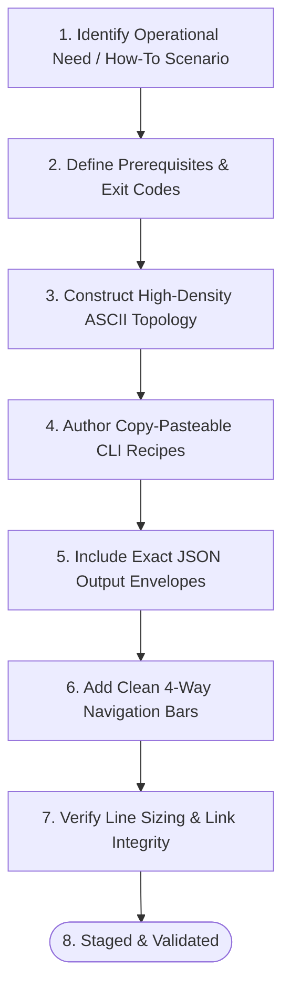

# OLT Reference Hub Authoring Charter & Operator Handbook

---

[Previous: Health and Status](health-and-status.md) | [Chapter Index](index.md) | [All Chapters Index](../architecture/index.md) | [Next: Reference Index](index.md)

---

## 1. Executive Charter & Reference Pedagogy

The **OLT Reference Hub (`docs/olt/reference/`)** provides copy-pasteable operator manuals, diagnostic recipes, and onboarding walkthroughs for human engineers, system administrators, and autonomous watchdogs across the OLT (Orchestrating Long Tasks) ecosystem.

In accordance with Daniele Procida's **Diátaxis Documentation Framework**, the Reference Hub encompasses:

1. **Tutorials (Learning-Oriented)**: Step-by-step onboarding walkthroughs with explicit prerequisites, deterministic execution paths, and verifiable outputs (e.g. `quickstart.md`).
2. **How-To Guides (Problem-Oriented)**: Practical diagnostic sweeps, automated self-healing procedures, and disaster recovery playbooks (e.g. `health-and-status.md`).
3. **Information Catalogs (Reference-Oriented)**: Fast command dictionaries, Draft 2020-12 JSON Schema contracts, and Unix exit code lookups.

```text
+--------------------------------------------------------------------------------------------------+
│                                 REFERENCE HUB PEDAGOGY MATRIX                                    │
+--------------------------------------------------------------------------------------------------+
│                                                                                                  │
│   CORE OBJECTIVE: Enable immediate, unambiguous operator action and automated CLI execution.     │
│                                                                                                  │
│   MANDATORY ELEMENTS ACROSS EVERY REFERENCE GUIDE:                                               │
│   1. Purpose & Preconditions (Exact runtime prerequisites & exit code expectations)              │
│   2. High-Density Workflow Diagrams (ASCII & Mermaid Pipelines)                                  │
│   3. Copy-Pasteable Shell Command Examples (Flags, arguments, stdin payloads)                    │
│   4. Expected JSON Output Envelopes & Error Code Mappings                                        │
│   5. Universal Clean 4-Way Navigation Mesh (Zero Emojis)                                         │
│   6. Mathematical Rigor (Formal equations for hash chains, SLA bounds, backoffs)                 │
│                                                                                                  │
+--------------------------------------------------------------------------------------------------+
```

---

## 2. Essential Operator Reference Catalog

```text
+------------------------------------+----------------+--------------------------------------------+
| Reference Guide                    | Diátaxis Type  | Primary Operational Focus                  |
+------------------------------------+----------------+--------------------------------------------+
| [Quickstart Tutorial](quickstart.md) | Tutorial     | First-time onboarding & single-task run    |
| [Health and Status](health-and-status.md) | How-To  | 10-domain diagnostic sweep & auto-healing  |
| [Reference Index](index.md)        | Navigation     | Master reference directory & quick links   |
| [Harness CLI Engine](../architecture/14-harness-cli-and-command-engine/index.md) | Reference | 15-domain CLI capability dictionary |
| [State Schemas](../architecture/15-state-schemas-and-event-ledger/index.md) | Reference | Draft 2020-12 State & Event schemas        |
| [Error Catalog](../architecture/16-error-catalog-and-blunders/index.md) | Reference | 12 HarnessError codes & 28 blunders        |
| [Verification Engines](../architecture/17-verification-engines-and-gates/index.md) | Reference | 5 mechanical verification engines  |
+------------------------------------+----------------+--------------------------------------------+
```

---

## 3. Strict Authoring Standards & Invariants

All contributors to the Reference Hub must adhere to the following non-negotiable invariants:

1. **Zero Source Code Mutation**: Documentation passes are confined strictly to markdown (`.md`) files under `docs/olt/`. Never edit TypeScript source files (`.ts`) during documentation tasks.
2. **Sizing Envelope Compliance**:
   - Reference Guides & Tutorials: Target 280 to 450 lines (never $< 250$ lines, never $> 800$ lines).
   - Index & Handbook Guides: Target 100 to 200 lines.
3. **Zero Emojis**: Strictly zero emojis across titles, headers, navigation bars, tables, diagrams, and prose.
4. **Deterministic Command Receipts**: Every shell snippet must specify exact command invocations (e.g. `bun olt/scripts/harness.ts <command>`) and corresponding JSON output envelopes.
5. **Universal Clean 4-Way Navigation**: Top and bottom bars must match the standard clean format:
   ```markdown
   [Previous: ...] | [Chapter Index: ...] | [All Chapters Index: ...] | [Next: ...]
   ```
6. **100% Relative Link Integrity**: All relative links must resolve to existing on-disk targets.

---

## 4. Workflow for Authoring New Reference Guides



---

## 5. Reviewer Quality & Verification Checklist

Before publishing any updates to reference documentation, execute the following forensic checks:

- [ ] Does the document contain zero emojis across all lines?
- [ ] Are all CLI snippets executable directly via `bun olt/scripts/harness.ts`?
- [ ] Are JSON output envelopes formatted with valid JSON syntax?
- [ ] Does the top navigation bar match the bottom navigation bar?
- [ ] Do all relative markdown links resolve to valid on-disk files?
- [ ] Does the line count fall within the mandated sizing envelope (100-200 lines for indexes/handbooks, 280-450 lines for tutorials/how-tos)?

---

[Previous: Health and Status](health-and-status.md) | [Chapter Index](index.md) | [All Chapters Index](../architecture/index.md) | [Next: Reference Index](index.md)

---
