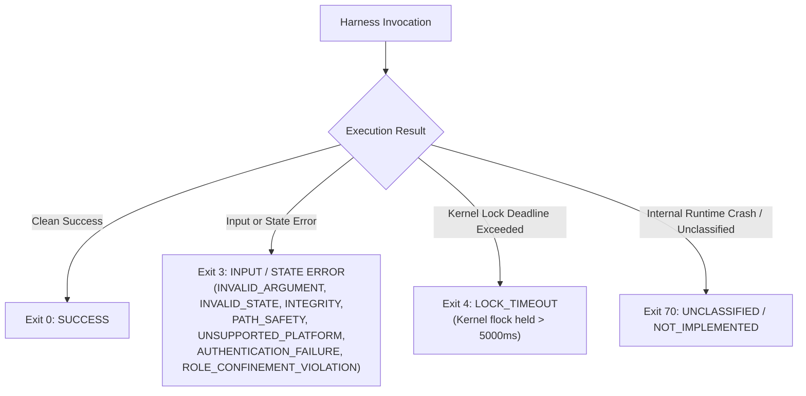

# OLT Error Codes & Failure Modes Catalog

The OLT Harness enforces deterministic error reporting and strict exit status classifications. This catalog documents all standard error codes, exit statuses, error payload structures, and empirical blunder failure modes.

---

## 🚦 Exit Status Hierarchy

The harness terminates with one of four canonical POSIX exit codes:



### Exit Codes Summary Table

| Exit Code | Classification            | Trigger Description                                                                           | State Mutation                           |
| :-------- | :------------------------ | :-------------------------------------------------------------------------------------------- | :--------------------------------------- |
| `0`       | `SUCCESS`                 | Command completed successfully; output brief written to `stdout`.                             | State committed & synced                 |
| `3`       | `INPUT / STATE ERROR`     | Preflight assertion failed (invalid flag, broken invariant, unreadable path, state mismatch). | ❌ Zero mutation (Rejected pre-mutation) |
| `4`       | `LOCK_TIMEOUT`            | Capsule file lock (`flock`) could not be acquired within the deadline.                        | ❌ Zero mutation                         |
| `70`      | `NOT_IMPLEMENTED / FATAL` | Unimplemented verb or unhandled internal JavaScript exception.                                | ❌ Zero mutation                         |

---

## 🛡️ Error Code Dictionary

All exit code 3, 4, and 70 failures emit a structured JSON error object on `stderr`:

```json
{
  "ok": false,
  "error": {
    "code": "INVALID_STATE",
    "message": "Task 'task-1' cannot be submitted because it is in state 'ready' (expected 'leased')",
    "exit_code": 3,
    "issues": [
      {
        "field": "tasks.task-1.status",
        "expected": "leased",
        "actual": "ready"
      }
    ],
    "fix": "Claim the task with 'bun harness.ts task:claim --task task-1 --agent <agent-id>' first."
  }
}
```

### 1. `INVALID_ARGUMENT` (Exit 3)

- **Cause**: Missing mandatory flags, invalid flag types, conflicting arguments, or syntax violations in command strings.
- **Example Triggers**:
  - Omitting `--summary` on `task:submit`.
  - Providing non-integer values for `--priority` or `--rounds`.
  - Passing unverified bash shell pipes to `run:exec` instead of literal argv vectors.
- **Mitigation**: Inspect required flags with `bun harness.ts <command> --help` and supply conformant arguments.

### 2. `INVALID_STATE` (Exit 3)

- **Cause**: The requested transition violates the formal lifecycle state machine.
- **Example Triggers**:
  - Attempting to claim a task that is already `leased` or `done`.
  - Submitting a task whose lease has expired or been reclaimed.
  - Reviewing a task (`task:review --status pass`) with open, unresolved findings or probe demands.
  - Approving a plan (`plan:validate-review`) before `plan:compile` has occurred.
- **Mitigation**: Query current status with `bun harness.ts status --run <run-id>` and follow the lifecycle sequence.

### 3. `INTEGRITY` (Exit 3)

- **Cause**: Cryptographic hash mismatch, corrupted event chain, schema violation, or unverified prompt mutation.
- **Example Triggers**:
  - Manual modification of `prompt.md` after `plan:init`.
  - Hash chain divergence in `events.jsonl` (`previous_hash` does not match prior event hash).
  - Malformed YAML manifest in `olt/agents/`.
- **Mitigation**: Run `bun harness.ts run:doctor --run <run-id>` to isolate torn tails or run forensics.

### 4. `PATH_SAFETY` (Exit 3)

- **Cause**: Attempted directory traversal (`..`), symlink escaping, or write-scope containment violation.
- **Example Triggers**:
  - Modifying files outside the task's assigned `write_scope`.
  - Creating files in the repository root without authorization (`ROOT_HYGIENE_VIOLATION`).
  - Specifying relative paths that escape the workspace boundary.
- **Mitigation**: Confine all edits strictly to the paths declared in `--task-write-scope`.

### 5. `AUTHENTICATION_FAILURE` / `ROLE_CONFINEMENT_VIOLATION` (Exit 3)

- **Cause**: Presenting an invalid bearer token, expired token digest, or executing a verb disallowed for the agent's role contract.
- **Example Triggers**:
  - Implementer attempting to run supervisory commands (`plan:compile`, `queue:wave`).
  - Cognitive validator invoking `run:exec` directly (violating the command-running ban).
  - Submitting with a token issued to a different agent.
- **Mitigation**: Verify agent identity and role permissions via `bun harness.ts role:cheat-sheet <role>`.

### 6. `LOCK_TIMEOUT` (Exit 4)

- **Cause**: Another concurrent agent or background process held the capsule's POSIX kernel `flock` longer than the acquisition window (default: 5000ms).
- **Example Triggers**:
  - High-frequency burst of simultaneous CLI calls without jittered backoff.
  - Stalled background subprocess holding file descriptors open.
- **Mitigation**: Implement exponential backoff with jitter, or check for hung tasks with `bun harness.ts watchdog:verify`.

### 7. `UNSUPPORTED_PLATFORM` (Exit 3)

- **Cause**: Operating on an incompatible OS architecture, missing POSIX lock support, or unsupported Bun engine version.
- **Mitigation**: Ensure execution on macOS/Linux with Bun $\ge 1.1.0$.

### 8. `NOT_IMPLEMENTED` (Exit 70)

- **Cause**: Invoking a planned command or subcommand variant that has no active runtime implementation.

---

## 🛑 Authoritative Catalog of Blunders & Failure Modes

The following table documents empirical failure modes observed in autonomous multi-agent environments and the structural invariants built into the OLT harness to counter them:

### 1. Long-Prompt Baselines

- **`LP-2` (Chat Context Capture Loophole)**: A chat context copy is labeled "verbatim" without cryptographic provenance.  
  _Countermeasure_: Record capture provenance (`capture_mode`, `source-verified`) and bind SHA-256 digests in `manifest.json`.
- **`LP-6` (Premature Architecture Invention)**: Architecture is frozen before inspecting existing repository code.  
  _Countermeasure_: Keep pre-inspection architecture provisional; require `plan:enhance` before `plan:compile`.

### 2. Validator Pressure & Theatre

- **`VP-1` (Context Anchoring & Sycophancy)**: Validator receives implementer confidence narratives or deadline pressure.  
  _Countermeasure_: Algorithmic context sanitization (`isolateValidatorContext`, `excludeValidatorContamination`) strips implementer narratives from validation packets.
- **`VP-3` (Unstructured Pushback)**: Rejection is filed as vague conversational prose.  
  _Countermeasure_: Reject verbs (`task:reject`, `critic:reject`) require structured finding schemas (`id`, `class`, `severity`, `observation`, `evidence`, `remediation`, `revalidation`).
- **`VT-1` (Premature First-Round Approval)**: Validator passes task immediately without testing negative paths or boundary claims.  
  _Countermeasure_: Mandatory adversarial probe round (`min_adversarial_probes = 1`). `task:review --status pass` is mechanically blocked until `probe_round >= 1`.
- **`VT-2` (Ritual Rejection)**: Validator invents fake defects to fulfill pushback quotas.  
  _Countermeasure_: Separation of `task:probe` (which files non-grading demands without burning repair rounds) from `task:reject` (actual defects).
- **`VT-3` (Prose-Answered Demands)**: Implementer answers a probe demand with conversational explanation instead of empirical proof.  
  _Countermeasure_: `task:review --status pass` mandates `--resolve <finding-id>=<command-receipt>` for every open demand.
- **`VT-4` (Green Sign-Off Over Red Gate)**: Validator approves despite a failing gate command.  
  _Countermeasure_: Harness refuses review approval if any applicable mandatory gate has a nonzero exit code in its latest run.

### 3. Dynamic Branching & Lifecycle Failures

- **`BR-1` (Dead Sub-Agent Freeze)**: A sub-agent holding a branch task dies, freezing the parent lease.  
  _Countermeasure_: `bun harness.ts run:recover` reclaims expired sub-leases and returns open tasks to the dispatch queue.
- **`BR-2` (Uncollected Branch Leak)**: An uncollected branch reaches completion.  
  _Countermeasure_: Terminal completion (`run:complete`) mechanically fails if any branch remains in `open` or `collecting` status.
- **`BR-3` (Branched Parent Stale Reap)**: A live parent is reaped while waiting for child branch completion.  
  _Countermeasure_: `branch:open` suspends the parent's lease clock until `branch:collect` or `branch:abandon` restores it with a fresh TTL.

### 4. Monolithic Single-Agent Trap & Repair Routing

- **`MC-1` (Monolithic In-Place Repair)**: Late-stage critic defects are assigned to a single agent in-place, causing context exhaustion and regression loops.  
  _Countermeasure_: Mandatory fan-back replanning (`plan:replan`). Findings are partitioned by write scope into new repair waves with independent paired validators.
- **`MC-4` (Triad Floor Violation)**: Coordinator dispatches an implementer without deploying a paired validator.  
  _Countermeasure_: The Triad Floor invariant requires concurrent registration of paired `(Implementer, Validator)` agents.

### 5. Small-Model & Supervisor Invariants

- **`SM-1` (Host Binary Inversion)**: Agent attempts to run host interactive terminal wrappers (`agy`, `cursor`) inside shell commands.  
  _Countermeasure_: Host executable deny-list rejects interactive wrapper invocations.
- **`SM-4` (Turn 0 Conversational Paralysis)**: Autonomous supervisor role halts and asks "How can I help you?".  
  _Countermeasure_: `TURN_0_AUTONOMOUS_WAKEUP` invariant compels immediate task queue intake without conversational prompts.
- **`SM-6` (Empty Payload Dropout)**: Model finishes `<thought>` chain without emitting tool calls or text.  
  _Countermeasure_: `NON_EMPTY_PAYLOAD_MANDATE` rejects empty turns.
- **`SM-8` (Rogue Background Sleep Loops)**: Agent authors `while true; do sleep 10; done` scripts in repository root.  
  _Countermeasure_: Root directory hygiene guard (`ROOT_HYGIENE_VIOLATION`) bans loose scratch scripts and sleep loops in favor of native `schedule` timers.
- **`G5-1` (Supervisor Boundary Leak)**: Supervisory role (`mind`, `orchestrator`, `coordinator`) directly edits code files.  
  _Countermeasure_: Zero-File-Edit Invariant for supervisory roles triggers immediate boundary violation alerts.
