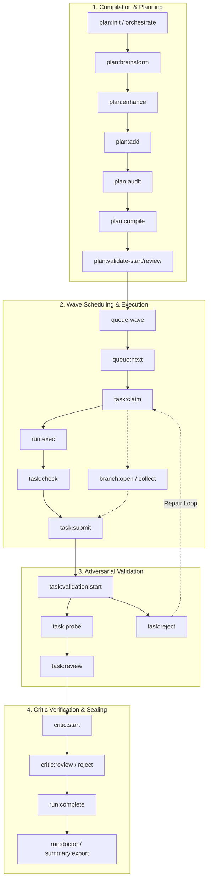

# OLT Harness CLI Reference Manual

The **OLT Harness** (`bun olt/scripts/harness.ts` or `bun ~/.agents/skills/olt/scripts/harness.ts`) is the single deterministic runtime interface for Orchestrating Long Tasks. Every agent action, lifecycle state transition, gate evaluation, and evidence submission passes through this unified entry point.

All commands follow a **Zero-JSON Colon Command Architecture** (`<domain>:<verb>`) designed for high-concurrency multi-agent environments, strict POSIX advisory locking, and immutable auditability.

---

## 🏛️ Standard Conventions & Execution Semantics

### Output Modes

- **Default (Markdown Brief)**: Returns a concise human- and agent-readable Markdown brief (capped at 30 lines) summarizing the operation and highlighting next actionable steps.
- **Structured JSON (`--format json`)**: Emits a deterministic, JSON-serialized payload on `stdout`.
- **Error Payloads (`stderr`)**: On failure, the harness prints a structured JSON object to `stderr`:
  ```json
  {
    "ok": false,
    "error": {
      "code": "INVALID_ARGUMENT",
      "message": "Task task-1 is not in ready state for claim",
      "exit_code": 3,
      "issues": []
    }
  }
  ```

### Standard Exit Status Catalog

| Exit Code | Classification            | Description                                                                                                                                                       |
| :-------- | :------------------------ | :---------------------------------------------------------------------------------------------------------------------------------------------------------------- |
| `0`       | `SUCCESS`                 | Operation succeeded; output brief written to `stdout`.                                                                                                            |
| `3`       | `INPUT / STATE ERROR`     | `INVALID_ARGUMENT`, `INVALID_STATE`, `INTEGRITY`, `PATH_SAFETY`, `UNSUPPORTED_PLATFORM`, or `ROLE_CONFINEMENT_VIOLATION`. Rejected before mutating capsule state. |
| `4`       | `LOCK_TIMEOUT`            | Capsule kernel `flock` was held past the acquisition deadline (default: 5000ms).                                                                                  |
| `70`      | `INTERNAL / UNCLASSIFIED` | `NOT_IMPLEMENTED` or an unhandled catastrophic runtime failure.                                                                                                   |

> [!NOTE]
> `run:exec` is the sole exception to exit code propagation: it always exits `0` if the child command was spawned and recorded, encapsulating the child's raw exit status in the returned `exit_code` record field.

### Common Global Flags

| Flag                | Type     | Default       | Description                                                         |
| :------------------ | :------- | :------------ | :------------------------------------------------------------------ |
| `--run`, `--run-id` | `string` | Derived / `.` | Target capsule root path (e.g., `.olt/capsules/<slug>`) or run ID.  |
| `--repo`            | `string` | `.`           | Absolute or relative path to the workspace root owning the capsule. |
| `--format`          | `string` | `markdown`    | Output formatting mode (`markdown` or `json`).                      |
| `--actor`           | `string` | Role name     | Identity recorded on the event payload in `events.jsonl`.           |

---

## 🧭 Command Matrix by Functional Domain



---

## 1. Orchestration & Planning Commands

### `orchestrate`

The zero-friction universal entrypoint. Captures user prompt bytes, initializes the capsule, pins runtime files, and emits the next sequence checklist.

```bash
bun harness.ts orchestrate <free-text prompt>
printf "%s" "$PROMPT" | bun harness.ts orchestrate --prompt-stdin
```

- **Flags**:
  - `--prompt-file <path>` (`string`): Path to verbatim prompt file.
  - `--prompt-stdin` (`bool`): Explicitly enforce reading prompt from standard input.
  - `--repo <path>` (`string`, default: `.`): Workspace repository root.
  - `--run <slug>` (`string`): Explicit run slug override.
  - `--runtime-source <path>` (`string`): Runtime directory to pin into capsule.
  - `--no-runtime-pin` (`bool`): Skip runtime pinning.
- **Stdin**: Read if piped or `--prompt-stdin` is provided.
- **Exit Codes**: `0` on success, `3` on invalid prompt/path safety violation, `4` on lock timeout.

### `plan:init`

Low-level deterministic run capsule initialization.

```bash
bun harness.ts plan:init --run <run-id> --prompt-file prompt.md
```

- **Flags**:
  - `--run`, `--run-id` (`string`, required): Unique capsule directory identifier.
  - `--repo` (`string`, default: `.`): Repository root path.
  - `--prompt-file` (`string`): File containing exact prompt bytes.
  - `--prompt-stdin` (`bool`): Read prompt from stdin.
  - `--source-verified` (`bool`): Attest prompt source verification.

### `plan:brainstorm`

Executes Socratic 8-vector matrix expansion across multiple rounds to discover latent constraints, edge cases, and architectural tradeoffs.

```bash
bun harness.ts plan:brainstorm --run .olt/capsules/<run-id> --rounds 3
```

- **Flags**:
  - `--run` (`string`, required): Capsule root path.
  - `--prompt` (`string`): Prompt text override.
  - `--rounds` (`int`, default: `3`): Number of iterative expansion rounds.
  - `--save` (`bool`, default: `true`): Persist `brainstorming.json` to capsule root.

### `plan:enhance`

Records structured repository analysis, discovering existing subsystems, risks, and architectural anchor points without displacing the raw prompt.

```bash
bun harness.ts plan:enhance --run .olt/capsules/<run-id> --file planning/enhanced-plan.json
```

- **Flags**:
  - `--run` (`string`, required): Capsule root path.
  - `--file` (`string`): JSON file containing structured observations, risks, and todos.
  - `--markdown-file` (`string`): Companion Markdown plan documentation.

### `plan:add`

Appends atomic requirements, tasks, artifacts, and verification gates to the mutable planning buffer.

```bash
bun harness.ts plan:add --run .olt/capsules/<run-id> \
  --requirement-id "R-001" \
  --requirement-lines "1-4" \
  --task-id "task-core-engine" \
  --task-label "Implement Core Storage Engine" \
  --task-write-scope "src/engine/store" \
  --gate-command "bun test tests/unit/store.test.ts"
```

- **Flags**:
  - `--requirement-id` (`string`): Unique requirement identifier.
  - `--requirement-lines` (`string`): Source line ranges (e.g. `1-5,8`).
  - `--task-id` (`string`): Unique task identifier.
  - `--task-label` (`string`): Human-readable task description.
  - `--task-write-scope` (`string`, repeatable): Assigned disjoint filesystem paths.
  - `--task-priority` (`int`, default: `100`): Task scheduling priority.
  - `--task-effort` (`int`, default: `3`): Estimated effort units.
  - `--gate-command` (`string`, repeatable): Mandatory verification command.
  - `--gate-cwd` (`string`, default: `.`): Working directory for gate command.
  - `--depends-on` (`string`, repeatable): Prerequisite task dependencies.

### `plan:audit`

Executes mechanical verification of the planning graph against invariants A1–A6 before compilation.

```bash
bun harness.ts plan:audit --run .olt/capsules/<run-id>
```

- **Flags**:
  - `--run` (`string`, required): Capsule root path.
  - `--strict` (`bool`, default: `true`): Enforce 100% prompt line coverage and gate attachment.

### `plan:compile`

Locks the mutable plan into an immutable Graph Revision $R$, executes Tarjan's SCC cycle detection, calculates the Brent Work/Span metric ($P = \lceil W/S \rceil$), and commits `state.topology`.

```bash
bun harness.ts plan:compile --run .olt/capsules/<run-id> --max-parallel 8
```

- **Flags**:
  - `--run` (`string`, required): Capsule root path.
  - `--max-parallel` (`int`, default: `8`): Concurrency ceiling for wave dispatch.
  - `--completion-gate` (`string`): Mandatory run-wide gate command.

### `plan:validate-start`, `plan:validate-review`, `plan:validate-reject`

Lifecycle for independent Plan-Validator adversary reviewing structural graph validity before task execution begins.

```bash
bun harness.ts plan:validate-start --run .olt/capsules/<run-id> --agent plan-val-1
bun harness.ts plan:validate-review --run .olt/capsules/<run-id> --agent plan-val-1 --token <token> --verdict pass
bun harness.ts plan:validate-reject --run .olt/capsules/<run-id> --agent plan-val-1 --token <token> --reason "Missing UI gate"
```

### `plan:replan`

Performs dynamic graph revision ($R \to R+1$) in response to critic findings or unexpected runtime blockers.

```bash
bun harness.ts plan:replan --run .olt/capsules/<run-id> --findings-file /tmp/findings.json
```

---

## 2. Queue & Task Execution Commands

### `queue:wave`

Inspects graph topology and dispatches the next wave of eligible, unblocked tasks whose write scopes are completely disjoint.

```bash
bun harness.ts queue:wave --run .olt/capsules/<run-id>
```

- **Flags**:
  - `--run` (`string`, required): Capsule root path.
  - `--coordinator` (`string`): Assigning coordinator identity.

### `queue:next`

Returns the next claimable task according to 6-factor deterministic priority ranking.

```bash
bun harness.ts queue:next --run .olt/capsules/<run-id>
```

### `task:claim`

Claims an open task lease for an assigned agent, returning an ephemeral bearer lease token.

```bash
bun harness.ts task:claim --run .olt/capsules/<run-id> --task task-1 --agent implementer-1
```

- **Flags**:
  - `--run` (`string`, required): Capsule root path.
  - `--task` (`string`, required): Target task ID.
  - `--agent` (`string`, required): Registered agent identifier.
  - `--role` (`string`, default: `implementer`): Lease role (`implementer` or `repairer`).
  - `--lease-seconds` (`int`, default: `300`): Lease TTL in seconds.
- **Output**: Issues bearer lease token on `stdout`.

### `run:exec`

The mandatory monitored execution wrapper. Enforces monotonic timeouts, traps process signals, captures `stdout`/`stderr` streams into cryptographic blobs, and validates worktree diffs.

```bash
bun harness.ts run:exec --run .olt/capsules/<run-id> --task task-1 -- bun test tests/unit/store.test.ts
```

- **Flags**:
  - `--run` (`string`, required): Capsule root path.
  - `--task` (`string`): Bound task ID.
  - `--gate` (`string`): Bound gate ID.
  - `--timeout` (`int`, default: `60000`): Maximum execution timeout in milliseconds.
  - `--idle-timeout` (`int`, default: `15000`): Idle output timeout in milliseconds.
  - `--cwd` (`string`, default: `.`): Working directory.
- **Exit Codes**: Always `0` if spawned; raw process status reported in JSON record.

### `task:check`

Fast incremental verification tool for targeted files and task write scopes. Runs incremental typechecking and AST invariant audits (0 `any`, 0 compiler suppressions).

```bash
bun harness.ts task:check --task task-1 src/engine/store.ts src/engine/index.ts
```

- **Flags**:
  - `--run` (`string`): Capsule root path.
  - `--task` (`string`): Task ID for write-scope resolution.
  - `--typecheck` (`bool`, default: `true`): Run TypeScript incremental typechecker.
  - `--lint` (`bool`, default: `true`): Run AST invariant auditor.
  - `--fix` (`bool`, default: `false`): Automatically patch fixable AST violations.

### `task:submit`

Submits an implementer's completed work, committing changed file paths and linking verified command receipts.

```bash
bun harness.ts task:submit --run .olt/capsules/<run-id> \
  --task task-1 \
  --agent implementer-1 \
  --token <lease-token> \
  --summary "Implemented durable storage engine with POSIX flock atomicity"
```

- **Flags**:
  - `--run` (`string`, required): Capsule root path.
  - `--task` (`string`, required): Target task ID.
  - `--agent` (`string`, required): Claiming agent ID.
  - `--token` (`string`, required): Active bearer lease token.
  - `--summary` (`string`, required): Non-empty summary of modifications.

### `task:release` & `task:abandon`

Voluntary release of a task lease back to the scheduler queue.

```bash
bun harness.ts task:release --run .olt/capsules/<run-id> --task task-1 --token <token> --reason "Yielding for rebalancing"
```

---

## 3. Adversarial Validation Commands

### `task:validation:start`

Initiates an independent validation lease for an unanchored validator agent.

```bash
bun harness.ts task:validation:start --run .olt/capsules/<run-id> --task task-1 --agent val-cq-1 --domain code-quality
```

- **Flags**:
  - `--run` (`string`, required): Capsule root path.
  - `--task` (`string`, required): Target task ID in `submitted` state.
  - `--agent` (`string`, required): Validator agent ID.
  - `--domain` (`string`): Specialization domain (`code-quality`, `security`, `ui-design`, etc.).

### `task:probe`

Issues mandatory adversarial probe demands ("prove property X holds"), advancing the probe round counter without burning repair budgets.

```bash
bun harness.ts task:probe --run .olt/capsules/<run-id> \
  --task task-1 \
  --agent val-cq-1 \
  --token <token> \
  --demand "Prove that concurrent write locks timeout cleanly after 5000ms"
```

- **Flags**:
  - `--demand` (`string`, repeatable): Adversarial challenge description.
  - `--command-id` (`string`, repeatable): Supporting command evidence reference.

### `task:reject`

Formally rejects a task submission due to observed defects, transitioning the task to `changes_requested` and escalating the repair round.

```bash
bun harness.ts task:reject --run .olt/capsules/<run-id> \
  --task task-1 \
  --agent val-cq-1 \
  --token <token> \
  --reason "File descriptor leak detected during lock contention" \
  --severity "important" \
  --remediation "Ensure close() is called in a finally block" \
  --revalidation "bun test tests/unit/concurrency.test.ts"
```

### `task:review`

Submits final validation verdict (`pass`), ensuring 100% of open probe demands and findings are resolved with monitored command receipts.

```bash
bun harness.ts task:review --run .olt/capsules/<run-id> \
  --task task-1 \
  --agent val-cq-1 \
  --token <token> \
  --status "pass" \
  --resolve "probe-task-1-01-1=C-VAL-CMD-101"
```

---

## 4. Completeness Critic & Sealing Commands

### `critic:start`

Spawns the late-stage Completeness Critic to audit the entire repository diff against 100% of prompt requirements.

```bash
bun harness.ts critic:start --run .olt/capsules/<run-id> --agent critic-1
```

### `critic:review`

Records final critic sign-off and attaches the cryptographic proof bundle linking each requirement ID to successful command receipts.

```bash
bun harness.ts critic:review --run .olt/capsules/<run-id> \
  --agent critic-1 \
  --token <token> \
  --proofs-file /tmp/proofs.json \
  --summary "All 18 prompt obligations verified against live test suite"
```

### `critic:reject`

Rejects full run completion, filing structured findings that trigger mandatory fan-back replanning (`plan:replan`).

```bash
bun harness.ts critic:reject --run .olt/capsules/<run-id> \
  --agent critic-1 \
  --token <token> \
  --findings-file /tmp/critic-findings.json
```

### `run:complete`

Mechanically validates the 9-point terminal checklist, verifies that all agent grants are closed, and places the cryptographic seal on the run capsule.

```bash
bun harness.ts run:complete --run .olt/capsules/<run-id> --auth-token <critic-token>
```

---

## 5. Branching & Workforce Ledger Commands

### `branch:open` & `branch:collect`

Enables dynamic hierarchy expansion by creating isolated sub-task worktrees beneath an active parent task lease while suspending the parent lease clock.

```bash
bun harness.ts branch:open --run .olt/capsules/<run-id> --task task-1 --token <token> --reason "Parallelizing parser and grammar"
bun harness.ts branch:collect --run .olt/capsules/<run-id> --branch <branch-id> --token <token> --summary "Sub-tasks complete"
```

### `agent:register`, `agent:report`, `agent:release`

Maintains the immutable workforce grant ledger (`state.agents`).

```bash
# Register an agent
bun harness.ts agent:register --run .olt/capsules/<run-id> --agent implementer-2 --role implementer --host antigravity --parent-agent coordinator-1 --parent-task task-2

# Report telemetry
bun harness.ts agent:report --run .olt/capsules/<run-id> --agent implementer-2 --tokens-in 15000 --tokens-out 3200 --model "claude-3-7-sonnet"

# Release agent grant
bun harness.ts agent:release --run .olt/capsules/<run-id> --agent implementer-2 --reason "Task complete"
```

---

## 6. Watchdog, Diagnostics & Forensics

### `watchdog:verify` & `watchdog:cleanup`

Audits running background processes, cleans up orphaned child tasks, and recovers stale leases.

```bash
bun harness.ts watchdog:verify --run .olt/capsules/<run-id>
bun harness.ts watchdog:cleanup --run .olt/capsules/<run-id>
```

### `run:doctor` & `diagnostics:dump`

Performs comprehensive structural integrity auditing across the event log hash chain, state projections, and disk blobs.

```bash
bun harness.ts run:doctor --run .olt/capsules/<run-id>
bun harness.ts diagnostics:dump --run .olt/capsules/<run-id> --output-dir /tmp/diagnostics
```

### `summary:export`

Generates portable analytical summaries (`summary.md`, `metrics.json`, `timeline.json`, `graph.json`).

```bash
bun harness.ts summary:export --run .olt/capsules/<run-id> --export-dir docs/artifacts/run-summary
```

---

## 7. Operational Best Practices & Quick Tips

> [!TIP]
> **Deterministic Execution**: Always pass `WaitMsBeforeAsync: 10000` when executing CLI commands via host tools to avoid premature backgrounding.

> [!IMPORTANT]
> **Strict Write Scopes**: Implementers must only edit files strictly within their assigned `write_scope`. Any file edits outside assigned paths will fail submission with a `PATH_SAFETY` error.

> [!NOTE]
> **Adversarial Probes vs Defects**: Use `task:probe` for non-grading demands and challenges; use `task:reject` only when a substantive code defect is empirically observed.
