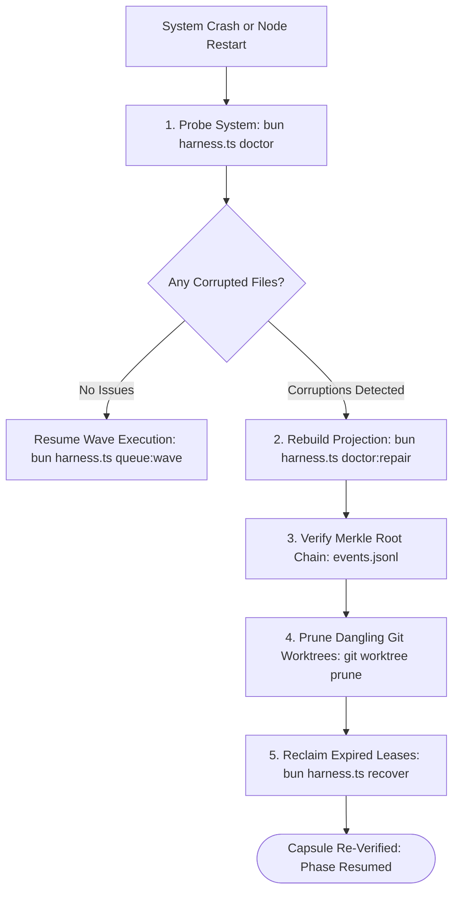

# OLT System Health, Diagnostics & Incident Recovery Reference

---

[Previous: Quickstart Tutorial](quickstart.md) | [Chapter Index](index.md) | [All Chapters Index](../architecture/index.md) | [Next: Reference Authoring Guide](GUIDE.md)

---

## 1. Executive Summary & Health Philosophy

In high-concurrency autonomous multi-agent environments, human operators and supervisor daemons require deterministic visibility into runtime state, worker leases, topological wave progress, and filesystem health.

The **OLT (Orchestrating Long Tasks)** Health & Diagnostics Engine provides unified diagnostic sweeping and self-healing capabilities via the `doctor`, `health`, `doctor:repair`, and `recover` command suites. The architecture is governed by three foundational operational principles:

1. **Non-Invasive Continuous Inspection**: Diagnostic probes perform read-only evaluations of runtime memory, kernel locks, and filesystem structures without altering active task state or acquiring exclusive write locks.
2. **Deterministic Auto-Healing (`doctor:repair`)**: Known transient failure modes—such as torn event log tails, stale advisory locks, and orphaned worktree directories—are repaired mathematically from the underlying append-only event ledger.
3. **Fail-Closed Safety**: Any detected invariant breach immediately halts execution wave dispatch and returns structured error envelopes, preventing cascading state corruption across downstream worker tasks.

```text
+--------------------------------------------------------------------------------------------------+
│                             OLT HEALTH & DIAGNOSTICS ARCHITECTURE                                │
+--------------------------------------------------------------------------------------------------+
│                                                                                                  │
│   ┌───────────────────────────┐         ┌───────────────────────────┐                            │
│   │ 1. Diagnostic Probing     │  ───►   │ 2. 10-Domain Audit Engine │                            │
│   │ `bun harness.ts doctor`   │         │ (Env, Merkle, AST, SLA)   │                            │
│   └─────────────┬─────────────┘         └─────────────┬─────────────┘                            │
│                 │                                     │                                          │
│                 ▼                                     ▼                                          │
│   ┌───────────────────────────┐         ┌───────────────────────────┐                            │
│   │ 3. Status & Diagnostic Rpt│  ◄───►  │ 4. State Projection Repair│                            │
│   │ `bun harness.ts run:status│         │ `bun harness.ts doc:repair│                            │
│   └─────────────┬─────────────┘         └─────────────┬─────────────┘                            │
│                 │                                     │                                          │
│                 ▼                                     ▼                                          │
│   ┌───────────────────────────┐         ┌───────────────────────────┐                            │
│   │ 5. Lease & Zombie Recovery│  ───►   │ 6. Cryptographic Proof    │                            │
│   │ `bun harness.ts recover`  │         │ Re-sealed Merkle Ledger   │                            │
│   └───────────────────────────┘         └───────────────────────────┘                            │
│                                                                                                  │
+--------------------------------------------------------------------------------------------------+
```

---

## 2. The 10-Domain Diagnostic Health Sweep

OLT evaluates system health across ten orthogonal domains ($D_1 \dots D_{10}$). Every domain must achieve a `HEALTHY` verdict for production wave execution.

```text
+--------+-------------------------+---------------------------------------------------------------+
| Domain | Subsystem Target        | Diagnostic Probing Focus & Invariants                         |
+--------+-------------------------+---------------------------------------------------------------+
| D1     | Environment & Runtime   | Bun runtime >= 1.1.0, Git porcelain v2, platform flock(2)    |
| D2     | Capsule Integrity       | manifest.json presence, prompt.md mode 0444 SHA-256 match     |
| D3     | State Ledger Hygiene    | events.jsonl Merkle hash chaining, sequence monotonicity      |
| D4     | Concurrency & Locks     | POSIX flock contention, stale lock files (/tmp/olt-*.lock)    |
| D5     | Worker Leases & SLA     | 5-minute heartbeat SLA (Delta t <= 300s), zombie worker tasks |
| D6     | Topological Graph       | Acyclicity (Tarjan SCC |SCC| = 1), wave dependency continuity |
| D7     | Git Workspace Hygiene   | Clean root working tree, valid out-of-repo .olt/worktrees     |
| D8     | Static AST Purity       | TypeScript AST scan (0 any, 0 @ts-ignore, <= 300 line budget) |
| D9     | Inter-Agent Mailbox     | Mailbox IPC queue latency, deadletter inspection, JSON schema |
| D10    | Telemetry & Audit Logs  | .olt/telemetry.jsonl append validity, Cowan token envelope    |
+--------+-------------------------+---------------------------------------------------------------+
```

### Detailed Domain Verification Specifications

#### Domain 1: Environment & Runtime Compatibility

- **Bun Runtime Engine**: Verifies version string $\ge 1.1.0$.
- **Git Porcelain Interface**: Confirms Git version $\ge 2.38.0$ with worktree submodule support.
- **Kernel Advisory Locks**: Probes POSIX `flock(2)` syscall responsiveness on host filesystem.
- **TypeScript Environment**: Confirms strict type resolution in the execution runtime.

#### Domain 2: Capsule Integrity & Immutability

- **Manifest Schema**: Validates `.olt/capsules/<slug>/manifest.json` against Draft 2020-12 JSON Schema.
- **Prompt Hash Verification**: Recomputes SHA-256 digest of `prompt.md` and matches against `manifest.json`:
  $$H_{\text{prompt}} = \text{SHA-256}(\text{prompt.md})$$
- **POSIX Permission Mode**: Confirms `prompt.md` is set to read-only `0444`.

#### Domain 3: State Ledger Merkle Chaining

- **Event Line Monotonicity**: Verifies strictly incrementing integer sequence numbers $1, 2, \dots, N$.
- **Recursive Hash Chain**: Evaluates the Merkle hash link at each event line $e_i$:
  $$H_i = \text{SHA-256}(H_{i-1} \parallel e_i)$$
- **Torn-Tail Detection**: Identifies incomplete trailing bytes from unbuffered process kills.

#### Domain 4: Concurrency & Kernel Advisory Locks

- **Advisory Lock Contention**: Detects active shared and exclusive lock holders on capsule locks.
- **Orphan Lock Files**: Scans `/tmp/olt-*.lock` for abandoned lock descriptors where holder PID is inactive.

#### Domain 5: Worker Leases & Straggler SLA

- **Heartbeat Freshness**: Calculates $\Delta t = t_{\text{now}} - t_{\text{last\_heartbeat}}$ for every active task.
- **Straggler SLA Enforcement**: Flags any lease where $\Delta t > 300\,\text{s}$ as a dead worker.

#### Domain 6: Topological Graph Integrity

- **Tarjan SCC Cycle Detection**: Runs Strongly Connected Components algorithm to guarantee $|\text{SCC}| = 1$.
- **Wave Continuity**: Confirms every dependency edge $(u, v)$ satisfies $\text{Wave}(u) < \text{Wave}(v)$.

#### Domain 7: Git Workspace Hygiene

- **Root Repository Purity**: Asserts zero uncommitted modifications in root repository working tree.
- **Isolated Worktree Allocation**: Validates that all worker edits reside strictly under `.olt/worktrees/<task_id>/`.

#### Domain 8: Static AST Purity

- **Type Suppression Gate**: Verifies zero instances of `any`, `unknown` bypasses, `@ts-ignore`, or `@ts-expect-error`.
- **Modular Sizing Budgets**: Asserts that all newly authored source modules contain $\le 300$ non-comment lines.

#### Domain 9: Inter-Agent Mailbox IPC

- **Queue Delivery Latency**: Monitors message transit times in `.olt/capsules/<slug>/mailbox/`.
- **Deadletter Queue**: Audits unparseable or rejected JSON payloads across agent inboxes.

#### Domain 10: Telemetry & Token Envelope

- **Cowan Envelope Compliance**: Confirms task execution remains within the $150{,}000$ token context budget.
- **Structured Audit Append**: Asserts valid JSONL formatting on `.olt/telemetry.jsonl`.

---

## 3. Diagnostic CLI Commands & Output Envelopes

### Command 3.1: Full Diagnostic Sweep (`doctor`)

Execute the complete diagnostic sweep against an active capsule:

```bash
bun olt/scripts/harness.ts doctor \
  --run .olt/capsules/quickstart-auth-tokens
```

Expected JSON diagnostic report:

```json
{
  "ok": true,
  "result": {
    "status": "HEALTHY",
    "checkedAt": "2026-08-29T20:15:00.000Z",
    "capsule": ".olt/capsules/quickstart-auth-tokens",
    "domains": {
      "environment": { "healthy": true, "issues": [] },
      "capsuleIntegrity": { "healthy": true, "promptHashVerified": true },
      "merkleLedger": { "healthy": true, "eventHeight": 14, "chainIntact": true },
      "concurrencyLocks": { "healthy": true, "activeLocks": 1, "staleLocks": 0 },
      "workerLeases": { "healthy": true, "activeLeases": 0, "staleLeases": 0 },
      "topologicalGraph": { "healthy": true, "cycleCount": 0, "wavesTotal": 2 },
      "gitWorkspace": { "healthy": true, "rootClean": true, "activeWorktrees": 0 },
      "astPurity": { "healthy": true, "violations": 0 },
      "mailbox": { "healthy": true, "queuedMessages": 0, "deadletters": 0 },
      "telemetry": { "healthy": true, "tokensConsumed": 28400, "tokenBudgetLimit": 150000 }
    },
    "verdict": "PASS"
  }
}
```

### Command 3.2: Host Environment Preflight (`health`)

Audit host compatibility without requiring an active capsule:

```bash
bun olt/scripts/harness.ts health
```

Exit Codes:

- `0`: All checks passed, system fully operational.
- `3`: Incompatible platform or missing runtime dependency (`UNSUPPORTED_PLATFORM`).
- `70`: Internal fatal error or unhandled runtime failure.

### Command 3.3: Counterfactual Mutation Certification (`doctor:certify`)

Certify that diagnostic checks and gates are falsifiable using counterfactual mutation testing:

```bash
bun olt/scripts/harness.ts doctor:certify \
  --run .olt/capsules/quickstart-auth-tokens
```

---

## 4. Automated Capsule Healing & Repair (`doctor:repair`)

When runtime faults occur (e.g. abrupt host restarts, killed worker processes, or network disconnections), OLT provides mathematical state reconstruction via `doctor:repair`.

```bash
bun olt/scripts/harness.ts doctor:repair \
  --run .olt/capsules/quickstart-auth-tokens \
  --actor coordinator
```

### Auto-Healing Mechanics

```text
+--------------------------------------------------------------------------------------------------+
│                             AUTOMATED HEALING REPAIR ENGINE                                      │
+------------------------------------+-------------------------------------------------------------+
│ Defect Type                        │ Automated Remediation Action                                │
+------------------------------------+-------------------------------------------------------------+
│ Torn JSON Tail in events.jsonl     │ Truncates file to last valid newline and verified Merkle SHA│
│ Desynchronized state.json          │ Replays events.jsonl from height 0 to rebuild projection    │
│ Abandoned /tmp/olt-*.lock          │ Inspects process PID table; releases lock if process dead   │
│ Stale Worker Leases                │ Reclaims task leases with expired 5m heartbeat SLA          │
│ Orphaned Git Worktrees             │ Runs git worktree prune and removes dangling directories    │
+------------------------------------+-------------------------------------------------------------+
```

---

## 5. Worker Lease Reclamation & Zombie Recovery (`recover`)

OLT enforces the **5-Minute Straggler SLA Rule**. If a worker fails to send a heartbeat or complete its task within 300 seconds:

$$\Delta t = t_{\text{current}} - t_{\text{last\_heartbeat}} > 300\,\text{s}$$

the worker is designated as a **Zombie Task**.

### Step 5.1: Monotonic Lease Epoch Bumping

The orchestrator increments the lease epoch counter:

$$E_{k+1} = E_k + 1$$

and computes a new monotonic HMAC lease token. Any late submission from the previous worker possessing token $\tau_{\text{lease}}^{(k)}$ is rejected with `LEASE_EXPIRED`.

### Step 5.2: Execute Lease Reclamation

```bash
bun olt/scripts/harness.ts recover \
  --run .olt/capsules/quickstart-auth-tokens \
  --actor coordinator \
  --grace-seconds 30
```

The task is returned to `retry_ready` (or `changes_requested` after a repair attempt) and scheduled for the next available worker in the wave.

---

## 6. Crash Recovery Procedures & Merkle Chain Integrity

When recovering from an unexpected operating system reboot or hardware crash, follow this deterministic recovery runbook:



### Merkle Event Chaining Formulation

During recovery, the ledger recomputes each event's recursive hash:

$$H_0 = \text{SHA-256}(\text{manifest.json})$$

$$H_i = \text{SHA-256}(H_{i-1} \parallel e_i) \quad \text{for } i = 1, \dots, N$$

If any event line $e_i$ is mutated or truncated, hash verification fails at index $i$, enabling exact rollback to $H_{i-1}$.

---

## 7. Quota Freeze & Circuit Breaker Response Playbooks

To protect against token exhaustion and LLM provider rate limits, OLT integrates an automated Circuit Breaker Engine.

### Token Envelope Limits

- **Per-Task Cowan Envelope**: $T_{\text{task}} \le 150{,}000$ tokens.
- **Circuit Breaker States**:
  - `CLOSED`: Normal operation, all agent requests permitted.
  - `OPEN`: Rate limit reached; incoming requests queued with exponential backoff.
  - `HALF-OPEN`: Probing canary request dispatched to test provider responsiveness.

### Exponential Backoff Formulation

When an upstream quota limit is encountered, wait duration is computed as:

$$t_{\text{wait}} = \min\left(t_{\text{max}},\, t_0 \cdot 2^k + \mathcal{U}(0, \delta)\right)$$

where $t_0 = 2\,\text{s}$, $k$ is the retry attempt index, and $\mathcal{U}(0, \delta)$ provides uniform jitter ($\delta = 500\,\text{ms}$).

---

## 8. Diagnostic Finding & Defect Ingestion (`finding:file`)

When an auditor or companion discovers an anomaly, record the finding directly into the flock-locked defect ledger:

```bash
bun olt/scripts/harness.ts finding:file \
  --code AST_PURITY_VIOLATION \
  --severity high \
  --file src/auth/tokens.ts \
  --message "Found unapproved any type annotation" \
  --task-id task-002 \
  --actor auditor-01
```

---

## 9. Complete Incident Diagnostic Checklist & Verification Matrix

```text
+------------------------------------+---------------------------------------------------------------+
| Diagnostic Check                   | Verification Command & Invariant Target                       |
+------------------------------------+---------------------------------------------------------------+
| 1. Runtime Parity                  | `bun harness.ts health` (Exit code 0, Bun >= 1.1.0)           |
| 2. Capsule Manifest Hash           | `bun harness.ts doctor --run <path>` (SHA-256 match)          |
| 3. Merkle Ledger Chain             | `bun harness.ts doctor --run <path>` (All event hashes valid) |
| 4. Worker Heartbeat SLA            | `bun harness.ts run:status --run <path>` (Leases Delta t<=300)|
| 5. Topological DAG Cycles          | `bun harness.ts plan:status --run <path>` (Cycles == 0)       |
| 6. Worktree Directory Hygiene      | `git worktree list` (Matches active task lease IDs exactly)   |
| 7. Static AST Compliance           | `bun harness.ts task:check --file <path>` (0 any, 0 ignore)   |
| 8. Telemetry Budget                | `bun harness.ts doctor --run <path>` (Tokens < 150,000 cap)   |
+------------------------------------+---------------------------------------------------------------+
```

---

[Previous: Quickstart Tutorial](quickstart.md) | [Chapter Index](index.md) | [All Chapters Index](../architecture/index.md) | [Next: Reference Authoring Guide](GUIDE.md)

---
