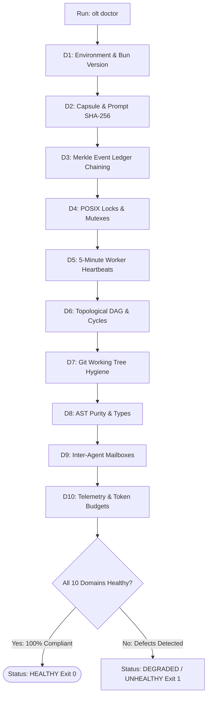

# OLT Health, Diagnostics & System Status Reference

---

[Previous: Quickstart Guide](quickstart.md) | [Chapter Index](index.md) | [All Chapters Index](../architecture/index.md) | [Next: Reference Hub Index](index.md)

---

## 1. Executive Summary & Diagnostic Foundations

In large-scale autonomous agent environments, human operators and automated watchdogs require instantaneous, trustworthy visibility into system health, active worker leases, topological wave progress, and filesystem hygiene.

The OLT (Orchestrating Long Tasks) engine provides a unified **Diagnostics & Status Engine** backed by the `doctor` and `status` command suites. Under this system:

1. **10-Domain Health Probing**: The doctor engine probes 10 distinct architectural subsystems, emitting structured health issues, warnings, and remediation actions.
2. **Deterministic Status Rendering**: The status engine inspects `.olt/capsules/<slug>/state.json` to render live Gantt charts, worker lease summaries, and remaining critical paths.
3. **Automated Healing (`doctor:heal`)**: Common transient faults (torn JSON tails, stale lock files, orphaned temporary worktrees) are repaired automatically with zero operator intervention.

```text
+--------------------------------------------------------------------------------------------------+
│                             OLT HEALTH & DIAGNOSTICS ARCHITECTURE                                │
+--------------------------------------------------------------------------------------------------+
│                                                                                                  │
│   ┌──────────────────────┐         ┌──────────────────────┐         ┌──────────────────────┐     │
│   │ CLI / Watchdog Probe │  ───►   │ Unified Diagnostics  │  ───►   │ Structured Health    │     │
│   │ (`olt doctor`)       │         │ Engine (10 Domains)  │         │ Report & Remediation │     │
│   └──────────────────────┘         └──────────────────────┘         └──────────────────────┘     │
│              │                                 │                               │                 │
│              ▼                                 ▼                               ▼                 │
│      [Live Sensors]                  [Evaluate Invariants]           [CLI Brief / Auto-Heal]     │
│                                                                                                  │
+--------------------------------------------------------------------------------------------------+
```

---

## 2. The 10 Diagnostic Health Domains

```text
+--------+-------------------------+---------------------------------------------------------------+
| Domain | Subsystem Target        | Diagnostic Probing Focus                                      |
+--------+-------------------------+---------------------------------------------------------------+
| D1     | Environment & Runtime   | Bun runtime version, Node compatibility, platform libc flock  |
+--------+-------------------------+---------------------------------------------------------------+
| D2     | Capsule Integrity       | manifest.json presence, prompt.md SHA-256 cryptographic match |
+--------+-------------------------+---------------------------------------------------------------+
| D3     | State Ledger Hygiene    | events.jsonl Merkle hash chaining, sequence monotonicity      |
+--------+-------------------------+---------------------------------------------------------------+
| D4     | Concurrency & Locks     | POSIX advisory lock contention, stale observer file orphans   |
+--------+-------------------------+---------------------------------------------------------------+
| D5     | Worker Leases & SLA     | 5-minute heartbeat freshness (Delta t <= 300s), zombie leases |
+--------+-------------------------+---------------------------------------------------------------+
| D6     | Topological Graph       | Acyclicity (Tarjan SCC |SCC| = 1), wave dependency continuity |
+--------+-------------------------+---------------------------------------------------------------+
| D7     | Git Workspace Hygiene   | Dirty working tree check, out-of-repo worktree status         |
+--------+-------------------------+---------------------------------------------------------------+
| D8     | Static AST Purity       | TypeScript Compiler AST scan (0 any, 0 suppressions, budgets) |
+--------+-------------------------+---------------------------------------------------------------+
| D9     | Inter-Agent Mailbox     | Mailbox queue latency, deadletter inspection, message syntax  |
+--------+-------------------------+---------------------------------------------------------------+
| D10    | Telemetry & Audit Logs  | .olt/telemetry.jsonl append validity, Cowan token envelope    |
+--------+-------------------------+---------------------------------------------------------------+
```



---

## 3. Command Usage & Operator CLI Recipes

### A. Comprehensive Health Diagnostics (`doctor`)

Runs the full 10-domain diagnostic suite:

```bash
# Run standard diagnostics
olt doctor

# Run with detailed JSON output for automated ingestion
olt doctor --detailed --json
```

### B. Automated Capsule Healing (`doctor:heal`)

Repairs torn event logs, clears dead locks, and reclaims zombie worker leases:

```bash
olt doctor:heal --capsule .olt/capsules/mind-gen-6
```

### C. Live Run Status Querying (`run:status`)

Displays active phase, Gantt chart progress, worker allocations, and remaining critical path span:

```bash
olt run:status --run mind-gen-6 --detailed
```

---

## 4. Structured Diagnostic Output Envelope

```json
{
  "status": "HEALTHY",
  "checkedAt": "2026-08-29T03:20:00.000Z",
  "bunVersion": "1.4.0",
  "activeCapsule": ".olt/capsules/mind-gen-6",
  "domains": {
    "environment": { "healthy": true, "issues": [] },
    "capsule": { "healthy": true, "promptHashVerified": true },
    "merkleLedger": { "healthy": true, "eventsVerified": 142 },
    "workerLeases": { "healthy": true, "activeLeases": 4, "staleLeases": 0 },
    "dagTopology": { "healthy": true, "wavesTotal": 5, "wavesCompleted": 3 },
    "astPurity": { "healthy": true, "violationsCount": 0 }
  },
  "overallVerdict": "PASS"
}
```

---

## 5. Architectural Invariants Summary

1. **Deterministic Probing**: Probes perform non-invasive read-only inspections.
2. **Zero False Positives**: Missing fields in telemetry are reported as `unknown` rather than healthy defaults.
3. **Automated Recovery**: `doctor:heal` provides deterministic, mathematical rollback and repair routines.

---

[Previous: Quickstart Guide](quickstart.md) | [Chapter Index](index.md) | [All Chapters Index](../architecture/index.md) | [Next: Reference Hub Index](index.md)

---
