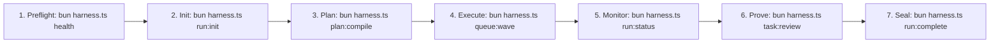

# OLT Reference Manuals & Operator Catalog

---

[Previous: Master Architecture Index](../architecture/index.md) | [Chapter Index](index.md) | [All Chapters Index](../architecture/index.md) | [Next: Quickstart Tutorial](quickstart.md)

---

## 1. Reference Domain Overview & Pedagogy

Welcome to the **OLT Reference Hub**. Grounded in Daniele Procida's Diátaxis documentation framework, the Reference domain delivers actionable, copy-pasteable operator manuals, diagnostic playbooks, and command specifications for human engineers, system administrators, and autonomous supervisor agents.

While the [Architecture Book](../architecture/index.md) establishes theoretical foundations, scheduling proofs, and cryptographic state models, the Reference Hub focuses directly on operational execution, CLI invocation syntax, health diagnostics, and incident recovery.

```text
+--------------------------------------------------------------------------------------------------+
│                                  OLT REFERENCE MANUAL TOPOLOGY                                   │
+--------------------------------------------------------------------------------------------------+
│                                                                                                  │
│    ┌───────────────────────────┐                    ┌───────────────────────────┐                │
│    │ Quickstart Tutorial       │                    │ Health & Status Reference │                │
│    │ (quickstart.md)           │ ══════════════════►│ (health-and-status.md)    │                │
│    │ [Learning-Oriented]       │                    │ [Problem-Oriented How-To] │                │
│    └─────────────┬─────────────┘                    └─────────────┬─────────────┘                │
│                  │                                                │                              │
│                  ▼                                                ▼                              │
│    ┌───────────────────────────┐                    ┌───────────────────────────┐                │
│    │ Harness CLI Engine        │                    │ State Schemas & Ledgers   │                │
│    │ (Architecture Ch 14)      │ ══════════════════►│ (Architecture Ch 15)      │                │
│    │ [Command Dictionary]      │                    │ [JSON Schema Contracts]   │                │
│    └─────────────┬─────────────┘                    └─────────────┬─────────────┘                │
│                  │                                                │                              │
│                  ▼                                                ▼                              │
│    ┌───────────────────────────┐                    ┌───────────────────────────┐                │
│    │ Error Catalog & Blunders  │                    │ Verification Engines      │                │
│    │ (Architecture Ch 16)      │ ══════════════════►│ (Architecture Ch 17)      │                │
│    │ [Error Codes & Playbooks] │                    │ [5 Mechanical Provers]    │                │
│    └───────────────────────────┘                    └───────────────────────────┘                │
│                                                                                                  │
+--------------------------------------------------------------------------------------------------+
```

---

## 2. Complete Reference Catalog & Direct Links

```text
+------------------------------------+----------------+--------------------------------------------+
| Document Title                     | Diátaxis Type  | Primary Operational Focus                  |
+------------------------------------+----------------+--------------------------------------------+
| [Quickstart Tutorial](quickstart.md) | Tutorial     | Step-by-step onboarding & first wave run   |
| [Health and Status](health-and-status.md) | How-To  | 10-domain diagnostic sweep & auto-healing  |
| [Reference Authoring Guide](GUIDE.md) | Handbook    | Reference contribution rules & invariants  |
| [Harness CLI Engine](../architecture/14-harness-cli-and-command-engine/index.md) | Reference | 15-domain CLI capability dictionary |
| [State Schemas & Ledgers](../architecture/15-state-schemas-and-event-ledger/index.md) | Reference | Draft 2020-12 State & Event JSON contracts |
| [Error Catalog & Blunders](../architecture/16-error-catalog-and-blunders/index.md) | Reference | 12 HarnessError codes & 28 blunders |
| [Verification Engines](../architecture/17-verification-engines-and-gates/index.md) | Reference | 5 internal mechanical proof engines |
+------------------------------------+----------------+--------------------------------------------+
```

### [Quickstart Tutorial](quickstart.md)

Comprehensive, zero-assumption onboarding walkthrough covering environment preflight, task capsule initialization, topological planning, concurrent wave execution in isolated Git worktrees, adversarial validation, and terminal completion sealing.

### [Health & Status Reference](health-and-status.md)

Authoritative how-to guide for evaluating system health across the 10 diagnostic domains (`bun olt/scripts/harness.ts doctor`), repairing corrupted capsule projections (`bun olt/scripts/harness.ts doctor:repair`), managing worker straggler leases, and handling upstream quota freezes.

### [Reference Authoring Guide (GUIDE.md)](GUIDE.md)

Engineering charter and formatting guidelines for authoring reference documents, ensuring 100% link integrity, zero emojis, exact JSON output envelopes, and strict Diátaxis sizing bounds.

### Deep Architecture Reference Links

- **[Chapter 14: Harness CLI & Command Engine](../architecture/14-harness-cli-and-command-engine/index.md)**: Exhaustive reference for all 15 command domains, flags, and arguments.
- **[Chapter 15: State Schemas & Event Ledger](../architecture/15-state-schemas-and-event-ledger/index.md)**: JSON Schema contracts for capsule manifests, requirements, events, and mailboxes.
- **[Chapter 16: Error Catalog & Empirical Blunders](../architecture/16-error-catalog-and-blunders/index.md)**: Error codes, Unix exit codes, and 28 agentic blunder mitigation playbooks.
- **[Chapter 17: Verification Engines & Gate Provers](../architecture/17-verification-engines-and-gates/index.md)**: Verification engines for TypeScript typecheck, AST linting, APCA contrast, and PNG headers.

---

## 3. Core Operator Invariants & Behavioral Standards

Every operator and autonomous agent interacting with the OLT CLI must honor four operational invariants:

1. **Non-Invasive Diagnostics**: Health checks (`health`, `doctor`) must never mutate active capsule states or lock tables.
2. **Out-of-Repo Worktree Confinement**: All code modifications are restricted to isolated worktree directories (`.olt/worktrees/<task_id>/`). Working tree modifications in the root repository are rejected.
3. **Falsifiable Evidence Proofs**: Task completions require dual-channel validation (independent cognitive verdict + mechanical AST and test execution receipts). Self-certification is strictly rejected.
4. **Append-Only Merkle Ledger**: System state is recomputed deterministically from the Merkle-chained event log (`events.jsonl`). Direct mutations to `state.json` are prohibited.

---

## 4. Essential Operator Workflows



---

## 5. Operational Summary & Next Steps

For practical task execution, proceed immediately to the [Quickstart Tutorial](quickstart.md).

For production deployment health checks and incident recovery, consult [Health and Status](health-and-status.md).

For deep algorithmic proofs and mathematical models, explore the master [Architecture Book Index](../architecture/index.md).

---

[Previous: Master Architecture Index](../architecture/index.md) | [Chapter Index](index.md) | [All Chapters Index](../architecture/index.md) | [Next: Quickstart Tutorial](quickstart.md)

---
