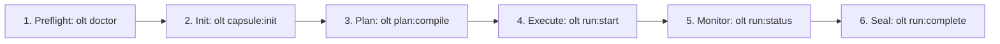

# OLT Reference Manuals & Operator Guides

---

[Previous: Architecture Index](../architecture/index.md) | [Chapter Index](index.md) | [All Chapters Index](../architecture/index.md) | [Next: Quickstart Guide](quickstart.md)

---

## 1. Reference Domain Overview & Pedagogy

Welcome to the **OLT Reference Hub**. In the Diátaxis documentation taxonomy, the Reference domain provides concise, copy-pasteable operator guides, command dictionaries, and diagnostic playbooks for human engineers and automated watchdogs.

While the [Architecture Book](../architecture/index.md) explores theoretical foundations, proofs, and mathematical models, the Reference Hub focuses on practical action, operational maintenance, and day-to-day CLI execution.

```text
+--------------------------------------------------------------------------------------------------+
|                                  OLT REFERENCE MANUAL TOPOLOGY                                   |
+--------------------------------------------------------------------------------------------------+
│                                                                                                  │
│    ┌───────────────────────────┐                    ┌───────────────────────────┐                │
│    │ Quickstart Guide          │                    │ Health & Status Reference │                │
│    │ (quickstart.md)           │ ══════════════════►│ (health-and-status.md)    │                │
│    └─────────────┬─────────────┘                    └─────────────┬─────────────┘                │
│                  │                                                │                              │
│                  ▼                                                ▼                              │
│    ┌───────────────────────────┐                    ┌───────────────────────────┐                │
│    │ Complete 15-Domain        │                    │ State Schemas & Errors    │                │
│    │ CLI Reference             │ ══════════════════►│ Catalog (Architecture 15) │                │
│    └───────────────────────────┘                    └───────────────────────────┘                │
│                                                                                                  │
+--------------------------------------------------------------------------------------------------+
```

---

## 2. Reference Documents Catalog

```text
+------------------------------------+----------------+--------------------------------------------+
| Document Title                     | Classification | Primary Focus                              |
+------------------------------------+----------------+--------------------------------------------+
| quickstart.md                      | Tutorial       | Step-by-step onboarding & single-task run  |
+------------------------------------+----------------+--------------------------------------------+
| health-and-status.md               | How-To Guide   | 10-domain doctor diagnostics & auto-heal   |
+------------------------------------+----------------+--------------------------------------------+
| ../architecture/14-harness-cli/    | Reference      | Complete CLI dictionary & argument schemas |
+------------------------------------+----------------+--------------------------------------------+
| ../architecture/15-state-schemas/  | Reference      | Draft 2020-12 State & Event JSON schemas   |
+------------------------------------+----------------+--------------------------------------------+
| ../architecture/16-error-catalog/  | Reference      | 12 HarnessError codes & 28 blunders        |
+------------------------------------+----------------+--------------------------------------------+
```

### [Quickstart Guide](quickstart.md)

Comprehensive onboarding tutorial covering environment preflight, task capsule initialization, topological planning, concurrent wave execution, and terminal completion sealing.

### [Health & Status Reference](health-and-status.md)

Complete operator guide for running system diagnostics (`olt doctor`), interpreting health issues across the 10 domains, recovering crashed runs (`olt doctor:heal`), and monitoring live execution progress.

---

## 3. Essential Operator Workflows



---

## 4. Summary & Navigation

For deep mathematical formulations, scheduling algorithms, and internal engine mechanics, explore the [OLT Architecture Book](../architecture/index.md).

Proceed directly to the [Quickstart Guide](quickstart.md) to launch your first task.

---

[Previous: Architecture Index](../architecture/index.md) | [Chapter Index](index.md) | [All Chapters Index](../architecture/index.md) | [Next: Quickstart Guide](quickstart.md)

---
