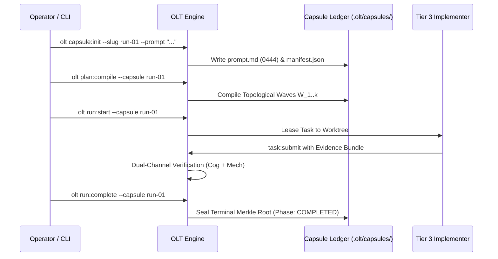

# OLT Quickstart & Onboarding Guide

---

[Previous: Reference Hub Index](index.md) | [Chapter Index](index.md) | [All Chapters Index](../architecture/index.md) | [Next: Health & Status Reference](health-and-status.md)

---

## 1. Executive Summary & Getting Started

Welcome to the OLT (Orchestrating Long Tasks) quickstart guide. This document provides step-by-step walkthroughs for initializing tasks, running autonomous development waves, verifying code correctness, and diagnosing runtime health.

OLT operates in two primary modes:

1. **Single-Task Execution Mode**: An operator or developer issues a discrete prompt, and OLT compiles, executes, and validates the task using isolated worktrees and dual-channel verification.
2. **Infinite Mind Mode (Product Owner)**: OLT runs as a continuous autonomous daemon, ingesting defect backlogs, checking admission gates, and dispatching multi-wave orchestrations.

```text
+--------------------------------------------------------------------------------------------------+
│                                 OLT QUICKSTART EXECUTION PIPELINE                                │
+--------------------------------------------------------------------------------------------------+
│                                                                                                  │
│   Step 1: System Preflight  ──► Verify runtime & dependencies (`olt doctor`)                     │
│               │                                                                                  │
│               ▼                                                                                  │
│   Step 2: Initialize Task   ──► Ingest & seal prompt into capsule (`olt capsule:init`)           │
│               │                                                                                  │
│               ▼                                                                                  │
│   Step 3: Compile DAG Plan  ──► Kahn toposort & wave compilation (`olt plan:compile`)            │
│               │                                                                                  │
│               ▼                                                                                  │
│   Step 4: Dispatch Waves    ──► Parallel implementers in worktrees (`olt run:start`)             │
│               │                                                                                  │
│               ▼                                                                                  │
│   Step 5: Verify & Complete ──► Dual-channel proof & terminal seal (`olt run:complete`)          │
│                                                                                                  │
+--------------------------------------------------------------------------------------------------+
```

---

## 2. Step-by-Step Single-Task Walkthrough

### Step 1: Run System Preflight Diagnostics

Before launching a run, ensure your environment meets the runtime invariants:

```bash
olt doctor
```

Verify that all 10 diagnostic domains return `HEALTHY` with exit code `0`.

### Step 2: Initialize a New Task Capsule

Create a new execution capsule and ingest your prompt verbatim:

```bash
olt capsule:init --slug feature-auth-tokens --prompt "Implement HMAC SHA-256 lease token generation in auth/token.ts with 100% unit test coverage."
```

This writes `.olt/capsules/feature-auth-tokens/prompt.md` with mode `0444` and computes the canonical SHA-256 digest in `manifest.json`.

### Step 3: Compile the Topological Execution Plan

Decompose obligations and compile the dependency DAG:

```bash
olt plan:compile --capsule .olt/capsules/feature-auth-tokens
```

Verify that Kahn's algorithm reports zero cycles and compiles the wave sequence.

### Step 4: Launch Concurrent Execution Waves

Dispatch the compiled plan:

```bash
olt run:start --capsule .olt/capsules/feature-auth-tokens
```

Monitor live execution progress:

```bash
olt run:status --run feature-auth-tokens --detailed
```

### Step 5: Verify and Seal Terminal Completion

Once all tasks pass dual-channel validation:

```bash
olt run:complete --capsule .olt/capsules/feature-auth-tokens
```



---

## 3. Running in Infinite Mind Product Owner Mode

To launch the perpetual autonomous discovery daemon:

```bash
# Launch Mind daemon with default 5-minute pulse interval
olt mind:pulse

# Query active backlog and admission state
olt mind:status
```

---

## 4. Key CLI Commands Quick Reference

```text
+-----------------------+--------------------------------------------------------------------------+
| Command Line Syntax   | Description                                                              |
+-----------------------+--------------------------------------------------------------------------+
| `olt doctor`          | Runs 10-domain diagnostic sweep across runtime, git, and AST invariants. |
+-----------------------+--------------------------------------------------------------------------+
| `olt doctor:heal`     | Auto-heals torn event logs, clears deadlocks, and recovers stale leases. |
+-----------------------+--------------------------------------------------------------------------+
| `olt capsule:init`    | Initializes a new task capsule, sealing prompt.md with SHA-256 hashing.  |
+-----------------------+--------------------------------------------------------------------------+
| `olt plan:compile`    | Decomposes prompt obligations and compiles a cycle-free topological DAG. |
+-----------------------+--------------------------------------------------------------------------+
| `olt run:status`      | Displays real-time phase, active worker leases, and remaining span.      |
+-----------------------+--------------------------------------------------------------------------+
| `olt gate:prove`      | Mechanically evaluates Class 1-4 falsifiable evidence receipts.          |
+-----------------------+--------------------------------------------------------------------------+
```

---

## 5. Architectural Invariants Summary

1. **Deterministic Execution**: Given identical inputs, OLT generates reproducible schedules and cryptographic proofs.
2. **Hermetic Worktrees**: Implementers execute in isolated directories, leaving the root repository clean.
3. **Continuous Verification**: Every completed task is verified across both cognitive and mechanical channels before merging.

---

[Previous: Reference Hub Index](index.md) | [Chapter Index](index.md) | [All Chapters Index](../architecture/index.md) | [Next: Health & Status Reference](health-and-status.md)

---
