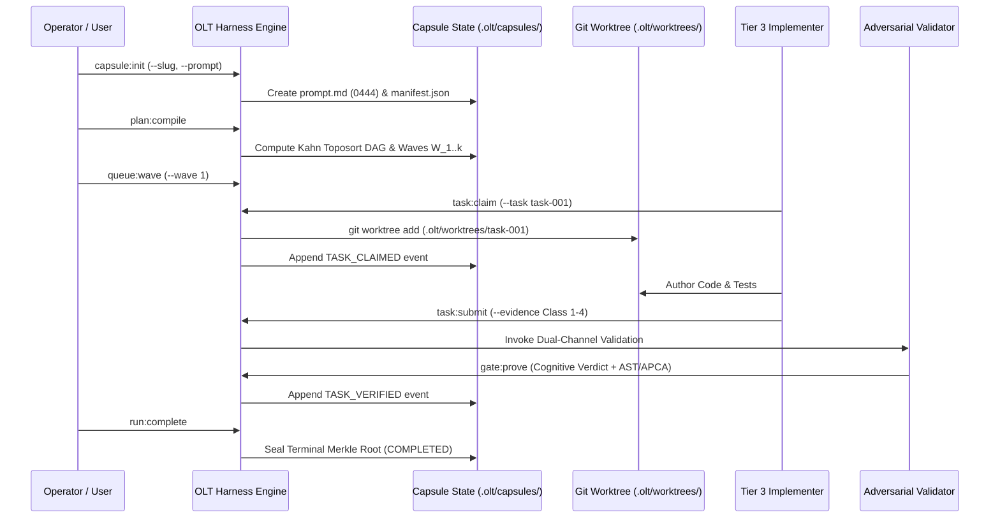

# OLT Quickstart & Onboarding Tutorial

---

[Previous: Reference Index](index.md) | [Reference Index](index.md) | [All Chapters Index](../architecture/index.md) | [Next: Health and Status](health-and-status.md)

---

## 1. Executive Overview & Diátaxis Learning Objectives

Welcome to the **OLT (Orchestrating Long Tasks)** Quickstart Tutorial. This guide is structured according to Daniele Procida's Diátaxis documentation framework as a learning-oriented tutorial. By following this walkthrough, you will initialize a hermetic execution capsule, compile an obligation dependency DAG, execute concurrent workforce waves in isolated Git worktrees, verify code artifacts with dual-channel cognitive and mechanical gates, and seal a cryptographically immutable state ledger.

OLT supports two execution operational modes:

1. **Single-Task Pipeline Mode**: An operator or external caller submits a discrete specification prompt. The harness parses, compiles, schedules, executes, and validates the implementation across worker waves.
2. **Infinite Autonomous Mind Mode**: The Tier 0 Product Owner daemon continuously runs pulse cycles, discovering defects across 10 repository sources, triaging candidate tasks through 6 admission gates, and dispatching execution waves autonomously.

```text
+--------------------------------------------------------------------------------------------------+
│                                  OLT QUICKSTART EXECUTION PIPELINE                                │
+--------------------------------------------------------------------------------------------------+
│                                                                                                  │
│   ┌───────────────────────────┐         ┌───────────────────────────┐                            │
│   │ 1. Zero-Assumption Check  │  ───►   │ 2. Task Capsule Init      │                            │
│   │ `bun harness.ts health`   │         │ `bun harness.ts init`     │                            │
│   └─────────────┬─────────────┘         └─────────────┬─────────────┘                            │
│                 │                                     │                                          │
│                 ▼                                     ▼                                          │
│   ┌───────────────────────────┐         ┌───────────────────────────┐                            │
│   │ 3. Topological Plan Build │  ───►   │ 4. Wave Dispatch & Leases │                            │
│   │ `bun harness.ts plan:comp`│         │ `bun harness.ts queue:wav`│                            │
│   └─────────────┬─────────────┘         └─────────────┬─────────────┘                            │
│                 │                                     │                                          │
│                 ▼                                     ▼                                          │
│   ┌───────────────────────────┐         ┌───────────────────────────┐                            │
│   │ 5. Adversarial Validation │  ───►   │ 6. Cryptographic Sealing  │                            │
│   │ `bun harness.ts gate:prov`│         │ `bun harness.ts complete` │                            │
│   └───────────────────────────┘         └───────────────────────────┘                            │
│                                                                                                  │
+--------------------------------------------------------------------------------------------------+
```

---

## 2. Zero-Assumption Prerequisite Checks & Environment Setup

OLT enforces the Zero-Assumption Philosophy: runtime capabilities must be proven mechanically before any task execution commences.

### System Requirements

- **Runtime Engine**: Bun $\ge 1.1.0$ (native TypeScript execution and fast IPC)
- **Version Control**: Git $\ge 2.38.0$ (supporting out-of-repo worktrees and porcelain v2)
- **Filesystem & Locks**: POSIX-compliant kernel supporting atomic `flock(2)` advisory locks
- **Node Type Definitions**: `@types/node` and `@types/bun` installed in dependencies

### Step 2.1: Verify Platform Runtime Health

Execute the health diagnostic probe against the harness engine:

```bash
bun olt/scripts/harness.ts health
```

Expected JSON output envelope:

```json
{
  "ok": true,
  "result": {
    "status": "HEALTHY",
    "runtime": "bun-1.4.0",
    "git": "git-version-2.39.5",
    "flock": "supported",
    "astLinter": "ready",
    "checksPassed": 18,
    "checksFailed": 0
  }
}
```

If exit code is non-zero (exit status `3`), refer to [Health and Status](health-and-status.md) to rectify missing system dependencies.

---

## 3. Initializing the First Task Capsule

An execution capsule (`.olt/capsules/<slug>/`) represents an isolated, durable execution sandbox containing the immutable prompt, cryptographic manifests, state projections, and event ledgers.

### Step 3.1: Initialize Capsule Directory

Issue the `capsule:init` command with a unique task slug and an explicit prompt string:

```bash
bun olt/scripts/harness.ts capsule:init \
  --slug quickstart-auth-tokens \
  --prompt "Implement HMAC-SHA256 lease token generator in auth/tokens.ts with 100% unit test coverage."
```

### Step 3.2: Verify Capsule Manifest & Prompt Sealing

When initialized, OLT seals `prompt.md` with read-only POSIX permissions (`mode 0444`) and writes `manifest.json`.

The prompt's cryptographic digest is computed as:

$$H_{\text{prompt}} = \text{SHA-256}(\text{prompt.md})$$

Inspect the generated capsule filesystem structure:

```text
.olt/capsules/quickstart-auth-tokens/
├── manifest.json         # Capsule metadata & SHA-256 prompt digest (mode 0444)
├── prompt.md             # Verbatim immutable prompt text (mode 0444)
├── requirements.json     # Decomposed obligations and evidence requirements
├── events.jsonl          # Append-only Merkle-chained event log
├── state.json            # Projected aggregate runtime state
└── mailbox/              # Inter-agent non-blocking message queues
    ├── orchestrator/
    ├── coordinator/
    └── workers/
```

Verify the manifest with `cat`:

```bash
cat .olt/capsules/quickstart-auth-tokens/manifest.json
```

```json
{
  "schema": "olt-capsule-manifest/v1",
  "slug": "quickstart-auth-tokens",
  "createdAt": "2026-08-29T05:50:00.000Z",
  "promptSha256": "e3b0c44298fc1c149afbf4c8996fb92427ae41e4649b934ca495991b7852b855",
  "status": "INITIALIZED",
  "authorityTier": "T0"
}
```

---

## 4. Compiling the Topological Wave Plan

OLT transforms free-form requirements into a strictly ordered, cycle-free Directed Acyclic Graph (DAG).

### Step 4.1: Compile Requirements & Obligations

Run the plan compiler to decompose the prompt into authority-gated obligations and verify 100% Prompt Line Coverage:

$$\Phi_{\text{cov}} = \frac{\sum_{i=1}^{N} \mathbb{I}(\text{Line}_i \in \text{Obligations})}{N} = 1.000$$

```bash
bun olt/scripts/harness.ts plan:compile \
  --capsule .olt/capsules/quickstart-auth-tokens
```

The compiler applies Kahn's topological sorting algorithm:

$$\mathcal{O}(|V| + |E|)$$

alongside Tarjan's Strongly Connected Components (SCC) cycle detection ($|\text{SCC}| = 1$) to partition tasks into discrete sequential execution waves $W_1, W_2, \dots, W_k$.

### Step 4.2: Inspect the Compiled Wave Topology

Visualize the computed DAG layers:

```bash
bun olt/scripts/harness.ts graph:dag \
  --capsule .olt/capsules/quickstart-auth-tokens
```

Output:

```text
+-------------------------------------------------------------------+
|               TOPOLOGICAL WAVE EXECUTION SCHEDULE                 |
+-------------------------------------------------------------------+
|  Wave 1 (Width = 2):                                              |
|    • task-001: auth-token-types (Interface & Contract Specs)     |
|    • task-002: hmac-crypto-helpers (Cryptographic Primitives)     |
|                                                                   |
|  Wave 2 (Width = 1) [Depends on Wave 1]:                          |
|    • task-003: token-generator-impl (Core Generator Logic)        |
|                                                                   |
|  Wave 3 (Width = 1) [Depends on Wave 2]:                          |
|    • task-004: unit-test-suite (100% Branch Coverage Tests)       |
+-------------------------------------------------------------------+
```

---

## 5. Authoring and Dispatching Task Waves

Execution waves run concurrently across Tier 3 Implementers. To prevent concurrency conflicts, each task executes in an out-of-repo isolated Git worktree.

### Step 5.1: Launch Execution Wave 1

Dispatch Wave 1 tasks into the execution queue:

```bash
bun olt/scripts/harness.ts queue:wave \
  --capsule .olt/capsules/quickstart-auth-tokens \
  --wave 1
```

### Step 5.2: Worker Lease Acquisition & Worktree Allocation

A Tier 3 worker claims a task by acquiring an exclusive monotonic lease token:

$$\tau_{\text{lease}} = \text{HMAC-SHA256}(\text{task\_id} \parallel \text{worker\_id} \parallel \text{epoch}, K_{\text{session}})$$

```bash
bun olt/scripts/harness.ts task:claim \
  --capsule .olt/capsules/quickstart-auth-tokens \
  --task task-001 \
  --worker implementer-ts-01
```

OLT automatically provisions an out-of-repo Git worktree at:

```text
.olt/worktrees/quickstart-auth-tokens/task-001/
```

The worker implements changes strictly within this isolated directory. Working tree modifications in the root repository are blocked by the Worktree Honesty Gate.



---

## 6. Adversarial Validation & Falsifiable Evidence Gates

OLT eliminates false self-certification through **Orthogonal Adversarial Validation**. The agent that authors code cannot approve it.

### The Four Falsifiable Evidence Classes

Every task submission must produce falsifiable evidence conforming to the four standard classes:

```text
+---------+----------------------------+----------------------------------------------------+
| Class   | Evidence Type              | Verification Engine & Mechanics                    |
+---------+----------------------------+----------------------------------------------------+
| Class 1 | AST Purity & Types         | Zero `any`, zero `@ts-ignore`, strict typecheck    |
| Class 2 | Deterministic Test Proofs  | Bun test execution with 100% assertion pass receipt |
| Class 3 | APCA Perceptual Contrast   | WCAG 3.0 $L_c \ge 60$ contrast formula verification|
| Class 4 | Binary PNG IHDR & Entropy  | Header validation + Shannon entropy $H(X) \ge 3.0$  |
+---------+----------------------------+----------------------------------------------------+
```

### Step 6.1: Submit Completed Task Evidence

When the worker completes modifications in its worktree, it submits the evidence bundle:

```bash
bun olt/scripts/harness.ts task:submit \
  --capsule .olt/capsules/quickstart-auth-tokens \
  --task task-001 \
  --worker implementer-ts-01 \
  --evidence-file .olt/worktrees/quickstart-auth-tokens/task-001/evidence.json
```

### Step 6.2: Run Adversarial Gate Prover

The validator executes `gate:prove` on a scratch sandbox copy to verify reproducibility:

```bash
bun olt/scripts/harness.ts gate:prove \
  --capsule .olt/capsules/quickstart-auth-tokens \
  --task task-001
```

Verification evaluates both cognitive review (command hard-locked with zero tool permissions) and mechanical provers (AST linter, test runner, APCA engine).

---

## 7. Reviewing State Ledgers & Sealing Completion

### Step 7.1: Monitor Run Status

Inspect live run status, remaining critical path, and lease health:

```bash
bun olt/scripts/harness.ts run:status \
  --capsule .olt/capsules/quickstart-auth-tokens \
  --detailed
```

Output:

```text
+-------------------------------------------------------------------+
| RUN STATUS: quickstart-auth-tokens                                |
+-------------------------------------------------------------------+
| Phase:          EXECUTING                                         |
| Active Waves:   1 / 3 Completed                                   |
| Total Tasks:    4 (2 Verified, 2 Pending)                         |
| Active Leases:  0 stale, 1 active (implementer-ts-01)             |
| Merkle Height:  18 events (Chain: VALID)                          |
+-------------------------------------------------------------------+
```

### Step 7.2: Seal Terminal Completion

Once all waves $W_1 \dots W_k$ reach verified state, execute terminal sealing:

```bash
bun olt/scripts/harness.ts run:complete \
  --capsule .olt/capsules/quickstart-auth-tokens
```

OLT computes the final Merkle root over the append-only event sequence:

$$H_i = \text{SHA-256}(H_{i-1} \parallel e_i)$$

and marks the capsule state as `COMPLETED`.

---

## 8. Executing an Autonomous Mind Pulse Cycle

For unattended repository stewardship, launch the Tier 0 Mind daemon to execute a single autonomous pulse:

```bash
bun olt/scripts/harness.ts mind:pulse \
  --consumer . \
  --max-admissions 3
```

During a pulse, the Mind:

1. Scans 10 repository discovery sources (failing tests, AST violations, doc mismatches).
2. Filters findings through 6 Admission Gates (Deduplication, Scope, Authority, Budget, Blast Radius, Convergence).
3. Compiles admitted tasks into a fresh capsule and initiates execution waves.

---

## 9. Troubleshooting & Common Blunders FAQ

```text
+------------------------------------+---------------------------------------------------------------+
| Symptom / Error Code               | Root Cause & Remediation Playbook                             |
+------------------------------------+---------------------------------------------------------------+
| `INVALID_STATE`                    | Attempting to run tasks before `plan:compile`. Run compiler.   |
| `LEASE_EXPIRED` (Delta t > 300s)   | Worker exceeded 5m SLA. Run `doctor:heal` to reclaim lease.   |
| `PROMPT_INTEGRITY_MISMATCH`        | `prompt.md` modified after init. Restore original digest.     |
| `WORKTREE_DIRTY`                   | Direct edits in root repo. Confine changes to `.olt/worktrees`|
| `AUTHENTICATION_FAILURE`           | Unverified role. Pass explicit `--role` or `--actor` flag.    |
+------------------------------------+---------------------------------------------------------------+
```

For complete diagnostic procedures, proceed to the [Health and Status](health-and-status.md) reference guide.

---

[Previous: Reference Index](index.md) | [Reference Index](index.md) | [All Chapters Index](../architecture/index.md) | [Next: Health and Status](health-and-status.md)

---
