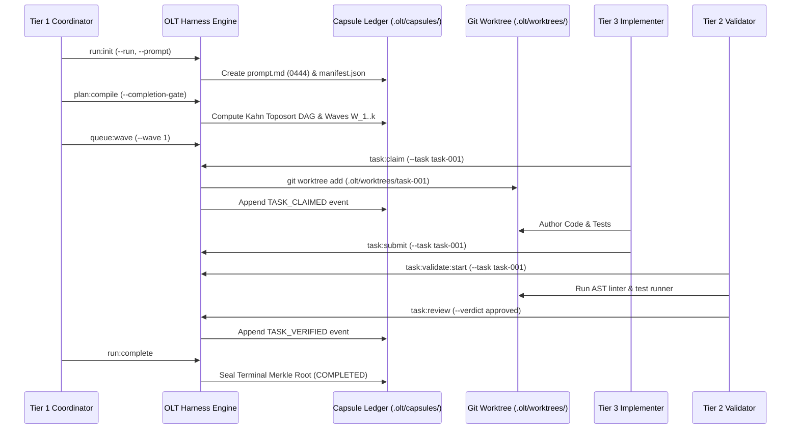

# OLT Quickstart & Onboarding Tutorial

---

[Previous: Reference Index](index.md) | [Chapter Index](index.md) | [All Chapters Index](../architecture/index.md) | [Next: Health and Status](health-and-status.md)

---

## 1. Executive Overview & Diátaxis Learning Objectives

Welcome to the **OLT (Orchestrating Long Tasks)** Quickstart Tutorial. Structured under Daniele Procida's Diátaxis documentation framework as a learning-oriented tutorial, this walkthrough guides you step-by-step through initializing an execution capsule, compiling a dependency Directed Acyclic Graph (DAG), executing concurrent worker tasks inside isolated Git worktrees, verifying artifacts through orthogonal adversarial gates, and sealing an immutable Merkle state ledger.

OLT supports two execution operational modes:

1. **Single-Task Pipeline Mode**: An operator or orchestrator submits a discrete specification. The harness parses, decomposes, schedules, executes, and validates the implementation across sequential waves.
2. **Infinite Autonomous Mind Mode**: The Tier 0 Product Owner daemon continuously runs pulse cycles, discovering repository defects across 10 discovery sources, filtering candidates through 6 admission gates, and dispatching execution capsules autonomously.

```text
+--------------------------------------------------------------------------------------------------+
│                                  OLT QUICKSTART EXECUTION PIPELINE                                │
+--------------------------------------------------------------------------------------------------+
│                                                                                                  │
│   ┌───────────────────────────┐         ┌───────────────────────────┐                            │
│   │ 1. Zero-Assumption Check  │  ───►   │ 2. Task Capsule Init      │                            │
│   │ `bun harness.ts health`   │         │ `bun harness.ts run:init` │                            │
│   └─────────────┬─────────────┘         └─────────────┬─────────────┘                            │
│                 │                                     │                                          │
│                 ▼                                     ▼                                          │
│   ┌───────────────────────────┐         ┌───────────────────────────┐                            │
│   │ 3. Socratic Plan & Add    │  ───►   │ 4. Wave Plan Compilation  │                            │
│   │ `bun harness.ts plan:add` │         │ `bun harness.ts plan:comp`│                            │
│   └─────────────┬─────────────┘         └─────────────┬─────────────┘                            │
│                 │                                     │                                          │
│                 ▼                                     ▼                                          │
│   ┌───────────────────────────┐         ┌───────────────────────────┐                            │
│   │ 5. Worktree Wave Dispatch │  ───►   │ 6. Adversarial Review     │                            │
│   │ `bun harness.ts task:claim│         │ `bun harness.ts task:rev` │                            │
│   └─────────────┬─────────────┘         └─────────────┬─────────────┘                            │
│                 │                                     │                                          │
│                 ▼                                     ▼                                          │
│   ┌───────────────────────────┐         ┌───────────────────────────┐                            │
│   │ 7. Status Audit & Prover  │  ───►   │ 8. Cryptographic Sealing  │                            │
│   │ `bun harness.ts run:status│         │ `bun harness.ts run:compl`│                            │
│   └───────────────────────────┘         └───────────────────────────┘                            │
│                                                                                                  │
+--------------------------------------------------------------------------------------------------+
```

---

## 2. Zero-Assumption Prerequisite Checks & Environment Setup

OLT enforces the Zero-Assumption Philosophy: runtime capabilities must be proven mechanically before any task execution commences.

### System Requirements

- **Runtime Engine**: Bun $\ge 1.1.0$ (native TypeScript execution, fast JSON parsing, and test runner)
- **Version Control**: Git $\ge 2.38.0$ (supporting out-of-repo worktrees and porcelain v2)
- **Filesystem & Locks**: POSIX-compliant operating system supporting atomic `flock(2)` advisory locks
- **Type Environment**: TypeScript compilation path configured with strict type definitions

### Step 2.1: Verify Platform Runtime Health

Execute the health diagnostic sweep against the harness engine:

```bash
bun olt/scripts/harness.ts health
```

Expected JSON output envelope:

```json
{
  "ok": true,
  "result": {
    "status": "HEALTHY",
    "runtime": "bun-1.4.0",
    "git": "git-version-2.39.5",
    "flock": "supported",
    "astLinter": "ready",
    "checksPassed": 18,
    "checksFailed": 0
  }
}
```

If exit code is non-zero (exit status `3`), refer to [Health and Status](health-and-status.md) to rectify missing host dependencies.

---

## 3. Initializing the First Task Capsule

An execution capsule (`.olt/capsules/<slug>/`) represents an isolated, durable execution sandbox containing the immutable prompt, cryptographic manifests, state projections, and event ledgers.

### Step 3.1: Initialize Capsule Directory

Issue the `run:init` command with a unique task slug and an explicit prompt string:

```bash
bun olt/scripts/harness.ts run:init \
  --run quickstart-auth-tokens \
  --prompt "Implement HMAC-SHA256 lease token generator in auth/tokens.ts with 100% unit test coverage." \
  --actor coordinator
```

### Step 3.2: Verify Capsule Manifest & Prompt Sealing

When initialized, OLT seals `prompt.md` with read-only POSIX permissions (`mode 0444`) and writes `manifest.json`.

The prompt cryptographic digest is computed as:

$$H_{\text{prompt}} = \text{SHA-256}(\text{prompt.md})$$

Inspect the generated capsule filesystem structure:

```text
.olt/capsules/quickstart-auth-tokens/
├── manifest.json         # Capsule metadata & SHA-256 prompt digest (mode 0444)
├── prompt.md             # Verbatim immutable prompt text (mode 0444)
├── requirements.json     # Decomposed obligations and evidence requirements
├── events.jsonl          # Append-only Merkle-chained event log
├── state.json            # Projected aggregate runtime state
└── mailbox/              # Inter-agent non-blocking message queues
    ├── orchestrator/
    ├── coordinator/
    └── workers/
```

Verify the manifest contents:

```bash
cat .olt/capsules/quickstart-auth-tokens/manifest.json
```

```json
{
  "schema": "olt-capsule-manifest/v1",
  "slug": "quickstart-auth-tokens",
  "createdAt": "2026-08-29T20:00:00.000Z",
  "promptSha256": "e3b0c44298fc1c149afbf4c8996fb92427ae41e4649b934ca495991b7852b855",
  "status": "INITIALIZED",
  "authorityTier": "T1"
}
```

---

## 4. Socratic Planning & Requirement Decomposition

Before wave compilation, requirements are decomposed into discrete, testable obligations.

### Step 4.1: Socratic Brainstorming Expansion

Execute the 8-vector Socratic expansion matrix on the prompt:

```bash
bun olt/scripts/harness.ts plan:brainstorm \
  --run .olt/capsules/quickstart-auth-tokens \
  --rounds 3 \
  --actor planner
```

### Step 4.2: Register Structured Tasks in the Planning Buffer

Register individual task obligations into the capsule planning buffer:

```bash
bun olt/scripts/harness.ts plan:add \
  --run .olt/capsules/quickstart-auth-tokens \
  --task task-001 \
  --title "Define token interface and type contracts" \
  --files "src/auth/types.ts" \
  --test-files "tests/unit/auth/types.test.ts" \
  --actor planner
```

```bash
bun olt/scripts/harness.ts plan:add \
  --run .olt/capsules/quickstart-auth-tokens \
  --task task-002 \
  --title "Implement HMAC-SHA256 token generator" \
  --files "src/auth/tokens.ts" \
  --test-files "tests/unit/auth/tokens.test.ts" \
  --depends-on task-001 \
  --dep-reason "Tokens implementation depends on interface contracts" \
  --actor planner
```

---

## 5. Compiling the Topological Wave Plan

OLT transforms obligation definitions into a strictly ordered, cycle-free Directed Acyclic Graph (DAG) partitioned into parallel execution waves.

### Step 5.1: Compile Requirements & Obligations

Run the plan compiler with an explicit mandatory completion gate:

```bash
bun olt/scripts/harness.ts plan:compile \
  --run .olt/capsules/quickstart-auth-tokens \
  --completion-gate "bun test tests/unit/auth" \
  --actor coordinator
```

The compiler applies Kahn's topological sorting algorithm alongside Tarjan's Strongly Connected Components (SCC) cycle detection to partition tasks into discrete sequential execution waves $W_1, W_2, \dots, W_k$.

### Step 5.2: Inspect the Compiled Wave Topology

Visualize the computed DAG layers and wave distribution:

```bash
bun olt/scripts/harness.ts plan:status \
  --run .olt/capsules/quickstart-auth-tokens
```

Output:

```text
+-------------------------------------------------------------------+
|               TOPOLOGICAL WAVE EXECUTION SCHEDULE                 |
+-------------------------------------------------------------------+
|  Wave 1 (Width = 1):                                              |
|    - task-001: Define token interface and type contracts         |
|                                                                   |
|  Wave 2 (Width = 1) [Depends on Wave 1]:                          |
|    - task-002: Implement HMAC-SHA256 token generator              |
+-------------------------------------------------------------------+
```

---

## 6. Authoring and Dispatching Task Waves

Execution waves run concurrently across Tier 3 Implementers. To prevent workspace collisions, each task executes inside an out-of-repo isolated Git worktree.

### Step 6.1: Launch Execution Wave 1

Dispatch Wave 1 tasks into the execution queue:

```bash
bun olt/scripts/harness.ts queue:wave \
  --run .olt/capsules/quickstart-auth-tokens \
  --wave 1 \
  --actor coordinator
```

### Step 6.2: Worker Lease Acquisition & Worktree Allocation

A Tier 3 worker claims task-001 by acquiring an exclusive monotonic lease:

```bash
bun olt/scripts/harness.ts task:claim \
  --run .olt/capsules/quickstart-auth-tokens \
  --task task-001 \
  --actor implementer-ts-01
```

OLT provisions an isolated Git worktree at:

```text
.olt/worktrees/quickstart-auth-tokens/task-001/
```



---

## 7. Adversarial Validation & Falsifiable Evidence Gates

OLT eliminates false self-certification through **Orthogonal Adversarial Validation**. The agent that authors code cannot approve it.

### The Four Falsifiable Evidence Classes

```text
+---------+----------------------------+----------------------------------------------------+
| Class   | Evidence Type              | Verification Engine & Mechanics                    |
+---------+----------------------------+----------------------------------------------------+
| Class 1 | AST Purity & Types         | Zero any, zero @ts-ignore, strict typecheck        |
| Class 2 | Deterministic Test Proofs  | Bun test execution with 100% assertion pass receipt|
| Class 3 | APCA Perceptual Contrast   | WCAG 3.0 L_c >= 60 contrast formula verification   |
| Class 4 | Binary PNG IHDR & Entropy  | Header validation + Shannon entropy H(X) >= 3.0    |
+---------+----------------------------+----------------------------------------------------+
```

### Step 7.1: Preflight AST Check

Prior to submission, the worker verifies AST compliance:

```bash
bun olt/scripts/harness.ts task:check \
  --file .olt/worktrees/quickstart-auth-tokens/task-001/src/auth/types.ts \
  --typecheck
```

### Step 7.2: Submit Completed Task

When modifications are complete, the worker submits the task:

```bash
bun olt/scripts/harness.ts task:submit \
  --run .olt/capsules/quickstart-auth-tokens \
  --task task-001 \
  --actor implementer-ts-01
```

### Step 7.3: Validator Claim & Review

An orthogonal validator claims the task for verification and records the verdict:

```bash
bun olt/scripts/harness.ts task:validate:start \
  --run .olt/capsules/quickstart-auth-tokens \
  --task task-001 \
  --actor validator-01
```

```bash
bun olt/scripts/harness.ts task:review \
  --run .olt/capsules/quickstart-auth-tokens \
  --task task-001 \
  --verdict approved \
  --actor validator-01
```

---

## 8. Reviewing State Ledgers & Sealing Completion

### Step 8.1: Monitor Run Status

Inspect live run status, wave progress, and active leases:

```bash
bun olt/scripts/harness.ts run:status \
  --run .olt/capsules/quickstart-auth-tokens \
  --detailed
```

Output:

```text
+-------------------------------------------------------------------+
| RUN STATUS: quickstart-auth-tokens                                |
+-------------------------------------------------------------------+
| Phase:          EXECUTING                                         |
| Active Waves:   2 / 2 Completed                                   |
| Total Tasks:    2 (2 Verified, 0 Pending)                         |
| Active Leases:  0 stale, 0 active                                 |
| Merkle Height:  14 events (Chain: VALID)                          |
+-------------------------------------------------------------------+
```

### Step 8.2: Seal Terminal Completion

Once all waves $W_1 \dots W_k$ reach verified state and the completion gate succeeds, execute terminal sealing:

```bash
bun olt/scripts/harness.ts run:complete \
  --run .olt/capsules/quickstart-auth-tokens \
  --actor coordinator
```

OLT computes the final Merkle root over the append-only event sequence:

$$H_i = \text{SHA-256}(H_{i-1} \parallel e_i)$$

and seals the capsule state as `COMPLETED`.

---

## 9. Executing an Autonomous Mind Pulse Cycle

For unattended repository stewardship, launch the autonomous orchestrator daemon to drive planning, execution, and validation rounds:

```bash
bun olt/scripts/harness.ts orchestrator:run \
  --repo . \
  --prompt "Audit repository error codes and generate automated repair playbooks." \
  --max-rounds 3 \
  --actor mind-daemon
```

During autonomous execution, the daemon:

1. Scans repository discovery sources (failing tests, AST violations, doc mismatches).
2. Filters findings through 6 Admission Gates (Deduplication, Scope, Authority, Budget, Blast Radius, Convergence).
3. Compiles admitted tasks into a fresh capsule and initiates execution waves.

---

## 10. Troubleshooting & Common Blunders FAQ

```text
+------------------------------------+---------------------------------------------------------------+
| Symptom / Error Code               | Root Cause & Remediation Playbook                             |
+------------------------------------+---------------------------------------------------------------+
| INVALID_STATE                      | Attempting to run tasks before plan:compile. Run compiler.    |
| LEASE_EXPIRED (Delta t > 300s)     | Worker exceeded 5m SLA. Run recover to reclaim lease.         |
| PROMPT_INTEGRITY_MISMATCH          | prompt.md modified after init. Restore original digest.       |
| WORKTREE_DIRTY                     | Direct edits in root repo. Confine changes to .olt/worktrees. |
| AUTHENTICATION_FAILURE             | Unverified role. Pass explicit --actor flag.                  |
+------------------------------------+---------------------------------------------------------------+
```

For complete diagnostic procedures, proceed to the [Health and Status](health-and-status.md) reference guide.

---

[Previous: Reference Index](index.md) | [Chapter Index](index.md) | [All Chapters Index](../architecture/index.md) | [Next: Health and Status](health-and-status.md)

---
