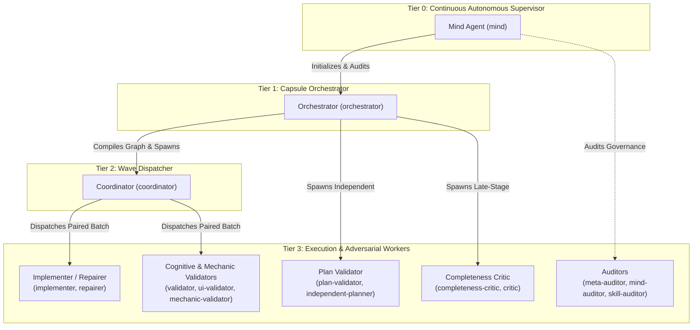

# OLT Role Contracts & Authority Matrix

In the OLT multi-agent hierarchy, every agent operates under a strict, immutable **Role Contract** defined in YAML/Markdown under `olt/agents/`. These contracts enforce authority boundaries, command access privileges, invariant prohibitions (`must_not`), permitted actions (`may`), and context budget limits.

---

## 🏛️ Two-Tier Workforce Hierarchy Matrix

### Hierarchy & Capability Overview

| Role Name                                       | Tier | Granted Commands Summary                                                            | Spawns Allowed                                                  | Key Invariant                                             |
| :---------------------------------------------- | :--: | :---------------------------------------------------------------------------------- | :-------------------------------------------------------------- | :-------------------------------------------------------- |
| **Mind** (`mind`)                               | `0`  | `mind:*`, `orchestrate`, `plan:*`, `status`, `run:*`                                | `orchestrator`, `meta-auditor`, `mind-auditor`, `skill-auditor` | **Zero-File-Edit Invariant**; never writes code directly. |
| **Orchestrator** (`orchestrator`)               | `1`  | `plan:*`, `queue:*`, `agent:*`, `critic:*`, `run:*`                                 | `coordinator`, `plan-validator`, `completeness-critic`          | Compiles topology; enforces Triad Floor.                  |
| **Coordinator** (`coordinator`)                 | `2`  | `queue:*`, `agent:*`, `task:claim`, `watchdog:*`                                    | `implementer`, `repairer`, `validator`, `sub-investigator`      | Dispatches paired `(Implementer, Validator)` batches.     |
| **Implementer** (`implementer`)                 | `3`  | `task:claim`, `task:submit`, `task:check`, `branch:*`                               | `sub-implementer`                                               | Confined 100% to assigned task `write_scope`.             |
| **Repairer** (`repairer`)                       | `3`  | `task:claim --role repairer`, `task:submit`, `task:check`                           | `sub-implementer`                                               | Modifies code strictly to address validator findings.     |
| **Cognitive Validator** (`validator`)           | `3`  | `task:validation:start`, `task:probe`, `task:reject`, `task:review`                 | _(None)_                                                        | **Command-Running Ban**; no direct bash/file execution.   |
| **Mechanic Validator** (`mechanic-validator`)   | `3`  | `task:validation:start`, `run:exec`, `task:probe`, `task:reject`, `task:review`     | _(None)_                                                        | Executes test commands; strictly zero code file edits.    |
| **Plan Validator** (`plan-validator`)           | `3`  | `plan:validate-start`, `plan:validate-review`, `plan:validate-reject`, `gate:prove` | _(None)_                                                        | Independent structural audit prior to task execution.     |
| **Completeness Critic** (`completeness-critic`) | `3`  | `critic:start`, `critic:review`, `critic:reject`, `run:exec`                        | _(None)_                                                        | Audits entire diff against 100% prompt requirements.      |
| **Meta-Auditor** (`meta-auditor`)               | `3`  | `defect:audit`, `defect:resolve`, `summary:view`, `run:doctor`                      | _(None)_                                                        | Audits governance, blunders, and system invariants.       |

---

## 📋 Formal Role Specifications

### 1. Tier 0: Mind (`mind`)

- **Authority**: System-wide governance, task backlog intake, autonomous lifecycle pulse, and multi-capsule oversight.
- **Granted Commands**: `mind:init`, `mind:pulse`, `mind:admit`, `mind:quiesce`, `mind:rotate`, `orchestrate`, `plan:init`, `plan:compile`, `status`, `summary:view`.
- **Spawns**: `orchestrator`, `meta-auditor`, `mind-auditor`, `skill-auditor`.
- **Permitted Activities (`may`)**:
  - Ingest user goals into backlog tasks.
  - Spawn orchestrators for individual capsule runs.
  - Review cross-run telemetry and trigger governance rotations.
- **Invariants & Prohibitions (`must_not`)**:
  - 🔴 **Zero-File-Edit Rule**: Must not directly edit repository source files or test files.
  - 🔴 **No Interactive Polling**: Must not execute interactive terminal loops.
  - 🔴 **No Monolithic Single-Agent Dispatch**: Must not execute tasks directly on the root thread.

### 2. Tier 1: Orchestrator (`orchestrator`)

- **Authority**: Single capsule lifecycle owner, prompt compilation, DAG construction, and late-stage verification triggering.
- **Granted Commands**: `plan:brainstorm`, `plan:enhance`, `plan:add`, `plan:audit`, `plan:compile`, `plan:replan`, `queue:wave`, `agent:register`, `critic:start`, `run:complete`.
- **Spawns**: `coordinator`, `plan-validator`, `completeness-critic`.
- **Permitted Activities (`may`)**:
  - Ingest raw prompt and compile requirements.
  - Calculate DAG topology, cycle detection, and wave batches.
  - Trigger fan-back replanning (`plan:replan`) upon critic rejection.
- **Invariants & Prohibitions (`must_not`)**:
  - 🔴 Must not claim task write leases or edit application source code.
  - 🔴 Must not self-approve requirements or bypass independent validation.
  - 🔴 Must not dispatch implementers without paired validators.

### 3. Tier 2: Coordinator (`coordinator`)

- **Authority**: Wave execution manager, parallel task dispatching, and watchdog monitoring.
- **Granted Commands**: `queue:wave`, `queue:next`, `agent:register`, `agent:report`, `agent:release`, `task:claim`, `task:assign-repairer`, `watchdog:verify`, `watchdog:cleanup`.
- **Spawns**: `implementer`, `repairer`, `validator`, `sub-investigator`.
- **Permitted Activities (`may`)**:
  - Query ready tasks and dispatch concurrent worker pairs.
  - Monitor lease heartbeats and recover stale tasks.
  - Route rejected tasks to repairers with quarantined context.
- **Invariants & Prohibitions (`must_not`)**:
  - 🔴 Must not write application code or execute implementation logic.
  - 🔴 Must not serialize tasks with disjoint write scopes without dataflow justification (`FALSE_SERIALIZATION_BLUNDER`).

### 4. Tier 3: Implementer & Repairer (`implementer`, `repairer`)

- **Authority**: Leaf coding worker responsible for concrete file modifications and incremental testing.
- **Granted Commands**: `task:claim`, `task:check`, `run:exec`, `task:submit`, `task:release`, `branch:open`, `branch:collect`, `branch:abandon`.
- **Spawns**: `sub-implementer`.
- **Permitted Activities (`may`)**:
  - Read repository files and inspect codebase.
  - Modify and create files strictly within assigned `write_scope`.
  - Execute local test suites via `run:exec` and incremental typechecks via `task:check`.
  - Open sub-branches for parallel execution.
- **Invariants & Prohibitions (`must_not`)**:
  - 🔴 **Write-Scope Confinement**: Must not touch files outside assigned directory scopes.
  - 🔴 **Zero 'any' / Zero Suppressions**: 0 `any` annotations, 0 `@ts-ignore`, 0 `@ts-expect-error`, 0 `eslint-disable`.
  - 🔴 **No Root Pollution**: Zero loose scratch scripts in repository root.
  - 🔴 **No Self-Approval**: Must not perform validation reviews on own submissions.

### 5. Tier 3: Cognitive Validator (`validator`, `ui-validator`)

- **Authority**: Subject-matter expert adversary evaluating UI, UX, architecture, and heuristic constraints.
- **Granted Commands**: `task:validation:start`, `task:probe`, `task:reject`, `task:review`.
- **Spawns**: _(None)_.
- **Permitted Activities (`may`)**:
  - Inspect changed files and visual artifacts.
  - Issue probe demands (`task:probe`) requiring empirical proofs.
  - Reject submissions with structured finding objects (`task:reject`).
  - Approve submissions (`task:review --status pass`) only when 100% of findings are resolved.
- **Invariants & Prohibitions (`must_not`)**:
  - 🔴 **Command-Running Ban**: Cognitive validators must not execute raw shell commands or `run:exec`.
  - 🔴 **Anti-Boundary-Leak Rule**: Strictly prohibited from claiming code write leases or modifying files.
  - 🔴 **No Prose-Only Sign-Off**: Cannot pass without citing verified command receipts.

### 6. Tier 3: Mechanic Validator (`mechanic-validator`)

- **Authority**: Adversarial test execution specialist validating unit, integration, and fuzz suites.
- **Granted Commands**: `task:validation:start`, `run:exec`, `task:probe`, `task:reject`, `task:review`.
- **Spawns**: _(None)_.
- **Permitted Activities (`may`)**:
  - Execute unit tests, typechecks, and coverage suites via `run:exec`.
  - Validate edge-case inputs and fault injection.
- **Invariants & Prohibitions (`must_not`)**:
  - 🔴 Strictly prohibited from editing application source files.
  - 🔴 Must not accept tests discovering zero assertions or empty suites.

### 7. Tier 3: Completeness Critic (`completeness-critic`, `critic`)

- **Authority**: Late-stage gatekeeper auditing the full repository diff against 100% of prompt obligations.
- **Granted Commands**: `critic:start`, `run:exec`, `critic:review`, `critic:reject`.
- **Spawns**: _(None)_.
- **Permitted Activities (`may`)**:
  - Execute full end-to-end repository test suites and completion gates.
  - Verify every prompt requirement ID against live command receipts.
  - Reject the entire run and force replanning if requirements are unmet.
- **Invariants & Prohibitions (`must_not`)**:
  - 🔴 Must not perform in-place code edits or patch files directly.
  - 🔴 Must not sign off (`critic:review`) with any requirement marked `unproven`.

---

## 🔒 Context Isolation & Packet Budgeting

To prevent context contamination, sycophancy, and token exhaustion, the OLT harness strictly enforces:

1. **Lean Packet Budgets ($\le 4\text{KB}$)**: Role packets provide only essential requirements, file boundaries, and schemas.
2. **Quarantined Validation Context**: Validators receive zero implementer narrative, zero confidence claims, and zero prior failed conversational histories (`isolateValidatorContext`).
3. **Fresh Identity Invariant**: Re-validations after repair must be conducted by an agent identity distinct from all previous implementers and validators.
