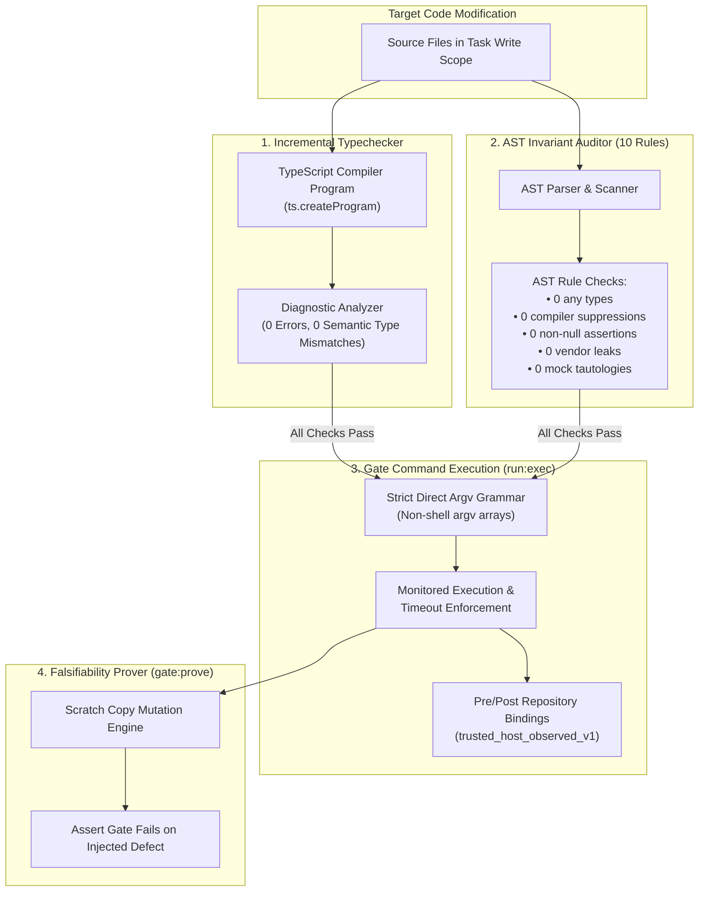

# OLT Deterministic Verification Engines

In the OLT ecosystem, correctness is verified through **deterministic code analysis engines** rather than subjective LLM self-evaluation. These engines execute during `task:check`, `run:exec`, `gate:prove`, and terminal gate verification.

---

## 🏗️ Architecture of the Verification Pipeline



---

## 1. Incremental Typecheck Engine (`task:check`)

The Typecheck Engine provides fast, targeted semantic type validation of files within an assigned task write scope without requiring a full repository recompilation.

### Operational Mechanics

1. **Target File Resolution**: Resolves candidate files from `--task <task-id>` write scopes or explicit positional arguments, filtering for supported TypeScript/JavaScript extensions (`.ts`, `.tsx`, `.mts`, `.cts`, `.js`, `.jsx`, `.mjs`, `.cjs`).
2. **Program Creation**: Creates an incremental TypeScript AST program via `ts.createProgram` configured with the project's `tsconfig.json`.
3. **Diagnostic Extraction**: Extracts syntactic, semantic, and global diagnostics across all specified files.
4. **Zero-Error Invariant**: Any type error (e.g., TS2322, TS2339, TS7006) fails the check with non-zero violation counts and line-level diagnostic snippets.

---

## 2. AST Static Invariant Auditor (The 10 AST Lint Rules)

The AST Enforcer (`olt/scripts/src/linter/ast-enforcer.ts`) parses the code into an abstract syntax tree using the TypeScript compiler API to audit code quality, hygiene, and honesty.

```text
┌─────────────────────────────────────────────────────────────────────────────┐
│                    THE 10 MANDATORY AST LINT INVARIANTS                     │
├──────────────────────┬──────────────────────────────────────────────────────┤
│ RULE IDENTIFIER      │ DESCRIPTION & ENFORCEMENT POLICY                     │
├──────────────────────┼──────────────────────────────────────────────────────┤
│ any_type             │ Strict 0 'any' keyword annotations. Requires formal  │
│                      │ generics, interfaces, or unknown with type guards.   │
│ compiler_suppression │ Strict 0 @ts-ignore, @ts-expect-error, @ts-nocheck,  │
│                      │ @ts-check, or eslint-disable directives.             │
│ non_null_assertion   │ Strict 0 '!' postfix non-null assertion operators.   │
│                      │ Must use explicit narrowing or null checks.          │
│ vendor_leak          │ Prohibits hardcoding AI vendor model names           │
│                      │ (e.g., 'anthropic', 'openai', 'claude', 'gpt-4').    │
│ mock_tautology       │ Detects tests asserting directly against hardcoded   │
│                      │ mock return values without exercising real code.     │
│ trivial_assertion    │ Disallows tautological assertions like               │
│                      │ expect(true).toBe(true) or expect(1).toBe(1).        │
│ empty_test_body      │ Rejects test/it blocks containing zero executable    │
│                      │ statements or assertions.                            │
│ trivial_early_return │ Rejects test blocks that return early without        │
│                      │ executing substantive expectations.                  │
│ nullish_coalescing   │ Enforces correct usage of ?? over falsy-blind ||.    │
│ logical_or_fallback  │ Prohibits || fallback where empty strings/0 are valid│
└──────────────────────┴──────────────────────────────────────────────────────┘
```

### Detailed Rule Specifications

#### 1. `any_type`

- **AST Node**: `ts.SyntaxKind.AnyKeyword`
- **Violation Message**: `"Explicit 'any' type annotation is strictly prohibited. Use strong typing or 'unknown' with type guards."`
- **Mitigation**: Replace with a specific interface, union type, or `unknown` combined with type predicates.

#### 2. `compiler_suppression`

- **AST Scanner**: Scans comment trivia (`SingleLineCommentTrivia`, `MultiLineCommentTrivia`) across the source.
- **Directives Banned**: `@ts-ignore`, `@ts-nocheck`, `@ts-expect-error`, `@ts-check`, `eslint-disable`, `eslint-disable-line`, `eslint-disable-next-line`.
- **Violation Message**: `"Prohibited compiler suppression directive '@ts-ignore' detected."`
- **Mitigation**: Fix the underlying type defect or refactor the code to satisfy the compiler naturally.

#### 3. `non_null_assertion`

- **AST Node**: `ts.SyntaxKind.NonNullExpression` (`expr!`)
- **Violation Message**: `"Non-null assertion operator '!' is prohibited. Use optional chaining, default values, or explicit conditionals."`
- **Mitigation**: Replace `val!` with `if (val === undefined) throw ...` or optional chaining `val?.prop`.

#### 4. `vendor_leak`

- **AST Node**: Identifiers and string literals matching the deny-list (`anthropic`, `openai`, `gemini`, `claude`, `chatgpt`, `gpt-4`, `llama`, `deepseek`, `mistral`, `qwen`, `cohere`).
- **Violation Message**: `"Vendor leak detected: reference to prohibited vendor name '<vendor>'."`
- **Mitigation**: Abstract provider logic behind generic adapter interfaces.

#### 5. `mock_tautology` & `trivial_assertion`

- **AST Node**: `CallExpression` matching `expect(mockVal).toBe(mockVal)` or `expect(true).toBe(true)`.
- **Violation Message**: `"Trivial assertion detected: asserting constant against constant."`
- **Mitigation**: Assert against the return value of the system under test.

---

## 3. Gate Command Policies & Verification Grammars

All test execution and verification in OLT is governed by strict gate policies.

### Direct Argv Grammar

Gates MUST be specified as a direct array of string arguments (`string[]`), never as arbitrary shell strings containing pipes (`|`), redirects (`>`), or command substitution (`$()`):

```json
// ✅ VALID: Direct argv array
["bun", "test", "tests/unit/store.test.ts"]

// ❌ INVALID: Shell program string
"bun test tests/unit/store.test.ts | grep 'pass'"
```

### Recognized Tool Grammars

Recognized standard tools require bare executable names without path prefixes:

- `git diff --check`
- `git diff --cached --check`
- `test -f <path>`

### Custom Verifier Grammar

Custom repository verification scripts must use repository-relative executable paths:

- `./scripts/check`
- `./scripts/verify-schema.sh`
- Prohibited: Shell wrappers, arbitrary external binary execution, or uncoordinated options.

---

## 4. Dynamic Gate Falsifiability Engine (`gate:prove`)

To ensure that gate commands are genuine verifiers and not tautological "always-green" scripts, OLT provides the **Gate Falsifiability Prover** (`gate:prove`).

### Mutation Testing Protocol

1. **Scratch Copy Isolation**: The engine creates an isolated scratch copy of the target file in a temporary directory.
2. **Defect Injection**: The engine injects a deterministic semantic mutation into the scratch copy (e.g. flipping boolean conditions, removing function returns, throwing exceptions).
3. **Execution & Failure Assertion**: The gate command is executed against the mutated scratch copy. The gate MUST fail (exit non-zero).
4. **Revert & Clean Up**: If the gate fails on the mutant, the gate is proven falsifiable (valid). The scratch file is cleanly reverted. If the gate passes on the mutant, the gate is rejected as unfalsifiable.

---

## 5. Worktree Integrity & Write Scope Confinement

The harness monitors all filesystem mutations across task lifetimes:

1. **Pre-Execution Baseline**: Captures Git HEAD commit SHA and unstaged diff hash (`repository_before`).
2. **Scope Overlap Detection (`detectScopeOverlap`)**: Verifies that no two concurrent tasks in the same wave have overlapping write scopes using glob-aware directory matching.
3. **Post-Execution Assurance (`repository_after`)**: Records all modified, added, and deleted file paths, asserting that 100% of modifications reside inside the task's assigned `write_scope`. Any mutation outside the scope triggers a `PATH_SAFETY` violation.
