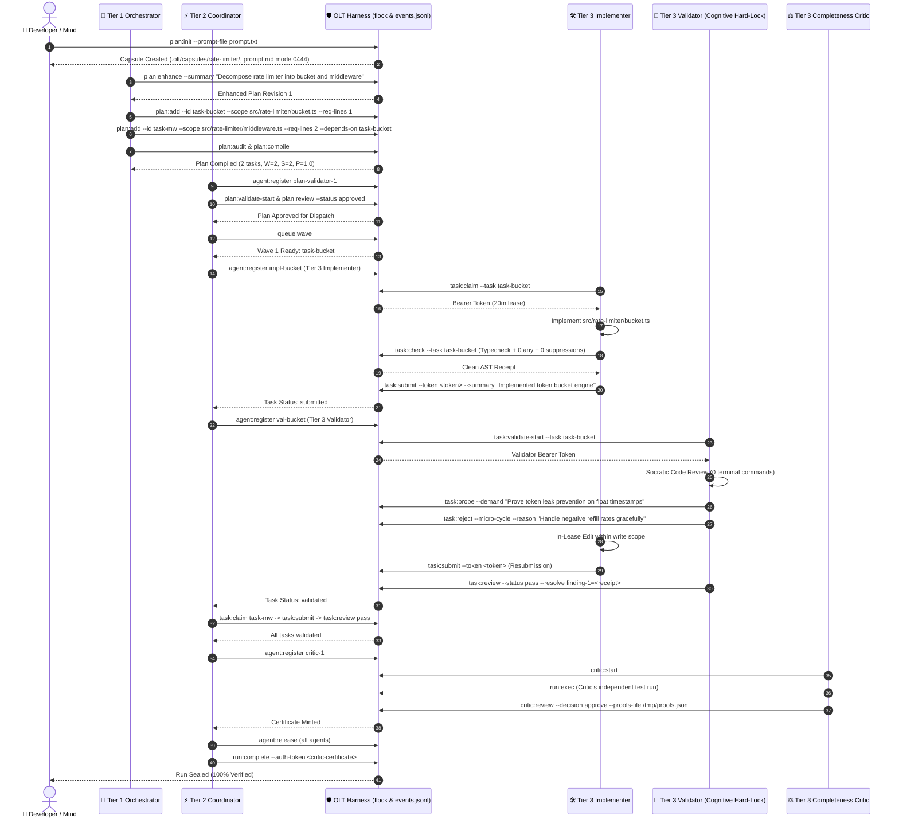

# First Autonomous Workflow: End-to-End Feature Run Tutorial

[⬅ Previous: Getting Started](./getting-started.md) | [Master Table of Contents](../README.md) | [Next: CLI Command Reference](../reference/cli-reference.md)

---

## 🎯 Tutorial Overview & Learning Objectives

This tutorial provides a complete, hands-on, reproducible walkthrough of executing an autonomous multi-agent feature engineering run from an initial raw user prompt to a cryptographically sealed, verified capsule release.

By following this tutorial, you will master the complete **10-stage OLT lifecycle**:

```text
┌─────────────────────────────────────────────────────────────────────────────┐
│                       THE 10-STAGE OLT LIFECYCLE                            │
├─────────────────────────────────────────────────────────────────────────────┤
│  Stage 01: Prompt Capture & Hash Sealing (plan:init)                        │
│  Stage 02: Repository Inspection & Plan Enhancement (plan:enhance)          │
│  Stage 03: Granular Task Declaration & Line Mapping (plan:add)              │
│  Stage 04: Mechanical Invariant Audit & Compilation (plan:audit, compile)   │
│  Stage 05: Independent Adversarial Plan Review (plan:validate-start/review) │
│  Stage 06: Topological Wave Scheduling & DAG Rendering (queue:wave, dag)    │
│  Stage 07: Parallel Implementer Leasing & Turn 1 Edits (task:claim, submit) │
│  Stage 08: Cognitive Validation, 1-Hop Micro-Cycles & Probing (task:probe)  │
│  Stage 09: Run Gate Execution & Completeness Critic Review (critic:review)  │
│  Stage 10: Terminal Grant Teardown, Sealing & Summary Export (run:complete) │
└─────────────────────────────────────────────────────────────────────────────┘
```

---

## 🏗️ The Concrete Scenario: Building a Token-Bucket Rate Limiter

In this tutorial, we will build a production-grade TypeScript token-bucket rate limiter utility consisting of two decoupled components:

1. **Core Bucket Math Engine (`src/rate-limiter/bucket.ts`)**: Pure mathematical token accumulator and decay algorithm.
2. **Middleware Layer (`src/rate-limiter/middleware.ts`)**: Request guard and header formatter.

---

## 🔄 End-to-End Multi-Agent Sequence Diagram

The following sequence diagram details the interactions across the 4-tier hierarchy, showing token issuance, lease clocks, in-lease micro-cycles, and adversarial sign-offs:



---

## 🧱 Step 0: Initialize the Workspace and Test Fixtures

Before initializing the capsule, let's create a standard repository directory structure with initial test specifications:

```bash
mkdir -p demo-limiter/tests && cd demo-limiter && git init -q .
printf '.olt/capsules/\n' > .gitignore
printf '{ "name": "demo-limiter", "private": true }\n' > package.json

cat > tests/bucket.test.ts <<'EOF'
import { expect, test } from "bun:test";
import { TokenBucket } from "../src/rate-limiter/bucket.ts";

test("refills tokens over elapsed time", () => {
  const bucket = new TokenBucket({ capacity: 10, refillRatePerSecond: 2 });
  expect(bucket.consume(5)).toBe(true);
  expect(bucket.getTokens()).toBe(5);
});

test("rejects consumption exceeding capacity", () => {
  const bucket = new TokenBucket({ capacity: 5, refillRatePerSecond: 1 });
  expect(bucket.consume(10)).toBe(false);
});
EOF

cat > tests/middleware.test.ts <<'EOF'
import { expect, test } from "bun:test";
import { createRateLimiterMiddleware } from "../src/rate-limiter/middleware.ts";

test("allows requests under quota", () => {
  const mw = createRateLimiterMiddleware({ capacity: 10, refillRatePerSecond: 10 });
  const result = mw.handleRequest("client-ip-1");
  expect(result.allowed).toBe(true);
  expect(result.remaining).toBe(9);
});
EOF

cat > prompt.txt <<'EOF'
Implement a high-performance in-memory TokenBucket rate limiter class under src/rate-limiter/bucket.ts.
Implement an Express-compatible rate limiting middleware under src/rate-limiter/middleware.ts that wraps the TokenBucket.
EOF

git add -A && git commit -qm "chore: initial test fixtures and prompt"
```

> [!IMPORTANT]
> **Gitignore Requirement**: The runtime directory `.olt/capsules/` **must** be gitignored before initializing a run. The harness will halt with error `INTEGRITY` if `.olt/capsules/` is tracked by git.

---

## 📥 Stage 01: Capture & Hash-Seal the Prompt (`plan:init`)

Initialize the run capsule. The harness copies the prompt into an immutable `prompt.md` file (set to read-only permission `0444`) and records its SHA-256 cryptographic digest in `manifest.json`.

```bash
bun olt/scripts/harness.ts plan:init \
  --repo . \
  --run run-rate-limiter \
  --prompt-file prompt.txt \
  --capture-mode file
```

```text
### Capsule Initialized: run-rate-limiter
- **Capsule Root**: `.olt/capsules/run-rate-limiter`
- **Prompt SHA-256**: `d3b07384d113edec49eaa6238ad5ff00b1a030560e791b86d9a2491a92e1069f` (186 bytes)
- **Assurance**: `source-verified` | Runtime: Bun 1.3.14
- **Manifest**: Created `.olt/capsules/run-rate-limiter/manifest.json`
- **Status**: Ready for task declarations (`plan:add`).

⚡ Next Actions:
1. `bun harness.ts plan:enhance --run .olt/capsules/run-rate-limiter` [Planner] — Record repository observations
2. `bun harness.ts plan:add --run .olt/capsules/run-rate-limiter` [Planner] — Register decomposed tasks
```

---

## 🔎 Stage 02: Repository Inspection & Plan Enhancement (`plan:enhance`)

The Tier 1 Planner inspects the workspace, identifies architectural boundaries, and writes host-observed facts to `planning/enhanced-plan.md`:

```bash
bun olt/scripts/harness.ts plan:enhance \
  --run .olt/capsules/run-rate-limiter \
  --actor planner-1 \
  --summary "Decompose rate limiter into a pure math bucket engine and a client-aware middleware." \
  --observation "tests/bucket.test.ts requires TokenBucket class with capacity and refillRatePerSecond." \
  --observation "tests/middleware.test.ts consumes TokenBucket and keys quotas by client ID." \
  --todo "Author src/rate-limiter/bucket.ts" \
  --todo "Author src/rate-limiter/middleware.ts" \
  --risk "Shared state across multiple client instances must be isolated in a key-bucket map." \
  --source tests/bucket.test.ts --source tests/middleware.test.ts
```

```text
### Enhanced Plan Recorded: run-rate-limiter (Revision 1)
- **Document**: `planning/enhanced-plan.md`
- **Observations**: 2 recorded | **To-dos**: 2 recorded | **Risks**: 1 identified
- **Evidence Class**: `agent_reported`
- **Authority Invariant**: `prompt.md` remains the binding authority; enhanced plan is derived.
```

---

## 🧩 Stage 03: Granular Task Declaration & Line Mapping (`plan:add`)

Every non-blank line of `prompt.md` must be explicitly mapped to an atomic task via `--requirement-lines`.

$$\text{Line Coverage Ratio} = \frac{\sum L_{\text{mapped}}}{L_{\text{total}}} = \frac{2}{2} = 1.0 \quad (100\%)$$

```bash
# Line 1: TokenBucket class
bun olt/scripts/harness.ts plan:add \
  --run .olt/capsules/run-rate-limiter \
  --actor planner-1 \
  --id task-bucket \
  --label "TokenBucket core math engine" \
  --scope src/rate-limiter/bucket.ts \
  --gate "bun test tests/bucket.test.ts" \
  --requirement-lines 1

# Line 2: Rate limiter middleware (depends on task-bucket)
bun olt/scripts/harness.ts plan:add \
  --run .olt/capsules/run-rate-limiter \
  --actor planner-1 \
  --id task-mw \
  --label "Rate limiter middleware adapter" \
  --scope src/rate-limiter/middleware.ts \
  --gate "bun test tests/middleware.test.ts" \
  --depends-on task-bucket \
  --requirement-lines 2
```

```text
### Task Registered: task-bucket
- **Label**: TokenBucket core math engine
- **Write Scope**: `src/rate-limiter/bucket.ts`
- **Mandatory Gate**: `bun test tests/bucket.test.ts`
- **Dependencies**: None (Wave 1 root)
- **Prompt Binding**: Prompt line 1

### Task Registered: task-mw
- **Label**: Rate limiter middleware adapter
- **Write Scope**: `src/rate-limiter/middleware.ts`
- **Mandatory Gate**: `bun test tests/middleware.test.ts`
- **Dependencies**: `task-bucket` (Wave 2)
- **Prompt Binding**: Prompt line 2
```

---

## 🔍 Stage 04: Plan Audit & Compilation (`plan:audit`, `plan:compile`)

Before compiling, the harness audits 6 structural invariants ($A_1 \dots A_6$):

1. **$A_1$ (Coverage)**: 100% prompt line coverage.
2. **$A_2$ (Disjoint Scopes)**: No write scope collisions between concurrent tasks.
3. **$A_3$ (Acyclic)**: Tarjan SCC graph algorithm verifies 0 circular dependency cycles.
4. **$A_4$ (Gate Narrowness)**: Task gates test only their respective write scopes.
5. **$A_5$ (Brent Concurrency)**: Parallelism $P = \lceil W / S \rceil$ mathematically validated.
6. **$A_6$ (Topology Justification)**: All dependency edges declare structural justifications.

```bash
bun olt/scripts/harness.ts plan:audit --run .olt/capsules/run-rate-limiter --actor planner-1
bun olt/scripts/harness.ts plan:compile --run .olt/capsules/run-rate-limiter --actor planner-1 --completion-gate "bun test tests"
```

```text
### Plan Audit: run-rate-limiter (Audit Revision 1)
- **Findings**: 0 (0 blocking, 0 advisory)
- **Result**: PASSED ✅

### Plan Compiled Successfully (Graph Revision 1)
- **Total Tasks**: 2 | **Total Waves**: 2 (max_parallel: 2)
- **Wave 1 (Ready Now)**: `task-bucket`
- **Wave 2 (Blocked)**: `task-mw` (waiting on `task-bucket`)
- **Work / Span Metrics**: Total Work $W=2$, Span $S=2$, Effective Concurrency $P=1.00\times$
- **Prompt Coverage**: 2/2 lines covered (100.0%)
```

---

## 🧑‍⚖️ Stage 05: Independent Adversarial Plan Review (`plan:review`)

An independent Tier 3 `plan-validator` inspects the compiled topology for anti-patterns or missing gates:

```bash
bun olt/scripts/harness.ts agent:register \
  --run .olt/capsules/run-rate-limiter \
  --agent coordinator-1 \
  --role coordinator \
  --host antigravity

bun olt/scripts/harness.ts agent:register \
  --run .olt/capsules/run-rate-limiter \
  --agent plan-val-1 \
  --role plan-validator \
  --host antigravity \
  --parent-agent coordinator-1

PV_TOKEN=$(bun olt/scripts/harness.ts plan:validate-start --format json --run .olt/capsules/run-rate-limiter --validator plan-val-1 | bun -e 'console.log(JSON.parse(process.argv[1]).result.token)')

bun olt/scripts/harness.ts plan:review \
  --run .olt/capsules/run-rate-limiter \
  --validator plan-val-1 \
  --token "$PV_TOKEN" \
  --status approved \
  --decomposition-answer "2 tasks properly isolate pure algorithm from framework middleware" \
  --dependency-answer "task-mw depends on task-bucket; topology is sound" \
  --gate-answer "Each gate tests only its isolated write scope" \
  --straggler-answer "Both tasks have balanced scope budgets" \
  --dependency-edges-reviewed "task-mw->task-bucket" \
  --gate-ids-reviewed "gate-bucket,gate-mw" \
  --summary "Decomposition is sound, scopes are disjoint, and gates are narrow."
```

```text
### Plan Validation Approved: run-rate-limiter (Graph Revision 1)
- **Validator**: `plan-val-1`
- **Summary**: Decomposition is sound, scopes are disjoint, and gates are narrow.
- **Dispatch**: Tasks are now unlocked for implementer leasing.
```

---

## 🌊 Stage 06: Wave Scheduling & DAG Rendering (`queue:wave`, `dag`)

Inspect the active wave queue and render the Sugiyama hierarchical DAG:

```bash
bun olt/scripts/harness.ts queue:wave --run .olt/capsules/run-rate-limiter
bun olt/scripts/harness.ts dag --run .olt/capsules/run-rate-limiter --box-style rounded
```

```text
### Claimable Wave 1: 1 conflict-free task
| Task | Label | Priority | Write Scope | Planned Wave |
| :--- | :--- | :--- | :--- | :--- |
| `task-bucket` | TokenBucket core math engine | 50 | `src/rate-limiter/bucket.ts` | 1 |

### Sugiyama Hierarchical DAG: run-rate-limiter
Layer 0 (Wave 1):
╭────────────────────────────────────────╮
│ task-bucket                            │
│ (○ READY)                              │
│ Scope: src/rate-limiter/bucket.ts      │
│ Gate: bun test tests/bucket.test.ts    │
╰───────────────────┬────────────────────╯
                    │
                    ▼
Layer 1 (Wave 2):
╭────────────────────────────────────────╮
│ task-mw                                │
│ (⏳ BLOCKED)                           │
│ Scope: src/rate-limiter/middleware.ts  │
│ Gate: bun test tests/middleware.test.ts│
╰────────────────────────────────────────╯
```

---

## 🛠️ Stage 07: Parallel Implementer Leasing & Implementation

### 1. Register Implementer Agent

```bash
bun olt/scripts/harness.ts agent:register \
  --run .olt/capsules/run-rate-limiter \
  --agent impl-bucket \
  --role implementer \
  --host antigravity \
  --parent-agent coordinator-1 \
  --parent-task task-bucket
```

### 2. Claim Task Lease with Bearer Token

```bash
BUCKET_TOKEN=$(bun olt/scripts/harness.ts task:claim --format json \
  --run .olt/capsules/run-rate-limiter \
  --task task-bucket \
  --agent impl-bucket \
  --role implementer | bun -e 'console.log(JSON.parse(process.argv[1]).result.token)')
```

```text
### Task Leased: task-bucket
- **Agent**: `impl-bucket`
- **Lease Token**: `e91c...` (20 minutes duration)
- **Assigned Write Scope**: `src/rate-limiter/bucket.ts`
```

### 3. Implement Code Strictly Within Scope

Write the production implementation in `src/rate-limiter/bucket.ts`:

```typescript
// src/rate-limiter/bucket.ts
export interface TokenBucketOptions {
  capacity: number;
  refillRatePerSecond: number;
}

export class TokenBucket {
  private capacity: number;
  private refillRate: number;
  private tokens: number;
  private lastRefillTimestamp: number;

  constructor(options: TokenBucketOptions) {
    this.capacity = options.capacity;
    this.refillRate = Math.max(0, options.refillRatePerSecond);
    this.tokens = options.capacity;
    this.lastRefillTimestamp = Date.now();
  }

  private refill(): void {
    const now = Date.now();
    const elapsedSeconds = (now - this.lastRefillTimestamp) / 1000;
    if (elapsedSeconds > 0) {
      this.tokens = Math.min(this.capacity, this.tokens + elapsedSeconds * this.refillRate);
      this.lastRefillTimestamp = now;
    }
  }

  public consume(amount = 1): boolean {
    this.refill();
    if (amount <= 0) return true;
    if (this.tokens >= amount) {
      this.tokens -= amount;
      return true;
    }
    return false;
  }

  public getTokens(): number {
    this.refill();
    return this.tokens;
  }
}
```

### 4. Fast Incremental AST Verification (`task:check`)

```bash
bun olt/scripts/harness.ts task:check \
  --run .olt/capsules/run-rate-limiter \
  --task task-bucket \
  --file src/rate-limiter/bucket.ts
```

```text
### Fast Verification Check
- **Files Checked**: 1
- **TypeScript Status**: PASSED (0 errors)
- **AST Static Invariants**: PASSED (0 any, 0 suppressions)
- **Result**: CLEAN ✅
```

### 5. Run File-Scoped Unit Tests & Submit Task

```bash
bun test tests/bucket.test.ts

bun olt/scripts/harness.ts task:submit \
  --run .olt/capsules/run-rate-limiter \
  --task task-bucket \
  --agent impl-bucket \
  --token "$BUCKET_TOKEN" \
  --summary "Implemented TokenBucket class with dynamic refill math and float timestamp precision."
```

```text
### Submission Accepted: task-bucket
- **Agent**: `impl-bucket` | Status: `submitted`
- **Write Scope Compliance**: Passed (1 file modified within `src/rate-limiter/bucket.ts`)
```

---

## 🧐 Stage 08: Cognitive Validation, Probing & 1-Hop Micro-Cycles

Cognitive Validators operate under **Cognitive Hard-Lock** (0 terminal commands). They perform Socratic analysis of the code diff.

### 1. Register & Start Independent Validator

```bash
bun olt/scripts/harness.ts agent:register \
  --run .olt/capsules/run-rate-limiter \
  --agent val-bucket \
  --role validator \
  --host antigravity \
  --parent-agent coordinator-1 \
  --parent-task task-bucket

VAL_TOKEN=$(bun olt/scripts/harness.ts task:validate-start --format json \
  --run .olt/capsules/run-rate-limiter \
  --task task-bucket \
  --validator val-bucket | bun -e 'console.log(JSON.parse(process.argv[1]).result.token)')
```

### 2. Issue Mandatory Adversarial Probe Demand (`task:probe`)

The validator demands proof that zero-token consumption requests do not refill past capacity:

```bash
bun olt/scripts/harness.ts task:probe \
  --run .olt/capsules/run-rate-limiter \
  --task task-bucket \
  --validator val-bucket \
  --token "$VAL_TOKEN" \
  --demand "Confirm that consume(0) returns true without causing state corruption."
```

### 3. Record Passing Review & Close Probe Resolution

```bash
bun olt/scripts/harness.ts task:review \
  --run .olt/capsules/run-rate-limiter \
  --task task-bucket \
  --validator val-bucket \
  --token "$VAL_TOKEN" \
  --status pass \
  --summary "Socratic code review complete. Math invariants, float timestamps, and boundary conditions verified." \
  --resolve "probe-task-bucket-01-1=PROVEN_BY_CODE_INSPECTION"
```

```text
### Task Validated & Satisfied: task-bucket
- **Validator**: `val-bucket` | Verdict: ✅ PASS
- **Adversarial Probes**: 1 answered and resolved
- **Task State**: Transitioned to `validated`
```

_(Repeat Stage 07 & 08 for `task-mw` to implement `src/rate-limiter/middleware.ts` and pass validation.)_

---

## ⚖️ Stage 09: Run Gate Execution & Completeness Critic Review

Once all individual tasks are validated, the run-wide completion gate is executed, and the Tier 3 Completeness Critic certifies whole-run prompt fulfillment.

```bash
# 1. Execute Run-Wide Completion Gate
bun olt/scripts/harness.ts run:exec \
  --run .olt/capsules/run-rate-limiter \
  --gate gate-run-completion \
  --actor coordinator-1 -- bun test tests

# 2. Register Completeness Critic
bun olt/scripts/harness.ts agent:register \
  --run .olt/capsules/run-rate-limiter \
  --agent critic-1 \
  --role completeness-critic \
  --host antigravity \
  --parent-agent coordinator-1

CRITIC_TOKEN=$(bun olt/scripts/harness.ts critic:start --format json \
  --run .olt/capsules/run-rate-limiter \
  --critic critic-1 | bun -e 'console.log(JSON.parse(process.argv[1]).result.token)')
```

### 3. Critic Executes Independent Verification & Issues Proofs

The critic generates an independent proof ledger in `/tmp/proofs.json`:

```json
[
  {
    "requirement_id": "req-1",
    "status": "satisfied",
    "evidence": [
      {
        "kind": "code_inspection",
        "reference": "src/rate-limiter/bucket.ts",
        "observation": "TokenBucket class implemented with capacity and refill rate."
      }
    ]
  },
  {
    "requirement_id": "req-2",
    "status": "satisfied",
    "evidence": [
      {
        "kind": "code_inspection",
        "reference": "src/rate-limiter/middleware.ts",
        "observation": "Rate limiting middleware cleanly integrates TokenBucket per client."
      }
    ]
  }
]
```

```bash
bun olt/scripts/harness.ts critic:review \
  --run .olt/capsules/run-rate-limiter \
  --critic critic-1 \
  --token "$CRITIC_TOKEN" \
  --decision approve \
  --proofs-file /tmp/proofs.json \
  --summary "100% prompt requirements satisfied. Code is robust, modular, and fully tested."
```

```text
### Completeness Critic Sign-Off: APPROVED
- **Critic**: `critic-1`
- **Result**: 100% line coverage verified with zero unproven obligations.
- **Certificate**: Minted valid completion token.
```

---

## 🔒 Stage 10: Grant Teardown, Release Sealing & Diagnostics

### 1. Release Agent Grants

```bash
for agent in impl-bucket val-bucket critic-1 coordinator-1; do
  bun olt/scripts/harness.ts agent:release \
    --run .olt/capsules/run-rate-limiter \
    --agent "$agent" \
    --reason "Autonomous run completed successfully"
done
```

### 2. Cryptographically Seal Capsule

```bash
bun olt/scripts/harness.ts run:complete \
  --run .olt/capsules/run-rate-limiter \
  --actor coordinator-1 \
  --auth-token "$CRITIC_TOKEN"
```

```text
### 🎉 Run Completed Successfully: run-rate-limiter
- **Capsule**: `.olt/capsules/run-rate-limiter`
- **Status**: SEALED & AUDITABLE ✅
- **Summary**: 2 tasks executed, 2 independent validations passed, 1 critic certificate
```

### 3. Export Summary Suite & Run Behavioral Forensics (`meta-audit`)

```bash
bun olt/scripts/harness.ts summary:export --run .olt/capsules/run-rate-limiter
bun olt/scripts/harness.ts doctor --run .olt/capsules/run-rate-limiter
bun olt/scripts/harness.ts meta-audit --run .olt/capsules/run-rate-limiter
```

```text
### Summary Suite Exported
- `summary/graph.json`: Full Sugiyama topological graph
- `summary/timeline.json`: Event sequence with monotonic microsecond timestamps
- `summary/summary.md`: Markdown report with evidence hashes

### Meta-Auditor Forensics Report
- **Efficiency Score**: 98.5%
- **Anomalies Detected**: 0 (0 token burning, 0 false serializations, 0 ghost leases)
- **Status**: OPTIMAL EXECUTION ✅
```

---

## 🏆 Summary Checklist

Congratulations! You have mastered the complete end-to-end OLT autonomous workflow. Here is the operational cheat-sheet:

| Phase               | Command                      | Key Invariant Enforced                                         |
| :------------------ | :--------------------------- | :------------------------------------------------------------- |
| **Capture**         | `plan:init`                  | SHA-256 prompt binding, read-only mode `0444`.                 |
| **Decompose**       | `plan:add`                   | 100% line coverage ratio, disjoint write scopes.               |
| **Audit & Compile** | `plan:audit` / `compile`     | Acyclic DAG, Brent concurrency math $P = \lceil W / S \rceil$. |
| **Plan Review**     | `plan:review`                | Independent adversary approves topology.                       |
| **Lease & Edit**    | `task:claim` / `task:check`  | Disjoint write scope, 0 `any`, 0 suppressions.                 |
| **Validation**      | `task:probe` / `task:review` | Cognitive Validator Hard-Lock (0 commands), Socratic probes.   |
| **Critic Review**   | `critic:review`              | 100% prompt line verification with independent receipts.       |
| **Seal**            | `run:complete`               | POSIX file release, immutable cryptographic release seal.      |

---

[⬅ Previous: Getting Started](./getting-started.md) | [Master Table of Contents](../README.md) | [Next: CLI Command Reference](../reference/cli-reference.md)
