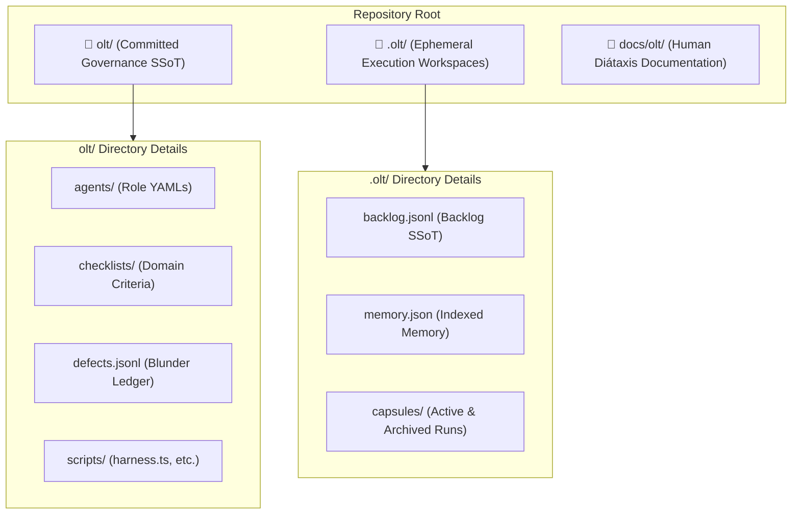
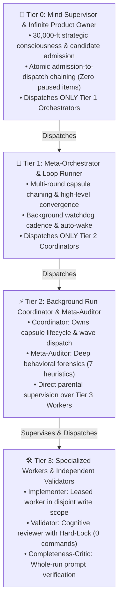

# Getting Started with OLT: Beginner Onboarding Guide

[Master Table of Contents](../README.md) | [Next: First Autonomous Workflow ➡](./first-autonomous-workflow.md)

---

## 🎯 Welcome & Learning Objectives

Welcome to **OLT (Orchestrating Long Tasks)** — the open, deterministic, multi-agent orchestration harness designed for complex, long-horizon software engineering tasks.

Standard AI coding assistants excel at small, localized edits. However, when faced with large, multi-file features or multi-phase refactors, unstructured LLM agents routinely succumb to **context saturation, prompt amnesia, uncoordinated write collisions, and sycophantic self-grading**.

OLT solves this by replacing fragile chat conversations with **cryptographic event logs, kernel POSIX file locks, topological graph scheduling, strict disjoint write scopes, and independent adversarial validation**.

```text
┌─────────────────────────────────────────────────────────────────────────────┐
│                           WHAT YOU WILL LEARN TODAY                         │
├─────────────────────────────────────────────────────────────────────────────┤
│  1. System Prerequisites & Environment Verification (Bun 1.3+, Git)         │
│  2. Dual-Layer Storage Architecture (Persistent olt/ vs Ephemeral .olt/)   │
│  3. The 4-Tier Hierarchy & 5 Golden Roles (Mind, Orchestrator, etc.)        │
│  4. Core Operational Axioms (Zero-JSON CLI, Disjoint Write Scopes)          │
│  5. Running Fast System Diagnostics with doctor                             │
│  6. Next Steps: Launching your first autonomous multi-agent run             │
└─────────────────────────────────────────────────────────────────────────────┘
```

---

## ⚙️ Prerequisites & Environment Setup

OLT is engineered to be **100% host-agnostic and zero-dependency**. It runs directly against modern JavaScript/TypeScript runtimes without requiring external package managers or complex runtime compilation.

### Minimum System Requirements

| Component            | Minimum Required Version                    | Purpose                                                                    |
| :------------------- | :------------------------------------------ | :------------------------------------------------------------------------- |
| **Bun Runtime**      | `v1.3.0+` (Recommended: `v1.3.14+`)         | Fast, native execution engine for harness scripts and test suites          |
| **Git**              | `v2.30.0+`                                  | Version control, workspace branch management, and scope hashing            |
| **AI Host Runtime**  | Antigravity / Claude Code / Codex / Generic | Multi-agent execution host running LLM reasoning loops                     |
| **Operating System** | macOS, Linux, or WSL2                       | POSIX compliance for kernel-level `flock` and atomic filesystem operations |

### 1. Verify Your Bun Installation

Open your terminal and confirm that Bun is installed and meets version requirements:

```bash
bun --version
```

```text
1.3.14
```

> [!TIP]
> If Bun is not installed on your system, install it via the official installer:
>
> ```bash
> curl -fsSL https://bun.sh/install | bash
> ```

### 2. Verify Repository Working Tree

OLT operates directly within any standard Git repository. Ensure your working tree is initialized:

```bash
git status
```

```text
On branch main
Your branch is up to date with 'origin/main'.
nothing to commit, working tree clean
```

---

## 🗂️ Zero-Config Architecture & Directory Layout

OLT strictly separates **permanent, repository-wide governance metadata** from **ephemeral, crash-resilient runtime execution capsules**.



### 1. Permanent Governance Layer (`olt/`)

This directory is committed to version control and contains the rules, role contracts, checklists, and error databases that govern all agent behavior across generations:

```text
olt/
├── agents/                       # Canonical YAML role manifests (Mind, Orchestrator, etc.)
│   ├── mind.yaml                 # Tier 0 Product Owner manifest & charter
│   ├── orchestrator.yaml         # Tier 1 Meta-Orchestrator manifest
│   ├── coordinator.yaml          # Tier 2 Wave Coordinator manifest
│   ├── implementer.yaml          # Tier 3 Implementer contract
│   ├── validator.yaml            # Tier 3 Cognitive Validator contract
│   ├── completeness-critic.yaml  # Tier 3 Prompt Critic contract
│   └── meta-auditor.yaml         # Tier 2 Forensics Auditor contract
├── checklists/                   # Standing domain validation checklists
│   ├── code-quality.md           # AST, zero-any, modularity criteria
│   ├── product.md                # Prompt requirement fulfillment criteria
│   ├── security.md               # Secret hygiene & path containment criteria
│   ├── system-design.md          # Architectural boundary criteria
│   └── ui-design.md              # Visual fidelity & APCA contrast criteria
├── defects.jsonl                 # Active blunder registry & regression trackers
├── completed-blunders.jsonl      # 46 verified blunder remediations (permanent immunity)
└── scripts/                      # Harness entrypoints & diagnostic scripts
    └── harness.ts                # Master CLI dispatch engine
```

### 2. Ephemeral Runtime Capsule Layer (`.olt/`)

This directory is automatically created and **gitignored** (`.gitignore` entry: `.olt/capsules/`). It houses the mutable state of active and archived runs:

```text
.olt/
├── backlog.jsonl                 # Canonical Mind product queue
├── memory.json                   # Cross-generational semantic memory index
└── capsules/                     # Run capsules (isolated by slug)
    └── 35-comprehensive-docs/    # Example capsule run
        ├── prompt.md             # Read-only byte-exact prompt (mode 0444)
        ├── manifest.json         # SHA-256 capture hash & environment pin
        ├── events.jsonl          # Tamper-proof append-only cryptographic event chain
        ├── state.json            # Deterministic materialized projection
        ├── planning/             # Requirements decomposition & DAG graph
        ├── evidence/             # Content-addressed deduplicated tool logs
        └── summary/              # Exported completion suite (summary.md, graph.json)
```

> [!IMPORTANT]
> **Zero-Scratch Invariant**: Agents and users must never create temporary or scratch files in the repository root. All temporary data belongs strictly inside the respective `.olt/capsules/<run-id>/` directory or OS `/tmp/`.

---

## 👥 The 4-Tier Multi-Agent Hierarchy

To eliminate context pollution, prevent cognitive anchoring, and ensure deterministic long-task execution, OLT organizes agents into an authoritative **4-Tier Workforce Hierarchy**:



### The 5 Golden Roles

| Role               |  Tier  | Authority & Primary Duty                                                                                               | Non-Negotiable Prohibitions (`must_not`)                                                               |
| :----------------- | :----: | :--------------------------------------------------------------------------------------------------------------------- | :----------------------------------------------------------------------------------------------------- |
| **`mind`**         | Tier 0 | Strategic backlog governance, candidate admission, atomic dispatch chaining, non-idle autonomous discovery.            | **Must not** write code, run unit tests, or bypass tiers to spawn Tier 2/3 directly.                   |
| **`orchestrator`** | Tier 1 | Multi-round orchestration, capsule chaining, convergence governance, watchdog monitoring.                              | **Must not** implement tasks directly, run raw test suites, or spawn Tier 3 workers directly.          |
| **`coordinator`**  | Tier 2 | Run lifecycle management, 1-shot exact-anchor briefings (`task:brief`), wave scheduling, Git sync.                     | **Must not** write source code, claim leases, or assign unit test commands to Cognitive Validators.    |
| **`implementer`**  | Tier 3 | Leased execution strictly inside `task.write_scope`, Turn 1 exact edits, file-scoped unit testing (`bun test <path>`). | **Must not** edit outside write scope, self-validate work, or run whole-repo test suites (`bun test`). |
| **`validator`**    | Tier 3 | Cognitive verification, adversarial probing (`task:probe`), 1-hop micro-cycle critique, Socratic analysis.             | **Cognitive Hard-Lock**: Must execute ZERO terminal commands (0 `run:exec`, 0 tests, 0 build tools).   |

### Specialized Support Roles

- **`completeness-critic` (Tier 3)**: Independent reviewer validating that 100% of the raw `prompt.md` lines are satisfied by the final repository diff before the capsule can be sealed.
- **`meta-auditor` (Tier 2)**: Deep behavioral forensics auditor scanning `events.jsonl` traces post-wave and post-run against 7 behavioral heuristics (`TOKEN_BURNING`, `FALSE_SERIALIZATION`, `ROLE_BOUNDARY_DEVIATION`, `POLLING_WASTE`, `CONTEXT_OVERFLOW`, `GHOST_LEASE`, `STRAGGLER`), computing deterministic efficiency scores ($0.0\% - 100.0\%$).

---

## 🛡️ Core Operational Axioms & Invariants

Every agent and human interacting with OLT is bounded by three fundamental operational axioms:

### 1. "Prose is Not State, Memory is Not Proof"

Conversational affirmations (e.g., _"I tested the auth module and it works perfectly!"_) carry **zero authoritative weight**. The harness recognizes only:

- Cryptographic SHA-256 hash chains in `events.jsonl`.
- Verified process exit codes (`0`) in structured execution receipts.
- Static AST validation receipts with 0 `any` annotations and 0 compiler suppressions (`task:check`).
- Independent validator sign-offs accompanied by adversarial probe resolutions (`task:review --status pass --resolve ...`).

### 2. Disjoint Write-Scope Leases

When multiple parallel implementers work simultaneously, each is leased an **explicit, mutually disjoint write scope** (e.g., `src/auth` vs `src/billing`). Modifying, formatting, or deleting any file outside the assigned write scope is a critical security and integrity violation (`PATH_SAFETY`).

### 3. Cognitive Validator Hard-Lock

To eliminate sycophancy and biased testing, Cognitive Validators are **mechanically locked out of terminal execution**. Validators focus 100% of their attention on adversarial code reading, diff inspection, and Socratic questioning. Implementers own 100% of test execution, and type checking is verified deterministically via `task:check`.

---

## 🩺 Step-by-Step Diagnostic Check: `doctor`

Before launching an autonomous run, verify repository health and harness integrity using the built-in diagnostic tool.

### 1. Run Global Health Doctor

Execute the global doctor to verify system prerequisites, git status, and role configurations:

```bash
bun olt/scripts/harness.ts doctor --help
```

```text
### `doctor`

Capsule doctor.

Check the capsule.

- **Domain**: doctor
- **Tier**: primary
- **Aliases**: none

| Flag | Type | Required | Default | Description |
| :--- | :--- | :--- | :--- | :--- |
| `--run` | string | yes | - | Capsule run root. |
```

### 2. Run Doctor Against an Active Run Capsule

When a capsule is active, run `doctor` to perform deep structural validation:

```bash
bun olt/scripts/harness.ts doctor --run .olt/capsules/35-comprehensive-olt-documentation-overhaul
```

```text
### Capsule Doctor: `.olt/capsules/35-comprehensive-olt-documentation-overhaul`
- **Healthy**: YES ✅
- **Bun**: 1.3.14 (supported)
- **Gitignored**: yes
- **Supervisory Invariants**: Strict Tier Hierarchy & Supervisor Zero-File-Edit Rule actively enforced
- **Git Preservation**: Zero-Destructive Git Invariant & User Edit Preservation actively enforced
- **Issues**: 0
```

### 3. Fast Incremental Invariant Audit: `task:check`

Implementers and coordinators can instantly audit any source file for TypeScript type errors, `any` leaks, and `@ts-ignore` suppressions using `task:check`:

```bash
bun olt/scripts/harness.ts task:check --file docs/olt/README.md
```

```text
### Fast Verification Check
- **Files Checked**: 1
- **TypeScript Status**: PASSED (0 errors)
- **AST Static Invariants**: PASSED (0 any, 0 suppressions)
- **Result**: CLEAN ✅
```

---

## 🗺️ Diátaxis Documentation Navigation Hub

This guide is part of the Diátaxis Documentation Suite for OLT. Explore other sections based on your current objective:

```text
┌─────────────────────────────────────────────────────────────────────────────┐
│                    THE DIÁTAXIS DOCUMENTATION FRAMEWORK                     │
├──────────────────────────────────────────────┬──────────────────────────────┤
│               PRACTICAL GOALS                │      THEORETICAL CONCEPTS    │
├──────────────────────────────────────────────┼──────────────────────────────┤
│  LEARNING-ORIENTED:                          │  UNDERSTANDING-ORIENTED:     │
│  [ TUTORIALS ] (You are here)                │  [ ARCHITECTURE EXPLANATION ]│
│  • Getting Started (This Guide)              │  • Why Long Tasks Fail       │
│  • First Autonomous Workflow                 │  • Brent Work/Span Math      │
│                                              │  • 7-Heuristic Forensics     │
├──────────────────────────────────────────────┼──────────────────────────────┤
│  PROBLEM-ORIENTED:                           │  INFORMATION-ORIENTED:       │
│  [ HOW-TO GUIDES ]                           │  [ REFERENCE MANUALS ]       │
│  • CLI Harness Operations Guide              │  • Harness CLI Reference     │
│  • Candidate Admission Workflow              │  • State & Event Schemas     │
│  • Authoring Custom Validators               │  • Role Manifest Contracts   │
└──────────────────────────────────────────────┴──────────────────────────────┘
```

---

## 🚀 Next Steps

Now that your environment is configured and you understand the core 4-tier mental model, proceed to the step-by-step hands-on tutorial:

👉 **[Proceed to Tutorial 02: Your First Autonomous Workflow ➡](./first-autonomous-workflow.md)**
