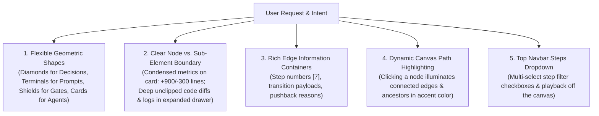

# Creative Vision, Philosophy & User Intent

**Document**: `01-creative-vision-and-user-intent.md`  
**Status**: Authoritative Planning Specification (Part 1 of 5)  
**Workspaces**: `skills` (`orchestrating-long-tasks`) & `gvui` (`graph-visualizer-ui`)  
**Line Bound**: Strictly $\le 500$ lines

---

## 1. The Creative Mandate: Autonomy, Taste & Visual Excellence

This project is **not** a rigid, literal compliance exercise. It is a **creative, high-taste engineering and UI/UX design mission**.

The goal is to transform **GVUI** into a living, visually compelling, dark-mode observability platform that feels like an authentic mission control for complex multi-agent systems.

### Core Philosophy:
1. **Visual Distinction by Nature**: When you look at an element on the canvas, its shape, geometry, typography, and internal structure immediately tell you what it is (an Agent, a Tool, a User Instruction, a Gate Checkpoint, or a Decision Diamond).
2. **High-Signal Condensed Cards vs Deep Expanded Details**: Cards on the canvas show high-signal summary metrics (e.g., `+900, -300 lines`, `2 tools (142ms)`, `Step 4`). Clicking a node opens the expanded drawer with the exhaustive, unclipped details (file tree, syntax-highlighted diffs, terminal stdout/stderr logs, full I/O payloads).
3. **Edges as Storytellers**: Edges are not dumb lines. They are informative connective tissue carrying Step Numbers (`[7]` or `[3 → 4]`), feedback observations, and diff volume.
4. **Dynamic Color Highlighting**: Clicking any node illuminates its connected edges and ancestor/descendant graph pathways with the node's dominant accent color against the dark canvas.

---

## 2. Verbatim User Prompts (The Voice of Intent)

To ensure every agent understands the true intent, nuances, and philosophy, here are the user's canonical directives:

### User Prompt A: The Need for True Distinction & Narrative Flow
> *"I have some feedback about the nodes and how they should look. I mentioned to you that the nodes and their distinctive looks should be addressed properly. I told you I don't like the circles that are an indicator on them, and the left-side coloring on them. Instead, I told you the entire node should be distinct for a specific thing, whatever it is, whether it's a model, a sub-agent, a large tool, or something. That distinction has not been done properly.*
> *For the edges and the edge badges, I told you they should be highly flexible. Whatever they are indicating in the middle of their information, it doesn't need to be stuck on some kind of static information. When one step is running and it goes to a validator agent, the validator agent might give feedback and run again. For those things, the step numbers should also be on the edges, like step 1 is one specific node executing and going to step 2. On the node, there should be a number. I wanted to see step numbers on the nodes, not colors on the left side.*
> *I also don't want to see phase 1, phase 2, and phase 3 on the background. Those things are unnecessary. It should just be step number-based. I wanted maybe one dropdown with checkbox options, where I can check or uncheck which steps are currently showing. Inside the dropdown, pause and play could be included when the step numbers are expanded. Currently, the step number container is invading the graph canvas space. I didn't ask you to do that. I asked you to give one additional dropdown field in the top nav bar for the graph that is currently rendering."*

### User Prompt B: Beyond Naive "Success / Failure"
> *"Even if you just look at this, you will understand some problems. For example, you chose an agent and decided to show some status, which is success. What does success mean? What happens if the agent gets three pieces of back-to-back feedback from a validating or reviewing agent? After the fourth implementation, maybe it completed its task. Are we going to say it's success, or for failure, what does failure mean? Failure means that the agent never concludes, even if it tried 10 times.*
> *There are so many fields, and it doesn't make any sense. It doesn't give us any kind of value. They are not representing the actual flow of the things that are running. The things that are running should give me some authentic information that is actually valuable.*
> *When I look at the graph, I should be able to say: there is some back-and-forth connection between one note and another note. One note gave this feedback to it, and that feedback went back to the first run on step 3. After some other things are run on step 7, there is another feedback given to another one."*

### User Prompt C: Node vs Element Taxonomy & Creative Freedom
> *"I don't want to say exactly what I'm looking for, because to be honest, I don't know what I'm looking for exactly. I have a shallow overall understanding of how the system should look. That's why, in this prompt, creativity is the key. I want something that gives some valuable information, serves its purpose, and gives us creative information about what is visually positive and should be decided by agents during the decision-making process for those implementations.*
> *What things should be presented as a node? What things should be presented as a part of a node or sub-element that has a short view of the node itself and a long, expanded information view when I click on the actual node?*
> *For example, for 'changed files,' let's say the node is an agent, and on the node it should mention the number of changed files and their line numbers, for example, 900 lines added and 300 lines removed. It should not show all the file names that are changed, because it is a detailed section. When I click on the node or the files part, I see the detailed list.*
> *All edges should show the step number, for example, 'Edge connection 1: goes from A to B, which step does it belong to?' If an edge doesn’t have an original context, it can at least show the step number. It doesn’t need to use the word 'step.' It can just give the number, like 7. In its container, it can also give some information.*
> *Let's say all nodes don't always need to look like rectangles. They can also have flowchart-like attributes. For example, maybe the tool made some edge decisions based on a yes/no decision, and it connected to other things. We can use a diamond-shaped node for that, or a circle-shaped node.*
> *The shapes of the nodes can be flexible, and the content, background color, and edge colors can be flexible. When I click on a node, the dominant background color of a specific node, chosen nodes, and the connection edges can temporarily get that color as a highlight. All color choices should still lean on dark mode colors."*

---

## 3. Core Architectural Tenets

