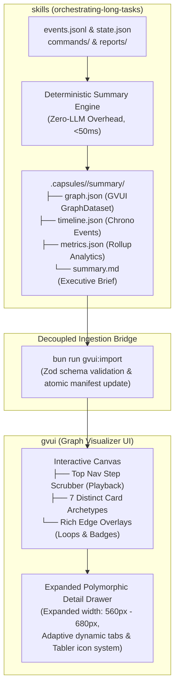

# System Architecture & Tabler Icon Design Specification

**Document**: `01-system-architecture-and-icons.md`  
**Status**: Modular Planning Specification (Part 1 of 5)  
**Workspaces**: `skills` (`orchestrating-long-tasks`) & `gvui` (`graph-visualizer-ui`)  
**Line Bound**: Strictly $\le 500$ lines

---

## 1. Executive Summary & Vision

The objective of this architecture is to establish a seamless, high-fidelity visual observability platform connecting **`orchestrating-long-tasks`** (the multi-agent execution harness) and **`GVUI`** (the graph visualizer UI).

Every multi-agent execution run—spanning prompt ingestion, task planning, subagent leasing, CLI tool execution, independent validation pushbacks, and completeness reviews—is automatically recorded and synthesized into an interactive visual graph dataset with **zero runtime LLM overhead**.

---

## 2. Core Architectural Invariants

1. **Zero LLM Runtime Overhead**: The execution timeline, metrics, and graph dataset are **never** written or summarized by an LLM at runtime. Synthesis executes in $< 50\text{ms}$ purely via deterministic TypeScript algorithms.
2. **Preserve Layout Engine Invariants**: All existing Rust WASM and TypeScript DAG ranking, port calculation, and spline pathfinding algorithms in `gvui/src/engine/layout/` remain strictly untouched.
3. **Strict Tabler Icon System (Zero Emojis)**: Emojis are strictly banned from UI cards, badges, and drawers due to inconsistent OS font rendering and lack of systematic visual hierarchy. All icons are standardized exclusively on the **Tabler Icons** library (`@tabler/icons-react` / SVG paths).
4. **Adaptive Dynamic Drawer**: The right-hand inspection drawer width is expanded (minimum 560px, scalable up to 680px). Tabs dynamically adapt—hiding empty sections (e.g. no Files tab if no files were touched) and updating the section title based on the selected node archetype.
5. **Strict TypeScript Typing**: Zero `any`, `@ts-ignore`, or `@ts-expect-error` across both repositories.

---

## 3. Systematic Tabler Icon Taxonomy

All visual iconography across cards, status badges, edge overlays, and drawer tabs maps strictly to Tabler Icons:

### 3.1 Node Archetype Icons

| Node Archetype | Tabler Icon Component | Visual Semantic |
| :--- | :--- | :--- |
| **`input`** | `IconTerminal2` / `IconPrompt` | Original user request / instruction trigger |
| **`orchestrator`** | `IconHierarchy2` / `IconCrown` | Tier 2 Coordinator / execution decomposition |
| **`agent`** | `IconRobot` / `IconCpu` | Tier 3 Implementation worker |
| **`tool`** | `IconCode` / `IconTerminal` | Monitored CLI command / script execution |
| **`gate`** | `IconShieldCheck` / `IconCheckbox` | Independent validator checkpoint |
| **`critic`** | `IconScale` / `IconCertificate` | Completeness critic / authority audit |
| **`terminal`** | `IconFlagCheckered` / `IconCircleCheck` | Final sealed run outcome |

### 3.2 Execution Status Icons

| Status | Tabler Icon | Color Accent | Meaning |
| :--- | :--- | :--- | :--- |
| **`success`** | `IconCheck` | Emerald (`#34d399`) | Clean pass / satisfied |
| **`running`** | `IconLoader2` (animated spin) | Amber (`#fbbf24`) | In-flight execution |
| **`warning`** | `IconAlertTriangle` | Orange (`#fb923c`) | Pushback / changes requested |
| **`error`** | `IconX` | Red (`#f87171`) | Gate failure / hard error |
| **`skipped`** | `IconBan` | Zinc (`#71717a`) | Disposed / cancelled |
| **`pending`** | `IconClock` | Slate (`#64748b`) | Unblocked / queued |

### 3.3 Drawer Navigation & Tab Icons

| Drawer Tab | Tabler Icon | Render Condition |
| :--- | :--- | :--- |
| **Overview** | `IconInfoCircle` | Always rendered |
| **Inputs / Outputs** | `IconArrowsExchange` | Rendered if `node.io` has inputs or outputs |
| **Files & Diffs** | `IconFiles` | Rendered only if `node.files` is non-empty |
| **Executions** | `IconTerminal` | Rendered only if `metadata.commands` is non-empty |
| **Feedback / Reviews** | `IconShieldSearch` | Rendered if findings, reviews, or critic proofs exist |
| **Raw Provenance** | `IconBinary` | Always rendered (collapsible) |

### 3.4 Edge Archetype Icons

| Edge Kind | Tabler Icon on Badge | Visual Semantic |
| :--- | :--- | :--- |
| **`spawn`** | `IconRocket` | Subagent creation & lease dispatch |
| **`sequence`** | `IconArrowRight` | Forward DAG dependency satisfaction |
| **`loop`** | `IconRefresh` / `IconAlertCircle` | Validator pushback / repair cycle |
| **`data`** | `IconFileText` | Evidence report / diff handoff |
| **`join`** | `IconGitMerge` | Multi-task aggregation to barrier |

---

## 4. Documentation Suite Index

This specification is broken into 5 modular, cohesive documents:

1. [`01-system-architecture-and-icons.md`](file:///Users/onurseckinsenoglu/repos/skills/docs/planning/gvui-execution-graph/01-system-architecture-and-icons.md): Master architecture, core invariants, and Tabler icon taxonomy.
2. [`02-edge-cases-and-hk-scenarios.md`](file:///Users/onurseckinsenoglu/repos/skills/docs/planning/gvui-execution-graph/02-edge-cases-and-hk-scenarios.md): Deep algorithmic modeling of the 10 Hard-Knock edge cases.
3. [`03-node-archetypes-and-canvas-system.md`](file:///Users/onurseckinsenoglu/repos/skills/docs/planning/gvui-execution-graph/03-node-archetypes-and-canvas-system.md): Visual card anatomy, mini-chips, edge overlays, and top nav step scrubber.
4. [`04-universal-polymorphic-drawer.md`](file:///Users/onurseckinsenoglu/repos/skills/docs/planning/gvui-execution-graph/04-universal-polymorphic-drawer.md): Expanded sidebar width, adaptive dynamic tabs, and rich inspection panels.
5. [`05-skills-synthesis-engine-and-schemas.md`](file:///Users/onurseckinsenoglu/repos/skills/docs/planning/gvui-execution-graph/05-skills-synthesis-engine-and-schemas.md): Deterministic synthesis algorithms, TypeScript contracts, JSON dataset schema, and roadmap.
