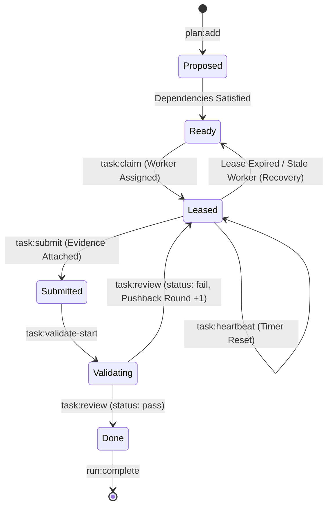

# Edge-Case Architecture & Hard-Knock (HK) Scenarios

**Document**: `02-edge-cases-and-hk-scenarios.md`  
**Status**: Modular Planning Specification (Part 2 of 5)  
**Workspaces**: `skills` (`orchestrating-long-tasks`) & `gvui` (`graph-visualizer-ui`)  
**Line Bound**: Strictly $\le 500$ lines

---

## 1. Overview & Tenet

Real-world multi-agent execution exhibits edge cases: repeated validator rejections, worker timeouts, cancelled requirements, huge log streams, and massive file churn.

The graph synthesis engine and GVUI visual canvas must handle all 10 Hard-Knock (HK) scenarios robustly without visual clutter or runtime degradation.

---

## 2. The 10 Hard-Knock (HK) Scenarios

### HK 1: Multi-Round Validator Pushback & Repair Cycles (Rounds 1–5)
- **Failure Mode**: When a validator rejects an agent's submission with findings, creating separate node pairs for each round produces visual explosion (12+ nodes for 5 iterations).
- **Algorithmic Solution**:
  1. **Canonical Node Retention**: Exactly one `AgentNode` and one `GateNode` represent the task throughout its lifecycle.
  2. **Loopback Edge**: A red/amber dashed reverse spline connects `GateNode` $\to$ `AgentNode` (`kind: "loop"`, `isCycle: true`).
  3. **Dynamic Badge Overlay**: Edge badge displays `❌ Pushback: Round X (Y Findings) ↳ Re-assigned`.
  4. **Multi-Round History in Drawer**: Tab 5 (*Feedback & Reviews*) renders an accordion of every historical round (Round 1 findings $\to$ Round 2 remediation notes $\to$ Round 3 clean passing gate proofs).

### HK 2: Complex DAG Wave Concurrency & Multi-Parent Dependencies
- **Failure Mode**: Tasks unblocked across different stages lose parallel clarity when mapped naively to linear steps.
- **Algorithmic Solution**:
  1. **Topological Wave Partitioning**: Tasks whose upstream dependencies are simultaneously satisfied at wave $W$ share the exact same `step` integer and `stepLabel: "Wave W: <Domain>"`.
  2. **Multiple Ingress Sequence Edges**: Explicit `sequence` edges connect all parent tasks.
  3. **Shared Step Scrubber Highlighting**: Selecting `[Step 2: Wave 1]` in the top scrubber spotlights all concurrent tasks simultaneously.

### HK 3: Stale Worker Timeout, Lease Expiry & Recovery
- **Failure Mode**: A subagent crashes or times out, requiring the coordinator to reclaim the lease and reassign the task.
- **Algorithmic Solution**:
  1. **`fallback` Edge**: Dotted slate edge links the previous lease to the new worker.
  2. **Worker Lineage Badge**: The node card displays `Attempt 2 (Stale Recovered)` in amber.
  3. **Drawer Audit**: Documents the original worker ID, expiry timestamp, recovery transaction, and replacement worker ID.

### HK 4: Cancelled Requirements & Disposed Tasks
- **Failure Mode**: An out-of-scope requirement is formally declined by an authority decision, cancelling dependent tasks.
- **Algorithmic Solution**:
  1. **Muted Visual State (`status: "skipped"`)**: Diagonal hatch background pattern, gray border, and `[SKIPPED]` badge.
  2. **Connecting Edges**: Rendered as thin muted dotted lines.
  3. **Drawer Explanation**: Displays the exact requirement disposition decision (e.g. `"Declined by authority: out_of_scope"`).

### HK 5: Massive Command Output Logs (> 10MB stdout/stderr)
- **Failure Mode**: Massive test suites or compiler outputs crash browser memory if embedded raw into `graph.json`.
- **Algorithmic Solution**:
  1. **Bounded Sanitized Snippet**: `graph.json` embeds the last 50 lines / 8 KB of output with total byte counts.
  2. **Direct Disk File Reference**: Commands specify `logPath: "commands/C-XXXX/record.json"` for on-demand inspection in the drawer.

### HK 6: Deep Monorepo File Churn (50+ Modified Files)
- **Failure Mode**: Long file paths expand card bounding boxes beyond canvas limits.
- **Algorithmic Solution**:
  1. **Card Summary Chip**: Displays `📁 14 files (+420, -85)`.
  2. **Drawer Directory Tree**: The *Files & Diffs* tab groups files by folder hierarchy with fuzzy search filtering and individual collapsible diff inspectors.

### HK 7: Non-Coding & Polymorphic Agent Workflows
- **Failure Mode**: Hardcoding coding terminology (e.g. "git diff", "compiler error") breaks for research, debate, or incident triage graphs.
- **Algorithmic Solution**:
  1. **Dynamic Adaptive Tabs**: If `files` or `commands` are empty, those tabs are hidden automatically.
  2. **Polymorphic Field Mapping**: Universal archetypes (`input`, `orchestrator`, `agent`, `tool`, `gate`, `critic`, `terminal`) render cleanly across all agent paradigms.

### HK 8: Partial Data Recovery on Mid-Run Crashes
- **Failure Mode**: An unexpected power outage or crash leaves an uncommitted tail fragment in `events.jsonl`.
- **Algorithmic Solution**:
  1. **Defensive Event Parser**: Uses the capsule store's recovery algorithm to quarantine torn lines and construct a valid partial graph.
  2. **In-Flight Visual Status**: Incomplete tasks cleanly display `status: "running"` or `"error"` with time-of-crash indicators.

### HK 9: Circular Dependency & Layout Freeze Protection
- **Failure Mode**: Malformed graph inputs containing accidental dependency cycles freeze layout calculations.
- **Algorithmic Solution**:
  1. **Acyclic Verification**: All `sequence` edges are verified acyclic before entering the layout engine.
  2. **Explicit Cycle Flagging**: Only intentional feedback edges carry `isCycle: true` and `kind: "loop"`, allowing the routing engine to treat them as backward splines.

### HK 10: Canvas Semantic Level-of-Detail (LOD) Zoom
- **Failure Mode**: Highly detailed cards become unreadable or cause GPU stutter when zoomed out on 50+ node graphs.
- **Algorithmic Solution**:
  1. **Zoom < 40% (Macro LOD)**: Archetype icon, title, and status dot only.
  2. **Zoom 40%–80% (Standard LOD)**: 2-line action summary and mini metric chips.
  3. **Zoom > 80% (Micro LOD)**: Full card view with write scopes, model tier tags, and tool counts.
