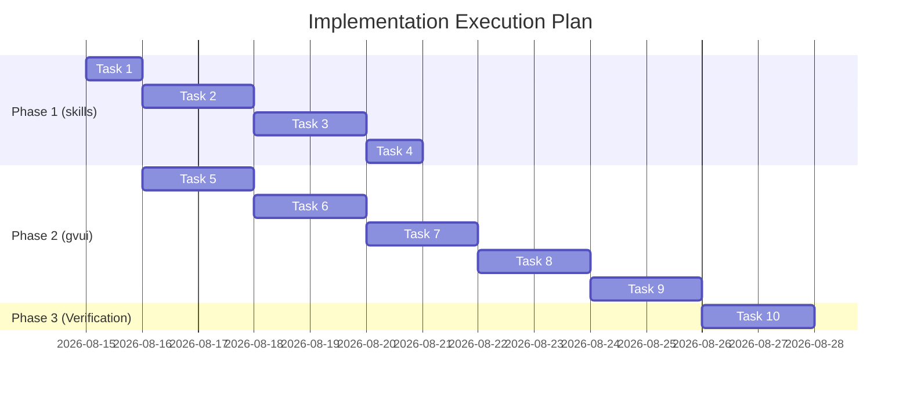

# Synthesis Engine, Data Contracts & Implementation Roadmap

**Document**: `05-skills-synthesis-engine-and-schemas.md`  
**Status**: Modular Planning Specification (Part 5 of 5)  
**Workspaces**: `skills` (`orchestrating-long-tasks`) & `gvui` (`graph-visualizer-ui`)  
**Line Bound**: Strictly $\le 500$ lines

---

## 1. Deterministic Summary Synthesis Pipeline (`skills`)

The summary engine compiles runtime events into a `SummarySuite` on `run:complete` or via `summary:export`:

```typescript
export interface SummarySuite {
  timeline: TimelineEventRecord[];
  metrics: RollupMetrics;
  graph: GraphDataset;
  markdown: string;
}
```

### 1.1 Step & Wave Assignment Algorithm
```typescript
export function computeExecutionSteps(tasks: TaskRecord[]): Map<string, number> {
  const stepMap = new Map<string, number>();
  const inDegree = new Map<string, number>();
  const adj = new Map<string, string[]>();

  for (const t of tasks) {
    inDegree.set(t.id, t.dependencies.length);
    for (const dep of t.dependencies) {
      const list = adj.get(dep) ?? [];
      list.push(t.id);
      adj.set(dep, list);
    }
  }

  // Queue initial zero-dependency tasks as Wave 1 (Step 2, after Step 1 Prompt/Plan)
  let currentWave = tasks.filter((t) => t.dependencies.length === 0).map((t) => t.id);
  let stepIndex = 2;

  while (currentWave.length > 0) {
    for (const taskId of currentWave) {
      stepMap.set(taskId, stepIndex);
    }
    stepIndex++; // Increment for validator checkpoints
    stepIndex++; // Increment for next wave

    const nextWave: string[] = [];
    for (const taskId of currentWave) {
      for (const neighbor of adj.get(taskId) ?? []) {
        const remaining = (inDegree.get(neighbor) ?? 1) - 1;
        inDegree.set(neighbor, remaining);
        if (remaining === 0) nextWave.push(neighbor);
      }
    }
    currentWave = nextWave;
  }
  return stepMap;
}
```

---

## 2. Strict TypeScript Contracts (`gvui/src/types/graphData.ts`)

```typescript
export type NodeKind =
  | "input"         // User prompt trigger
  | "orchestrator"  // Coordinator / execution planner
  | "agent"         // Implementation worker
  | "tool"          // Monitored CLI command execution
  | "gate"          // Independent validator checkpoint
  | "critic"        // Completeness authority
  | "terminal";     // Final sealed outcome

export type NodeStatus = "pending" | "running" | "success" | "warning" | "error" | "skipped" | "cached";
export type EdgeKind = "sequence" | "spawn" | "loop" | "conditional" | "data" | "fallback" | "join";
export type ModelTier = "xs" | "s" | "m" | "l";

export interface FileRef {
  path: string;
  mode?: "read" | "write" | "attach";
  lines?: string;
  additions?: number;
  deletions?: number;
}

export interface IoPort {
  node?: string;
  kind: "prompt" | "full-context" | "summary" | "artifact" | "decision" | "file";
  label: string;
  tokens?: number;
  preview?: string;
  dataRef?: string;
}

export interface CommandExecutionDetail {
  id: string;
  argv: string[];
  cwd: string;
  exitCode: number;
  durationMs: number;
  startedAt: string;
  finishedAt: string;
  stdoutSnippet?: string;
  stderrSnippet?: string;
  logPath?: string;
}

export interface FindingDetail {
  id: string;
  requirementId: string;
  severity: "critical" | "important" | "suggestion";
  observation: string;
  remediation: string;
  status: "open" | "resolved";
}

export interface GraphNodeData {
  id: string;
  name: string;
  description?: string;
  kind?: NodeKind;
  status?: NodeStatus;
  step?: number;
  stepLabel?: string;
  model?: string;
  tier?: ModelTier;
  sectionId?: string;
  files?: FileRef[];
  io?: { inputs?: IoPort[]; outputs?: IoPort[] };
  metadata?: {
    commands?: CommandExecutionDetail[];
    findings?: FindingDetail[];
    writeScope?: string[];
    leaseAgent?: string;
    repairRounds?: number;
    [key: string]: unknown;
  };
}

export interface GraphEdgeData {
  id: string;
  source: string;
  target: string;
  kind?: EdgeKind;
  label?: string;
  badge?: {
    text: string;
    variant?: "info" | "warning" | "error" | "success" | "neutral";
    icon?: string;
    targetTab?: string;
  };
  isCycle?: boolean;
}

export interface GraphDataset {
  id: string;
  title: string;
  description?: string;
  entry?: string;
  exits?: string[];
  nodes: GraphNodeData[];
  edges: GraphEdgeData[];
}
```

---

## 3. Implementation File Matrix & Parallel Tasks



---

## 4. Verification Gates & Standards
- **Zero LLM Overhead**: Summary compilation $< 50\text{ms}$.
- **Layout Invariants**: Preserves Rust WASM engine waypoint calculations.
- **Type Safety**: Zero `any`, `@ts-ignore`, or `@ts-expect-error`.
- **Test Gate**: 100% test pass rate in both `skills` and `gvui`.
