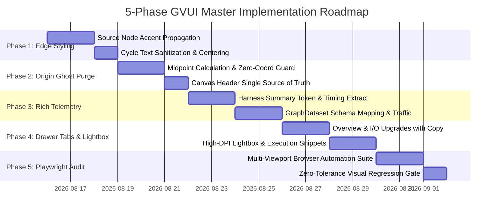

# 13: GVUI Edge Styling Harmonization, Origin Ghost Text Purging, Rich Telemetry & Node Detail Drawer Master Plan

**Document ID**: `GVUI-MASTER-PLAN-13`  
**Status**: `APPROVED FOR IMPLEMENTATION`  
**Authors**: Dedicated Planning Director  
**Date**: 2026-08-15  

---

## 1. Executive Summary & Architectural Vision

The **Graph Visualization User Interface (GVUI)** is the high-performance visual command center for autonomous multi-agent execution trajectories, workflow DAGs, and long-running task orchestration runs. While previous architectural milestones delivered zero-tolerance WebAssembly layout engines (`layered` and `radial`), in-layer corridor routing, and sub-millisecond affine coordinate projections, deep user experience audits and telemetry ingestion requirements have revealed five critical enhancement opportunities:

1. **Visual Edge Continuity & Archetype Alignment**: Edge strokes currently default to generic zinc grey (`#3f3f46`), ignoring the originating source node's archetype accent color (e.g. Violet for Prompts, Blue for Coordinators, Cyan for Workers, Emerald for Gates, Gold for Critics).
2. **Origin (0,0) Ghost Text & Top-Left Banner Clutter**: Unpositioned edge badges default to $(0, 0)$ when bounding boxes are uncomputed, creating confusing ghost text in the top-left canvas corner. Concurrently, redundant sentence banners overlay the canvas instead of residing in the unified top navigation bar.
3. **Rich Multi-Agent Telemetry Ingestion**: The harness summary pipeline requires rich token telemetry extraction (prompt tokens, completion tokens, thinking/reasoning tokens), high-resolution execution timings ($T_{\text{agent}}$, $T_{\text{tools}}$, $T_{\text{think}}$), and multi-round repair lifecycle tracking.
4. **Polymorphic Node Detail Drawer**: The inspection drawer requires structured metric cards (tokens, thinking, cost, duration), formatted I/O stream accordions with syntax copy buttons, and an interactive high-DPI asset Lightbox viewer.
5. **Automated End-to-End Visual Audit Pipeline**: An automated Playwright browser test suite across 3 device viewports ($375\text{px}$, $768\text{px}$, $1280\text{px}$) to continuously enforce 0 descending glyph clipping (`g`, `y`, `p`, `q`), 0 origin ghost badges, and strict z-index layer stacking.

This master plan unifies the specifications developed in Modules 1 through 5 into a deterministic 5-phase execution blueprint.

---

## 2. Synthesis of Planning Specifications (Modules 1–5)

```
+----------------------------------------------------------------------------------------------------+
|                               MASTER ARCHITECTURE & SPECIFICATION SYNTHESIS                       |
+----------------------------------------------------------------------------------------------------+
|                                                                                                    |
|  [ Module 1: Edge Color Harmonization & Centered Typography ]                                      |
|    - Source Node Accent Propagation: Edge stroke inherits source node archetype color.            |
|    - Bidirectional Selection Sync: Clicking edge or badge focuses the source node & drawer.        |
|    - Badge Border & Background Matching: Badge border inherits edge stroke; fill tinted at 12%.    |
|    - Cycle Prefix Cleanup: Strip "CYCLE" / "CYCLE (...)" prefixes and render raw message directly. |
|    - Centered Typography: text-anchor: middle & flexbox center to eliminate right-side gap.       |
|                                                                                                    |
|  [ Module 2: Origin Ghost Text & Top Banner Purging ]                                              |
|    - Polyline Arc-Length Midpoint Calculation: Parametric interpolation P_mid = (1-t)p_k + t p_k+1 |
|    - Unpositioned Badge Guard: Strict suppression (return null) if coordinates are unresolvable.   |
|    - Single Source of Truth for Canvas Titles: Clean top navbar header; 0 floating canvas banners. |
|                                                                                                    |
|  [ Module 3: Rich Harness Telemetry Expansion ]                                                    |
|    - Multi-Dimensional Tokens: Total = Prompt + Completion + Reasoning + Cache Tokens.             |
|    - High-Resolution Timings: Split Wall Duration into T_agent, T_tools (active cmds), T_think.    |
|    - Repair Round Model: repair_round tracking, finding classification, loop feedback edge gen.   |
|    - Schema Mapping: Extended GraphNodeData (tokens, hostAgent, commands, findings) & traffic.    |
|                                                                                                    |
|  [ Module 4: Node Detail Drawer Tabs & Asset Viewer ]                                              |
|    - Overview Tab: Density-optimized metric grid, thinking chips, cost USD, host agent card.       |
|    - I/O Tab: Formatted stream accordions, token count chips, 1-click clipboard copy.              |
|    - Assets Tab: Playwright test execution summary banner + multi-filter thumbnail grid.           |
|    - Lightbox Dialog: Fullscreen zoom (100%-400%), pan, keyboard nav (Arrows/Esc), download links. |
|    - Executions / Diffs Tab: Exit code pills, duration timers, stdout/stderr snippets, diff churn. |
|                                                                                                    |
|  [ Module 5: Automated Playwright Visual Inspection Pipeline ]                                     |
|    - Viewport Matrix: Mobile (375x667), Tablet (768x1024), Desktop (1280x800).                     |
|    - Archetype Traversal: Click Prompt, Plan, Worker, Gate, Critic nodes & cycle all tabs.         |
|    - Invariant Gates: Zero descender clipping (line-height: 1.2, padding: 0 8px), Z-index stack.   |
|                                                                                                    |
+----------------------------------------------------------------------------------------------------+
```

---

## 3. Deterministic 5-Phase Implementation Roadmap



### Phase 1: Edge Color Harmonization & Dynamic Accent Propagation
1. **Source Node Accent Lookup**:
   - In `GraphCanvas/index.tsx`, construct `nodeAccentMap: Map<string, string>` from `positionedNodes`.
   - Pass `sourceAccentColor={nodeAccentMap.get(edge.source)}` into `<GraphEdge>` and `<EdgeBadgeOverlay>`.
2. **CSS Variable Cascading**:
   - Update `GraphEdge.css` to define `--current-edge-stroke: var(--edge-source-accent, var(--edge-kind-stroke, #3f3f46));`.
   - Ensure edge hover, selection, and flow animation dashes adhere to the propagated accent.
3. **Cycle Text Cleaning & Centering**:
   - In `EdgeBadgeOverlay.tsx`, replace `"CYCLE ("` wrapper with raw label extraction via `resolveEdgeDisplayText`.
   - Enforce `display: flex; align-items: center; justify-content: center; text-align: center;` in `.edge-badge-inner`.

### Phase 2: Origin Ghost Text Elimination & Midpoint Interpolation Guard
1. **Polyline Midpoint Interpolator**:
   - Implement `computePolylineMidpoint(points: readonly Point[]): Point | null` in `gvui/src/primitives/edges/GraphEdge/collision.ts`.
2. **Strict Placement Resolution**:
   - In `GraphBadgeLayer.tsx` and `GraphEdge/index.tsx`, implement `resolveSafeBadgePlacement(edge)`.
   - If `!badgeRect && (labelX === 0 && labelY === 0 || (!points || points.length < 2))`, return `null`.
3. **Top Navbar Header Cleanliness**:
   - Verify zero `.canvas-title-banner` elements exist inside `.graph-canvas-viewport`.

### Phase 3: Rich Harness Telemetry Collectors & Schema Mapping
1. **Summary Pipeline Ingestion (`skills/orchestrating-long-tasks/scripts/src/summary/`)**:
   - In `types.ts`, expand `TokenUsageDetail` with `reasoningTokens`, `cacheCreationTokens`, and `cacheReadTokens`.
   - In `metrics-collector.ts`, compute exact wall duration, tool active duration ($T_{\text{tools}}$), and cognitive latency ($T_{\text{think}}$).
   - In `graph-generator-helpers.ts`, map `hostAgent` metadata, `repairRounds`, `findings`, and `mediaAssets`.
2. **Edge Traffic Generation**:
   - In `graph-generator.ts`, generate enriched `traffic` objects on all causal and feedback loop edges.

### Phase 4: Polymorphic Node Detail Drawer & High-DPI Asset Lightbox
1. **Overview Tab Upgrades (`OverviewTab.tsx`)**:
   - Render structured metric cards (Tokens In/Out, Reasoning Tokens, Duration, Cost, Repair Rounds).
   - Render Host Agent card (Tool name, model tier pill, thinking level).
2. **I/O Tab & Stream Accordions (`IoTab.tsx`, `IoStreamItem.tsx`)**:
   - Collapsible input/output stream items with payload preview, byte count, and one-click copy buttons.
3. **Assets Tab & Lightbox Modal (`AssetsTab.tsx`, `LightboxDialog.tsx`)**:
   - Playwright test summary card (status, browser, duration).
   - Multi-filter thumbnail grid + Lightbox modal supporting $100\%-400\%$ zoom, pan, and download.
4. **Executions Tab (`CommandsTab.tsx`, `FilesTab.tsx`)**:
   - Exit code badges, execution duration, and formatted stdout/stderr snippets with scroll limits.

### Phase 5: Automated Multi-Viewport Playwright Visual Inspection Suite
1. **Test Suite Construction (`tests/visual/graphVisualAudit.spec.ts`)**:
   - Multi-viewport matrix: Mobile ($375\text{px}$), Tablet ($768\text{px}$), Desktop ($1280\text{px}$).
   - Automated traversal of 5 node archetypes and 4 drawer tabs.
2. **Automated Invariant Assertions**:
   - Assert count of `.edge-badge-group[transform="translate(0, 0)"]` equals 0.
   - Assert zero text clipping on descending characters (`g`, `y`, `p`, `q`, `j`).
   - Ingest generated screenshots into the harness capsule evidence store.

---

## 4. Complete File Touchpoints Matrix

| File Path | Subsystem | Responsibility & Changes |
| :--- | :--- | :--- |
| `gvui/src/primitives/edges/GraphEdge/index.tsx` | Edge Primitives | Propagate `sourceAccentColor`, safe badge coordinates, forward `onClick`. |
| `gvui/src/primitives/edges/GraphEdge/EdgeBadgeOverlay.tsx` | Edge Primitives | Purge `"CYCLE"` prefix, center typography, dynamic stroke matching. |
| `gvui/src/primitives/edges/GraphEdge/GraphEdge.css` | Styling | CSS variables `--edge-source-accent`, centered badge text, stroke transitions. |
| `gvui/src/primitives/edges/GraphEdge/collision.ts` | Geometry | Implement `computePolylineMidpoint` for polyline edge badge positioning. |
| `gvui/src/engine/GraphCanvas/GraphBadgeLayer.tsx` | Canvas Engine | Enforce `resolveSafeBadgePlacement` to eradicate origin $(0, 0)$ ghost badges. |
| `gvui/src/engine/GraphCanvas/GraphSvgLayer.tsx` | Canvas Engine | Wire edge click handlers to `setSelectedNodeId` / `setSelectedEdgeId`. |
| `gvui/src/components/NodeDetailDrawer/tabs/OverviewTab.tsx` | Inspection Drawer | Render rich token metrics, reasoning tokens chip, host agent model card. |
| `gvui/src/components/NodeDetailDrawer/tabs/IoTab.tsx` | Inspection Drawer | Syntax highlighting, JSON preview, copy-to-clipboard button. |
| `gvui/src/components/NodeDetailDrawer/tabs/AssetsTab.tsx` | Inspection Drawer | Playwright execution banner, media gallery, lightbox triggers. |
| `gvui/src/components/NodeDetailDrawer/LightboxDialog.tsx` | Inspection Drawer | Fullscreen zoom/pan modal, keyboard navigation, download buttons. |
| `gvui/src/components/NodeDetailDrawer/tabs/CommandsTab.tsx` | Inspection Drawer | Exit code pills, execution duration, line-formatted stdout/stderr snippets. |
| `skills/.../summary/metrics-collector.ts` | Harness Telemetry | Extract exact token usage, reasoning tokens, and high-resolution timing. |
| `skills/.../summary/graph-generator-helpers.ts` | Harness Telemetry | Map host agent telemetry, command executions, and Playwright metadata. |
| `gvui/tests/visual/graphVisualAudit.spec.ts` | Visual Verification | Playwright multi-viewport automated test suite across archetypes and tabs. |

---

## 5. Quality Gates & Verification Invariants

```
+----------------------------------------------------------------------------------------------------+
|                                    QUALITY GATE VERIFICATION MATRIX                                |
+----------------------------------------------------------------------------------------------------+
|                                                                                                    |
|  [ Gate 1: TypeScript & Static Lint Verification ]                                                 |
|    - Command: `bun run typecheck && oxlint`                                                        |
|    - Invariant: Zero type errors, zero prohibited `any` usages across all touched TypeScript files.|
|                                                                                                    |
|  [ Gate 2: Primitives & Drawer Unit Tests ]                                                        |
|    - Command: `bun test tests/`                                                                    |
|    - Invariant: 100% pass rate across drawer tabs, schema validation, and capsule import.         |
|                                                                                                    |
|  [ Gate 3: Exhaustive 280-Run Layout Engine Matrix ]                                               |
|    - Command: `bun run audit` (`scripts/runLayoutAudit.ts`)                                         |
|    - Invariant: 280/280 runs passing with 0 node overlaps, 0 edge penetrations, 0 badge overlaps. |
|                                                                                                    |
|  [ Gate 4: Automated Playwright Visual Inspection ]                                               |
|    - Command: `bun test tests/visual/graphVisualAudit.spec.ts`                                     |
|    - Invariant: 0 ghost badges at (0,0), 0 descender clipping, 0 horizontal overflow.             |
|                                                                                                    |
+----------------------------------------------------------------------------------------------------+
```

---
