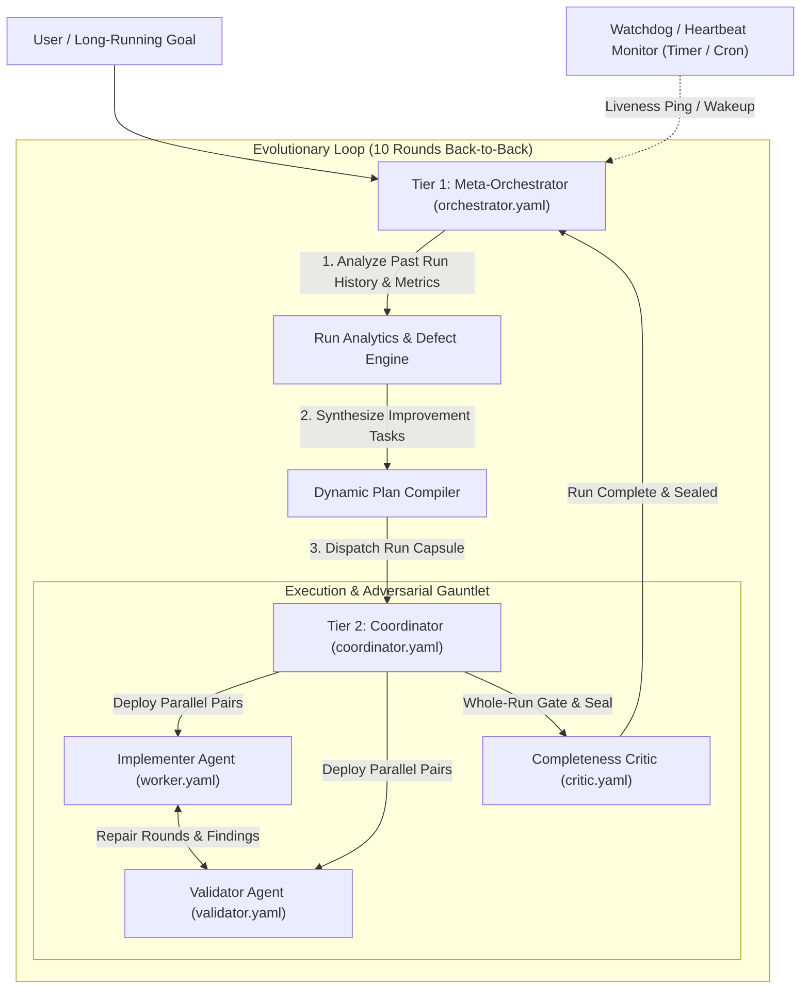

# Plan 14: Autonomous Meta-Orchestrator, 10-Round Evolutionary Loop & Universal GVUI Drawer Overhaul

## 1. Executive Summary & Vision
This plan elevates the collaboration between `skills` (the autonomous multi-agent orchestration engine) and `gvui` (the high-fidelity graph visualization and debugging interface) into a fully continuous, self-improving development loop.

The system introduces:
1. **Tier 1 Meta-Orchestrator Architecture (`orchestrator.yaml`)**: An agent that sits above Tier 2 Coordinators, autonomously analyzing past run metrics, repair histories, layout logs, and code quality audits, compiling evolutionary improvement plans, and running back-to-back development rounds (up to 10 rounds).
2. **Autonomous Watchdog & Heartbeat Liveness Monitor**: Background scheduled watchdog ensuring zero stalled runs, auto-recovering orchestrators upon idle timeouts or external interruptions.
3. **Universal GVUI Drawer & Node Sections Overhaul**:
   - **Overview**: Human-readable execution outputs replacing raw "exit 0" with rich contextual badges (e.g. `✅ Verified Clean (0 Warnings)`, duration, memory footprint, host model attribution).
   - **Row Provenance**: Full chain of custody tracking validator lease tokens, attempt histories, finding remediations, and command telemetry.
   - **Edge Connection Badges & Details**: Interactive badges displaying handoff payloads, token exchanges, step orders, and condition branches.
   - **Asset & Media Tiles + Lightbox Dialog**: Small visual interactive tiles for screenshots, diagrams, PDFs, logs, and markdown files, opening full-resolution Lightbox previews.
   - **Aggregated Diffs**: Unified multi-file diff viewer with syntax highlighting and file tree collapsing.
   - **Expanded Sidebar & Header System**: Full-width node and drawer headers that adapt dynamically, moving secondary chips gracefully to the card body to prevent title truncation.

---

## 2. Multi-Tier Orchestration Hierarchy

---

## 3. Key Components & Implementation Breakdown

### Group A: Autonomous Meta-Orchestrator & Loop Automation (`skills`)
- **`agents/orchestrator.yaml`**: Agent prompt contract defining the Meta-Orchestrator.
- **`scripts/src/orchestrator/loop-runner.ts`**: Multi-round coordinator runner executing up to $N$ iterations (default 10) back-to-back.
- **`scripts/src/orchestrator/defect-synthesizer.ts`**: Analyzes state capsules, finding logs, test runs, and layout metrics to extract high-leverage improvement tasks for the next wave.
- **`scripts/src/orchestrator/watchdog.ts`**: Heartbeat and watchdog scheduler monitoring task leases and auto-awakening idle orchestrators.

### Group B: GVUI Universal Drawer & Section Overhaul (`gvui`)
- **`OverviewTab.tsx`**: Replace raw exit codes with formatted status pills (`Execution Verified`, `Exit 0 (Clean Execution)`, `Exit 1 (Validation Pushback)`), duration, cognitive tokens, and model details.
- **`RawProvenanceTab.tsx`**: Render attempt progression, actor IDs, lease token digests, finding links, and command links in a structured provenance timeline.
- **`AssetsTab.tsx` & `LightboxDialog.tsx`**:
  - Small visual tiles for all asset kinds (`image`, `screenshot`, `diagram`, `pdf`, `document`, `log`).
  - Interactive click handlers opening high-fidelity `LightboxDialog` with image zoom/pan, PDF viewer integration, and code/markdown preview.
- **`EdgeDetailDrawer/`**:
  - Connect edge click and badge click directly to the edge drawer.
  - Display full handoff payloads, token exchanges, routing parameters, and condition status.
- **`Sidebar/index.tsx` & `NodeCardHeader.tsx`**:
  - Expanded graph details in the sidebar (total nodes, satisfied tasks, token volume, model count).
  - Dedicated full-width title row with responsive chip repositioning into the card body.

---

## 4. Architectural Design Options

### Option 1: Full-Stack Integrated Meta-Loop & Polymorphic Drawer (Recommended)
- Implement the Meta-Orchestrator (`orchestrator.yaml`) with 10-round auto-looping in `skills`.
- Upgrade all GVUI drawer tabs (`Overview`, `Provenance`, `Assets`, `Edges`, `Sidebar`, `Diffs`) with rich interactive components, asset tiles, and humanized telemetry.
- Fully synchronized via `bun run skill:update` and integrated test suites.

### Option 2: Frontend-First Rich Visual Experience
- Implement the GVUI drawer, assets lightbox, provenance timeline, and sidebar layout enhancements first.
- Follow up with the multi-round Meta-Orchestrator loop in a subsequent iteration.

### Option 3: Backend-First Autonomous Evolutionary Engine
- Implement the L1 Meta-Orchestrator, watchdog, defect synthesizer, and multi-round runner first.
- Render raw telemetry in GVUI and enhance the UI components in a second phase.

---

## 5. Verification Gates
- `bun test` in `gvui` (assert 100% pass across all drawer and primitive test suites).
- `bun test` in `skills` (assert 100% pass across orchestrator, CLI, and summary suites).
- `bun run typecheck` (0 errors, 0 `any` annotations/casts across both repos).
- `bun run audit` (240/240 runs passing with 0 failures).
- `bun run skill:update` (verify global skill synchronization).
