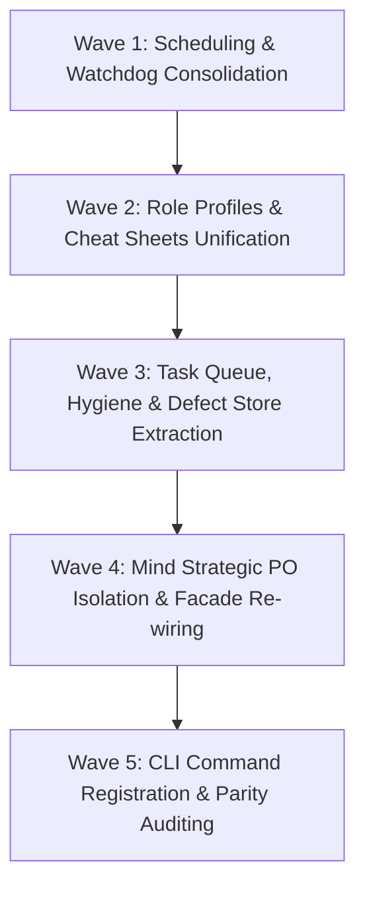

# Blueprint 01: Executive Summary & Architecture

**Domain:** `mind` / `core` / `architecture`  
**Priority:** `CRITICAL`  
**Status:** `READY_FOR_EXECUTION`  
**Tracking ID:** `MIND-DEDUP-ARCH-01`

---

## Level 1: Executive Context & Problem Statement

The Open Leadership Tier (OLT) contains powerful autonomous capabilities across `olt/scripts/src/mind/` and supporting runtime modules (`workflow/`, `watchdog/`, `engine/`, `packets/`, `reporting/`, `policy/`, `roles/`, `task/`). However, extensive code audits reveal major architectural duplication, inverted dependency layers, parallel scheduling timers, and fragmented data stores:

1. **Watchdog Fracturing**: `mind/lifecycle/watchdog/watchdog-manager.ts` and `watchdog-ops.ts` implement a parallel file-backed watchdog store with mock stubs that drift from `watchdog/autonomic-watchdog/watchdog-engine.ts`.
2. **Scheduling Duplication**: `mind/lifecycle/interval/scheduler.ts` and `watchdog/autonomic-watchdog/adaptive-timer.ts` independently implement jitter, backoff, and adaptive scheduling mathematics.
3. **Role Fragmentation**: `roles/cheat-sheets.ts` (425 lines) and `mind/roles/dynamic/cheatsheet.ts` duplicate markdown syntax formatters, while `mind/roles/profiles.ts` isolates model tier resolution.
4. **Hygiene Duplication**: `reporting/doctor/hygiene-engine.ts` and `mind/root-hygiene/scanner.ts` run duplicate file-walking logic against identical root constants.
5. **Inverted Defect Dependencies**: `engine/store/recovery/defect-store.ts` imports directly from `mind/defects/index.ts`, creating cyclic and inverted module graphs.
6. **Task Queue Mind Confinement**: `mind/tasks/queue/` traps universal POSIX file-locked task queueing inside Mind, blocking Orchestrators and Coordinators from direct utilization.

---

## Level 2: Target Architecture & Flow Diagram

```text
┌─────────────────────────────────────────────────────────────────────────────┐
│                       MIND STRATEGIC PO CONSCIOUSNESS                       │
│  (Intake Triaging, Continuous Preplanning, Work/Span Scaling, Governance)    │
└──────────────────────────────────────┬──────────────────────────────────────┘
                                       │ Consumes parameterized facades
                                       ▼
┌─────────────────────────────────────────────────────────────────────────────┐
│                    UNIVERSAL COMMON REUSABLE COMPONENTS                     │
├─────────────────────────────────────────────────────────────────────────────┤
│  1. `core/scheduling/` : Universal Backoff, Jitter, & Adaptive Timers       │
│  2. `watchdog/autonomic/`: Universal Process Liveness & Watchdog Store Sync │
│  3. `roles/`            : Universal Role Registry, Profiles, & Cheat Sheets │
│  4. `task/queue/`       : Universal File-Locked Task Queue & Lease Engine   │
│  5. `health/hygiene/`   : Universal Repository & Package Purity Scanner     │
│  6. `logging/defects/`  : Universal Defect Store & Lifecycle Synchronizer   │
└──────────────────────────────────────┬──────────────────────────────────────┘
                                       │ Registered with CLI & Telemetry Bus
                                       ▼
┌─────────────────────────────────────────────────────────────────────────────┐
│                     HARNESS CLI COMMAND REGISTRY & BUS                      │
│      (`task:*`, `sched:*`, `role:*`, `hygiene:*`, `defect:*`, `mind:*`)     │
└─────────────────────────────────────────────────────────────────────────────┘
```

---

## Level 3: Disjoint Scope Boundaries

### Write Scope

- `olt/scripts/src/core/scheduling/` (New universal package)
- `olt/scripts/src/roles/` (Refactored universal package)
- `olt/scripts/src/task/queue/` (Promoted universal package)
- `olt/scripts/src/health/hygiene/` (Consolidated universal package)
- `olt/scripts/src/logging/defects/` (Extracted universal package)
- `olt/scripts/src/watchdog/autonomic-watchdog/` (Refactored store sync)
- `olt/scripts/src/mind/` (Refactored PO consumers)
- `olt/scripts/src/cli/commands/` (CLI verb implementations)
- `olt/references/cli-capabilities/commands/` (Capability schemas)
- `tests/unit/` (Corresponding unit test suites)

### Read-Only Scope

- `olt/agents/*.yaml` (All 28 agent manifests)
- `docs/olt/architecture/` (Architectural specifications)
- `olt/scripts/src/platform/` (Platform flock primitives)

---

## Level 4: Atomic Implementation Tasks Matrix

| Task ID        | Target File Path                                                     | Concrete Symbols / Functions                                                          | Deliverable                                                  |
| :------------- | :------------------------------------------------------------------- | :------------------------------------------------------------------------------------ | :----------------------------------------------------------- |
| `task-arch-01` | `olt/scripts/src/core/scheduling/index.ts`                           | `computeAntiIdleInterval`, `applyIntervalJitter`, `calculateExponentialBackoff`       | Universal scheduling facade export.                          |
| `task-arch-02` | `olt/scripts/src/roles/index.ts`                                     | `resolveAgentProfile`, `formatUniversalCheatSheet`, `validateRoleAuthorityInvariants` | Universal role and cheat-sheet facade.                       |
| `task-arch-03` | `olt/scripts/src/task/queue/index.ts`                                | `enqueueTask`, `dequeueTask`, `completeTask`, `assertValidActiveLease`                | Universal task queue and leasing engine.                     |
| `task-arch-04` | `olt/scripts/src/health/hygiene/index.ts`                            | `scanRootHygiene`, `quarantineViolations`                                             | Universal repository hygiene scanner.                        |
| `task-arch-05` | `olt/scripts/src/logging/defects/index.ts`                           | `recordKeyedDefect`, `resolveDefect`, `serializeAggregatedDefectLog`                  | Universal defect deduplication and persistence.              |
| `task-arch-06` | `olt/scripts/src/watchdog/autonomic-watchdog/watchdog-store-sync.ts` | `syncWatchdogStore`, `loadWatchdogStore`, `saveWatchdogStore`                         | Atomic POSIX-flock watchdog store synchronizer.              |
| `task-arch-07` | `olt/scripts/src/mind/index.ts`                                      | `MindLifecycleEngine`, `ContinuousPreplanner`, `BacklogClusterer`                     | Strategic Mind PO facade cleanly decoupled from lower tiers. |

---

## Level 5: Falsifiable Gate Verification Commands

```bash
# Verify scheduling and watchdog consolidation
bun test tests/unit/core/scheduling/anti-idle.test.ts
bun test tests/unit/watchdog/autonomic-watchdog.test.ts

# Verify role profiles and cheat sheets
bun test tests/unit/roles/cheat-sheets.test.ts
bun test tests/unit/roles/profiles.test.ts

# Verify task queue and hygiene
bun test tests/unit/task/queue/task-queue.test.ts
bun test tests/unit/health/hygiene-scanner.test.ts

# Verify overall architectural integrity
bun harness.ts doctor:linter
bun harness.ts doctor:imports --check-dangling
```

---

## Level 6: Strict Invariant Enforcement

1. **Zero Code Comments Invariant ($\mathcal{C}_{13}$)**: 0 comments in all `.ts` files under `olt/scripts/src/`.
2. **Physical Line Density Budget**: $\le 300$ physical lines per file across all new and modified modules.
3. **Directory Fanout Budget**: $\le 10$ files per directory (target $\le 8$).
4. **Explicit Named Facade Exports**: Zero wildcard `export *` statements; all exported symbols explicitly enumerated in `index.ts`.
5. **Zero Defect-Prefix Files**: Defect records persist exclusively to `.olt/defects.jsonl` using POSIX flock.
6. **Zero Backwards-Compatibility Shims**: Complete deletion of 17 obsolete duplicate files.

---

## Level 7: Sequential Execution Order & Critical Path DAG



---

## Level 8: Exhaustive Traceability Matrix

| Backlog / Flaw Area          | Root Defect ID   | Implementation Task            | Verification Test Suite                                                 |
| :--------------------------- | :--------------- | :----------------------------- | :---------------------------------------------------------------------- |
| Watchdog & Timer Duplication | `DEF-SCHED-01`   | `task-arch-01`, `task-arch-06` | `tests/unit/core/scheduling/*.test.ts`, `tests/unit/watchdog/*.test.ts` |
| Role Profile Split           | `DEF-ROLE-02`    | `task-arch-02`                 | `tests/unit/roles/*.test.ts`                                            |
| Root Hygiene Clones          | `DEF-HYGIENE-03` | `task-arch-04`                 | `tests/unit/health/*.test.ts`                                           |
| Inverted Defect Store        | `DEF-DEFECT-04`  | `task-arch-05`                 | `tests/unit/engine/recovery/defect-store.test.ts`                       |
| Task Queue Mind Confinement  | `DEF-QUEUE-05`   | `task-arch-03`                 | `tests/unit/task/queue/*.test.ts`                                       |
| Mind PO Strategic Facade     | `DEF-MIND-06`    | `task-arch-07`                 | `tests/unit/mind/**/*.test.ts`                                          |
