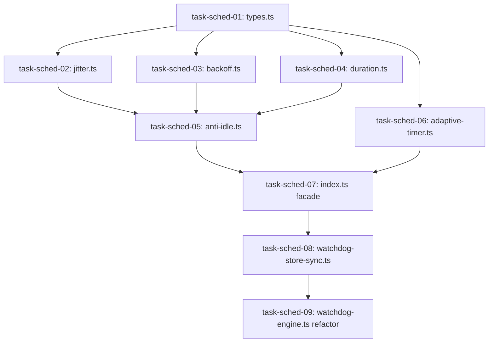

# Blueprint 02: Lifecycle & Scheduling Consolidation

**Domain:** `mind` / `watchdog` / `scheduling`  
**Priority:** `CRITICAL`  
**Status:** `READY_FOR_EXECUTION`  
**Tracking ID:** `MIND-DEDUP-SCHED-02`

---

## Level 1: Executive Context & Problem Statement

Currently, two parallel subsystems calculate execution backoff and track watchdog processes:

1. **Mind Interval Scheduler** (`mind/lifecycle/interval/scheduler.ts` and `types.ts`): Implements Mulberry32 PRNG jitter, multi-strategy backoff, duration parsing, and anti-idle rollover, but hardcodes Mind-specific fields (`hasPendingWork`, `zeroValueStreak`).
2. **Autonomic Watchdog Adaptive Timer** (`watchdog/autonomic-watchdog/adaptive-timer.ts` and `watchdog-engine.ts`): Implements `AdaptiveTimerController` with activity boosting and idle decay, while `watchdog-engine.ts` exceeds density limits at 401 lines.
3. **Mind Watchdog Ops & Store** (`mind/lifecycle/watchdog/watchdog-manager.ts` and `watchdog-ops.ts`): Persists records to `olt/watchdogs.json` with hardcoded mock returns that duplicate and drift from live `AutonomicWatchdog` liveness audits.

---

## Level 2: Target Architecture & Flow Diagram

```text
┌─────────────────────────────────────────────────────────────────────────────┐
│                       UNIVERSAL SCHEDULING MODULE                           │
│                     `olt/scripts/src/core/scheduling/`                      │
├─────────────────────────────────────────────────────────────────────────────┤
│  • `types.ts`           : Generic BackoffStrategy, JitterOptions, Activity  │
│  • `jitter.ts`          : Composite FNV-1a Seeder & Mulberry32 PRNG Jitter  │
│  • `backoff.ts`         : Pure Strategy Calculators (Exp, Linear, Fib)      │
│  • `duration.ts`        : Universal Duration Parser & Formatter ("15m", ms) │
│  • `adaptive-timer.ts`  : Unified Adaptive Controller (Boost & Decay)       │
│  • `anti-idle.ts`       : Retry-After Aware Anti-Idle & Activity Rollover   │
│  • `index.ts`           : Explicit Named Facade Exports                     │
└──────────────────────────────────────┬──────────────────────────────────────┘
                                       │
            ┌──────────────────────────┴──────────────────────────┐
            ▼                                                     ▼
┌──────────────────────────────────────┐  ┌───────────────────────────────────┐
│       AUTONOMIC WATCHDOG ENGINE      │  │        MIND LIFECYCLE ENGINE      │
│   `olt/scripts/src/watchdog/`        │  │     `olt/scripts/src/mind/`       │
│  • Consumes `AdaptiveTimerController`│  │  • Consumes `computeAntiIdle`     │
│  • POSIX flock `.olt/watchdogs.json` │  │  • 8th-Streak Quiescent Digest    │
│  • Atomic rename write pipeline      │  │  • Generational Handover (Gen-N)  │
└──────────────────────────────────────┘  └───────────────────────────────────┘
```

---

## Level 3: Disjoint Scope Boundaries

### Write Scope

- `olt/scripts/src/core/scheduling/` (New directory with 7 files)
- `olt/scripts/src/watchdog/autonomic-watchdog/watchdog-store-sync.ts` (New synchronization module)
- `olt/scripts/src/watchdog/autonomic-watchdog/watchdog-engine.ts` (Refactored to $\le 250$ lines)
- `olt/scripts/src/watchdog/autonomic-watchdog/index.ts` (Explicit exports)
- `olt/scripts/src/mind/lifecycle/quiesce/evaluator.ts` (Updated to consume unified anti-idle)
- `olt/scripts/src/mind/lifecycle/watchdog/watchdog-ops.ts` (Deleted)
- `tests/unit/core/scheduling/` (New test suites)
- `tests/unit/watchdog/` (Updated test suites)

### Read-Only Scope

- `olt/scripts/src/platform/flock.ts` (Advisory file locking)
- `olt/scripts/src/core/contracts/` (Core system contracts)

---

## Level 4: Atomic Implementation Tasks Matrix

| Task ID         | Target File Path                                         | Exported Typed Symbols / Signatures                                                                                                                                                                       | Deliverable & Contract                                                                       |
| :-------------- | :------------------------------------------------------- | :-------------------------------------------------------------------------------------------------------------------------------------------------------------------------------------------------------- | :------------------------------------------------------------------------------------------- |
| `task-sched-01` | `src/core/scheduling/types.ts`                           | `BackoffStrategy`, `JitterOptions`, `CompositeSeedOptions`, `AdaptiveTimerConfig`, `AdaptiveTimerState`, `AntiIdleIntervalOptions`, `AntiIdleIntervalResult`                                              | Generic scheduling type declarations ($\le 140$ lines).                                      |
| `task-sched-02` | `src/core/scheduling/jitter.ts`                          | `createCompositeSeed(options?: CompositeSeedOptions): number`<br>`createDeterministicRandom(seed: number): () => number`<br>`applyIntervalJitter(rawIntervalMs: number, options?: JitterOptions): number` | Composite FNV-1a seeder and Mulberry32 bounded jitter engine ($\le 130$ lines).              |
| `task-sched-03` | `src/core/scheduling/backoff.ts`                         | `calculateExponentialBackoff(baseMs: number, maxMs: number, streak: number, multiplier?: number): number`<br>`calculateBackoffWithStrategy(options: BackoffStrategyOptions): number`                      | Pure strategy backoff calculators (exponential, linear, fibonacci, fixed) ($\le 150$ lines). |
| `task-sched-04` | `src/core/scheduling/duration.ts`                        | `parseDuration(duration: number \| string): number`<br>`formatIntervalDuration(intervalMs: number): string`                                                                                               | ISO / human duration parser and formatter ($\le 120$ lines).                                 |
| `task-sched-05` | `src/core/scheduling/anti-idle.ts`                       | `computeAntiIdleInterval(options: AntiIdleIntervalOptions): AntiIdleIntervalResult`                                                                                                                       | Tier-agnostic anti-idle rollover with `retryAfterMs` support ($\le 150$ lines).              |
| `task-sched-06` | `src/core/scheduling/adaptive-timer.ts`                  | `class AdaptiveTimerController`<br>`getAdaptiveState(): AdaptiveTimerState`<br>`boostActivity(): IntervalAdjustmentResult`<br>`decayIdle(): IntervalAdjustmentResult`                                     | Adaptive interval controller relocated from watchdog ($\le 210$ lines).                      |
| `task-sched-07` | `src/core/scheduling/index.ts`                           | Explicit named exports for all scheduling functions, constants, and types                                                                                                                                 | Explicit named facade (0 wildcard exports) ($\le 60$ lines).                                 |
| `task-sched-08` | `src/watchdog/autonomic-watchdog/watchdog-store-sync.ts` | `syncWatchdogStore(store: WatchdogStore, filePath?: string): void`<br>`loadWatchdogStore(filePath?: string): WatchdogStore`<br>`saveWatchdogStore(store: WatchdogStore, filePath?: string): void`         | Multi-process POSIX-flock file-backed store synchronization ($\le 160$ lines).               |
| `task-sched-09` | `src/watchdog/autonomic-watchdog/watchdog-engine.ts`     | `class AutonomicWatchdog` refactored to consume `src/core/scheduling/` and delegate file I/O                                                                                                              | Density refactoring reducing file from 401 lines to $\le 250$ lines.                         |

---

## Level 5: Falsifiable Gate Verification Commands

```bash
# Verify unit tests for universal scheduling
bun test tests/unit/core/scheduling/jitter.test.ts
bun test tests/unit/core/scheduling/backoff.test.ts
bun test tests/unit/core/scheduling/duration.test.ts
bun test tests/unit/core/scheduling/anti-idle.test.ts
bun test tests/unit/core/scheduling/adaptive-timer.test.ts

# Verify autonomic watchdog and multi-process store sync
bun test tests/unit/watchdog/autonomic-watchdog.test.ts
bun test tests/unit/watchdog/watchdog-store-sync.test.ts

# Verify modularity and comment purity
bun harness.ts doctor:linter --check-comments
```

---

## Level 6: Strict Invariant Enforcement

1. **Zero Code Comments ($\mathcal{C}_{13}$)**: 0 comments across all `.ts` files in `src/core/scheduling/` and `src/watchdog/`.
2. **Line Budget ($\mathcal{C}_{13}$)**: All 7 scheduling files $\le 210$ lines; `watchdog-engine.ts` $\le 250$ lines.
3. **Directory Density**: `src/core/scheduling/` has exactly 7 files ($\le 10$ limit).
4. **Explicit Facades**: All exports explicitly named in `src/core/scheduling/index.ts`.
5. **Zero Backwards Shims**: Mock stubs in `mind/lifecycle/watchdog/watchdog-ops.ts` permanently deleted.

---

## Level 7: Sequential Execution Order & Critical Path DAG



---

## Level 8: Exhaustive Traceability Matrix

| Component Area         | Problem Statement                         | Task IDs                         | Target Test Suite                                   |
| :--------------------- | :---------------------------------------- | :------------------------------- | :-------------------------------------------------- |
| PRNG Jitter & Seeds    | Thundering herd on provider rate-limits   | `task-sched-01`, `task-sched-02` | `tests/unit/core/scheduling/jitter.test.ts`         |
| Multi-Strategy Backoff | Duplicated math across Mind and Watchdog  | `task-sched-03`                  | `tests/unit/core/scheduling/backoff.test.ts`        |
| Anti-Idle Scheduling   | Role-biased fields in interval calculator | `task-sched-05`                  | `tests/unit/core/scheduling/anti-idle.test.ts`      |
| Adaptive Timers        | Timer logic trapped in watchdog engine    | `task-sched-06`                  | `tests/unit/core/scheduling/adaptive-timer.test.ts` |
| Watchdog Persistence   | Broken mock stubs and uncoordinated store | `task-sched-08`, `task-sched-09` | `tests/unit/watchdog/watchdog-store-sync.test.ts`   |
