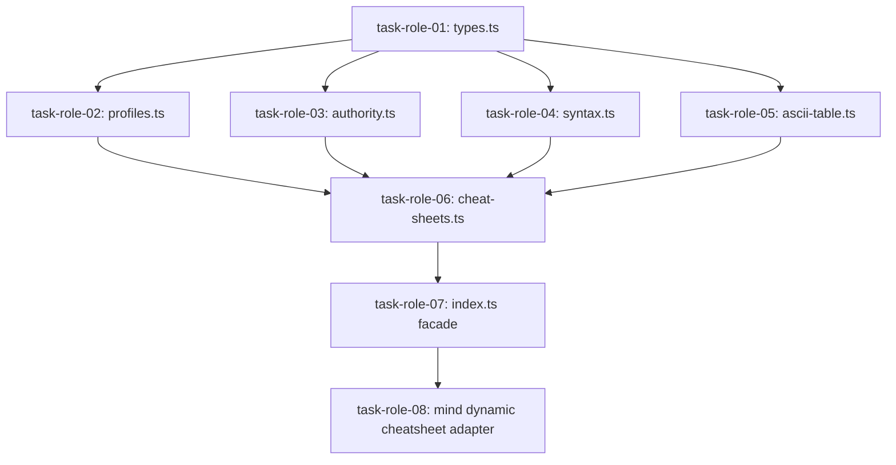

# Blueprint 03: Role Profiles & Authority Unification

**Domain:** `roles` / `mind` / `authority`  
**Priority:** `CRITICAL`  
**Status:** `READY_FOR_EXECUTION`  
**Tracking ID:** `MIND-DEDUP-ROLE-03`

---

## Level 1: Executive Context & Problem Statement

Currently, role cheat sheets, model profile mappings, and authority validation are split across three separate locations:

1. **Static Role Cheat Sheet Engine** (`roles/cheat-sheets.ts`): Monolithic 425-line file (violates density limits) formatting ASCII tables, role contracts, command syntax, and markdown cheat sheets for static agent manifests.
2. **Dynamic Role Cheat Sheet Engine** (`mind/roles/dynamic/cheatsheet.ts`): 108 lines of near-verbatim duplicate markdown formatting for dynamically synthesized roles.
3. **Mind Model Profile Resolver** (`mind/roles/profiles.ts`): Defines `AbstractProfile` and host capability telemetry resolution in isolation inside `mind/roles/`, preventing lower execution tiers from consuming it directly.

---

## Level 2: Target Architecture & Flow Diagram

```text
┌─────────────────────────────────────────────────────────────────────────────┐
│                         UNIVERSAL ROLE MODULE                               │
│                      `olt/scripts/src/roles/`                               │
├─────────────────────────────────────────────────────────────────────────────┤
│  • `types.ts`           : AbstractProfile, ProfileBinding, RoleCheatSheet   │
│  • `profiles.ts`        : Canonical Profile Mapping & Dynamic Archetypes    │
│  • `authority.ts`       : Epistemic Cognitive Hard-Locks (Invariant C7)     │
│  • `cheat-sheets.ts`    : Universal Markdown Cheat Sheet Generator          │
│  • `ascii-table.ts`     : ASCII Table Layout Renderer                       │
│  • `syntax.ts`          : CLI Command Syntax Formatter                      │
│  • `index.ts`           : Explicit Named Facade Exports                     │
└──────────────────────────────────────┬──────────────────────────────────────┘
                                       │
            ┌──────────────────────────┴──────────────────────────┐
            ▼                                                     ▼
┌──────────────────────────────────────┐  ┌───────────────────────────────────┐
│     MIND DYNAMIC ROLE SYNTHESIZER    │  │    ORCHESTRATOR & CLI REGISTRY    │
│    `olt/scripts/src/mind/roles/`     │  │   `olt/scripts/src/cli/commands/` │
│  • `synthesizer.ts` (Specializations)│  │  • `role:list`, `role:view`       │
│  • `mutator.ts` (Dynamic Roles)      │  │  • `agent:profile:resolve`        │
│  • Consumes universal cheat sheets   │  │  • Spawns correct model tiers     │
└──────────────────────────────────────┘  └───────────────────────────────────┘
```

---

## Level 3: Disjoint Scope Boundaries

### Write Scope

- `olt/scripts/src/roles/types.ts` (Universal role types)
- `olt/scripts/src/roles/profiles.ts` (Promoted profile resolver)
- `olt/scripts/src/roles/authority.ts` (Cognitive hard-lock enforcement)
- `olt/scripts/src/roles/cheat-sheets.ts` (Decomposed cheat-sheet generator)
- `olt/scripts/src/roles/ascii-table.ts` (ASCII table renderer)
- `olt/scripts/src/roles/syntax.ts` (CLI syntax formatter)
- `olt/scripts/src/roles/index.ts` (Explicit named facade)
- `olt/scripts/src/mind/roles/dynamic/cheatsheet.ts` (Refactored thin wrapper)
- `olt/scripts/src/mind/roles/profiles.ts` (Permanently deleted)
- `tests/unit/roles/` (Comprehensive role unit test suites)

### Read-Only Scope

- `olt/agents/*.yaml` (Agent definitions)
- `olt/scripts/src/core/contracts/` (Core type definitions)

---

## Level 4: Atomic Implementation Tasks Matrix

| Task ID        | Target File Path                       | Exported Typed Symbols / Signatures                                                                                                                                                                                                                                                                                                                                             | Deliverable & Contract                                                                                        |
| :------------- | :------------------------------------- | :------------------------------------------------------------------------------------------------------------------------------------------------------------------------------------------------------------------------------------------------------------------------------------------------------------------------------------------------------------------------------ | :------------------------------------------------------------------------------------------------------------ |
| `task-role-01` | `src/roles/types.ts`                   | `AbstractProfile`, `ProfileBinding`, `ProfileBindings`, `ResolvedProfile`, `AgentProfileResolution`, `UniversalRoleSpec`, `RoleCheatSheet`, `RoleSummary`                                                                                                                                                                                                                       | Consolidated type definitions ($\le 160$ lines).                                                              |
| `task-role-02` | `src/roles/profiles.ts`                | `ROLE_PROFILE_MAP: Record<string, AbstractProfile>`<br>`resolveRoleArchetype(roleName: string): AbstractProfile`<br>`roleToProfile(role: string): AbstractProfile`<br>`resolveProfile(profile: AbstractProfile, bindings?: ProfileBindings): ResolvedProfile`<br>`resolveAgentProfile(role: string, host: string, hostCapabilities?: HostCapabilities): AgentProfileResolution` | Canonical model tier mapping and dynamic fallback resolver ($\le 190$ lines).                                 |
| `task-role-03` | `src/roles/authority.ts`               | `FORBIDDEN_VALIDATOR_COMMANDS: ReadonlySet<string>`<br>`validateRoleAuthorityInvariants(roleName: string, profile: AbstractProfile, grantedCommands: readonly string[]): void`                                                                                                                                                                                                  | Epistemic cognitive hard-lock enforcement asserting validators cannot hold execution tools ($\le 100$ lines). |
| `task-role-04` | `src/roles/syntax.ts`                  | `formatCommandSyntax(spec: CommandSpec): CommandSyntaxInfo`<br>`buildCommandCheatSheet(commandName: string): RoleCommandCheatSheet`                                                                                                                                                                                                                                             | CLI verb syntax builder ($\le 85$ lines).                                                                     |
| `task-role-05` | `src/roles/ascii-table.ts`             | `renderAsciiRoleTable(roles: readonly (RoleSummary \| RoleCheatSheet)[]): string`                                                                                                                                                                                                                                                                                               | ASCII table formatter decomposed from monolithic cheat-sheet file ($\le 90$ lines).                           |
| `task-role-06` | `src/roles/cheat-sheets.ts`            | `formatUniversalCheatSheet(spec: UniversalRoleSpec, options?: RoleCheatSheetOptions): RoleCheatSheet`<br>`generateRoleCheatSheet(role: string, options?: RoleCheatSheetOptions): RoleCheatSheet`                                                                                                                                                                                | Universal cheat sheet generator supporting static and dynamic roles ($\le 220$ lines).                        |
| `task-role-07` | `src/roles/index.ts`                   | Explicit named re-exports for all 17 role symbols, constants, and types                                                                                                                                                                                                                                                                                                         | Explicit named facade (0 wildcard exports) ($\le 80$ lines).                                                  |
| `task-role-08` | `src/mind/roles/dynamic/cheatsheet.ts` | `generateDynamicRoleCheatSheet(spec: UniversalRoleSpec): RoleCheatSheet`                                                                                                                                                                                                                                                                                                        | Refactored thin adapter delegating to `formatUniversalCheatSheet` ($\le 35$ lines).                           |

---

## Level 5: Falsifiable Gate Verification Commands

```bash
# Verify role profiles and dynamic archetypes
bun test tests/unit/roles/profiles.test.ts

# Verify role cheat sheets and ASCII tables
bun test tests/unit/roles/cheat-sheets.test.ts
bun test tests/unit/roles/syntax.test.ts
bun test tests/unit/roles/authority.test.ts

# Verify Mind dynamic role integration
bun test tests/unit/mind/roles/dynamic-cheatsheet.test.ts

# Verify zero comments and line density
bun harness.ts doctor:linter --check-comments
```

---

## Level 6: Strict Invariant Enforcement

1. **Zero Code Comments ($\mathcal{C}_{13}$)**: 0 comments across all `.ts` files in `src/roles/`.
2. **Line Budget ($\mathcal{C}_{13}$)**: Monolithic `roles/cheat-sheets.ts` (425 lines) split into 4 files all $\le 220$ lines.
3. **Directory Density**: `src/roles/` has exactly 7 files ($\le 10$ limit).
4. **Explicit Facades**: All exports explicitly named in `src/roles/index.ts`.
5. **Zero Backwards Shims**: `mind/roles/profiles.ts` deleted and call sites migrated directly.
6. **Cognitive Hard-Lock ($\mathcal{C}_7$)**: `validateRoleAuthorityInvariants` strictly rejects mutating commands for adversarial roles.

---

## Level 7: Sequential Execution Order & Critical Path DAG



---

## Level 8: Exhaustive Traceability Matrix

| Component Area          | Problem Statement                                     | Task IDs                                       | Target Test Suite                                  |
| :---------------------- | :---------------------------------------------------- | :--------------------------------------------- | :------------------------------------------------- |
| Monolithic Cheat Sheet  | 425-line file exceeding density limits                | `task-role-04`, `task-role-05`, `task-role-06` | `tests/unit/roles/cheat-sheets.test.ts`            |
| Duplicate Dynamic Sheet | Mind dynamic cheatsheet duplicates markdown formatter | `task-role-06`, `task-role-08`                 | `tests/unit/mind/roles/dynamic-cheatsheet.test.ts` |
| Role Profile Isolation  | Model tier mapping isolated inside Mind               | `task-role-02`, `task-role-07`                 | `tests/unit/roles/profiles.test.ts`                |
| Cognitive Hard-Locks    | Validator execution tools not strictly validated      | `task-role-03`                                 | `tests/unit/roles/authority.test.ts`               |
