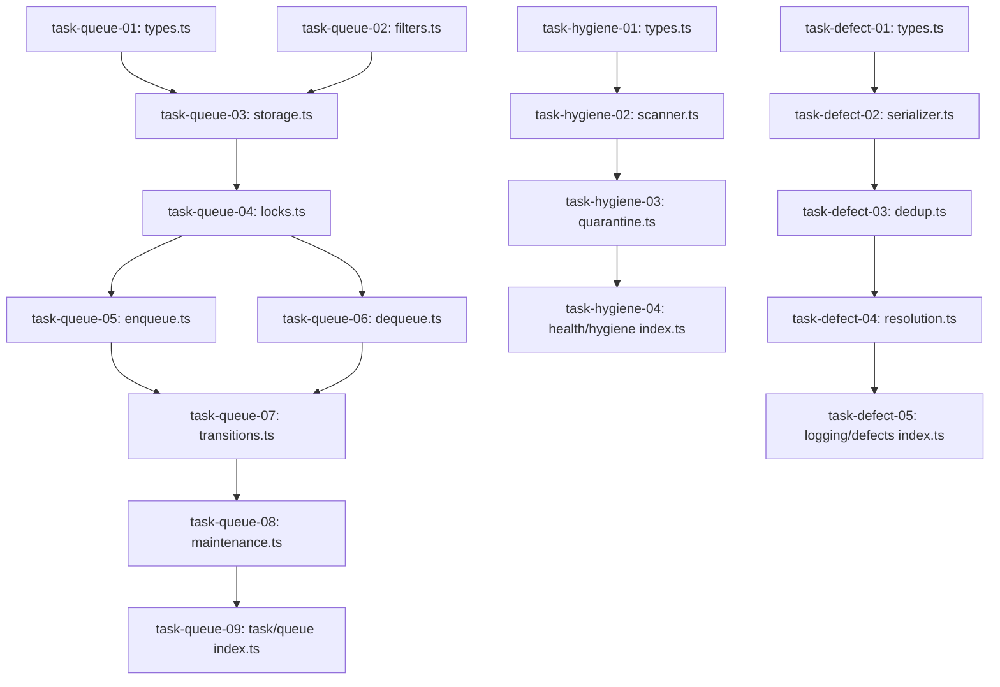

# Blueprint 04: Task Queue & Preplanning Harmonization

**Domain:** `task` / `mind` / `health` / `defects`  
**Priority:** `CRITICAL`  
**Status:** `READY_FOR_EXECUTION`  
**Tracking ID:** `MIND-DEDUP-TASK-04`

---

## Level 1: Executive Context & Problem Statement

Three critical structural duplications and boundary inversions exist across the codebase:

1. **Task Queue Mind Confinement**: `mind/tasks/queue/` implements POSIX file-locked task storage, atomic leasing, retry counters, and status transitions, but is trapped inside Mind, forcing Orchestrators to bypass canonical queueing.
2. **Root Hygiene Clones**: `reporting/doctor/hygiene-engine.ts` (218 lines) and `mind/root-hygiene/scanner.ts` (225 lines) perform duplicate directory scanning against identical constants.
3. **Inverted Defect Dependencies**: `engine/store/recovery/defect-store.ts` imports directly from `mind/defects/index.ts`, creating cyclic and inverted module graphs.

---

## Level 2: Target Architecture & Flow Diagram

```text
┌─────────────────────────────────────────────────────────────────────────────┐
│                    UNIVERSAL TASK & HEALTH INFRASTRUCTURE                   │
├─────────────────────────────────────────────────────────────────────────────┤
│  1. `task/queue/`        : Canonical File-Locked Task Queue & Lease Engine  │
│  2. `health/hygiene/`    : Canonical Root, Package Purity, & Quarantine     │
│  3. `logging/defects/`   : Canonical Defect Store, Serialization, & Dedup   │
└──────────────────────────────────────┬──────────────────────────────────────┘
                                       │ Direct consumption (0 shims)
            ┌──────────────────────────┴──────────────────────────┐
            ▼                                                     ▼
┌──────────────────────────────────────┐  ┌───────────────────────────────────┐
│       MIND STRATEGIC PO ENGINE       │  │    ORCHESTRATOR / DOCTOR / CLI    │
│  • Tarjan SCC Cycle-Cutting (C6)     │  │  • 1:1 Anti-Batching Guard (C11)   │
│  • Deterministic Kahn Toposort       │  │  • Hermetic Worktree Binding (C10)│
│  • Bounded Sub-Wave Partition (p<=8) │  │  • Suspended Lease Translation    │
└──────────────────────────────────────┘  └───────────────────────────────────┘
```

---

## Level 3: Disjoint Scope Boundaries

### Write Scope

- `olt/scripts/src/task/queue/` (8 new files promoted from Mind)
- `olt/scripts/src/health/hygiene/` (4 new files consolidating scanner and quarantine)
- `olt/scripts/src/logging/defects/` (5 new files extracting defect storage)
- `olt/scripts/src/engine/store/recovery/defect-store.ts` (Import updated)
- `olt/scripts/src/reporting/doctor/hygiene-engine.ts` (Refactored to wrap universal scanner)
- `olt/scripts/src/mind/preplanning/` (Preplanning factory files)
- `olt/scripts/src/mind/tasks/queue/` (Entire directory deleted)
- `olt/scripts/src/mind/root-hygiene/` (Entire directory deleted)
- `olt/scripts/src/mind/root-hygiene.ts` (Deleted)
- `tests/unit/task/queue/`, `tests/unit/health/`, `tests/unit/logging/defects/` (Test suites)

### Read-Only Scope

- `olt/scripts/src/platform/flock.ts` (Platform locking)
- `olt/agents/*.yaml` (Agent definitions)

---

## Level 4: Atomic Implementation Tasks Matrix

| Task ID           | Target File Path                    | Exported Typed Symbols / Signatures                                                                                                                                                                                                                                                                                                                                                                                                                                                                                                                                                                       | Deliverable & Contract                                                                                                                                                                                 |
| :---------------- | :---------------------------------- | :-------------------------------------------------------------------------------------------------------------------------------------------------------------------------------------------------------------------------------------------------------------------------------------------------------------------------------------------------------------------------------------------------------------------------------------------------------------------------------------------------------------------------------------------------------------------------------------------------------- | :----------------------------------------------------------------------------------------------------------------------------------------------------------------------------------------------------- |
| `task-queue-01`   | `src/task/queue/types.ts`           | `TaskQueueItem`, `TaskQueueStatus`, `TaskPriority`, `TaskLease`, `NewTaskQueueInput`, `CompletionReceipts`                                                                                                                                                                                                                                                                                                                                                                                                                                                                                                | Core task entity definitions ($\le 180$ lines).                                                                                                                                                        |
| `task-queue-02`   | `src/task/queue/filters.ts`         | `TaskQueueStats`, `TaskQueueFilterOptions`                                                                                                                                                                                                                                                                                                                                                                                                                                                                                                                                                                | Query and stats type definitions ($\le 120$ lines).                                                                                                                                                    |
| `task-queue-03`   | `src/task/queue/storage.ts`         | `loadTaskQueue(filePath?: string): TaskQueueItem[]`<br>`saveTaskQueue(tasks: readonly TaskQueueItem[], filePath?: string): void`<br>`cleanStaleTempFiles(targetDir: string, maxAgeMs?: number): number`                                                                                                                                                                                                                                                                                                                                                                                                   | Atomic read/write/fsync with stale temp file cleanup ($\le 240$ lines).                                                                                                                                |
| `task-queue-04`   | `src/task/queue/locks.ts`           | `withTaskQueueLock<T>(filePath: string, fn: () => T \| Promise<T>): Promise<T>`                                                                                                                                                                                                                                                                                                                                                                                                                                                                                                                           | POSIX flock mutex in `.olt/locks/tasks.lock` ($\le 180$ lines).                                                                                                                                        |
| `task-queue-05`   | `src/task/queue/enqueue.ts`         | `enqueueTask(input: NewTaskQueueInput, filePath?: string): TaskQueueItem`<br>`enqueueTasksBatch(inputs: readonly NewTaskQueueInput[], filePath?: string): TaskQueueItem[]`                                                                                                                                                                                                                                                                                                                                                                                                                                | Idempotent task creation and batch insertion ($\le 190$ lines).                                                                                                                                        |
| `task-queue-06`   | `src/task/queue/dequeue.ts`         | `dequeueTask(agentId: string, durationSeconds: number, options?: DequeueOptions): TaskQueueItem \| null`<br>`assertSingleActiveLease(tasks: readonly TaskQueueItem[], agentId: string): void`                                                                                                                                                                                                                                                                                                                                                                                                             | Priority-ordered lease acquisition with 1:1 anti-batching guard ($\mathcal{C}_{11}$) and worktree provisioning ($\mathcal{C}_{10}$) ($\le 220$ lines).                                                 |
| `task-queue-07`   | `src/task/queue/transitions.ts`     | `completeTask(taskId: string, token: string, receipts: CompletionReceipts): TaskQueueItem`<br>`failTask(taskId: string, token: string, errorMessage: string, allowRetry?: boolean): TaskQueueItem`<br>`translateSuspendedLeases(tasks: TaskQueueItem[], frozenDurationMs: number): LeaseTranslationResult`<br>`assertValidActiveLease(task: TaskQueueItem, expectedToken: string): void`<br>`validateCompletionReceipts(receipts: CompletionReceipts): void`<br>`assertWriteScopeASTPurity(repoRoot: string, writeScope: readonly string[]): void`<br>`stageWorktreeProgress(worktreePath: string): void` | Monotonic lease fencing ($\mathcal{C}_2$), dual-channel receipts ($\mathcal{C}_4$), AST purity ($\mathcal{C}_{13}$), Git staging ($\mathcal{C}_9$), and Pillar 16 clock translation ($\le 260$ lines). |
| `task-queue-08`   | `src/task/queue/maintenance.ts`     | `getTaskQueueStats(tasks: readonly TaskQueueItem[]): TaskQueueStats`<br>`pruneTaskQueue(options?: PruneOptions): PruneResult`<br>`compactTaskQueue(filePath?: string): CompactionResult`                                                                                                                                                                                                                                                                                                                                                                                                                  | Queue pruning, stats summary, and compaction ($\le 200$ lines).                                                                                                                                        |
| `task-queue-09`   | `src/task/queue/index.ts`           | Explicit named re-exports for all task queue functions, types, and constants                                                                                                                                                                                                                                                                                                                                                                                                                                                                                                                              | Explicit named facade (0 wildcard exports) ($\le 60$ lines).                                                                                                                                           |
| `task-hygiene-01` | `src/health/hygiene/types.ts`       | `RootHygieneFinding`, `RootHygieneScanResult`, `HygieneViolationType`, `QuarantineRecord`                                                                                                                                                                                                                                                                                                                                                                                                                                                                                                                 | Universal hygiene types ($\le 100$ lines).                                                                                                                                                             |
| `task-hygiene-02` | `src/health/hygiene/scanner.ts`     | `scanRootHygiene(options?: RootHygieneOptions): RootHygieneScanResult`                                                                                                                                                                                                                                                                                                                                                                                                                                                                                                                                    | Unified repo root, scripts, and static package auditor ($\le 240$ lines).                                                                                                                              |
| `task-hygiene-03` | `src/health/hygiene/quarantine.ts`  | `quarantineViolations(repoRoot: string, violations: readonly RootHygieneFinding[], quarantineDir?: string): QuarantineRecord[]`                                                                                                                                                                                                                                                                                                                                                                                                                                                                           | Forensic content-addressed mover targeting `scratch/orphaned/` ($\le 160$ lines).                                                                                                                      |
| `task-hygiene-04` | `src/health/hygiene/index.ts`       | Explicit named re-exports for hygiene scanner and quarantine functions                                                                                                                                                                                                                                                                                                                                                                                                                                                                                                                                    | Explicit named facade ($\le 40$ lines).                                                                                                                                                                |
| `task-defect-01`  | `src/logging/defects/types.ts`      | `AggregatedDefect`, `DefectRecordInput`, `DefectResolutionProof`, `HistoricalOccurrence`                                                                                                                                                                                                                                                                                                                                                                                                                                                                                                                  | Core defect data models ($\le 150$ lines).                                                                                                                                                             |
| `task-defect-02`  | `src/logging/defects/serializer.ts` | `serializeAggregatedDefectLog(defects: readonly AggregatedDefect[]): string`<br>`deserializeDefectRecord(raw: unknown): AggregatedDefect`                                                                                                                                                                                                                                                                                                                                                                                                                                                                 | JSONL serialization and parsing ($\le 180$ lines).                                                                                                                                                     |
| `task-defect-03`  | `src/logging/defects/dedup.ts`      | `computeDefectDedupKey(defect: DefectRecordInput): string`<br>`mergeDuplicateDefect(existing: AggregatedDefect, incoming: DefectRecordInput, runId?: string): AggregatedDefect`                                                                                                                                                                                                                                                                                                                                                                                                                           | Canonical hashing and occurrence tracking ($\le 180$ lines).                                                                                                                                           |
| `task-defect-04`  | `src/logging/defects/resolution.ts` | `resolveDefectRecord(defect: AggregatedDefect, proof: DefectResolutionProof): AggregatedDefect`                                                                                                                                                                                                                                                                                                                                                                                                                                                                                                           | Defect resolution proof validator and updater ($\le 160$ lines).                                                                                                                                       |
| `task-defect-05`  | `src/logging/defects/index.ts`      | Explicit named re-exports for defect persistence and resolution                                                                                                                                                                                                                                                                                                                                                                                                                                                                                                                                           | Explicit named facade ($\le 40$ lines).                                                                                                                                                                |

---

## Level 5: Falsifiable Gate Verification Commands

```bash
# Verify universal task queue operations
bun test tests/unit/task/queue/task-queue.test.ts
bun test tests/unit/task/queue/dequeue.test.ts
bun test tests/unit/task/queue/transitions.test.ts
bun test tests/unit/task/queue/lease-fencing.test.ts

# Verify health hygiene and quarantine
bun test tests/unit/health/hygiene-scanner.test.ts
bun test tests/unit/health/quarantine.test.ts

# Verify defect deduplication and engine recovery
bun test tests/unit/logging/defects/dedup.test.ts
bun test tests/unit/engine/recovery/defect-store.test.ts

# Verify Mind preplanning factory
bun test tests/unit/mind/preplanning/backlog-clusterer.test.ts
bun test tests/unit/mind/preplanning/continuous-preplanner.test.ts
bun test tests/unit/mind/preplanning/plan-factory.test.ts
```

---

## Level 6: Strict Invariant Enforcement

1. **Zero Code Comments ($\mathcal{C}_{13}$)**: 0 comments in all `.ts` files across `src/task/queue/`, `src/health/hygiene/`, and `src/logging/defects/`.
2. **Line Budget ($\mathcal{C}_{13}$)**: All 8 queue files $\le 260$ lines; all hygiene files $\le 240$ lines; all defect files $\le 180$ lines.
3. **Directory Density**: `src/task/queue/` has exactly 8 files ($\le 10$ limit).
4. **Monotonic Lease Fencing ($\mathcal{C}_2$)**: Stale lease tokens rejected with `ERR_LEASE_EXPIRED`.
5. **Dual-Channel Completion Gate ($\mathcal{C}_4$)**: Tasks cannot complete without mechanical exit code 0 and cognitive PASS.
6. **Subdomain Git Staging ($\mathcal{C}_9$)**: `git add -A` executed in worktree prior to lease release ($Z_{\text{unstaged\_crash}} = 0$).
7. **Hermetic Worktrees ($\mathcal{C}_{10}$)**: Leases bound to `.olt/worktrees/<task_id>`.
8. **Strict 1:1 Anti-Batching ($\mathcal{C}_{11}$)**: Multi-task leases per agent strictly forbidden.

---

## Level 7: Sequential Execution Order & Critical Path DAG



---

## Level 8: Exhaustive Traceability Matrix

| Component Area            | Problem Statement                             | Task IDs                                    | Target Test Suite                                  |
| :------------------------ | :-------------------------------------------- | :------------------------------------------ | :------------------------------------------------- |
| Task Queue Confinement    | Trapped in Mind; unavailable to Orchestrators | `task-queue-01` through `task-queue-09`     | `tests/unit/task/queue/task-queue.test.ts`         |
| Duplicate Hygiene Scanner | 450 lines duplicate between Doctor and Mind   | `task-hygiene-01` through `task-hygiene-04` | `tests/unit/health/hygiene-scanner.test.ts`        |
| Inverted Defect Store     | Engine depends on Mind defect subsystem       | `task-defect-01` through `task-defect-05`   | `tests/unit/engine/recovery/defect-store.test.ts`  |
| Monotonic Lease Fencing   | Stale workers corrupting reclaimed tasks      | `task-queue-07`                             | `tests/unit/task/queue/lease-fencing.test.ts`      |
| Work/Span Preplanning     | Mind PO DAG compiling and wave partitioning   | `task-queue-09`                             | `tests/unit/mind/preplanning/plan-factory.test.ts` |
