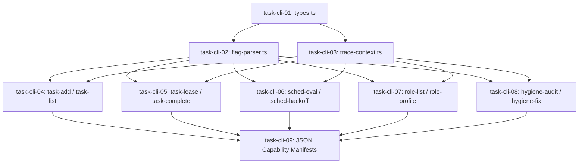

# Blueprint 05: Observability & CLI Registry Migration

**Domain:** `cli` / `observability` / `telemetry`  
**Priority:** `CRITICAL`  
**Status:** `READY_FOR_EXECUTION`  
**Tracking ID:** `MIND-DEDUP-CLI-05`

---

## Level 1: Executive Context & Problem Statement

Currently, core capabilities (task queueing, interval evaluations, role profile resolution, and hygiene fixing) lack typed, registered CLI interfaces. As a result:

1. Orchestrators and subagents lack first-class CLI verbs to lease tasks, evaluate backoff, or resolve role capabilities.
2. CLI commands lack type-safe flag parsing, resulting in ad-hoc type casts and poor error messaging.
3. Diagnostic logging leaks to `stdout`, violating the Zero Main-Thread Spill mandate ($\mathcal{C}_8$).
4. Distributed executions lack trace ID propagation across parent-child agent spans.

---

## Level 2: Target Architecture & Flow Diagram

```text
┌─────────────────────────────────────────────────────────────────────────────┐
│                         HARNESS CLI COMMAND ENGINE                          │
├─────────────────────────────────────────────────────────────────────────────┤
│  • `task:*`     : `task:add`, `task:list`, `task:lease`, `task:complete`    │
│  • `sched:*`    : `sched:eval`, `sched:backoff`, `sched:jitter`             │
│  • `role:*`     : `role:cheat-sheet`, `role:profile`, `role:list`           │
│  • `hygiene:*`  : `hygiene:audit`, `hygiene:fix`                            │
│  • `defect:*`   : `defect:record`, `defect:resolve`, `defect:list`          │
│  • `mind:*`     : `mind:pulse`, `mind:init`, `mind:observe`, `mind:admit`   │
└──────────────────────────────────────┬──────────────────────────────────────┘
                                       │ Emits structured events
                                       ▼
┌─────────────────────────────────────────────────────────────────────────────┐
│                      TELEMETRY & OBSERVABILITY BUS                          │
│   • Type-Safe Flag Parser with Zero-Any Invariant (`parseCommandFlags<T>`)   │
│   • 1:1 Bidirectional JSON Schema Parity Verification                       │
│   • OpenTelemetry Distributed Trace Tree (`OLT_TRACE_ID`, `OLT_SPAN_ID`)    │
│   • Cowan Context Budget Sanitization (< 150,000 tokens / Invariant C12)    │
│   • Zero Main-Thread Spill & Quiet Mandate (Invariant C8)                   │
└─────────────────────────────────────────────────────────────────────────────┘
```

---

## Level 3: Disjoint Scope Boundaries

### Write Scope

- `olt/scripts/src/cli/registry/types.ts` (Registry and error envelope types)
- `olt/scripts/src/cli/registry/flag-parser.ts` (Type-safe argument parser)
- `olt/scripts/src/cli/commands/` (Typed command implementations)
- `olt/scripts/src/telemetry/trace-context.ts` (Distributed trace propagation)
- `olt/references/cli-capabilities/commands/` (JSON capability manifests)
- `tests/unit/cli/` (CLI command and schema parity test suites)

### Read-Only Scope

- `olt/scripts/src/cli/registry/index.ts` (Registry lookup engine)
- `olt/references/cli-capabilities/domains/` (Domain metadata)

---

## Level 4: Atomic Implementation Tasks Matrix

| Task ID       | Target File Path                                       | Exported Typed Symbols / Signatures                                                                                                                        | Deliverable & Contract                                                                        |
| :------------ | :----------------------------------------------------- | :--------------------------------------------------------------------------------------------------------------------------------------------------------- | :-------------------------------------------------------------------------------------------- |
| `task-cli-01` | `src/cli/registry/types.ts`                            | `HarnessErrorCode`, `ErrorSeverity`, `CliErrorEnvelope`, `CliSuccessEnvelope<T>`, `CommandFlagSpec`, `CommandSpec`                                         | Canonical error taxonomy and CLI envelope types ($\le 160$ lines).                            |
| `task-cli-02` | `src/cli/registry/flag-parser.ts`                      | `parseCommandFlags<T extends Record<string, unknown>>(argv: readonly string[], spec: CommandSpec): T`                                                      | Type-safe argument parser with Zero-Any guarantee and fail-fast validation ($\le 180$ lines). |
| `task-cli-03` | `src/telemetry/trace-context.ts`                       | `resolveTraceContext(flags?: Record<string, unknown>): TraceContext`<br>`injectTraceEnvironment(env: Record<string, string>, context: TraceContext): void` | Distributed OpenTelemetry trace and span context propagation ($\le 120$ lines).               |
| `task-cli-04` | `src/cli/commands/task-add.ts` & `task-list.ts`        | `executeTaskAdd(argv: readonly string[]): Promise<number>`<br>`executeTaskList(argv: readonly string[]): Promise<number>`                                  | Task enqueue and list CLI verbs with Cowan pagination ($\le 200$ lines).                      |
| `task-cli-05` | `src/cli/commands/task-lease.ts` & `task-complete.ts`  | `executeTaskLease(argv: readonly string[]): Promise<number>`<br>`executeTaskComplete(argv: readonly string[]): Promise<number>`                            | Task lease acquisition and dual-channel sealed completion ($\le 220$ lines).                  |
| `task-cli-06` | `src/cli/commands/sched-eval.ts` & `sched-backoff.ts`  | `executeSchedEval(argv: readonly string[]): Promise<number>`<br>`executeSchedBackoff(argv: readonly string[]): Promise<number>`                            | Anti-idle evaluation and mathematical backoff CLI verbs ($\le 180$ lines).                    |
| `task-cli-07` | `src/cli/commands/role-list.ts` & `role-profile.ts`    | `executeRoleList(argv: readonly string[]): Promise<number>`<br>`executeRoleProfile(argv: readonly string[]): Promise<number>`                              | Role catalog and model tier resolution CLI verbs ($\le 180$ lines).                           |
| `task-cli-08` | `src/cli/commands/hygiene-audit.ts` & `hygiene-fix.ts` | `executeHygieneAudit(argv: readonly string[]): Promise<number>`<br>`executeHygieneFix(argv: readonly string[]): Promise<number>`                           | Repository purity scan and forensic quarantine CLI verbs ($\le 190$ lines).                   |
| `task-cli-09` | `olt/references/cli-capabilities/commands/**/*.json`   | Canonical JSON capability manifests matching all registered CLI verbs                                                                                      | JSON capability definitions for all new commands.                                             |

---

## Level 5: Falsifiable Gate Verification Commands

```bash
# Verify CLI argument parsing and error envelopes
bun test tests/unit/cli/flag-parser.test.ts
bun test tests/unit/cli/error-envelopes.test.ts

# Verify CLI domain command execution
bun test tests/unit/cli/task-commands.test.ts
bun test tests/unit/cli/sched-commands.test.ts
bun test tests/unit/cli/role-commands.test.ts
bun test tests/unit/cli/hygiene-commands.test.ts

# Verify 1:1 bidirectional capability schema parity
bun test tests/unit/cli/capabilities-schema-parity.test.ts

# Verify zero comments and line density
bun harness.ts doctor:linter --check-comments
```

---

## Level 6: Strict Invariant Enforcement

1. **Standard Exit Status Codes**: 0 = SUCCESS, 1 = RUNTIME_ERROR, 2 = INVALID_ARGUMENT / INVARIANT_VIOLATION.
2. **Zero-Any Invariant**: All flags parsed into strongly typed structs without unsafe casts.
3. **Cowan Context Budget ($\mathcal{C}_{12}$)**: Default `--limit 50` pagination and 400KB payload truncation guard.
4. **Quiet Output Mandate ($\mathcal{C}_8$)**: Diagnostics routed to `.olt/telemetry.jsonl`; `stdout` reserved for final result envelope.
5. **1:1 Capability Schema Parity**: 100% parity between TypeScript `CommandSpec` and on-disk JSON capability manifests.

---

## Level 7: Sequential Execution Order & Critical Path DAG



---

## Level 8: Exhaustive Traceability Matrix

| Component Area       | Problem Statement                           | Task IDs                     | Target Test Suite                                   |
| :------------------- | :------------------------------------------ | :--------------------------- | :-------------------------------------------------- |
| Flag Parsing & Types | Unsafe `as any` casting and ad-hoc flags    | `task-cli-01`, `task-cli-02` | `tests/unit/cli/flag-parser.test.ts`                |
| Trace Propagation    | Loss of parent-child telemetry context      | `task-cli-03`                | `tests/unit/cli/error-envelopes.test.ts`            |
| Task CLI Ops         | Missing first-class task queue commands     | `task-cli-04`, `task-cli-05` | `tests/unit/cli/task-commands.test.ts`              |
| Scheduling CLI Ops   | Internal backoff math inaccessible to CLI   | `task-cli-06`                | `tests/unit/cli/sched-commands.test.ts`             |
| Schema Parity        | Drift between implementations and JSON docs | `task-cli-09`                | `tests/unit/cli/capabilities-schema-parity.test.ts` |
