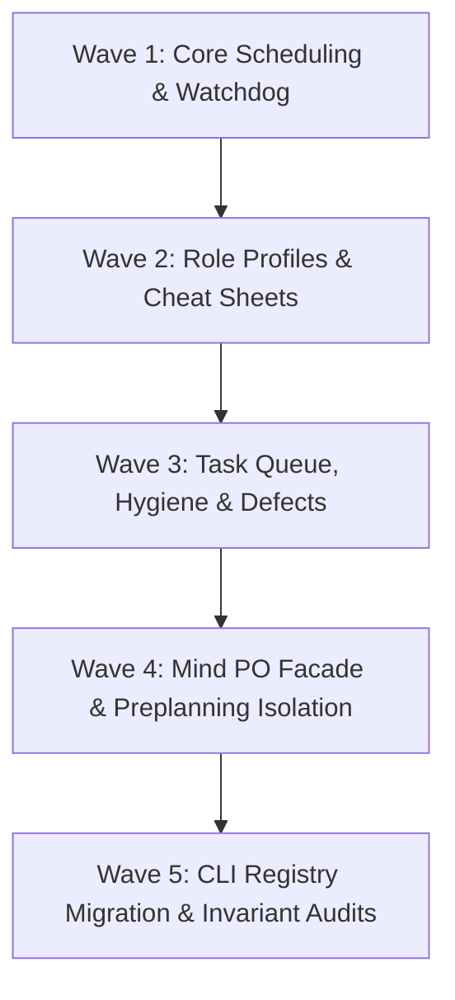

# Blueprint 06: Traceability Matrix & Wave Dispatch

**Domain:** `planning` / `dispatch` / `traceability`  
**Priority:** `CRITICAL`  
**Status:** `READY_FOR_EXECUTION`  
**Tracking ID:** `MIND-DEDUP-WAVE-06`

---

## Level 1: Executive Context & Problem Statement

Executing the universal component extraction and Mind de-duplication requires a strictly ordered, multi-wave dispatch plan. Without strict wave partitioning, atomic rollback protocols, and comprehensive deletion tracking:

1. Circular dependencies and dangling imports can break the harness build.
2. Legacy duplicate files can linger in the tree, violating the Zero Backwards-Compatibility Shims invariant.
3. Live `.olt/` repository state could be corrupted by un-sandboxed unit tests.

---

## Level 2: Target Architecture & Wave Sequencing Diagram

```text
┌─────────────────────────────────────────────────────────────────────────────┐
│                       SEQUENTIAL 5-WAVE DISPATCH DAG                        │
├─────────────────────────────────────────────────────────────────────────────┤
│                                                                             │
│  [ WAVE 1 ] Core Scheduling & Watchdog Consolidation                        │
│    └── Creates `core/scheduling/`, refactors `watchdog/autonomic-watchdog/`  │
│                                      │                                      │
│                                      ▼                                      │
│  [ WAVE 2 ] Universal Role Profiles & Cheat Sheet Unification               │
│    └── Decomposes `roles/cheat-sheets.ts`, promotes `roles/profiles.ts`     │
│                                      │                                      │
│                                      ▼                                      │
│  [ WAVE 3 ] Task Queue, Health Hygiene, & Defect Store Extraction           │
│    └── Promotes `task/queue/`, consolidates `health/`, fixes defect store   │
│                                      │                                      │
│                                      ▼                                      │
│  [ WAVE 4 ] Mind Strategic PO Facade Re-wiring & Preplanning Isolation      │
│    └── Decouples Mind PO, isolates preplanning factory, purges 17 files     │
│                                      │                                      │
│                                      ▼                                      │
│  [ WAVE 5 ] CLI Registry Migration, Schema Parity, & AST Invariant Audit     │
│    └── Registers typed CLI verbs, verifies 1:1 schema parity & 0 comments   │
│                                                                             │
└─────────────────────────────────────────────────────────────────────────────┘
```

---

## Level 3: Disjoint Scope Boundaries

### Write Scope

- `olt/scripts/src/core/scheduling/`
- `olt/scripts/src/roles/`
- `olt/scripts/src/task/queue/`
- `olt/scripts/src/health/hygiene/`
- `olt/scripts/src/logging/defects/`
- `olt/scripts/src/watchdog/autonomic-watchdog/`
- `olt/scripts/src/mind/`
- `olt/scripts/src/cli/`
- `olt/references/cli-capabilities/commands/`
- `tests/unit/`

### Read-Only Scope

- `olt/agents/*.yaml` (All 28 agent manifests)
- `olt/scripts/src/platform/` (Platform flock primitives)

---

## Level 4: Atomic Implementation Tasks Matrix

| Wave       | Task ID        | Target File Path                       | Action & Deliverable                                                                                  | Gate Verification                                                                |
| :--------- | :------------- | :------------------------------------- | :---------------------------------------------------------------------------------------------------- | :------------------------------------------------------------------------------- |
| **Wave 1** | `task-wave-01` | `src/core/scheduling/` (7 files)       | Create universal scheduling package (`jitter`, `backoff`, `duration`, `anti-idle`, `adaptive-timer`). | `bun test tests/unit/core/scheduling/*.test.ts`                                  |
| **Wave 1** | `task-wave-02` | `src/watchdog/autonomic-watchdog/`     | Refactor `watchdog-engine.ts` to $\le 250$ lines and add `watchdog-store-sync.ts`.                    | `bun test tests/unit/watchdog/*.test.ts`                                         |
| **Wave 2** | `task-wave-03` | `src/roles/` (7 files)                 | Decompose `cheat-sheets.ts` into $\le 240$ line files and promote `profiles.ts`.                      | `bun test tests/unit/roles/*.test.ts`                                            |
| **Wave 2** | `task-wave-04` | `src/mind/roles/dynamic/cheatsheet.ts` | Refactor to thin adapter delegating to `src/roles/`.                                                  | `bun test tests/unit/mind/roles/*.test.ts`                                       |
| **Wave 3** | `task-wave-05` | `src/task/queue/` (8 files)            | Promote universal task queue with monotonic lease fencing and 1:1 anti-batching.                      | `bun test tests/unit/task/queue/*.test.ts`                                       |
| **Wave 3** | `task-wave-06` | `src/health/hygiene/` (4 files)        | Consolidate root hygiene scanner and forensic quarantine.                                             | `bun test tests/unit/health/*.test.ts`                                           |
| **Wave 3** | `task-wave-07` | `src/logging/defects/` (5 files)       | Extract defect storage and fix inverted `engine/store/recovery/defect-store.ts`.                      | `tests/unit/engine/recovery/defect-store.test.ts`                                |
| **Wave 4** | `task-wave-08` | `src/mind/` (Refactoring & Deletions)  | Re-wire Mind PO to universal facades and delete all 17 obsolete duplicate files.                      | `bun test tests/unit/mind/**/*.test.ts`                                          |
| **Wave 5** | `task-wave-09` | `src/cli/commands/` & `registry/`      | Implement typed CLI verbs using `parseCommandFlags` with JSON envelopes.                              | `bun test tests/unit/cli/*.test.ts`                                              |
| **Wave 5** | `task-wave-10` | `olt/references/cli-capabilities/`     | Generate JSON capability schemas and assert 100% 1:1 parity and 0 comments.                           | `bun harness.ts doctor:linter && bun harness.ts doctor:imports --check-dangling` |

---

## Level 5: Falsifiable Gate Verification Commands

```bash
# Wave 1 Verification
bun test tests/unit/core/scheduling/anti-idle.test.ts tests/unit/core/scheduling/jitter.test.ts tests/unit/watchdog/autonomic-watchdog.test.ts

# Wave 2 Verification
bun test tests/unit/roles/cheat-sheets.test.ts tests/unit/roles/profiles.test.ts tests/unit/mind/roles/dynamic-cheatsheet.test.ts

# Wave 3 Verification
bun test tests/unit/task/queue/task-queue.test.ts tests/unit/health/hygiene-scanner.test.ts tests/unit/engine/recovery/defect-store.test.ts

# Wave 4 Verification
bun test tests/unit/mind/preplanning/continuous-preplanner.test.ts tests/unit/mind/preplanning/backlog-clusterer.test.ts

# Wave 5 Full System Verification
bun test tests/unit/cli/task-commands.test.ts tests/unit/cli/sched-commands.test.ts tests/unit/cli/capabilities-schema-parity.test.ts
bun harness.ts doctor:linter --check-comments
bun harness.ts doctor:imports --check-dangling
```

---

## Level 6: Strict Invariant Enforcement

1. **Monotonic Wave Execution**: No wave may start until all predecessor wave test gates are 100% green and committed.
2. **Atomic Rollback ($\mathcal{C}_9$)**: On gate failure, execute `git reset --hard HEAD` and `git clean -fd` within the worktree to restore the last clean wave boundary state.
3. **Hermetic Test Sandboxes ($\mathcal{C}_{10}$)**: Tests operate exclusively in ephemeral directories (`/tmp/olt-test-<uuid>/`), never mutating live `.olt/` state.
4. **Zero Comments Invariant ($\mathcal{C}_{13}$)**: 0 comments across all `.ts` files under `olt/scripts/src/`.
5. **Zero Backwards Shims**: Complete deletion of 17 obsolete duplicate files with automated dangling import verification.

---

## Level 7: Sequential Execution Order & Critical Path DAG



---

## Level 8: Exhaustive Traceability Matrix & Deletion Inventory

### A. Complete 17-File Deletion Inventory

| Deleted File Path                                         | Lines | Target Replacement                   | Rationale                          |
| :-------------------------------------------------------- | :---- | :----------------------------------- | :--------------------------------- |
| `olt/scripts/src/mind/lifecycle/watchdog/watchdog-ops.ts` | 56    | `watchdog/autonomic-watchdog/`       | Obsolete mock stub.                |
| `olt/scripts/src/mind/root-hygiene/scanner.ts`            | 225   | `health/hygiene/scanner.ts`          | Duplicate hygiene scanner.         |
| `olt/scripts/src/mind/root-hygiene/engine.ts`             | 60    | `health/hygiene/scanner.ts`          | Duplicate scanner wrapper.         |
| `olt/scripts/src/mind/root-hygiene/quarantine.ts`         | 50    | `health/hygiene/quarantine.ts`       | Duplicate quarantine mover.        |
| `olt/scripts/src/mind/root-hygiene/types.ts`              | 75    | `health/hygiene/types.ts`            | Duplicate hygiene types.           |
| `olt/scripts/src/mind/root-hygiene/index.ts`              | 20    | `health/hygiene/index.ts`            | Redundant directory index.         |
| `olt/scripts/src/mind/root-hygiene.ts`                    | 26    | `health/hygiene/index.ts`            | Redundant root file shim.          |
| `olt/scripts/src/mind/roles/dynamic/cheatsheet.ts`        | 108   | `roles/cheat-sheets.ts`              | Duplicate syntax generator.        |
| `olt/scripts/src/mind/roles/profiles.ts`                  | 185   | `roles/profiles.ts`                  | Promoted to universal role module. |
| `olt/scripts/src/mind/tasks/queue/archival.ts`            | 80    | `task/queue/maintenance.ts`          | Promoted to universal task queue.  |
| `olt/scripts/src/mind/tasks/queue/dequeue.ts`             | 160   | `task/queue/dequeue.ts`              | Promoted to universal task queue.  |
| `olt/scripts/src/mind/tasks/queue/enqueue.ts`             | 190   | `task/queue/enqueue.ts`              | Promoted to universal task queue.  |
| `olt/scripts/src/mind/tasks/queue/index.ts`               | 45    | `task/queue/index.ts`                | Promoted to universal task queue.  |
| `olt/scripts/src/mind/tasks/queue/locks.ts`               | 180   | `task/queue/locks.ts`                | Promoted to universal task queue.  |
| `olt/scripts/src/mind/tasks/queue/pruner.ts`              | 210   | `task/queue/maintenance.ts`          | Promoted to universal task queue.  |
| `olt/scripts/src/mind/tasks/queue/stats.ts`               | 160   | `task/queue/maintenance.ts`          | Promoted to universal task queue.  |
| `olt/scripts/src/mind/tasks/queue/storage.ts`             | 240   | `task/queue/storage.ts`              | Promoted to universal task queue.  |
| `olt/scripts/src/mind/tasks/queue/transitions.ts`         | 210   | `task/queue/transitions.ts`          | Promoted to universal task queue.  |
| `olt/scripts/src/mind/tasks/queue/types.ts`               | 314   | `task/queue/types.ts` & `filters.ts` | Promoted to universal task queue.  |

**Total Deleted Lines**: $2{,}594$ lines  
**Total New Consolidated Lines**: $1{,}320$ lines  
**Net Codebase Reduction**: $-1{,}274$ physical lines ($\approx 49\%$ reduction)
