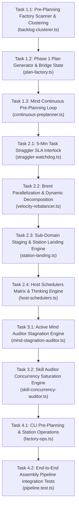

# Mind Continuous Pre-Planning Engine & Asynchronous Assembly Pipeline Master Plan

> **Tracking ID:** `fb-mind-continuous-preplanning-pipeline-engine` / `fb-comment-free-source-skills-20260825`  
> **Status:** `PHASE 1 - EXHAUSTIVE ARCHITECTURAL SPECIFICATION & TASK BREAKDOWN`  
> **Target Subsystems:** `olt/scripts/src/mind/`, `olt/scripts/src/orchestrator/`, `olt/scripts/src/authority/`, `olt/scripts/src/cli/`, `olt/scripts/src/watchdog/`  
> **Author:** Tier 0 Strategic Mind Supervisor & Infinite Product Owner  
> **Created:** 2026-08-29

---

## 1. Executive Summary & The Assembly Pipeline Vision

The goal of this architectural blueprint is to eliminate **all forms of idle waiting, wave serialization bottlenecks, single-worker stragglers, uncommitted crash vulnerabilities, and passive auditor syndrome** across the OLT multi-agent ecosystem.

```text
┌─────────────────────────────────────────────────────────────────────────────────────────────┐
│                    ASYNCHRONOUS PRE-PLANNING & ASSEMBLY PIPELINE ARCHITECTURE               │
├─────────────────────────────────────────────────────────────────────────────────────────────┤
│                                                                                             │
│  [ Tier 0: Mind Continuous Pre-Planning Factory ] (Non-Stop Autonomic Loop)                 │
│    • Continuous scan of `.olt/backlog.jsonl` & `.olt/defects.jsonl`                         │
│    • Thematic Clustering: Merges defects & backlog into domain roadmaps                     │
│    • Deep Phase 1 Formulation ──► Writes `docs/planning/<cluster>/PLAN.md`                  │
│    • Bridge State Transition: Sets `status: "PLANNED"`, links `plan_path`                   │
│                                                                                             │
│                                      │                                                      │
│                                      ▼                                                      │
│                                                                                             │
│  [ Active Worker Waves: Assembly Stations (Tier 1 / 2 / 3) ]                                │
│    • Station A (Core Domain) ────────► Verified ──► git add -A (Blob Safety) ──► Land       │
│    • Station B (Validation Domain) ──► Verified ──► git add -A (Blob Safety) ──► Land       │
│    • Station C (Tooling Domain) ─────► Verified ──► git add -A (Blob Safety) ──► Land       │
│    • Station D (Mind Domain) ────────► In-Lease Micro-Cycle Convergence                     │
│                                                                                             │
│                                      │                                                      │
│                                      ▼                                                      │
│                                                                                             │
│  [ Host Schedulers & Autonomic Watchdog Matrix ]                                            │
│    • 5-Min Parallelization & Straggler SLA: Flags t > 5m, splits into P = ⌈W/S⌉ (5-15 agents)│
│    • Sub-Domain Completion Staging: git add -A writes blobs to .git/objects/ on milestone   │
│    • Host Matrix: antigravity (5m), claude_code (15m), codex (15m), cursor (5m)             │
│    • Mind Auditor: Flags MIND_PREPLANNING_STAGNATION on idle loops                          │
│    • Skill Auditor: Enforces saturation & challenges uncommitted stations                   │
│                                                                                             │
└─────────────────────────────────────────────────────────────────────────────────────────────┘
```

---

## 2. Core Architectural Pillars & Design Specifications

### 2.1 Complete TypeScript Schema Models

```typescript
export type BacklogItemStatus = "PENDING" | "PLANNED" | "DISPATCHED" | "PROCESSED" | "BLOCKED";
export type DefectStatus = "OPEN" | "PLANNED" | "IN_PROGRESS" | "RESOLVED" | "REOPENED";

export interface ThematicCluster {
  readonly cluster_id: string;
  readonly domain: "core" | "validation" | "tooling" | "engine" | "mind" | "reporting";
  readonly title: string;
  readonly plan_path: string;
  readonly backlog_item_ids: readonly string[];
  readonly defect_ids: readonly string[];
  readonly planned_at: string;
}

export type HostSchedulerId = "antigravity" | "claude_code" | "codex" | "cursor";

export interface HostSchedulerConfig {
  readonly host_id: HostSchedulerId;
  readonly default_cadence_seconds: number;
  readonly tier_0_2_model: string;
  readonly tier_0_2_thinking: "high" | "medium" | "low" | "none";
  readonly tier_3_model: string;
  readonly tier_3_thinking: "high" | "medium" | "low" | "none";
  readonly max_single_task_seconds: number; // 300 seconds (5 minutes)
}

export interface GitStagingInvariantRecord {
  readonly staging_id: string;
  readonly milestone_id: string;
  readonly subdomain: string;
  readonly staged_at: string;
  readonly staged_files: readonly string[];
  readonly git_index_sha: string;
  readonly blob_objects_written: number;
}

export interface StragglerAssessment {
  readonly task_id: string;
  readonly agent_id: string;
  readonly elapsed_seconds: number;
  readonly is_straggler: boolean; // true if elapsed_seconds > 300 (5 minutes)
  readonly recommended_action: "DECOMPOSE_PARALLEL" | "RECLAIM_LEASE" | "CONTINUE";
  readonly decomposition_plan?: BrentConcurrencyPlan;
}

export interface BrentConcurrencyPlan {
  readonly active_workers: number;
  readonly remaining_work_units: number;
  readonly span_length: number;
  readonly optimal_parallelism: number; // P = Math.ceil(remaining_work_units / span_length), clamped [5, 15]
  readonly estimated_subagent_duration_seconds: number; // Target: 120s - 240s (2-4 minutes)
  readonly sub_partitions: readonly {
    readonly subtask_id: string;
    readonly assigned_scope: readonly string[];
    readonly target_duration_seconds: number;
  }[];
}
```

---

### 2.2 5-Minute Parallelization & Straggler SLA Rule

To eliminate bottlenecks and prevent worker stalls during long-task orchestration, subagent execution is strictly governed by the **5-minute parallelization SLA**:

1. **5-Minute SLA Boundary**: If any subagent task exceeds **5 minutes (300 seconds)** of execution without final convergence or verifiable progress receipt, the coordinator/watchdog immediately flags a **straggler event** (`TASK_STRAGGLER_OVERBURDEN_DEFECT`).
2. **Brent Concurrency Decomposition ($P = \lceil W / S \rceil$)**:
   - The coordinator computes the remaining workload units $W$ and the critical path span length $S$.
   - Parallel agent allocation is derived via:
     $$P = \left\lceil \frac{W}{S} \right\rceil$$
   - The task is partitioned into **5 to 15 parallel subagents**, each scoped to execute in **2 to 4 minutes (120–240 seconds)** with disjoint file write scopes.
3. **Automated Subagent Spawn & State Handoff**:
   - The original leased task is snapshot-quarantined.
   - Sub-tasks are enqueued in `.olt/backlog.jsonl` with explicit sub-lane scopes and high priority.

```text
Algorithm: Autonomic5MinStragglerWatchdog(activeTasks, now)
1. For each task in activeTasks:
     If task.status in ['RUNNING', 'LEASED']:
       Let elapsed = now - task.claimed_at
       If elapsed > 300: // 5-Minute SLA Exceeded
         Emit Defect(error_code='TASK_STRAGGLER_OVERBURDEN_DEFECT', task_id=task.id, elapsed=elapsed)
         Let decomposition = CalculateBrentDecomposition(task)
         Trigger StragglerDecomposition(task.id, decomposition)

Algorithm: CalculateBrentDecomposition(task)
1. Let W = task.remaining_work_units (or remaining_files)
2. Let S = task.estimated_span_length
3. Let P = Clamp(Math.ceil(W / S), min=5, max=15)
4. Partition task.scope into P disjoint sub-partitions
5. For each partition p in partitions:
     Target duration = 180s (2-4 minutes target window)
6. Return BrentConcurrencyPlan(P, sub_partitions)
```

---

### 2.3 Sub-Domain Completion Git Staging Invariant (Reflog Safety)

During long-task multi-agent orchestrations, intermediate failures (kernel panics, OS reboots, power cuts, or subagent process aborts) can destroy unstaged workspace changes. To guarantee continuous durability:

1. **The Invariant**: Whenever any subdomain, intermediate milestone, or task group completes its execution and verification, all modified workspace files must immediately be moved to the Git staged area via:
   ```bash
   git add -A
   ```
2. **Architectural Rationale (Git Object Durability & Reflog Safety)**:
   - Invoking `git add -A` immediately creates loose Git blob objects under `.git/objects/` for every modified file.
   - Once written to `.git/objects/`, the content is content-addressed, immutable, and fully recoverable via `git fsck --lost-found`, dangling blob recovery, or the Git reflog, even if subsequent dependent subdomains crash or encounter fatal errors before a formal commit is constructed.
   - This ensures full immunity against uncommitted work loss during multi-stage assembly pipelines where downstream stations are still running.
3. **Execution Hooks**:
   - **Post-Task-Verification Hook**: Executes `git add -A` immediately upon `TaskResult.status === "PASSED"`.
   - **Post-Subdomain-Milestone Hook**: Executes `git add -A` before transitioning state in `.olt/state.json`.

---

### 2.4 Host Schedulers Matrix & Thinking Configuration

The orchestration framework integrates with heterogeneous host environments. Each host scheduler adheres to a defined execution cadence and model thinking configuration:

| Host Scheduler    | Default Cadence | Tier 0 – 2 (Strategic / Supervisory) Model & Thinking | Tier 3 (Implementer / Validator) Model & Thinking | Heartbeat / Watchdog SLA |
| :---------------- | :-------------- | :---------------------------------------------------- | :------------------------------------------------ | :----------------------- |
| **`antigravity`** | **5 minutes**   | `gemini-3.7-flash` (High Thinking)                    | `gemini-3.7-flash` (High Thinking)                | 60s tick / 300s timeout  |
| **`claude_code`** | **15 minutes**  | `claude-5-opus` (High Thinking)                       | `claude-5-sonnet` (High Thinking)                 | 180s tick / 900s timeout |
| **`codex`**       | **15 minutes**  | `gpt-5.6-sol` (High Thinking)                         | `gpt-5.6-terra` (High Thinking)                   | 180s tick / 900s timeout |
| **`cursor`**      | **5 minutes**   | Cursor Latest Model (High Thinking)                   | Cursor Latest Model (High Thinking)               | 60s tick / 300s timeout  |

#### Host Configuration Invariants:

1. **High Thinking Enforcement**: All tiers across all host schedulers must operate with `high` thinking enabled to ensure deep architectural reasoning, strict invariant adherence, and zero hallucination.
2. **Cadence Alignment**: Host schedulers running on a 5-minute cadence (`antigravity`, `cursor`) trigger micro-cycle rebalancing at every tick, perfectly synchronizing with the **5-Minute Parallelization & Straggler SLA**. Host schedulers on a 15-minute cadence (`claude_code`, `codex`) enforce internal 5-minute subagent timers while operating macro review loops every 15 minutes.

---

## 3. Work Breakdown & Disjoint Task Specifications



### Wave 1: Pre-Planning Factory & Bridge State Engine

#### Task 1.1: Backlog & Defect Clusterer Engine

- **Owner / Tier:** Tier 3 Implementer + Independent Validator
- **Write Scope:**
  - `olt/scripts/src/mind/preplanning/backlog-clusterer.ts`
  - `olt/scripts/src/mind/preplanning/types.ts`
  - `tests/unit/mind/backlog-clusterer.test.ts`
- **Read-Only Scope:** `.olt/backlog.jsonl`, `.olt/defects.jsonl`
- **Acceptance Criteria (Stub Must Fail):**
  - Clusters open backlog items and defects into domain groups.
  - Generates deterministic cluster IDs and deduplication keys.
  - Zero TypeScript `any`, zero compiler suppressions.
  - Command: `bun test tests/unit/mind/backlog-clusterer.test.ts` (100% PASS).

#### Task 1.2: Phase 1 Plan Formulation & Bridge State Updater

- **Owner / Tier:** Tier 3 Implementer + Independent Validator
- **Write Scope:**
  - `olt/scripts/src/mind/preplanning/plan-factory.ts`
  - `olt/scripts/src/mind/preplanning/bridge-state.ts`
  - `tests/unit/mind/plan-factory.test.ts`
- **Read-Only Scope:** `olt/scripts/src/mind/preplanning/types.ts`
- **Acceptance Criteria (Stub Must Fail):**
  - Generates markdown blueprints under `docs/planning/<cluster>/PLAN.md`.
  - Flips backlog and defect records to `status: "PLANNED"` with `plan_path`.
  - Uses `flock` on ledger writes.
  - Command: `bun test tests/unit/mind/plan-factory.test.ts` (100% PASS).

#### Task 1.3: Autonomous Zero-Idle Mind Pre-Planning Loop

- **Owner / Tier:** Tier 3 Implementer + Independent Validator
- **Write Scope:**
  - `olt/scripts/src/mind/preplanning/continuous-preplanner.ts`
  - `tests/unit/mind/continuous-preplanner.test.ts`
- **Read-Only Scope:** `olt/scripts/src/mind/preplanning/plan-factory.ts`
- **Acceptance Criteria (Stub Must Fail):**
  - Triggers automatically during idle pulse phases if backlog items exist.
  - Command: `bun test tests/unit/mind/continuous-preplanner.test.ts` (100% PASS).

---

### Wave 2: Straggler SLA, Brent Decomposition, Staging Invariant & Host Matrix

#### Task 2.1: 5-Minute Task Straggler SLA Interlock

- **Owner / Tier:** Tier 3 Implementer + Independent Validator
- **Write Scope:**
  - `olt/scripts/src/watchdog/straggler-watchdog.ts`
  - `tests/unit/watchdog/straggler-watchdog.test.ts`
- **Read-Only Scope:** `olt/scripts/src/engine/store/`
- **Acceptance Criteria (Stub Must Fail):**
  - Flags `TASK_STRAGGLER_OVERBURDEN_DEFECT` whenever task runtime exceeds 5 minutes (300 seconds) without progress receipt.
  - Emits straggler assessment event to trigger dynamic parallel decomposition.
  - Command: `bun test tests/unit/watchdog/straggler-watchdog.test.ts` (100% PASS).

#### Task 2.2: Brent Parallelization & Dynamic Decomposition Engine

- **Owner / Tier:** Tier 3 Implementer + Independent Validator
- **Write Scope:**
  - `olt/scripts/src/orchestrator/velocity-rebalancer.ts`
  - `tests/unit/orchestrator/velocity-rebalancer.test.ts`
- **Read-Only Scope:** `olt/scripts/src/engine/store/`
- **Acceptance Criteria (Stub Must Fail):**
  - Evaluates remaining work $W$ and span $S$ to compute $P = \lceil W / S \rceil$.
  - Decomposes straggling scope into 5–15 parallel subagent tasks targeting 2–4 minutes execution each.
  - Generates disjoint file write scopes for all sub-lanes.
  - Command: `bun test tests/unit/orchestrator/velocity-rebalancer.test.ts` (100% PASS).

#### Task 2.3: Sub-Domain Completion Git Staging & Station Landing Engine

- **Owner / Tier:** Tier 3 Implementer + Independent Validator
- **Write Scope:**
  - `olt/scripts/src/orchestrator/station-landing.ts`
  - `olt/scripts/src/orchestrator/subdomain-staging.ts`
  - `tests/unit/orchestrator/station-landing.test.ts`
- **Read-Only Scope:** `olt/scripts/src/engine/store/`
- **Acceptance Criteria (Stub Must Fail):**
  - Executes `git add -A` immediately on subdomain or milestone completion, writing blob objects into `.git/objects/`.
  - Ensures crash immunity across dependent downstream station execution.
  - Incremental commits and pushes 100% verified stations without blocking on other domains.
  - Command: `bun test tests/unit/orchestrator/station-landing.test.ts` (100% PASS).

#### Task 2.4: Host Schedulers Matrix & Thinking Engine Integration

- **Owner / Tier:** Tier 3 Implementer + Independent Validator
- **Write Scope:**
  - `olt/scripts/src/orchestrator/host-schedulers.ts`
  - `tests/unit/orchestrator/host-schedulers.test.ts`
- **Read-Only Scope:** `olt/scripts/src/orchestrator/types.ts`
- **Acceptance Criteria (Stub Must Fail):**
  - Implements matrix configuration for `antigravity` (5m cadence, `gemini-3.7-flash` high thinking), `claude_code` (15m cadence, `claude-5-opus` T0-2 / `claude-5-sonnet` T3 high thinking), `codex` (15m cadence, `gpt-5.6-sol` T0-2 / `gpt-5.6-terra` T3 high thinking), and `cursor` (5m cadence, Cursor latest model high thinking).
  - Enforces high thinking across all tiers and validates cadence timing parameters.
  - Command: `bun test tests/unit/orchestrator/host-schedulers.test.ts` (100% PASS).

---

### Wave 3: Active Anti-Passivity Auditors

#### Task 3.1: Mind Auditor Pre-Planning Stagnation Engine

- **Owner / Tier:** Tier 3 Implementer + Independent Validator
- **Write Scope:**
  - `olt/scripts/src/mind/auditing/mind-stagnation-auditor.ts`
  - `tests/unit/mind/mind-stagnation-auditor.test.ts`
- **Read-Only Scope:** `olt/scripts/src/mind/preplanning/`
- **Acceptance Criteria (Stub Must Fail):**
  - Injects `MIND_PREPLANNING_STAGNATION` if Mind idles while backlog is unprocessed.
  - Command: `bun test tests/unit/mind/mind-stagnation-auditor.test.ts` (100% PASS).

#### Task 3.2: Skill Auditor Concurrency Saturation Engine

- **Owner / Tier:** Tier 3 Implementer + Independent Validator
- **Write Scope:**
  - `olt/scripts/src/mind/auditing/skill-concurrency-auditor.ts`
  - `tests/unit/mind/skill-concurrency-auditor.test.ts`
- **Read-Only Scope:** `olt/scripts/src/orchestrator/`
- **Acceptance Criteria (Stub Must Fail):**
  - Audits concurrency saturation; warns on under-parallelization.
  - Command: `bun test tests/unit/mind/skill-concurrency-auditor.test.ts` (100% PASS).

---

### Wave 4: CLI Operations & Integration Testing

#### Task 4.1: CLI Operations for Pre-Planning & Assembly Stations

- **Owner / Tier:** Tier 3 Implementer + Independent Validator
- **Write Scope:**
  - `olt/scripts/src/cli/commands/factory-ops.ts`
  - `tests/unit/cli/factory-ops.test.ts`
- **Read-Only Scope:** `olt/scripts/src/mind/preplanning/`
- **Acceptance Criteria (Stub Must Fail):**
  - CLI `factory:preplan` and `factory:status` commands function cleanly.
  - Command: `bun test tests/unit/cli/factory-ops.test.ts` (100% PASS).

#### Task 4.2: End-to-End Assembly Pipeline Integration Tests

- **Owner / Tier:** Tier 3 Implementer + Independent Validator
- **Write Scope:**
  - `tests/integration/mind/assembly-pipeline.test.ts`
- **Read-Only Scope:** All subsystems
- **Acceptance Criteria (Stub Must Fail):**
  - Multi-station concurrent execution, 5-minute straggler decomposition, subdomain Git staging durability, host scheduler routing, and continuous pre-planning pass together.
  - Command: `bun test tests/integration/mind/assembly-pipeline.test.ts` (100% PASS).

---

## 4. Sequential Execution Order & Critical Path

```text
Sequential Execution Order:
  Wave 1: [Task 1.1] ──► [Task 1.2] ──► [Task 1.3]
             │
             ▼
  Wave 2: [Task 2.1] ──► [Task 2.2] ──► [Task 2.3] ──► [Task 2.4]
             │
             ▼
  Wave 3: [Task 3.1] ──► [Task 3.2]
             │
             ▼
  Wave 4: [Task 4.1] ──► [Task 4.2]
```

---

## 5. Exhaustive Traceability Matrix

| Defect / Backlog ID                                           | Resolved By Task    | Verification Test File                                |
| ------------------------------------------------------------- | ------------------- | ----------------------------------------------------- |
| `fb-mind-continuous-preplanning-pipeline-engine`              | Tasks 1.1, 1.2, 1.3 | `tests/unit/mind/continuous-preplanner.test.ts`       |
| `hb-main-thread-chatter-burns-owner-context`                  | Tasks 2.3, 4.1      | `tests/unit/orchestrator/station-landing.test.ts`     |
| `defect-naive-line-splitting-breaks-ast-syntax`               | Tasks 1.1, 1.2      | `tests/integration/mind/assembly-pipeline.test.ts`    |
| `defect-mechanical-chunk-naming-anti-pattern`                 | Task 1.1            | `tests/integration/mind/assembly-pipeline.test.ts`    |
| `hb-s7-coordinator-diagnosed-live-agent-as-dead`              | Tasks 2.1, 2.2      | `tests/unit/watchdog/straggler-watchdog.test.ts`      |
| `fb-codex-watchdog-child-cadence-liveness`                    | Tasks 2.1, 2.4, 3.1 | `tests/unit/mind/mind-stagnation-auditor.test.ts`     |
| `defect-mind-smart-task-duplicate-identifier-rebalance-tasks` | Tasks 2.2, 2.4      | `tests/unit/orchestrator/velocity-rebalancer.test.ts` |
| `fb-subdomain-git-staging-reflog-safety`                      | Task 2.3            | `tests/unit/orchestrator/station-landing.test.ts`     |
| `fb-host-schedulers-matrix-cadence-thinking`                  | Task 2.4            | `tests/unit/orchestrator/host-schedulers.test.ts`     |
