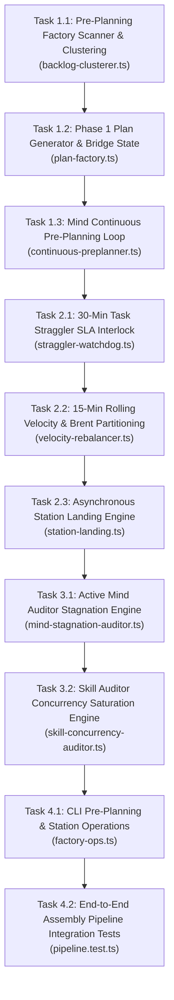

# Mind Continuous Pre-Planning Engine & Asynchronous Assembly Pipeline Master Plan

> **Tracking ID:** `fb-mind-continuous-preplanning-pipeline-engine` / `fb-comment-free-source-skills-20260825`  
> **Status:** `PHASE 1 - EXHAUSTIVE ARCHITECTURAL SPECIFICATION & TASK BREAKDOWN`  
> **Target Subsystems:** `olt/scripts/src/mind/`, `olt/scripts/src/orchestrator/`, `olt/scripts/src/authority/`, `olt/scripts/src/cli/`, `olt/scripts/src/watchdog/`  
> **Author:** Tier 0 Strategic Mind Supervisor & Infinite Product Owner  
> **Created:** 2026-08-29

---

## 1. Executive Summary & The Assembly Pipeline Vision

The goal of this architectural blueprint is to eliminate **all forms of idle waiting, wave serialization bottlenecks, single-worker stragglers, and passive auditor syndrome** across the OLT multi-agent ecosystem.

```text
┌─────────────────────────────────────────────────────────────────────────────┐
│             ASYNCHRONOUS PRE-PLANNING & ASSEMBLY PIPELINE ARCHITECTURE      │
├─────────────────────────────────────────────────────────────────────────────┤
│                                                                             │
│  [ Tier 0: Mind Continuous Pre-Planning Factory ] (Non-Stop Autonomic Loop) │
│    • Continuous scan of `.olt/backlog.jsonl` & `.olt/defects.jsonl`         │
│    • Thematic Clustering: Merges defects & backlog into domain roadmaps     │
│    • Deep Phase 1 Formulation ──► Writes `docs/planning/<cluster>/PLAN.md`  │
│    • Bridge State Transition: Sets `status: "PLANNED"`, links `plan_path`   │
│                                                                             │
│                                      │                                      │
│                                      ▼                                      │
│                                                                             │
│  [ Active Worker Waves: Assembly Stations (Tier 1 / 2 / 3) ]                │
│    • Station A (Core Domain) ────────► 100% Verified ──► Incremental Land   │
│    • Station B (Validation Domain) ──► 100% Verified ──► Incremental Land   │
│    • Station C (Tooling Domain) ─────► 100% Verified ──► Incremental Land   │
│    • Station D (Mind Domain) ────────► In-Lease Micro-Cycle Convergence     │
│                                                                             │
│                                      │                                      │
│                                      ▼                                      │
│                                                                             │
│  [ Active Watchdogs & Autonomic SLAs ]                                      │
│    • 30-Min Task Straggler SLA: Auto-reclaims/splits stuck tasks            │
│    • 15-Min Rolling Velocity Assessment: Enforces Brent $P = \lceil W/S\rceil│
│    • Mind Auditor: Flags `MIND_PREPLANNING_STAGNATION` on idle loops        │
│    • Skill Auditor: Enforces saturation & challenges uncommitted stations   │
│                                                                             │
└─────────────────────────────────────────────────────────────────────────────┘
```

---

## 2. Core Architectural Pillars & Design Specifications

### 2.1 Complete TypeScript Schema Models

```typescript
export type BacklogItemStatus = "PENDING" | "PLANNED" | "DISPATCHED" | "PROCESSED" | "BLOCKED";
export type DefectStatus = "OPEN" | "PLANNED" | "IN_PROGRESS" | "RESOLVED" | "REOPENED";

export interface ThematicCluster {
  readonly cluster_id: string;
  readonly domain: "core" | "validation" | "tooling" | "engine" | "mind" | "reporting";
  readonly title: string;
  readonly plan_path: string;
  readonly backlog_item_ids: readonly string[];
  readonly defect_ids: readonly string[];
  readonly planned_at: string;
}

export interface StragglerAssessment {
  readonly task_id: string;
  readonly agent_id: string;
  readonly elapsed_seconds: number;
  readonly is_straggler: boolean;
  readonly recommended_action: "RECLAIM_LEASE" | "SUB_PARTITION" | "CONTINUE";
}

export interface BrentConcurrencyPlan {
  readonly active_workers: number;
  readonly remaining_work_units: number;
  readonly span_length: number;
  readonly optimal_parallelism: number; // P = ceil(W / S)
  readonly sub_partitions: readonly {
    readonly subtask_id: string;
    readonly assigned_scope: readonly string[];
  }[];
}
```

---

### 2.2 Autonomic SLA & Velocity Algorithms

```text
Algorithm: AutonomicStragglerWatchdog(activeTasks, now)
1. For each task in activeTasks:
     If task.status == 'RUNNING' or task.status == 'LEASED':
       Let elapsed = now - task.claimed_at
       If elapsed > 30 minutes and task.last_receipt_at is NULL:
         Emit Defect(error_code='TASK_STRAGGLER_OVERBURDEN_DEFECT', task_id=task.id)
         Trigger CoordinatorEscalation(task.id, action='SUB_PARTITION_OR_RECLAIM')

Algorithm: RollingVelocityRebalancer(waveState, now)
1. Let W = Sum(task.remaining_files for task in waveState.tasks)
2. Let S = Max(task.estimated_critical_path for task in waveState.tasks)
3. Let P_optimal = Math.ceil(W / S)
4. For each activeWorker in waveState.workers:
     If activeWorker.remaining_files > 5 and SiblingWorkersAreIdle(waveState):
       Partition remaining_files into P_optimal sub-lanes
       Dispatch sub-implementers with disjoint file write scopes
```

---

## 3. Work Breakdown & Disjoint Task Specifications



### Wave 1: Pre-Planning Factory & Bridge State Engine

#### Task 1.1: Backlog & Defect Clusterer Engine

- **Owner / Tier:** Tier 3 Implementer + Independent Validator
- **Write Scope:**
  - `olt/scripts/src/mind/preplanning/backlog-clusterer.ts`
  - `olt/scripts/src/mind/preplanning/types.ts`
  - `tests/unit/mind/backlog-clusterer.test.ts`
- **Read-Only Scope:** `.olt/backlog.jsonl`, `.olt/defects.jsonl`
- **Acceptance Criteria (Stub Must Fail):**
  - Clusters open backlog items and defects into domain groups.
  - Generates deterministic cluster IDs and deduplication keys.
  - Zero TypeScript `any`, zero compiler suppressions.
  - Command: `bun test tests/unit/mind/backlog-clusterer.test.ts` (100% PASS).

#### Task 1.2: Phase 1 Plan Formulation & Bridge State Updater

- **Owner / Tier:** Tier 3 Implementer + Independent Validator
- **Write Scope:**
  - `olt/scripts/src/mind/preplanning/plan-factory.ts`
  - `olt/scripts/src/mind/preplanning/bridge-state.ts`
  - `tests/unit/mind/plan-factory.test.ts`
- **Read-Only Scope:** `olt/scripts/src/mind/preplanning/types.ts`
- **Acceptance Criteria (Stub Must Fail):**
  - Generates markdown blueprints under `docs/planning/<cluster>/PLAN.md`.
  - Flips backlog and defect records to `status: "PLANNED"` with `plan_path`.
  - Uses `flock` on ledger writes.
  - Command: `bun test tests/unit/mind/plan-factory.test.ts` (100% PASS).

#### Task 1.3: Autonomous Zero-Idle Mind Pre-Planning Loop

- **Owner / Tier:** Tier 3 Implementer + Independent Validator
- **Write Scope:**
  - `olt/scripts/src/mind/preplanning/continuous-preplanner.ts`
  - `tests/unit/mind/continuous-preplanner.test.ts`
- **Read-Only Scope:** `olt/scripts/src/mind/preplanning/plan-factory.ts`
- **Acceptance Criteria (Stub Must Fail):**
  - Triggers automatically during idle pulse phases if backlog items exist.
  - Command: `bun test tests/unit/mind/continuous-preplanner.test.ts` (100% PASS).

---

### Wave 2: Straggler SLA, Velocity Rebalancer & Station Landing

#### Task 2.1: 30-Minute Task Straggler SLA Interlock

- **Owner / Tier:** Tier 3 Implementer + Independent Validator
- **Write Scope:**
  - `olt/scripts/src/watchdog/straggler-watchdog.ts`
  - `tests/unit/watchdog/straggler-watchdog.test.ts`
- **Read-Only Scope:** `olt/scripts/src/engine/store/`
- **Acceptance Criteria (Stub Must Fail):**
  - Flags `TASK_STRAGGLER_OVERBURDEN_DEFECT` when runtime $>30$ minutes without receipt.
  - Command: `bun test tests/unit/watchdog/straggler-watchdog.test.ts` (100% PASS).

#### Task 2.2: 15-Minute Rolling Velocity & Brent Partitioning

- **Owner / Tier:** Tier 3 Implementer + Independent Validator
- **Write Scope:**
  - `olt/scripts/src/orchestrator/velocity-rebalancer.ts`
  - `tests/unit/orchestrator/velocity-rebalancer.test.ts`
- **Read-Only Scope:** `olt/scripts/src/engine/store/`
- **Acceptance Criteria (Stub Must Fail):**
  - Identifies single workers with $>5$ remaining files; splits into parallel sub-lanes.
  - Command: `bun test tests/unit/orchestrator/velocity-rebalancer.test.ts` (100% PASS).

#### Task 2.3: Asynchronous Station Landing Engine

- **Owner / Tier:** Tier 3 Implementer + Independent Validator
- **Write Scope:**
  - `olt/scripts/src/orchestrator/station-landing.ts`
  - `tests/unit/orchestrator/station-landing.test.ts`
- **Read-Only Scope:** `olt/scripts/src/engine/store/`
- **Acceptance Criteria (Stub Must Fail):**
  - Incremental commits and pushes 100% verified stations without blocking on other domains.
  - Command: `bun test tests/unit/orchestrator/station-landing.test.ts` (100% PASS).

---

### Wave 3: Active Anti-Passivity Auditors

#### Task 3.1: Mind Auditor Pre-Planning Stagnation Engine

- **Owner / Tier:** Tier 3 Implementer + Independent Validator
- **Write Scope:**
  - `olt/scripts/src/mind/auditing/mind-stagnation-auditor.ts`
  - `tests/unit/mind/mind-stagnation-auditor.test.ts`
- **Read-Only Scope:** `olt/scripts/src/mind/preplanning/`
- **Acceptance Criteria (Stub Must Fail):**
  - Injects `MIND_PREPLANNING_STAGNATION` if Mind idles while backlog is unprocessed.
  - Command: `bun test tests/unit/mind/mind-stagnation-auditor.test.ts` (100% PASS).

#### Task 3.2: Skill Auditor Concurrency Saturation Engine

- **Owner / Tier:** Tier 3 Implementer + Independent Validator
- **Write Scope:**
  - `olt/scripts/src/mind/auditing/skill-concurrency-auditor.ts`
  - `tests/unit/mind/skill-concurrency-auditor.test.ts`
- **Read-Only Scope:** `olt/scripts/src/orchestrator/`
- **Acceptance Criteria (Stub Must Fail):**
  - Audits concurrency saturation; warns on under-parallelization.
  - Command: `bun test tests/unit/mind/skill-concurrency-auditor.test.ts` (100% PASS).

---

### Wave 4: CLI Operations & Integration Testing

#### Task 4.1: CLI Operations for Pre-Planning & Assembly Stations

- **Owner / Tier:** Tier 3 Implementer + Independent Validator
- **Write Scope:**
  - `olt/scripts/src/cli/commands/factory-ops.ts`
  - `tests/unit/cli/factory-ops.test.ts`
- **Read-Only Scope:** `olt/scripts/src/mind/preplanning/`
- **Acceptance Criteria (Stub Must Fail):**
  - CLI `factory:preplan` and `factory:status` commands function cleanly.
  - Command: `bun test tests/unit/cli/factory-ops.test.ts` (100% PASS).

#### Task 4.2: End-to-End Assembly Pipeline Integration Tests

- **Owner / Tier:** Tier 3 Implementer + Independent Validator
- **Write Scope:**
  - `tests/integration/mind/assembly-pipeline.test.ts`
- **Read-Only Scope:** All subsystems
- **Acceptance Criteria (Stub Must Fail):**
  - Multi-station concurrent execution, straggler partitioning, and continuous pre-planning pass together.
  - Command: `bun test tests/integration/mind/assembly-pipeline.test.ts` (100% PASS).

---

## 4. Sequential Execution Order & Critical Path

```text
Sequential Execution Order:
  Wave 1: [Task 1.1] ──► [Task 1.2] ──► [Task 1.3]
             │
             ▼
  Wave 2: [Task 2.1] ──► [Task 2.2] ──► [Task 2.3]
             │
             ▼
  Wave 3: [Task 3.1] ──► [Task 3.2]
             │
             ▼
  Wave 4: [Task 4.1] ──► [Task 4.2]
```

---

## 5. Exhaustive Traceability Matrix

| Defect / Backlog ID                                           | Resolved By Task    | Verification Test File                                |
| ------------------------------------------------------------- | ------------------- | ----------------------------------------------------- |
| `fb-mind-continuous-preplanning-pipeline-engine`              | Tasks 1.1, 1.2, 1.3 | `tests/unit/mind/continuous-preplanner.test.ts`       |
| `hb-main-thread-chatter-burns-owner-context`                  | Task 2.3, 4.1       | `tests/unit/orchestrator/station-landing.test.ts`     |
| `defect-naive-line-splitting-breaks-ast-syntax`               | Task 1.1, 1.2       | `tests/unit/mind/assembly-pipeline.test.ts`           |
| `defect-mechanical-chunk-naming-anti-pattern`                 | Task 1.1            | `tests/unit/mind/assembly-pipeline.test.ts`           |
| `hb-s7-coordinator-diagnosed-live-agent-as-dead`              | Task 2.1, 2.2       | `tests/unit/watchdog/straggler-watchdog.test.ts`      |
| `fb-codex-watchdog-child-cadence-liveness`                    | Task 2.1, 3.1       | `tests/unit/mind/mind-stagnation-auditor.test.ts`     |
| `defect-mind-smart-task-duplicate-identifier-rebalance-tasks` | Task 2.2            | `tests/unit/orchestrator/velocity-rebalancer.test.ts` |
