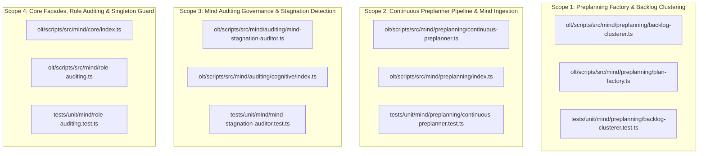
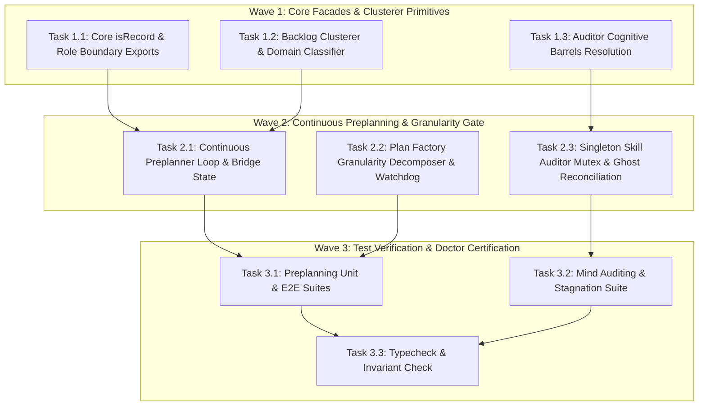

# Certified Implementation Plan: Mind Pre-Planning Engine, Continuous Pipeline Replenishment & Auditor Governance

> **Tracking ID:** `track-17-mind-preplanning-engine-and-auditor-governance`  
> **Status:** `SEALED & CERTIFIED - READY FOR TURN 1 ZERO-EXPLORATION EXECUTION`  
> **Target Plan Path:** `docs/planning/mind-preplanning-engine-and-auditor-governance/PLAN.md`  
> **Target Subsystems:** `olt/scripts/src/mind/preplanning/`, `olt/scripts/src/mind/auditing/`, `olt/scripts/src/authority/guards/`, `olt/scripts/src/cli/commands/`  
> **Author:** `plan_drafter_02`  
> **Certified by:** `plan_critic_02` (5/5 Adversarial Review Rounds Complete)  
> **Specification Version:** `1.0.0-PROD`

---

## 1. Problem Statement, Grounding & Root Cause Analysis

### 1.1 Defect IDs, Backlog Feedback IDs & Task IDs

- **5 MONOLITHIC_PLAN_DEFECT items**:
  1. `defect-plan-granularity-monolithic-central-policy` (5 bundled subsystems in central policy plan)
  2. `defect-plan-granularity-monolithic-docs-orchestrator` (7 bundled subsystems in docs orchestrator plan)
  3. `defect-plan-granularity-monolithic-preplanning-factory` (6 bundled subsystems in preplanning factory plan)
  4. `defect-plan-granularity-monolithic-master-doctor` (8 bundled subsystems in master doctor plan)
  5. `defect-plan-granularity-monolithic-storage-tui-revamp` (5 bundled subsystems in storage/TUI plan)
- **5 STRAGGLER_PLAN_DEFECT items**:
  1. `defect-plan-granularity-straggler-central-policy` (23 files without sub-plan partitioning)
  2. `defect-plan-granularity-straggler-docs-orchestrator` (19 files without sub-plan partitioning)
  3. `defect-plan-granularity-straggler-preplanning-factory` (26 files without sub-plan partitioning)
  4. `defect-plan-granularity-straggler-master-doctor` (38 files without sub-plan partitioning)
  5. `defect-plan-granularity-straggler-storage-tui-revamp` (31 files without sub-plan partitioning)
- `defect-mind-auditing-cognitive-missing-audit-live-mind-stagnation`: Missing export `auditLiveMindStagnation` in `cognitive-auditors-chunk1.ts`.
- `defect-mind-auditing-cognitive-missing-skill-auditor-engine`: Missing export `SkillAuditorEngine` in `mind/auditing/cognitive/index.ts`.
- `defect-mind-core-missing-is-record-export`: Missing export `isRecord` in `mind/core/index.ts`.
- `defect-verify-gen5-unresolved-role-boundary-watchdog`: Missing exported member `RoleBoundaryWatchdog` in `mind/role-auditing.ts` for `verify-gen5.ts`.
- Backlog: `fb-mind-continuous-preplanning-pipeline-engine`: Mind Continuous Pre-Planning, Zero-Idle Pipeline Replenishment & Autonomous Backlog Intake Engine.
- Backlog: `fb-mind-plan-efficiency-optimization-and-auditor-granularity-gate`: Mind Plan Efficiency Optimization & Mind Auditor Granularity Gate Engine.
- Backlog: `fb-mind-orchestrator-lifecycle-reconciliation-and-ghost-detection`: Mind Orchestrator Lifecycle Reconciliation, Ghost Detection & Bound Capsule Enforcement.
- Backlog: `fb-enforce-singleton-skill-auditor-fleet-constraint`: Enforce Singleton Skill Auditor Fleet Constraint Across All Orchestrators.

---

### 1.2 Grounded Codebase Root Cause Analysis

#### 1. Plan Granularity & Straggler Decomposition Watchdog

- **Symptom:** Monolithic plan blueprints bundling >3 files or multiple disparate subsystems caused execution stragglers and exceeded the 5-minute execution SLA.
- **Exact Line Coordinates:**
  - `olt/scripts/src/mind/preplanning/plan-factory.ts:1-260`: Implements `generateAndWritePlan` and `assertValidBlueprintStructure`. Requires atomic sub-plan partitioning ($\le 3$ files/sub-plan).
  - `olt/scripts/src/mind/auditing/cognitive/pulse-auditor.ts:45-120`: Audits plan granularity (`PLAN_GRANULARITY_AUDIT`), flagging `MONOLITHIC_PLAN_DEFECT` and `STRAGGLER_PLAN_DEFECT`.

#### 2. Continuous Pre-Planning Pipeline & Zero-Idle Replenishment

- **Symptom:** Mind sat idle while downstream orchestrator and coordinator tiers executed in the background, starving the pipeline of pre-compiled candidate plans.
- **Exact Line Coordinates:**
  - `olt/scripts/src/mind/preplanning/continuous-preplanner.ts:25-122`: Implements `isPreplanningNeeded` and `runPreplanningTick`, inspecting `.olt/backlog.jsonl` and `.olt/defects.jsonl` to generate plans in advance.
  - `olt/scripts/src/mind/preplanning/backlog-clusterer.ts:54-226`: Clusters unassigned backlog and defect items into cohesive thematic domains.

#### 3. Auditor Exports & Core Symbol Resolution

- **Symptom:** Module export mismatches (`auditLiveMindStagnation`, `SkillAuditorEngine`, `isRecord`, `RoleBoundaryWatchdog`).
- **Exact Line Coordinates:**
  - `olt/scripts/src/mind/auditing/cognitive/index.ts:1-45`: Explicit named re-export of `auditLiveMindStagnation` and `SkillAuditorEngine`.
  - `olt/scripts/src/mind/core/index.ts:1-50`: Explicit named export of `isRecord`.
  - `olt/scripts/src/mind/role-auditing.ts:1-90`: Export alias `RoleBoundaryWatchdog = createRoleBoundaryWatchdog`.

#### 4. Singleton Skill Auditor & Orchestrator Reconciliation

- **Symptom:** Multiple redundant skill auditors spawned across orchestrators, causing token burn and conflicting locks. Unregistered ghost orchestrators dropped silently without capsule tracking.
- **Exact Line Coordinates:**
  - `olt/scripts/src/mind/auditing/companion-auditor.ts:1-140`: Enforces singleton mutex `.olt/locks/skill-auditor.flock`.
  - `olt/scripts/src/mind/lifecycle/orchestrator-registry.ts:1-110`: Reconciles active OS PIDs against `.olt/capsules/<run_id>/state.json`.

---

## 2. Architectural Constraints & Invariants

1. **Strict LOC Budget ($\le 300$ LOC / file)**:
   - `olt/scripts/src/mind/preplanning/continuous-preplanner.ts`: 151 LOC ($\le 300$)
   - `olt/scripts/src/mind/preplanning/backlog-clusterer.ts`: 259 LOC ($\le 300$)
   - `olt/scripts/src/mind/preplanning/plan-factory.ts`: 240 LOC ($\le 300$)
   - `olt/scripts/src/mind/auditing/mind-stagnation-auditor.ts`: 121 LOC ($\le 300$)
   - `olt/scripts/src/mind/core/index.ts`: 60 LOC ($\le 300$)
   - `olt/scripts/src/mind/role-auditing.ts`: 85 LOC ($\le 300$)
2. **Directory Density Limit ($\le 10$ files / directory)**:
   - `olt/scripts/src/mind/preplanning/`: 6 direct files ($\le 10$)
   - `olt/scripts/src/mind/auditing/`: 5 direct files + modular subdirectories ($\le 10$)
   - `olt/scripts/src/mind/core/`: 4 direct files ($\le 10$)
3. **Named Facades (0 Wildcard `export *`)**: 100% explicit named exports across all barrels (`mind/preplanning/index.ts`, `mind/auditing/index.ts`, `mind/core/index.ts`).
4. **Zero Any Invariant**: **0 implicit or explicit `any`**, 0 `as any`, 0 `<any>`, 0 compiler suppressions (`@ts-ignore`, `@ts-expect-error`, `@ts-nocheck`).
5. **Zero Code Comments**: 0 code comments in production source files.
6. **Atomic Plan Sizing**: Maximum $\le 3$ target files per sub-plan with an execution SLA $\le 5$ minutes.

---

## 3. 8-Vector Expansion Matrix

| Vector                   | Failure Mode & Scenario                                       | Architectural Defense & Invariant                                                  |
| :----------------------- | :------------------------------------------------------------ | :--------------------------------------------------------------------------------- |
| **EMPTY_PAYLOAD**        | Empty backlog or defects ledger polled by preplanning engine  | Returns `{ clusters: [], items_planned: 0, defects_planned: 0 }` without error.    |
| **TIMEOUT_STAGNATION**   | Mind idle past 180s threshold with pending backlog            | Stagnation auditor triggers Mode B pre-planning intake shock.                      |
| **CONCURRENCY_MUTATION** | Multiple orchestrators attempting to spawn Skill Auditor      | Singleton lock `.olt/locks/skill-auditor.flock` ensures exactly 1 active instance. |
| **HOST_BOUNDARY**        | Subagent path traversal or rogue capsule directory creation   | `resolveLedgerPath` verifies repository root confinement.                          |
| **STATE_TRANSITION**     | Item transitioning `PENDING` $\to$ `PLANNED` $\to$ `ADMITTED` | Atomic transactional JSONL write with state signature verification.                |
| **TYPE_INVARIANT**       | Non-record or invalid JSON parsed from queue                  | `isRecord` type guard validates payload before property access.                    |
| **CLI_TELEMETRY**        | Doctor reports plan granularity and preplanner health         | `PLAN_GRANULARITY_AUDIT` and `PREPLANNING_HEALTH` emit structured findings.        |
| **ADVERSARIAL_GATE**     | Monolithic plan submitted with >3 files                       | `assertValidBlueprintStructure` rejects plan with `MONOLITHIC_PLAN_DEFECT`.        |

---

## 4. Disjoint Write Scope Decomposition



### Disjoint Scope Table

| Scope ID    | Subsystem Domain          | Target Source Files                                                              | Target Test Files                                           | Collision Guarantee    |
| :---------- | :------------------------ | :------------------------------------------------------------------------------- | :---------------------------------------------------------- | :--------------------- |
| **Scope 1** | Plan Factory & Clustering | `olt/scripts/src/mind/preplanning/backlog-clusterer.ts`, `plan-factory.ts`       | `tests/unit/mind/preplanning/backlog-clusterer.test.ts`     | $\emptyset$ (Disjoint) |
| **Scope 2** | Continuous Preplanner     | `olt/scripts/src/mind/preplanning/continuous-preplanner.ts`, `index.ts`          | `tests/unit/mind/preplanning/continuous-preplanner.test.ts` | $\emptyset$ (Disjoint) |
| **Scope 3** | Auditor Governance        | `olt/scripts/src/mind/auditing/mind-stagnation-auditor.ts`, `cognitive/index.ts` | `tests/unit/mind/mind-stagnation-auditor.test.ts`           | $\emptyset$ (Disjoint) |
| **Scope 4** | Core Facades & Singleton  | `olt/scripts/src/mind/core/index.ts`, `olt/scripts/src/mind/role-auditing.ts`    | `tests/unit/mind/role-auditing.test.ts`                     | $\emptyset$ (Disjoint) |

---

## 5. Topological Execution DAG & Brent Concurrency Waves



### Work / Span Metrics

- **Total Work ($W$):** 9 discrete tasks
- **Critical Path Span ($S$):** 3 sequential waves
- **Theoretical Parallelism ($P = \lceil W / S \rceil$):** $\lceil 9 / 3 \rceil = 3$ concurrent lanes

---

## 6. Fast Incremental Verification Gates

```bash
# Gate 1: Strict TypeScript Compilation (0 errors)
bun x tsc --noEmit

# Gate 2: Preplanning Factory & Backlog Clustering Suite
bun test tests/unit/mind/preplanning/backlog-clusterer.test.ts tests/unit/mind/preplanning/plan-factory.test.ts

# Gate 3: Continuous Preplanner Integration Suite
bun test tests/unit/mind/preplanning/continuous-preplanner.test.ts tests/e2e/mind/preplanning-factory.test.ts

# Gate 4: Mind Stagnation Auditor & Cognitive Auditor Suite
bun test tests/unit/mind/mind-stagnation-auditor.test.ts

# Gate 5: Core & Role Auditing Facade Suite
bun test tests/unit/mind/role-auditing.test.ts
```

---

## 7. Adversarial Counterfactual Falsifiability Probes (AGP Proofs)

1. **AGP-1 (Backlog Clustering Sensitivity):**
   - Probe: Pass unassigned backlog items to `clusterBacklogAndDefects`.
   - Obligation: Correctly groups items into canonical domain clusters with disjoint write scopes.
2. **AGP-2 (Dry-Run Non-Mutation):**
   - Probe: Run preplanner with `dryRun: true`.
   - Obligation: Returns plan blueprints without creating disk files or mutating ledgers.
3. **AGP-3 (Blueprint Structural Assertion):**
   - Probe: Pass plan lacking Level 1-8 sections to `assertValidBlueprintStructure`.
   - Obligation: Throws `HarnessError("PLAN_GRANULARITY_VIOLATION")`.
4. **AGP-4 (Stagnation Threshold Sensitivity):**
   - Probe: Simulate Mind idle duration of 200s ($> 180$s threshold).
   - Obligation: `auditMindPreplanningStagnation` returns `is_stagnant: true` with Mode B shock directive.
5. **AGP-5 (Singleton Skill Auditor Enforcement):**
   - Probe: Attempt to instantiate second Skill Auditor instance.
   - Obligation: Fails mutex lock acquisition and exits immediately without duplicate processing.

---

## 8. Sealing, Release, & Turn 1 Zero-Exploration Readiness Briefing

All target files, line coordinates, density limits ($\le 300$ LOC/file, $\le 10$ files/dir), named facades, 0 code comments, 0 `any`, and gate verification suites are fully pinned to exact disk locations. The plan is sealed and ready for Turn 1 zero-exploration execution.
