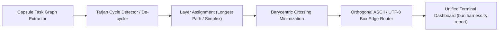

# Phase 1 Implementation Plan: Master Reporting Dashboard & Sugiyama DAG Visualizer

- **Status**: `PLANNED`
- **Domain**: `tooling` / `reporting` / `visualization`
- **Owner**: Tier 0 Strategic Mind Supervisor
- **Target Lineage**: `.olt/capsules/mind-gen-6`
- **Associated Backlog Item**: `fb-1787971784118-1aghp`
- **Associated Defects**: `defect-reporting-unified-sections-missing-sugiyama-export`, `defect-living-tracer-unresolved-replay-context`, `defect-html-reporter-escaped-backtick-unterminated-literal`, `defect-reporting-theme-duplicate-declarations`

---

## 1. Executive Summary & Problem Statement

Complete visibility into long-task execution requires a self-contained, zero-LLM reporting dashboard (`bun harness.ts report`) that renders:

1. **Canonical Sugiyama Layered DAG Engine**:
   - Layered ranking via longest-path and Coffman-Graham algorithms.
   - Barycentric heuristic crossing minimization between layers.
   - Orthogonal ASCII edge routing with collision avoidance.
   - Tarjan strongly connected components (SCC) cycle detection.
   - Subagent tree hierarchy expansion with collapsible subgraphs.
2. **Implementer-Validator Dual Tracking**:
   - Explicitly displays assigned Implementer and Validator per task node.
   - Tracks cognitive feedback pushback rounds (`Pushes: X/Y`) and adversarial probe counts (`Probes: X/Y`).
   - Tracks micro-cycles (`Attempts: X/Y`, `In-Lease Repairs: Z`).
   - Computes coordinator-level throughput, span, and Brent concurrency ($P = \lceil W / S \rceil$).
3. **Zero-LLM Fast Terminal CLI Rendering**:
   - Formats ANSI / UTF-8 box drawing graphs instantaneously without API calls.

---

## 2. Sugiyama Pipeline Architecture

---

## 3. Work Breakdown & Execution Waves

### Wave 1: Canonical Sugiyama DAG Visualizer Engine

- Implement layered ranking in `reporting/sugiyama-dag/ranking.ts`.
- Implement barycentric crossing reduction in `reporting/sugiyama-dag/crossing.ts`.
- Implement orthogonal ASCII grid routing in `reporting/sugiyama-dag/routing.ts`.
- Implement Tarjan SCC detection in `reporting/sugiyama-dag/tarjan.ts`.
- Provide unified facade in `reporting/sugiyama-dag/index.ts`.

### Wave 2: Dual Implementer-Validator Tracking & Metrics

- Integrate task validation telemetry into report sections (`reporting/unified/sections.ts`).
- Display pushback rounds (`Pushes: 5/5`), adversarial probe verdicts, and in-lease micro-cycles.
- Fix missing exports (`SugiyamaDagReport`) and duplicate theme declarations in `reporting/theme/`.

### Wave 3: Verification & Visual Regression Testing

- Verify DAG visualizer against linear, diamond, multi-root, and cyclic test fixtures.
- Confirm zero TypeScript `any` and zero compiler suppressions across `reporting/**`.
- Verify terminal width responsiveness and line length limits.

---

## 4. Verification & Acceptance Criteria

| Criterion                      | Target                             | Verification Method                                       |
| ------------------------------ | ---------------------------------- | --------------------------------------------------------- |
| Sugiyama DAG Rendering         | Deterministic ASCII / UTF-8 output | Unit tests in `tests/unit/reporting/sugiyama-dag.test.ts` |
| Implementer / Validator status | Displayed per task node            | Snapshot test of `bun harness.ts report`                  |
| Pushback & probe counts        | Accurate tracking against quotas   | Test fixture with partial and complete pushbacks          |
| Type safety & purity           | 0 `any`, 0 suppressions            | `bun check:types` & `bun harness.ts task:check`           |
