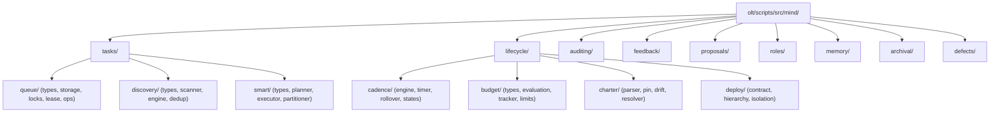

# Phase 1 Implementation Plan: Semantic Modularization & Domain-Semantic Naming Cleanup

- **Status**: `PLANNED`
- **Domain**: `architecture` / `modularization`
- **Owner**: Tier 0 Strategic Mind Supervisor
- **Target Lineage**: `.olt/capsules/mind-gen-6`
- **Associated Defects**: `defect-naive-line-splitting-breaks-ast-syntax`, `defect-mechanical-chunk-naming-anti-pattern`, `defect-mind-subchunk-missing-partitions`, `defect-engine-store-unresolved-mind-archival-import`, `defect-mind-defects-unresolved-aggregator-import`, `defect-mind-auditing-cognitive-unresolved-relative-imports`, `defect-mind-facade-missing-pulse-reclaim-and-value`, `defect-mind-tasks-partitioning-syntax-errors`, `defect-mind-archival-quiesce-missing-export`, `defect-mind-smart-task-duplicate-identifier-rebalance-tasks`, `defect-mind-lifecycle-deploy-missing-export`, `defect-mind-tasks-smart-duplicate-export-atomic-admission`, `defect-mind-smart-task-missing-map-feedback-priority`, `defect-mind-auditing-cognitive-missing-audit-live-mind-stagnation`, `defect-mind-auditing-cognitive-missing-skill-auditor-engine`, `defect-cli-commands-stale-mind-modularization-imports`, `defect-mind-duplicate-exports-auditor-cursor-and-proposal-limits`

---

## 1. Executive Summary & Problem Statement

Arbitrary mechanical file names (`*-chunkN.ts`, `*_partN.ts`, `slice_N.ts`, `subgroupN/`, `groupN/`) represent a severe architectural anti-pattern. They obscure domain intent, confuse human operators, fragment LLM attention, and risk AST syntax breakages when split mechanically rather than along semantic module boundaries.

This plan establishes strict **domain-semantic modularization** across all five domains of `@onurseckinsenoglu/skills` (`core`, `validation`, `tooling`, `engine`, `mind`), enforcing:

1. **Intention-Revealing Domain Naming**: Every file and folder is named after its specific single responsibility (e.g. `parser.ts`, `types.ts`, `rotator.ts`, `storage.ts`, `evaluator.ts`, `lease-manager.ts`, `gate-evaluator.ts`, `queue-drainer.ts`).
2. **Hard Modularity Constraints**:
   - File length: $\le 300$ physical lines per file.
   - Directory size: $\le 10$ direct files per directory.
   - Export hygiene: 0 `export *` wildcard barrels (explicit named exports only).
   - Type integrity: 0 `any` types, 0 `@ts-ignore` / `@ts-expect-error` suppressions.

---

## 2. Structural Decomposition Matrix

---

## 3. Work Breakdown & Execution Waves

### Wave 1: Mind Subsystem Semantic Normalization

- Refactor all remaining mechanical files in `mind/` into domain submodules:
  - `archival/`: `quiesce/`, `recycler/`, `rotate/`, `completed/`
  - `lifecycle/`: `budget/`, `cadence/`, `charter/`, `deploy/`, `rounds/`, `pulse/`, `liveness/`, `interval/`, `evolution/`, `purpose/`, `watchdog/`
  - `memory/`: `core/`, `digest/`, `sources/`
  - `proposals/`: `brief/`, `builder/`, `gates/`, `proposal/`
  - `roles/`: `dynamic/`
  - `tasks/`: `discovery/`, `queue/`, `smart/`
  - `auditing/`: `cognitive/`, `counterfactual/`, `flavor/`, `meta/`, `roles/`, `witness/`
- Enforce clean named-export facades (`index.ts`) in each directory.

### Wave 2: Line Count & Directory Count Hardening

- Split any module exceeding 300 physical lines into semantic companion files.
- Ensure no directory contains more than 10 direct files.
- Verify root `olt/scripts/src/mind/` contains strictly $\le 10$ files (facade `index.ts`).

### Wave 3: Full Test Suite Verification & Invariant Sealing

- Run complete defect test suite: `bun test tests/unit/defects` (68/68 PASS).
- Run complete mind test suite: `bun test tests/unit/mind` (85/85 files PASS, 1,343+ tests).
- Run TypeScript typecheck: `bun check:types` (0 errors).
- Verify invariant script: `bun scratch/audit-mind-invariants.ts` (0 violations).

---

## 4. Verification & Acceptance Criteria

| Criterion                       | Target | Verification Method                                               |
| ------------------------------- | ------ | ----------------------------------------------------------------- |
| Mechanical chunk/part files     | 0      | `grep_search` / `find_by_name` for `*chunk*`, `*part*`, `slice_*` |
| Files > 300 lines               | 0      | Automated AST line auditor script                                 |
| Directories > 10 files          | 0      | Directory entry count audit                                       |
| Wildcard exports (`export *`)   | 0      | AST export scanner                                                |
| TypeScript `any` & suppressions | 0      | AST linter (`bun harness.ts task:check`)                          |
| Unit Test Pass Rate             | 100%   | `bun test tests/unit/mind` & `bun test tests/unit/defects`        |
