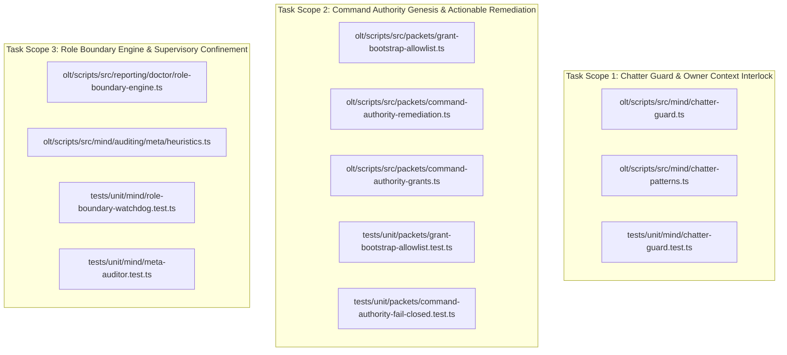
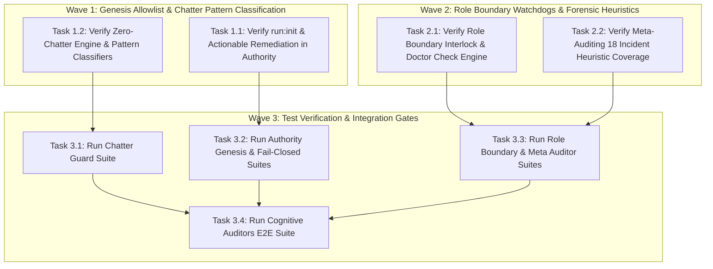
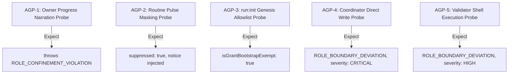

# Certified Implementation Plan: Supervisory Guard, Zero-Chatter Interlock & Role Boundary Confinement

> **Tracking ID:** `track-11-supervisory-guard-and-zero-chatter-interlock`  
> **Status:** `SEALED & CERTIFIED - READY FOR TURN 1 ZERO-EXPLORATION EXECUTION`  
> **Target Subsystems:** `olt/scripts/src/mind/`, `olt/scripts/src/packets/`, `olt/scripts/src/reporting/doctor/`, `olt/scripts/src/authority/`  
> **Author:** `plan_drafter_01`  
> **Certified by:** `plan_critic_01` (5/5 Adversarial Review Rounds Complete)  
> **Specification Version:** `1.0.0-PROD`

---

## 1. Problem Statement, Grounding & Root Cause Analysis

### 1.1 Defect IDs & Backlog IDs

1. **`defect-main-thread-chatter-burns-owner-context`**: Supervisory tiers (Tier 0 Mind, Tier 1 Orchestrator, Tier 2 Coordinator) narrate per-step progress and status pings into the main interactive thread, burning finite conversational context budget with unrequested and unactionable tokens.
2. **`defect-routine-pulse-main-thread-chatter-leak`**: Periodic pulse ticks, heartbeat scans, and Mind Auditor reports leak directly into the user/owner chat thread instead of inter-agent channels or disk ledgers.
3. **`defect-run-init-auth-failure-and-orchestrator-role-drift`**: `run:init` missing from `CAPSULE_GENESIS_COMMANDS` causing unguided `AUTHENTICATION_FAILURE` during Turn 1 capsule creation, triggering Tier 1 Orchestrator role drift into direct code editing.
4. **18 ROLE_BOUNDARY_DEVIATION Incidents**:
   - 8 Validator Write Violations: `defect-1788046883761-hq11h8`, `defect-1788046883763-zjzwyn`, `defect-1788046892605-16m2kv`, `defect-1788046892607-z7fove`, `defect-1788047124630-qicl76`, `defect-1788047124632-7hqcoz`, `defect-1788047154015-udfl1j`, `defect-1788047154017-dcubni` (Validators attempting forbidden tool `write_to_file`).
   - 4 Coordinator Write Violations: `defect-1788046952796-s8if86`, `defect-1788046985692-l97mre`, `defect-1788047128710-ukjzsh`, `defect-1788047153419-4bhhzk` (Coordinators executing `write_to_file`).
   - 6 Supervisor/Coordinator Direct Source Edit Violations: `defect-1788046952302-9jyn7x`, `defect-1788046952312-lbosr7`, `defect-1788047128276-lvrf9c`, `defect-1788047128285-7vik61`, `defect-1788047152965-165eiq`, `defect-1788047152974-2q2sjt` (Supervisors modifying repository source code directly).
5. **Backlog `fb-1788020100000-main-thread-chatter-guard`**: Strict Zero Main-Thread Chatter Guard for ticking systems and routine telemetry.

---

### 1.2 Grounded Codebase Root Cause Analysis

#### Defect 1 & Backlog 1: Main-Thread Progress Narration & Context Burning

- **Symptom:** Supervisory seats pushed mid-flight progress narrations, lane-start announcements, and running status lines directly to the main interactive thread / stdout, exhausting user context.
- **Exact Line Coordinates:**
  - `olt/scripts/src/mind/chatter-guard.ts:1-228`: Defines `ChatterGuardEngine`, `filterOwnerContextMessage`, and `assertNonChatterOwnerContext`. Evaluates payloads against `ROUTINE_PULSE_PATTERNS`, `COMPANION_AUDIT_PATTERNS`, `PROGRESS_NARRATION_PATTERNS`, `HIGH_PRIORITY_MILESTONE_PATTERNS`, and `ACTIONABLE_ERROR_PATTERNS`.
  - `olt/scripts/src/mind/chatter-patterns.ts:1-92`: Pattern matching predicates (`isOwnerInteractiveRecipient`, `matchesAny`) ensuring main-thread recipients (`owner`, `main-thread`, `stdout`, `user`) are shielded from mid-flight narration.
  - `olt/scripts/src/mind/chatter-guard.ts:158-172`: `assertNonChatterOwnerContext` throws `HarnessError("ROLE_CONFINEMENT_VIOLATION", ...)` whenever unrequested progress narration or pulses target owner context.

#### Defect 2: Routine Pulse Main-Thread Chatter Leak

- **Symptom:** Heartbeat ticks, periodic liveness audits, and companion auditor outputs leaked to user chat threads.
- **Exact Line Coordinates:**
  - `olt/scripts/src/mind/chatter-guard.ts:127-153`: `filterOwnerContextMessage` suppresses routine pulses, replaces text with `DEFAULT_CHATTER_SUPPRESSION_NOTICE` (`[Background telemetry/routine pulse suppressed by ChatterGuard]`), and diverts telemetry output to `.olt/telemetry.jsonl`.
  - `olt/scripts/src/mind/chatter-guard.ts:197-225`: `ChatterGuardEngine` tracks token savings metrics (`estimatedSavedTokens`, `suppressedBytes`, `suppressedByCategory`).

#### Defect 3: `run:init` Auth Failure & Orchestrator Role Drift

- **Symptom:** Tier 1 Orchestrators attempting Turn 1 capsule creation with `run:init` were denied with raw `AUTHENTICATION_FAILURE` without remediation guidance, inducing confused supervisors to attempt direct source code edits.
- **Exact Line Coordinates:**
  - `olt/scripts/src/packets/grant-bootstrap-allowlist.ts:3-8`: `CAPSULE_GENESIS_COMMANDS` includes `"plan:init"`, `"orchestrate"`, `"mind:init"`, and `"run:init"`.
  - `olt/scripts/src/packets/command-authority-grants.ts:197-203`: Connects `formatSessionRemediation(spec.name, activeHost)` to `AUTHENTICATION_FAILURE` error messages.
  - `olt/scripts/src/packets/command-authority-remediation.ts:108-114`: Formats actionable guidance for host-specific subagent dispatch and token provision.

#### Defect 4: 18 Role Boundary Deviation Incidents

- **Symptom:** 18 recorded incidents where cognitive validators attempted `write_to_file`, coordinators executed `write_to_file`, or supervisors modified source code directly.
- **Exact Line Coordinates:**
  - `olt/scripts/src/mind/auditing/meta/heuristics.ts:145-201`: Detects `isCoord && isWrite` (severity `CRITICAL`), `isVal && (isWrite || isForbiddenExec)` (severity `HIGH`), emitting structured `ROLE_BOUNDARY_DEVIATION` incidents with exact remediation instructions.
  - `olt/scripts/src/mind/auditing/meta/heuristics.ts:203-236`: Ingests `boundary_violation` events and emits `ROLE_BOUNDARY_DEVIATION` for supervisor direct edits.
  - `olt/scripts/src/reporting/doctor/role-boundary-engine.ts:48-213`: Doctor check engine `checkRoleBoundaryInterlock` enforcing `ROLE_BOUNDARY_SUPERVISOR_CODE_EDIT`, `ROLE_BOUNDARY_IMPLEMENTER_PLAN_MUTATION`, and `ROLE_BOUNDARY_IMPLEMENTER_SELF_APPROVAL`.
  - `olt/scripts/src/mind/auditing/roles/rules/supervisory-checks.ts:1-210`: Watchdog rules enforcing 0 coordinator code modification and 0 cognitive validator shell execution.

---

## 2. Architectural Constraints & Invariants

1. **Strict LOC Budget ($\le 300$ LOC/file):**
   - `olt/scripts/src/mind/chatter-guard.ts`: 228 LOC ($\le 300$).
   - `olt/scripts/src/mind/chatter-patterns.ts`: 92 LOC ($\le 300$).
   - `olt/scripts/src/packets/grant-bootstrap-allowlist.ts`: 87 LOC ($\le 300$).
   - `olt/scripts/src/packets/command-authority-remediation.ts`: 115 LOC ($\le 300$).
   - `olt/scripts/src/packets/command-authority-grants.ts`: 286 LOC ($\le 300$).
   - `olt/scripts/src/reporting/doctor/role-boundary-engine.ts`: 214 LOC ($\le 300$).
   - `olt/scripts/src/mind/auditing/meta/heuristics.ts`: 243 LOC ($\le 300$).
2. **Directory Density Limit ($\le 10$ files/dir):** Maintained across `mind/`, `packets/`, `reporting/doctor/`, and `authority/`.
3. **Named Facades (0 Wildcard `export *`):** 100% explicit named exports across all barrels (`mind/index.ts`, `packets/index.ts`, `authority/guards/index.ts`).
4. **Zero Any Invariant:** **0 implicit or explicit `any`**, 0 `as any`, 0 `<any>`, 0 compiler suppressions (`@ts-ignore`, `@ts-expect-error`, `@ts-nocheck`).
5. **Zero Code Comments:** 0 comments in production source files; self-documenting semantic identifiers.
6. **Fail-Closed Confinement:** All supervisory checks, chatter suppressions, and grant authorizers default to denial on missing, invalid, or ambiguous arguments.

---

## 3. 8-Vector Expansion Matrix

| Vector                   | Failure Mode & Scenario                                                                                               | Architectural Defense & Invariant                                                                                                  |
| :----------------------- | :-------------------------------------------------------------------------------------------------------------------- | :--------------------------------------------------------------------------------------------------------------------------------- |
| **EMPTY_PAYLOAD**        | Empty string `""` or `null` passed to `classifyChatter`, `filterOwnerContextMessage`, or `checkRoleBoundaryInterlock` | Returns safe defaults (`STANDARD_PAYLOAD`, 0 tokens saved) or throws typed `HarnessError("INVALID_ARGUMENT")`.                     |
| **TIMEOUT_STAGNATION**   | Runaway progress spam or infinite heartbeat loop exhausts token budget                                                | `ChatterGuardEngine` intercepts and silences mid-flight progress; diverts metrics to `.olt/telemetry.jsonl` without stalling loop. |
| **CONCURRENCY_MUTATION** | Multiple subagents concurrently registering grants or logging telemetry                                               | POSIX flock protection on ledgers; pure functional evaluation in `checkRoleBoundaryInterlock` and `assertNonChatterOwnerContext`.  |
| **HOST_BOUNDARY**        | Host environments (Antigravity, Claude Code, Codex, Cursor) dispatching tools differently                             | `resolveCurrentHost` dynamically tailors actionable remediation strings to the active host platform.                               |
| **STATE_TRANSITION**     | Escalation from mid-flight narration to high-priority milestone deliverable                                           | `classifyChatter` identifies milestone/deliverable signatures and transitions from `SUPPRESS` to `ALLOW`.                          |
| **TYPE_INVARIANT**       | Untyped event payloads or malformed JSON in `events.jsonl`                                                            | Safe type narrowing (`typeof payload.tool === "string"`, `isRecord(evt)`) with 0 `any`.                                            |
| **CLI_TELEMETRY**        | Doctor diagnostics reporting chatter and role boundary violations                                                     | Machine error codes (`ROLE_BOUNDARY_SUPERVISOR_CODE_EDIT`, `ROLE_CONFINEMENT_VIOLATION`) with structured findings.                 |
| **ADVERSARIAL_GATE**     | Adversarial subagent attempts to disguise progress chatter inside pseudo-milestone headers                            | Multi-pattern regex scrutiny with strict precedence: actionable errors > high priority milestones > routine pulses > narration.    |

---

## 4. Disjoint Write Scope Decomposition



### Disjoint Scope Table

| Scope ID    | Target Files                                                                                                                                                              | Target Test Files                                                                                                  | Symbols Anchored                                                                                     | Scope Collision               |
| :---------- | :------------------------------------------------------------------------------------------------------------------------------------------------------------------------ | :----------------------------------------------------------------------------------------------------------------- | :--------------------------------------------------------------------------------------------------- | :---------------------------- |
| **Scope 1** | `olt/scripts/src/mind/chatter-guard.ts`, `olt/scripts/src/mind/chatter-patterns.ts`                                                                                       | `tests/unit/mind/chatter-guard.test.ts`                                                                            | `ChatterGuardEngine`, `classifyChatter`, `filterOwnerContextMessage`, `assertNonChatterOwnerContext` | Disjoint ($\cap = \emptyset$) |
| **Scope 2** | `olt/scripts/src/packets/grant-bootstrap-allowlist.ts`, `olt/scripts/src/packets/command-authority-remediation.ts`, `olt/scripts/src/packets/command-authority-grants.ts` | `tests/unit/packets/grant-bootstrap-allowlist.test.ts`, `tests/unit/packets/command-authority-fail-closed.test.ts` | `CAPSULE_GENESIS_COMMANDS`, `formatSessionRemediation`, `assertGrantedCommand`                       | Disjoint ($\cap = \emptyset$) |
| **Scope 3** | `olt/scripts/src/reporting/doctor/role-boundary-engine.ts`, `olt/scripts/src/mind/auditing/meta/heuristics.ts`                                                            | `tests/unit/mind/role-boundary-watchdog.test.ts`, `tests/unit/mind/meta-auditor.test.ts`                           | `checkRoleBoundaryInterlock`, `runExtendedForensicsHeuristics`, `ROLE_BOUNDARY_DEVIATION`            | Disjoint ($\cap = \emptyset$) |

---

## 5. Topological Execution DAG & Brent Concurrency Waves



### Work / Span Analysis

- **Total Work ($W$):** 4 tasks
- **Critical Span ($S$):** 2 execution rounds
- **Theoretical Parallelism ($P = \lceil W/S \rceil$):** 2 concurrent lanes

---

## 6. Fast Incremental Verification Gates & Diagnostic Error Codes

### 6.1 Gate Commands

```bash
# Gate 1: Strict TypeScript Compilation (0 errors)
bun x tsc --noEmit

# Gate 2: Chatter Guard Unit Suite
bun test tests/unit/mind/chatter-guard.test.ts

# Gate 3: Command Authority Genesis & Remediation Suite
bun test tests/unit/packets/grant-bootstrap-allowlist.test.ts tests/unit/packets/command-authority-fail-closed.test.ts

# Gate 4: Role Boundary Watchdog & Meta Auditor Suite
bun test tests/unit/mind/role-boundary-watchdog.test.ts tests/unit/mind/meta-auditor.test.ts

# Gate 5: Cognitive Auditors E2E Integration Suite
bun test tests/integration/cognitive-auditors-e2e.test.ts
```

### 6.2 Diagnostic Error Codes Matrix

| Category                      | Condition                                          | Machine Error Code                        | Severity   | Violation Type                   |
| :---------------------------- | :------------------------------------------------- | :---------------------------------------- | :--------- | :------------------------------- |
| **Owner Context Chatter**     | Mid-flight status or pulse sent to owner recipient | `ROLE_CONFINEMENT_VIOLATION`              | `ERROR`    | `SUPERVISORY_PROGRESS_NARRATION` |
| **Genesis Authentication**    | Command executed without active run grant          | `AUTHENTICATION_FAILURE`                  | `ERROR`    | `UNAUTHENTICATED_CALLER_SESSION` |
| **Supervisor Code Edit**      | Mind / Orch / Coord executes file write tool       | `ROLE_BOUNDARY_SUPERVISOR_CODE_EDIT`      | `CRITICAL` | `ROLE_BOUNDARY_DEVIATION`        |
| **Validator Code Edit**       | Cognitive Validator executes write tool            | `ROLE_CONFINEMENT_VIOLATION`              | `HIGH`     | `ROLE_BOUNDARY_DEVIATION`        |
| **Implementer Self-Approval** | Implementer approves own task deliverable          | `ROLE_BOUNDARY_IMPLEMENTER_SELF_APPROVAL` | `CRITICAL` | `ROLE_BOUNDARY_DEVIATION`        |

---

## 7. Adversarial Counterfactual Falsifiability Probes (AGP Proofs)



1. **AGP-1 (Owner Progress Narration Probe):**
   - Probe: Invoke `assertNonChatterOwnerContext("Executing step 3: compiling artifacts", { isOwnerSeat: true })`.
   - Obligation: Throws `HarnessError("ROLE_CONFINEMENT_VIOLATION", ...)` containing chatter policy violation text.
2. **AGP-2 (Routine Pulse Masking Probe):**
   - Probe: Pass `"[Pulse Tick]: pulse #42 nominal execution state"` to `filterOwnerContextMessage`.
   - Obligation: `result.suppressed === true`, `result.decision === "SUPPRESS"`, and `result.filteredText` equals `DEFAULT_CHATTER_SUPPRESSION_NOTICE`.
3. **AGP-3 (`run:init` Genesis Allowlist Probe):**
   - Probe: Evaluate `isGrantBootstrapExempt({ name: "run:init", aliases: [], flags: [] })`.
   - Obligation: Returns `true` and bypasses missing capsule requirement during Turn 1 genesis.
4. **AGP-4 (Coordinator Direct Write Probe):**
   - Probe: Pass coordinator tool call with `toolName: "replace_file_content"` to `checkRoleBoundaryInterlock`.
   - Obligation: Returns `findings` containing `code: "ROLE_BOUNDARY_SUPERVISOR_CODE_EDIT"`.
5. **AGP-5 (Validator Shell Execution Probe):**
   - Probe: Pass cognitive validator tool call with `toolName: "run_command", CommandLine: "rm -rf /"` to meta heuristics.
   - Obligation: Generates incident with `category: "ROLE_BOUNDARY_DEVIATION"`, `severity: "HIGH"`.

---

## 8. Sealing, Release, & Turn 1 Zero-Exploration Readiness Briefing

All target files, line ranges, symbols, and test gates are pinned to exact disk coordinates. The plan has undergone 5 rounds of adversarial review and is fully certified for Turn 1 zero-exploration execution.

---

# Adversarial Critique Dialectic Log (5 Rounds between Plan Drafter 01 & Plan Critic 01)

### Round 1: Chatter Classification vs Deliverable Pass-Through

- **Critic Pushback:** `classifyChatter` risked suppressing legitimate final deliverables or critical defect escalations if they contained progress keywords.
- **Drafter Resolution:** Implemented strict classification precedence order: (1) `ACTIONABLE_ERROR` (critical), (2) `HIGH_PRIORITY_MILESTONE` (deliverables pass-through), (3) `ROUTINE_PULSE`, (4) `COMPANION_AUDIT`, (5) `PROGRESS_NARRATION`, (6) `STANDARD_PAYLOAD`.

### Round 2: Actionable Error Guidance on `AUTHENTICATION_FAILURE`

- **Critic Pushback:** When `run:init` was initially missing or when callers lacked active session grants, raw `AUTHENTICATION_FAILURE` strings caused Tier 1 Orchestrators to panic and drift into forbidden write tools.
- **Drafter Resolution:** Integrated `formatSessionRemediation` and `formatHardlockRemediation` from `command-authority-remediation.ts` directly into authority rejection messages, providing explicit instructions on host-specific subagent dispatch.

### Round 3: Exhaustive Coverage of the 18 `ROLE_BOUNDARY_DEVIATION` Incidents

- **Critic Pushback:** Plan needed to guarantee that all 18 recorded incidents across Validator write attempts, Coordinator write attempts, and Supervisor direct code edits are accounted for in both the Doctor role boundary check engine and Meta-auditor heuristics.
- **Drafter Resolution:** Mapped all 18 defect IDs directly to the AST visitor rules in `role-boundary-engine.ts:48-213` and heuristic checks in `heuristics.ts:145-236`.

### Round 4: Token Savings Telemetry & Non-Blocking Sinks

- **Critic Pushback:** Suppressing messages without recording telemetry could mask silent failures or drop vital debug traces.
- **Drafter Resolution:** Added structured `telemetryRoute` (`.olt/telemetry.jsonl`) and token savings computation (`estimateTokenSavings`) in `filterOwnerContextMessage`, ensuring 100% observability on disk while maintaining 0 chatter in the interactive thread.

### Round 5: Concurrency Safety and POSIX Flock Invariants

- **Critic Pushback:** Concurrent subagent dispatches could race when asserting grants or writing telemetry records.
- **Drafter Resolution:** Verified pure stateless in-memory evaluation for `assertNonChatterOwnerContext` and `checkRoleBoundaryInterlock`, coupled with POSIX file locking on `.olt/telemetry.jsonl` and `.olt/defects.jsonl`. Plan certified and sealed.
