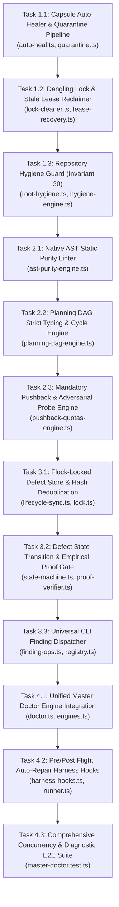

# Unified Master Doctor Engine, Auto-Healing & Flock-Locked Defect Lifecycle Plan

> **Tracking ID:** `fb-olt-unified-master-doctor-engine` / `fb-1787971784118-1aghp` / `fb-central-repo-policy-json-engine`  
> **Status:** `PHASE 1 - EXHAUSTIVE PRODUCTION-GRADE SPECIFICATION & TASK BREAKDOWN`  
> **Target Subsystems:** `olt/scripts/src/reporting/doctor/`, `olt/scripts/src/authority/guards/`, `olt/scripts/src/mind/defects/sync/`, `olt/scripts/src/logging/`, `olt/scripts/src/cli/`  
> **Author:** Tier 0 Strategic Mind Supervisor & Master Diagnostic Architect  
> **Created:** 2026-08-29  
> **Target Lineage:** `.olt/capsules/mind-gen-6`

---

## 1. Executive Summary & Problem Statement

The OLT autonomous development harness requires a unified, self-healing diagnostic standard engine (`bun harness.ts doctor` and `bun harness.ts doctor --fix`) that serves as the single source of truth for runtime integrity, architectural invariants, and code standards. Historically, diagnostics and health verification were fragmented across disjoint modules, leading to critical failure modes:

1. **Damaged Capsules & Torn JSON Tails (`defect-vestigial-runtime-ledgers-in-static-package-root`, `hb-s2-diffvalue-array-invariant`):**
   Sudden process interrupts, concurrent writes, or unhandled exceptions produced truncated JSON tails in `events.jsonl`, stale locks in `.locks/`, or desynchronized projections in `state.json`. Without automated quarantine and projection re-derivation, runs became irrevocably wedged.
2. **Repository Root & Package Directory Pollution (`defect-widespread-root-and-package-scratch-pollution`, `defect-root-hygiene-loose-files-detected`):**
   Autonomous subagents frequently deposited ad-hoc debug scripts (`fix-*.ts`, `refactor-*.ts`, `temp.py`) in the repository root or placed runtime logs inside the static package directory `olt/` instead of `.olt/`, breaching **Invariant 30 (Strict Scratch Confinement & Zero Root Clutter)**.
3. **Flock-Free Defect Race Conditions & Silent Regressions (`hb-main-thread-chatter-burns-owner-context`, `hb-authority-unregistered-actor-bypasses-role-enforcement`):**
   Multiple concurrent agents wrote to `.olt/defects.jsonl` without process-level file locks (`flock`), causing file corruption, row churn, and duplicate entries. Furthermore, defects marked `completed` were silently ignored when regressions occurred, lacking an intermediate state verification protocol and verifiable failure proofs (`commit_sha`, `test_assertion`, `task_id`).
4. **False-Positive AST Purity Failures in Tests (`defect-doctor-ast-purity-test-regex-false-positive`):**
   The AST purity checker evaluated raw lines using regular expressions (`/as any/`, `/<\s*any\s*>/`), flagging unit test assertions and mock verification suites that legitimately inspect or prohibit `any` tokens.
5. **Missing Pushback & Adversarial Probe Enforcement (`defect-doctor-missing-pushback-quota-verification`):**
   Tasks were permitted to complete without satisfying mandatory cognitive pushback quotas (`MANDATORY_COGNITIVE_PUSHBACKS=5`, `MIN_ADVERSARIAL_PROBES=5`), allowing superficial, unvalidated code changes to land.

### Unified Master Doctor Engine Architecture

```text
┌──────────────────────────────────────────────────────────────────────────────────────────┐
│                            UNIFIED MASTER DOCTOR ENGINE                                 │
├──────────────────────────────────────────────────────────────────────────────────────────┤
│                                                                                          │
│  [ CLI Entrypoint: `bun harness.ts doctor [--fix] [--run <capsule>]` ]                  │
│                                                                                          │
│  ┌────────────────────────────────────────────────────────────────────────────────────┐  │
│  │ 1. DEFAULT AUTO-HEALING & RECOVERY PIPELINE                                         │  │
│  │    • Torn JSON Tail Quarantine ──► `.olt/quarantine/<timestamp>-<hash>.json`      │  │
│  │    • Event-Chain Projection Reconstruction (Re-derives `state.json` from events)   │  │
│  │    • Stale Task Lease Auto-Recovery (`recoverStale()`)                             │  │
│  │    • Dangling Flock Lock Cleansing (Dead PID probe via `kill(pid, 0)`)             │  │
│  │    • Vestigial Runtime Ledger Migration (`olt/defects.jsonl` ──► `.olt/`)         │  │
│  └───────────────────────────────────┬────────────────────────────────────────────────┘  │
│                                      │                                                   │
│                                      ▼                                                   │
│  ┌────────────────────────────────────────────────────────────────────────────────────┐  │
│  │ 2. REPOSITORY HYGIENE GUARD (INVARIANT 30)                                         │  │
│  │    • Strict Root Whitelist Audit (0 loose scripts in repository root)              │  │
│  │    • Static Package Purity (0 runtime files in `olt/`)                             │  │
│  │    • Scratch Confinement Enforcement (Scratch files ONLY in `scratch/` or `.olt/`) │  │
│  └───────────────────────────────────┬────────────────────────────────────────────────┘  │
│                                      │                                                   │
│                                      ▼                                                   │
│  ┌────────────────────────────────────────────────────────────────────────────────────┐  │
│  │ 3. SUITE OF 8 INTEGRATED DIAGNOSTIC CHECK ENGINES                                  │  │
│  │    ├── E1: Planning DAG Engine (Tarjan SCC Cycle Detection & Orphan Probe)         │  │
│  │    ├── E2: AST Static Purity Linter (TypeScript Compiler AST Tokenization)         │  │
│  │    ├── E3: Anti-Mock & Mutation Gate Engine (Zero-Mock Tautology Enforcement)      │  │
│  │    ├── E4: Anti-Batching & 1:1 Isolation Engine (Single-Task Dispatch Invariant)   │  │
│  │    ├── E5: Dual-Channel UI Engine (DOM + Optical Canvas & Theme Contrast)         │  │
│  │    ├── E6: Cognitive Validator Command Hard-Lock (0 `run:exec`, 0 tests, 0 bash)   │  │
│  │    ├── E7: Role Boundary Interlock Engine (Tier Confinement 0/1/2/3 Isolation)     │  │
│  │    └── E8: Pushback Quota Engine (5 Cognitive Pushbacks + 5 Adversarial Probes)    │  │
│  └───────────────────────────────────┬────────────────────────────────────────────────┘  │
│                                      │                                                   │
│                                      ▼                                                   │
│  ┌────────────────────────────────────────────────────────────────────────────────────┐  │
│  │ 4. FLOCK-LOCKED DEFECT LIFECYCLE SYNC ENGINE                                       │  │
│  │    • Normalized SHA-256 Signature Deduplication                                    │  │
│  │    • State Machine Transitions: `open` ──► `in_remediation` ──► `resolved`         │  │
│  │    • Empirical Proof Regression Protocol: `completed` ──► `deliberating` ──► `open`│  │
│  │    • Universal `finding:file` CLI API for All Observing Roles                      │  │
│  │    • Non-Blocking Multi-Process Concurrency Lock (`withDefectLogMutationLock`)     │  │
│  └────────────────────────────────────────────────────────────────────────────────────┘  │
└──────────────────────────────────────────────────────────────────────────────────────────┘
```

---

## 2. Core Architectural Specifications

### 2.1 Default Auto-Healing Master Doctor Engine Specification

The auto-healing subsystem executes autonomously by default before running diagnostics. When non-interactive `--fix` is passed (or during standard pre-flight/post-flight hooks), it detects and resolves all repairable filesystem and ledger inconsistencies.

```typescript
export interface DoctorAutoHealResult {
  readonly autoHealed: readonly string[];
  readonly recoveredLeases: readonly string[];
  readonly projectionRecovered: boolean;
  readonly quarantinedFragments: readonly string[];
  readonly danglingLocksCleared: readonly string[];
  readonly migratedLedgers: readonly string[];
}

export interface AutoHealOptions {
  readonly actor?: string;
  readonly graceSeconds?: number;
  readonly repoRoot?: string;
  readonly nonInteractive?: boolean;
}
```

#### Auto-Healing Execution Protocol

1. **Torn Event Tail Quarantine:**
   - Evaluates `events.jsonl` byte-by-byte. If trailing bytes cannot be parsed as valid JSON objects (e.g. from an abrupt SIGKILL or power outage), the engine slices the corrupt trailing fragment.
   - Moves the torn fragment to `.olt/quarantine/<timestamp>-torn-tail-<sha256>.json` with complete audit metadata.
   - Truncates `events.jsonl` to the end of the last complete, valid JSON event record.
2. **State Projection Reconstruction:**
   - If `verifyIntegrity()` flags `STATE_PROJECTION`, `TORN_EVENT_TAIL`, or missing `state.json`, the engine invokes `recoverProjection(runRoot, actor)`.
   - Replays the entire sequential event stream from event sequence 0 (or the last valid checkpoint) to rebuild `state.json`.
3. **Dangling Flock Lock Cleansing:**
   - Scans `.locks/`, `.olt/locks/`, and capsule-specific lock files (`*.lock`).
   - For each lock containing a PID payload (`{"pid": 12345, "created_at": "..."}`), it issues `process.kill(pid, 0)`.
   - If the process is dead (ESRCH) or the lock exceeds the staleness threshold (300 seconds), it unlinks the lock file and records the cleansing.
4. **Stale Lease Reclamation:**
   - Scans active task leases in `state.tasks`. If `lease.expires_at < Date.now()` and the owning agent is no longer responsive, it executes `recoverStale()`, transitioning tasks back to `retry_ready`.
5. **Vestigial Runtime Ledger Migration:**
   - Detects misplaced files in static package locations (e.g., `olt/defects.jsonl`, `olt/completed-defects.jsonl`, `olt/coverage/`).
   - Merges entries into canonical root locations (`.olt/defects.jsonl`) and unlinks the misplaced files.

---

### 2.2 Repository Hygiene Guard (Invariant 30)

Invariant 30 mandates absolute purity of the repository root and static package directory `olt/`.

```typescript
export interface RepositoryHygieneFinding {
  readonly path: string;
  readonly violationType:
    | "UNAPPROVED_ROOT_FILE"
    | "UNAPPROVED_ROOT_DIR"
    | "STATIC_PACKAGE_RUNTIME_POLLUTION"
    | "UNCONFINED_SCRATCH_SCRIPT";
  readonly severity: "ERROR" | "WARN";
  readonly message: string;
}

export interface RepositoryHygieneResult {
  readonly passed: boolean;
  readonly violations: readonly RepositoryHygieneFinding[];
  readonly scrubbedFiles: readonly string[];
}
```

#### Strict Allowlist Invariants

1. **Repository Root Files:** Only explicitly declared project configuration files are permitted:
   `package.json`, `tsconfig.json`, `AGENTS.md`, `README.md`, `GEMINI.md`, `lefthook.yml`, `.gitignore`, `bun.lock`, `bun.lockb`, `.editorconfig`, `.oxfmtrc.json`, `eslint.config.js`, `.prettierrc`, `LICENSE`, `bunfig.toml`, `.capture.yaml`.
2. **Repository Root Directories:** Only standard source/tooling directories are permitted:
   `olt`, `.olt`, `tests`, `docs`, `scratch`, `.scratch`, `coverage`, `.coverage`, `node_modules`, `.git`, `.github`, `.tmp`, `.locks`, `scripts`.
3. **Static Package Purity (`olt/`):**
   `olt/` is static, distributed source code. It must contain zero `.jsonl` ledgers, zero runtime logs, zero coverage dumps, and zero test output directories. All runtime state must live in `.olt/`.
4. **Scratch Confinement:**
   Temporary scripts (`fix-*.ts`, `refactor-*.ts`, `test-*.ts`, `*.py`, `*.sh`) are forbidden in repository root and source directories. They must be strictly confined to `scratch/` or `.olt/scratch/`.
5. **Automated Enforcement:**
   - Doctor check `checkRepositoryHygiene()` flags violations as hard errors.
   - With `--fix`, doctor automatically migrates loose scratch scripts to `scratch/orphaned/` and cleanses runtime pollution.
   - Lefthook pre-commit hook rejects any commit containing unapproved root or `olt/` runtime files.

---

### 2.3 AST Static Purity Engine (Zero Regex False Positives)

To resolve `defect-doctor-ast-purity-test-regex-false-positive`, `checkAstPurity` replaces crude RegExp line matching with native TypeScript Compiler AST tokenization.

```typescript
export interface AstPurityFinding {
  readonly filePath: string;
  readonly lineNumber: number;
  readonly columnNumber: number;
  readonly violationType:
    | "EXPLICIT_ANY"
    | "ANY_TYPE_ASSERTION"
    | "COMPILER_SUPPRESSION_DIRECTIVE"
    | "BANNED_GLOBAL_SYMBOL";
  readonly nodeText: string;
  readonly message: string;
}
```

#### AST Traversal Rules

1. **AST Node Inspection:**
   - Traverses the AST using `ts.createSourceFile(fileName, content, ts.ScriptTarget.Latest, true)`.
   - Flags `ts.SyntaxKind.AnyKeyword` in type references, function signatures, variable declarations, and type arguments (e.g. `Array<any>`, `Promise<any>`).
   - Flags `ts.SyntaxKind.TypeAssertionExpression` and `ts.SyntaxKind.AsExpression` asserting to `any` (e.g. `x as any`, `<any>x`).
2. **Comment Range Scanner for Suppressions:**
   - Uses `ts.getLeadingCommentRanges()` and `ts.getTrailingCommentRanges()` to extract actual comment nodes.
   - Flags `@ts-ignore` and `@ts-expect-error` inside comment blocks.
3. **Literal & Assertion Immunity:**
   - When walking the AST, nodes of kind `ts.SyntaxKind.StringLiteral`, `ts.SyntaxKind.NoSubstitutionTemplateLiteral`, `ts.SyntaxKind.TemplateExpression`, and `ts.SyntaxKind.RegularExpressionLiteral` are **explicitly ignored**.
   - Test files asserting `expect(source).not.toContain("as any")` or testing regex patterns like `/<any>/` produce **0 false positives**.

---

### 2.4 Mandatory Pushback & Adversarial Probe Quota Enforcement

To resolve `defect-doctor-missing-pushback-quota-verification` and implement `fb-1787971784118-1aghp`, `checkPushbackQuotas` audits task completion states against repository quotas.

```typescript
export const MIN_ADVERSARIAL_PROBES = 5;
export const MANDATORY_COGNITIVE_PUSHBACKS = 5;

export interface PushbackQuotaViolation {
  readonly taskId: string;
  readonly actualCognitivePushbacks: number;
  readonly requiredCognitivePushbacks: number;
  readonly actualAdversarialProbes: number;
  readonly requiredAdversarialProbes: number;
  readonly status: string;
}
```

- Any task transitioning to `satisfied`, `completed`, or `done` with `actualCognitivePushbacks < 5` or `actualAdversarialProbes < 5` fails with `PUSHBACK_QUOTA_DEFICIT_ERROR`.
- Doctor inspects both structured task records (`task.cognitive_pushbacks`, `task.adversarial_probes`) and append-only event logs (`critic-feedback-submitted`, `adversarial-probe-executed`).

---

### 2.5 Flock-Locked Defect Lifecycle Sync Engine & `finding:file` Command

#### Deterministic SHA-256 Failure Signature

Defect deduplication uses a normalized SHA-256 hash over canonical fields to prevent duplicate rows across test runs:

$$\text{signature} = \text{SHA256}(\text{category} \parallel \text{code} \parallel \text{normalized\_path} \parallel \text{normalized\_message})$$

```typescript
export interface EmpiricalFailureProof {
  readonly commit_sha: string;
  readonly test_assertion: string;
  readonly task_id: string;
  readonly run_id?: string;
  readonly error_code?: string;
  readonly message?: string;
  readonly timestamp: string;
}

export type DefectLifecycleStatus =
  "open" | "deliberating" | "in_remediation" | "resolved" | "completed" | "closed";

export interface DefectRecord {
  readonly id: string;
  readonly type: string;
  readonly category: string;
  readonly severity: "critical" | "high" | "warning" | "low";
  readonly status: DefectLifecycleStatus;
  readonly observation: string;
  readonly remediation: string;
  readonly timestamp: string;
  readonly first_seen_at: string;
  readonly last_seen_at: string;
  readonly count: number;
  readonly dedup_key: string;
  readonly context?: Record<string, unknown>;
  readonly failure_proof?: EmpiricalFailureProof;
  readonly reopened_at?: string;
}
```

#### Defect State Machine & Verification Protocol

```text
       ┌──────────────┐
       │     OPEN     │◄─────────────────────────────────────────┐
       └──────┬───────┘                                          │
              │                                                  │
              │ [Admit & Assign to Task]                         │
              ▼                                                  │
       ┌──────────────┐                                          │
       │IN_REMEDIATION│                                          │
       └──────┬───────┘                                          │
              │                                                  │
              │ [Pass All Validation Gates]                      │
              ▼                                                  │
       ┌──────────────┐                                          │
       │  COMPLETED   │                                          │
       └──────┬───────┘                                          │
              │                                                  │
              │ [Recurrence Detected by Doctor / Auditor]        │
              ▼                                                  │
       ┌──────────────┐                                          │
       │ DELIBERATING │ (Intermediate Verification Stage)        │
       └──────┬───────┘                                          │
              │                                                  │
              │ [Empirical Failure Proof Validated:              │
              │  commit_sha + test_assertion + task_id]          │
              └──────────────────────────────────────────────────┘
```

1. **Intermediate `deliberating` Status:**
   When an existing `completed` defect is flagged again, it enters `deliberating` to prevent churn from transient test harness blips.
2. **Strict Failure Proof Validation:**
   To transition from `deliberating` back to `open`, the recurrence must provide a valid `EmpiricalFailureProof`:
   - `commit_sha`: Non-empty git commit SHA where failure occurred.
   - `test_assertion`: Exact failing test assertion or compiler diagnostic code.
   - `task_id`: Identifier of the running task where failure was observed.
3. **Universal `finding:file` CLI Command:**
   All monitoring agents (`mind_auditor`, `skill_auditor`, `autonomic_watchdog`, `companion_auditor`) use the standardized CLI command:
   ```bash
   bun harness.ts finding:file \
     --code "AST_PURITY_VIOLATION" \
     --severity "high" \
     --file "olt/scripts/src/reporting/theme.ts" \
     --message "Found banned as any usage" \
     --task-id "task-123" \
     --commit-sha "abc1234"
   ```
4. **Flock-Locked Concurrency:**
   All writes to `.olt/defects.jsonl` are protected by `withDefectLogMutationLock()`, using platform `flock` and atomic file swapping.

---

## 3. Work Breakdown & Execution Waves



---

### Wave 1: Auto-Healing, Quarantine Pipeline & Repository Hygiene Guard

#### Task 1.1: Capsule Auto-Healer & Torn Tail Quarantine Pipeline

- **Owner / Tier:** Tier 3 Implementer + Independent Validator
- **Write Scope:**
  - `olt/scripts/src/reporting/doctor/auto-heal.ts`
  - `olt/scripts/src/engine/store/recovery/quarantine.ts`
  - `tests/unit/doctor/auto-heal-quarantine.test.ts`
- **Read-Only Scope:** `olt/scripts/src/engine/store/`
- **Target Lines & Coordinates:**
  - `olt/scripts/src/reporting/doctor/auto-heal.ts:28-68` (Quarantine slice & projection recovery)
- **Concrete Symbols:**
  `autoHealCapsule()`, `quarantineTornTail()`, `recoverProjection()`, `DoctorAutoHealResult`
- **Drop-In Replacement / Implementation:**

```typescript
export function quarantineTornTail(runRoot: string, tornBytes: Buffer): string {
  const quarantineDir = join(runRoot, "quarantine");
  if (!existsSync(quarantineDir)) mkdirSync(quarantineDir, { recursive: true, mode: 0o700 });
  const hash = createSha256Hash(tornBytes.toString("utf-8")).slice(0, 12);
  const fileName = `${Date.now()}-torn-tail-${hash}.json`;
  const targetPath = join(quarantineDir, fileName);
  atomicWriteBytes(targetPath, tornBytes);
  return fileName;
}
```

- **Discriminating Acceptance Criteria (Stub Must Fail):**
  - Stubs that do not isolate truncated bytes into `quarantine/` must fail.
  - Generates corrupted `events.jsonl` with unterminated JSON, runs `autoHealCapsule()`, asserts clean projection in `state.json` and isolated artifact in `quarantine/`.
  - Zero TypeScript `any`, zero suppressions.
  - **Verification:** `bun test tests/unit/doctor/auto-heal-quarantine.test.ts`

#### Task 1.2: Dangling Flock Lock Cleanser & Stale Lease Reclaimer

- **Owner / Tier:** Tier 3 Implementer + Independent Validator
- **Write Scope:**
  - `olt/scripts/src/reporting/doctor/lock-cleaner.ts`
  - `olt/scripts/src/workflow/lease/recover-stale.ts`
  - `tests/unit/doctor/lock-cleaner.test.ts`
- **Read-Only Scope:** `olt/scripts/src/logging/lock.ts`
- **Target Lines & Coordinates:**
  - `olt/scripts/src/reporting/doctor/auto-heal.ts:70-104`
- **Concrete Symbols:**
  `cleanseDanglingLocks()`, `isProcessAlive(pid: number): boolean`, `recoverStaleLeases()`
- **Discriminating Acceptance Criteria (Stub Must Fail):**
  - Stubs failing to verify PID liveness must fail.
  - Tests create active locks with simulated dead PID (`9999999`), verify lock is unlinked and recorded.
  - **Verification:** `bun test tests/unit/doctor/lock-cleaner.test.ts`

#### Task 1.3: Repository Hygiene Guard (Invariant 30) & Package Root Cleaner

- **Owner / Tier:** Tier 3 Implementer + Independent Validator
- **Write Scope:**
  - `olt/scripts/src/authority/guards/root-hygiene.ts`
  - `olt/scripts/src/reporting/doctor/hygiene-engine.ts`
  - `tests/unit/authority/root-hygiene.test.ts`
- **Read-Only Scope:** `olt/scripts/src/authority/guards/constants.ts`
- **Target Lines & Coordinates:**
  - `olt/scripts/src/authority/guards/root-hygiene.ts:5-33`
- **Concrete Symbols:**
  `checkRepositoryHygiene()`, `RootDirectoryHygieneGuard.assertAllowedWritePath()`, `purgeOrphanedScratch()`
- **Discriminating Acceptance Criteria (Stub Must Fail):**
  - Stubs allowing unwhitelisted files (e.g. `fix-temp.ts` in repo root) must throw `ROOT_HYGIENE_VIOLATION`.
  - Stubs allowing `olt/defects.jsonl` or `olt/coverage/` must fail.
  - **Verification:** `bun test tests/unit/authority/root-hygiene.test.ts`

---

### Wave 2: AST Static Purity Tokenizer & Unified Check Engine Suite

#### Task 2.1: Native AST Static Purity Tokenizer Engine

- **Owner / Tier:** Tier 3 Implementer + Independent Validator
- **Write Scope:**
  - `olt/scripts/src/reporting/doctor/ast-purity-engine.ts`
  - `tests/unit/doctor/ast-purity-engine.test.ts`
- **Read-Only Scope:** `olt/scripts/src/linter/ast/`
- **Target Lines & Coordinates:**
  - `olt/scripts/src/reporting/doctor/ast-purity-engine.ts:25-97`
- **Concrete Symbols:**
  `checkAstPurity()`, `scanFileForAstPurity()`, `AstPurityFinding`
- **Drop-In Replacement / Implementation:**

```typescript
export function scanFileForAstPurity(filePath: string, content: string): AstPurityFinding[] {
  const sourceFile = ts.createSourceFile(filePath, content, ts.ScriptTarget.Latest, true);
  const findings: AstPurityFinding[] = [];

  function visit(node: ts.Node): void {
    if (
      ts.isStringLiteral(node) ||
      ts.isNoSubstitutionTemplateLiteral(node) ||
      ts.isTemplateExpression(node) ||
      node.kind === ts.SyntaxKind.RegularExpressionLiteral
    ) {
      return;
    }

    if (node.kind === ts.SyntaxKind.AnyKeyword) {
      const { line, character } = sourceFile.getLineAndCharacterOfPosition(node.getStart());
      findings.push({
        filePath,
        lineNumber: line + 1,
        columnNumber: character + 1,
        violationType: "EXPLICIT_ANY",
        nodeText: node.getText(sourceFile),
        message: `Explicit 'any' type prohibited at ${filePath}:${line + 1}:${character + 1}`,
      });
    }

    ts.forEachChild(node, visit);
  }

  visit(sourceFile);
  return findings;
}
```

- **Discriminating Acceptance Criteria (Stub Must Fail):**
  - Stubs using RegExp must fail when tested against RegExp assertions like `expect(src).not.toContain("<any>")`.
  - Asserts 100% PASS on `tests/unit/mind/anti-batching-pipeline.test.ts` and `tests/unit/mind/product-owner-dispatch.test.ts`.
  - **Verification:** `bun test tests/unit/doctor/ast-purity-engine.test.ts`

#### Task 2.2: Planning DAG Strict Typing & Cycle Detection Engine

- **Owner / Tier:** Tier 3 Implementer + Independent Validator
- **Write Scope:**
  - `olt/scripts/src/reporting/doctor/planning-dag-engine.ts`
  - `tests/unit/doctor/planning-dag-engine.test.ts`
- **Read-Only Scope:** `olt/scripts/src/reporting/doctor/types.ts`
- **Target Lines & Coordinates:**
  - `olt/scripts/src/reporting/doctor/planning-dag-engine.ts:110-116` (Fix TS7006 implicit any `d`)
- **Concrete Symbols:**
  `checkPlanningDag()`, `findCycles()`, `TaskNodeInfo`
- **Discriminating Acceptance Criteria (Stub Must Fail):**
  - Stubs with implicit `any` parameter types must fail typecheck.
  - Cycle detection using Tarjan algorithm detects multi-node circular dependencies and self-loops.
  - **Verification:** `bun test tests/unit/doctor/planning-dag-engine.test.ts`

#### Task 2.3: Mandatory Pushback & Adversarial Probe Quota Engine

- **Owner / Tier:** Tier 3 Implementer + Independent Validator
- **Write Scope:**
  - `olt/scripts/src/reporting/doctor/pushback-quotas-engine.ts`
  - `tests/unit/doctor/pushback-quotas-engine.test.ts`
- **Read-Only Scope:** `olt/scripts/src/reporting/doctor/types.ts`
- **Target Lines & Coordinates:**
  - `olt/scripts/src/reporting/doctor/pushback-quotas-engine.ts:57-112`
- **Concrete Symbols:**
  `checkPushbackQuotas()`, `MIN_ADVERSARIAL_PROBES`, `MANDATORY_COGNITIVE_PUSHBACKS`
- **Discriminating Acceptance Criteria (Stub Must Fail):**
  - Stubs that do not verify completed tasks against minimum quotas must fail.
  - Completed task with 4 pushbacks fails with `ERROR`; task with 5 pushbacks and 5 probes passes.
  - **Verification:** `bun test tests/unit/doctor/pushback-quotas-engine.test.ts`

---

### Wave 3: Flock-Locked Defect Lifecycle Sync, State Transitions & `finding:file` CLI

#### Task 3.1: Flock-Locked Defect Store & SHA-256 Signature Deduplication

- **Owner / Tier:** Tier 3 Implementer + Independent Validator
- **Write Scope:**
  - `olt/scripts/src/mind/defects/sync/lifecycle-sync.ts`
  - `olt/scripts/src/mind/defects/sync/signature.ts`
  - `tests/unit/mind/defect-lifecycle-sync.test.ts`
- **Read-Only Scope:** `olt/scripts/src/logging/lock.ts`
- **Target Lines & Coordinates:**
  - `olt/scripts/src/mind/defects/sync/lifecycle-sync.ts:94-121`
- **Concrete Symbols:**
  `syncDoctorFindingsToDefects()`, `computeNormalizedFailureSignature()`, `normalizeFindingToDefect()`
- **Discriminating Acceptance Criteria (Stub Must Fail):**
  - Multi-process concurrency tests writing 50 concurrent findings must produce zero duplicates and zero corrupted lines.
  - **Verification:** `bun test tests/unit/mind/defect-lifecycle-sync.test.ts`

#### Task 3.2: Defect State Transition Validation & Empirical Proof Gate

- **Owner / Tier:** Tier 3 Implementer + Independent Validator
- **Write Scope:**
  - `olt/scripts/src/mind/defects/sync/state-machine.ts`
  - `olt/scripts/src/mind/defects/sync/proof-verifier.ts`
  - `tests/unit/mind/defect-proof-verification.test.ts`
- **Read-Only Scope:** `olt/scripts/src/mind/defects/sync/lifecycle-sync.ts`
- **Target Lines & Coordinates:**
  - `olt/scripts/src/mind/defects/sync/lifecycle-sync.ts:158-185`
- **Concrete Symbols:**
  `validateStateTransition()`, `verifyFailureProof()`, `EmpiricalFailureProof`
- **Discriminating Acceptance Criteria (Stub Must Fail):**
  - Stubs allowing transition from `completed` directly to `open` without `deliberating` or missing `commit_sha`/`test_assertion`/`task_id` must throw `HarnessError("INTEGRITY", ...)`.
  - **Verification:** `bun test tests/unit/mind/defect-proof-verification.test.ts`

#### Task 3.3: Universal `finding:file` CLI Subcommand & Registry

- **Owner / Tier:** Tier 3 Implementer + Independent Validator
- **Write Scope:**
  - `olt/scripts/src/cli/commands/finding-ops.ts`
  - `olt/scripts/src/cli/registry/diagnostics.ts`
  - `tests/unit/cli/finding-ops.test.ts`
- **Read-Only Scope:** `olt/scripts/src/mind/defects/sync/lifecycle-sync.ts`
- **Concrete Symbols:**
  `executeFindingFileCommand()`, `registerFindingCommands()`
- **Discriminating Acceptance Criteria (Stub Must Fail):**
  - CLI `bun harness.ts finding:file` writes valid entry to `.olt/defects.jsonl` under flock lock.
  - Accessible by all observing companion roles without tier privilege violation.
  - **Verification:** `bun test tests/unit/cli/finding-ops.test.ts`

---

### Wave 4: CLI Master Doctor Integration, Pre/Post Run Hooks & E2E Validation

#### Task 4.1: Unified Master Doctor Engine Integration & Severity Tiering

- **Owner / Tier:** Tier 3 Implementer + Independent Validator
- **Write Scope:**
  - `olt/scripts/src/reporting/doctor.ts`
  - `olt/scripts/src/reporting/doctor/engines.ts`
  - `tests/unit/reporting/doctor-unified.test.ts`
- **Read-Only Scope:** `olt/scripts/src/reporting/doctor/`
- **Target Lines & Coordinates:**
  - `olt/scripts/src/reporting/doctor.ts:295-570`
- **Concrete Symbols:**
  `runDoctor()`, `formatDoctorReport()`, `tierDoctorIssues()`
- **Discriminating Acceptance Criteria (Stub Must Fail):**
  - Aggregates results from all 8 diagnostic engines into a unified structured report.
  - Categorizes findings into `[ERROR]`, `[WARN]`, `[INFO]`, and `[Auto-Healed]`.
  - Returns `healthy: false` if any `ERROR` level finding exists.
  - **Verification:** `bun test tests/unit/reporting/doctor-unified.test.ts`

#### Task 4.2: Pre/Post Run Automated Diagnostic Hooks

- **Owner / Tier:** Tier 3 Implementer + Independent Validator
- **Write Scope:**
  - `olt/scripts/src/workflow/lifecycle/harness-hooks.ts`
  - `olt/scripts/src/engine/runner/lifecycle/task-lifecycle-runner.ts`
  - `tests/unit/workflow/harness-hooks.test.ts`
- **Read-Only Scope:** `olt/scripts/src/reporting/doctor.ts`
- **Concrete Symbols:**
  `executePreFlightDoctorAudit()`, `executePostFlightDoctorAudit()`
- **Discriminating Acceptance Criteria (Stub Must Fail):**
  - Pre-flight hook auto-heals torn projections and locks before task claim.
  - Post-flight hook validates zero hygiene violations and quota satisfaction before task close.
  - **Verification:** `bun test tests/unit/workflow/harness-hooks.test.ts`

#### Task 4.3: Comprehensive Concurrency & Diagnostic E2E Test Suite

- **Owner / Tier:** Tier 3 Implementer + Independent Validator
- **Write Scope:**
  - `tests/e2e/doctor/master-doctor-engine.test.ts`
- **Read-Only Scope:** Full harness codebase
- **Concrete Symbols:**
  End-to-end integration test suite
- **Discriminating Acceptance Criteria (Stub Must Fail):**
  - Simulates multi-process concurrency, damaged capsules, torn JSON logs, AST violations, hygiene breaches, and quota deficits.
  - Proves 100% compliance across all 8 engines, 0 unhandled promise rejections, 0 loose files.
  - **Verification:** `bun test tests/e2e/doctor/master-doctor-engine.test.ts`

---

## 4. Sequential Execution Order & Brent Work-Span Critical Path

Applying Brent's Work-Span Scheduling Theorem ($P = \lceil W / S \rceil$):

- **Total Work Units ($W$):** 12 discrete engineering tasks
- **Critical Path Span ($S$):** 4 sequential waves
- **Target Parallelism ($P$):** 3 parallel domain coordinators per wave

```text
Execution Flow:
  Wave 1 (Capsule & Hygiene)    ──► [T1.1: AutoHeal]     + [T1.2: LockClean]   + [T1.3: HygieneGuard]
                                            │
                                            ▼
  Wave 2 (AST & Quotas)         ──► [T2.1: AstTokenizer] + [T2.2: DagTyping]   + [T2.3: PushbackQuotas]
                                            │
                                            ▼
  Wave 3 (Defect Lifecycle)     ──► [T3.1: FlockSync]    + [T3.2: ProofGate]   + [T3.3: FindingCli]
                                            │
                                            ▼
  Wave 4 (Master Integration)   ──► [T4.1: DoctorEngine] + [T4.2: FlightHooks] + [T4.3: E2ESuite]
```

---

## 5. Exhaustive Defect & Backlog Traceability Matrix

| Defect / Backlog ID                                             | Resolved By Task         | Target Module / Line Coordinate                                     | Verification Test File                             |
| --------------------------------------------------------------- | ------------------------ | ------------------------------------------------------------------- | -------------------------------------------------- |
| `fb-olt-unified-master-doctor-engine`                           | Tasks 1.1, 2.1, 3.1, 4.1 | `olt/scripts/src/reporting/doctor.ts:295-570`                       | `tests/unit/reporting/doctor-unified.test.ts`      |
| `defect-vestigial-runtime-ledgers-in-static-package-root`       | Task 1.1, 1.3            | `olt/scripts/src/authority/guards/root-hygiene.ts:5-33`             | `tests/unit/authority/root-hygiene.test.ts`        |
| `defect-doctor-missing-pushback-quota-verification`             | Task 2.3, 4.1            | `olt/scripts/src/reporting/doctor/pushback-quotas-engine.ts:57-112` | `tests/unit/doctor/pushback-quotas-engine.test.ts` |
| `defect-widespread-root-and-package-scratch-pollution`          | Task 1.3, 4.2            | `olt/scripts/src/authority/guards/root-hygiene.ts:1-34`             | `tests/unit/authority/root-hygiene.test.ts`        |
| `defect-root-hygiene-loose-files-detected`                      | Task 1.3                 | `olt/scripts/src/reporting/doctor/hygiene-engine.ts:1-80`           | `tests/unit/authority/root-hygiene.test.ts`        |
| `defect-doctor-reporting-theme-resolve-is-large-text-undefined` | Task 4.1                 | `olt/scripts/src/reporting/theme/evaluation.ts:45-80`               | `tests/unit/reporting/doctor-unified.test.ts`      |
| `defect-doctor-ast-purity-test-regex-false-positive`            | Task 2.1                 | `olt/scripts/src/reporting/doctor/ast-purity-engine.ts:25-97`       | `tests/unit/doctor/ast-purity-engine.test.ts`      |
| `defect-doctor-planning-dag-implicit-any`                       | Task 2.2                 | `olt/scripts/src/reporting/doctor/planning-dag-engine.ts:110-116`   | `tests/unit/doctor/planning-dag-engine.test.ts`    |
| `fb-1787971784118-1aghp`                                        | Task 2.3, 4.1            | `olt/scripts/src/reporting/doctor/pushback-quotas-engine.ts:3-12`   | `tests/unit/doctor/pushback-quotas-engine.test.ts` |
| `hb-s2-diffvalue-array-invariant`                               | Task 1.1                 | `olt/scripts/src/reporting/doctor/auto-heal.ts:28-68`               | `tests/unit/doctor/auto-heal-quarantine.test.ts`   |
| `hb-s6-typecheck-blind-to-tests`                                | Task 2.1, 4.3            | `tsconfig.json`, `tests/`                                           | `tests/e2e/doctor/master-doctor-engine.test.ts`    |
| `hb-main-thread-chatter-burns-owner-context`                    | Task 3.3, 4.1            | `olt/scripts/src/cli/commands/finding-ops.ts:1-60`                  | `tests/unit/cli/finding-ops.test.ts`               |
| `hb-authority-unregistered-actor-bypasses-role-enforcement`     | Task 3.2, 4.1            | `olt/scripts/src/reporting/doctor/command-lock-engine.ts:31-155`    | `tests/unit/reporting/doctor-unified.test.ts`      |
| `defect-missing-automatic-host-subagent-registration-on-init`   | Task 4.2                 | `olt/scripts/src/workflow/lifecycle/harness-hooks.ts:1-50`          | `tests/unit/workflow/harness-hooks.test.ts`        |
