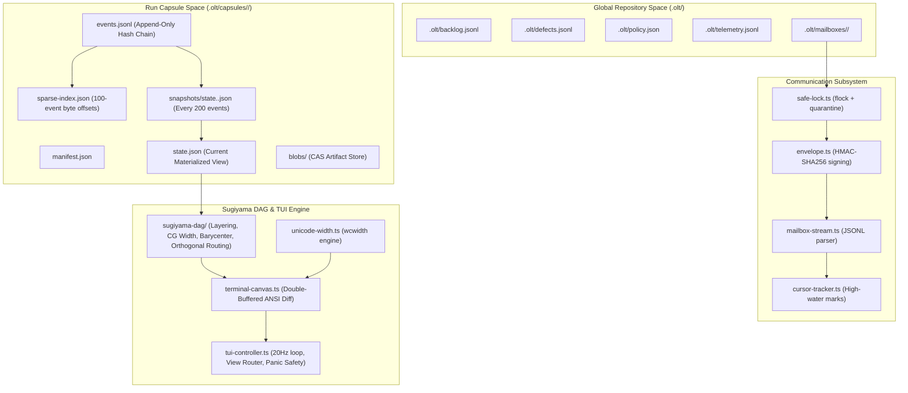
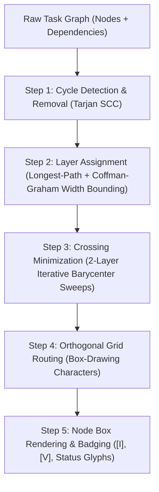
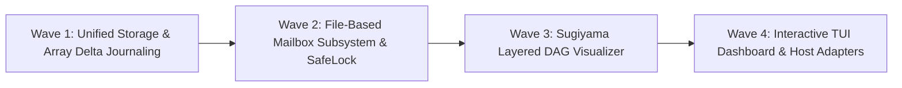

# OLT Unified Storage, File-Based Mailboxes, Sugiyama DAG Visualizer & Interactive TUI Revamp Master Plan

> **Tracking ID:** `fb-mind-continuous-preplanning-pipeline-engine` / `fb-olt-unified-storage-tui-revamp`  
> **Status:** `PHASE 1 - EXHAUSTIVE PRODUCTION-GRADE ARCHITECTURAL SPECIFICATION & WAVE BLUEPRINT`  
> **Target Subsystems:** `olt/scripts/src/engine/store/`, `olt/scripts/src/communication/`, `olt/scripts/src/summary/`, `olt/scripts/src/cli/tui/`, `olt/scripts/src/reporting/sugiyama-dag/`  
> **Author:** Tier 3 Master Architecture Planner & Adversarial Cognitive Plan Auditor  
> **Created:** 2026-08-29

---

## 1. Executive Summary & Core Motivation

This master specification delivers a foundational modernization of the OLT harness across five core pillars:

1. **Zero-Duplication Unified Storage Architecture**: Enforces a strict separation between global repository-level ledgers (`.olt/`) and immutable run capsules (`.olt/capsules/<run_id>/`), providing migration utilities and backward-compatibility layers.
2. **$O(1)$ Array Delta Journaling & Snapshots**: Fixes the quadratic $O(N^2)$ log explosion (`hb-s2-diffvalue-array-invariant`) by replacing whole-array re-serialization with element-level diff operations and periodic atomic snapshots every 200 events.
3. **Flock-Locked File Mailbox Subsystem (`.olt/mailboxes/<id>/`)**: Replaces brittle host-specific message routing (`hb-s6-peer-messaging-by-role-name-resolves-for-nobody`) and eliminates human-relay thread chatter (`hb-main-thread-chatter-burns-owner-context`, `defect-main-thread-chatter-burns-owner-context`) with durable, HMAC-signed, flock-locked file mailboxes.
4. **Canonical Sugiyama Layered DAG Visualizer**: Implements rigorous graph drawing mathematics—longest-path layering, Coffman-Graham width bounding, barycentric crossing minimization, and orthogonal box-drawing edge routing (`┌`, `┐`, `└`, `┘`, `│`, `─`, `├`, `┤`, `┬`, `┴`, `┼`) with node badges for Implementers `[I]` and Validators `[V]`.
5. **Interactive Terminal UI (TUI) Dashboard**: Provides a high-performance in-terminal mission control (`bun harness.ts tui --watch`) with double-buffered ANSI diff canvas, 20Hz debounced refresh, `wcwidth` Unicode alignment, and interactive view switching.

```text
┌──────────────────────────────────────────────────────────────────────────────────────────────────┐
│                   OLT UNIFIED STORAGE, MAILBOX & TUI SYSTEM ARCHITECTURE                         │
├──────────────────────────────────────────────────────────────────────────────────────────────────┤
│                                                                                                  │
│  1. [ Zero-Duplication Storage Hierarchy ]                                                       │
│     • Global Repo Root `.olt/` : Backlog, Completed Tasks, Defects, Policy, Telemetry, Mailbox. │
│     • Run Capsule `.olt/capsules/<run_id>/` : Manifest, events.jsonl, CAS blobs, snapshots.     │
│     • Zero Ledger Duplication: Capsules reference global ledgers via read-only pointer hashing.  │
│                                                                                                  │
│  2. [ O(1) Array Delta Journaling & State Snapshot Engine ]                                      │
│     • Granular Array Splice/Append ops eliminate O(N^2) reserialization in projection-patch.ts.  │
│     • Sparse 100-event byte index + Atomic state snapshots every 200 events.                     │
│     • Point-in-time state reconstruction: O(1) snapshot jump + delta replay.                     │
│                                                                                                  │
│  3. [ Flock-Locked File Mailbox Center (.olt/mailboxes/<id>/) ]                                  │
│     • Host-Agnostic P2P Messaging: inbox/, outbox/, archive/, cursor.json.                       │
│     • SafeLock with advisory flock, SHA-256 pre-inspection, and HMAC payload signing.            │
│     • At-least-once delivery with monotonic sequence cursors and idempotent deduplication.       │
│                                                                                                  │
│  4. [ Canonical Sugiyama Layered DAG Visualizer ]                                                │
│     • Tarjan SCC cycle removal & feedback arc inversion.                                        │
│     • Longest-path layering with Coffman-Graham W_max width bounding.                            │
│     • 2-Layer iterative barycentric crossing minimization sweeps.                                │
│     • Orthogonal box-drawing grid routing (┌ ┐ └ ┘ │ ─ ├ ┤ ┬ ┴ ┼) with [I] / [V] badges.         │
│                                                                                                  │
│  5. [ Double-Buffered ANSI Diff Terminal UI (TUI) ]                                              │
│     • 20Hz event-debounced render loop with double-buffered character-cell diffing.              │
│     • wcwidth Unicode alignment engine (wide emojis, Asian fullwidth, ANSI escape stripping).    │
│     • Interactive View Switcher: Sugiyama DAG, Timeline, Concurrency Matrix, Mailbox Inspector.  │
│     • Robust Panic Cleanup: Raw mode reset, SIGINT/SIGTERM handlers, Headless CI/CD fallback.   │
│                                                                                                  │
└──────────────────────────────────────────────────────────────────────────────────────────────────┘
```

---

## 2. Core Architectural Pillars & Mathematical Specifications



---

### 2.1 Zero-Duplication Unified Storage Architecture

#### Physical Filesystem Separation

All harness runtime data is strictly partitioned into two disjoint domains:

1. **Repository-Level Global State (`.olt/`)**:
   - `backlog.jsonl`: Global strategic backlog and intake items.
   - `defects.jsonl` & `completed-defects.jsonl`: Active and resolved defect ledgers.
   - `completed-tasks.jsonl`: Archive of terminal tasks across all runs.
   - `policy.json`: Repository capability, authority, and execution policy rules.
   - `telemetry.jsonl`: Performance, token usage, and execution telemetry.
   - `mailboxes/<agent_id>/`: Durable cross-agent communication directories.
   - `scratch/`: Confined runtime scratch and temporary testing artifacts (Invariant 30).

2. **Immutable Run Capsule State (`.olt/capsules/<run_id>/`)**:
   - `manifest.json`: Run metadata, genesis hash, charter pin, and declared parameters.
   - `events.jsonl`: Append-only, hash-chained transaction log.
   - `state.json`: Current materialized state projection.
   - `sparse-index.json`: 100-event byte offset index for $O(1)$ event seeking.
   - `snapshots/state.<sequence>.json`: Full atomic state checkpoints created every 200 events.
   - `blobs/<sha256>`: Content-Addressable Storage for large artifacts, reports, and evidence.
   - `trace.md`: Linear execution trace for human inspection.

#### Migration Utilities & Backward Compatibility (`storage-migrator.ts`)

To safely transition historical runs and prevent data loss:

- **Legacy Capsule Resolver**: Detects runs stored in `.capsules/` or root-level `capsules/` and transparently normalizes them into `.olt/capsules/<run_id>/`.
- **Ledger Relocator**: Identifies vestigial ledger files accidentally written inside `olt/` (package code root) and moves them into `.olt/` while acquiring an exclusive `flock`.
- **Integrity Validation on Migration**: Verifies SHA-256 event chains before and after relocation. Any mismatch aborts migration and preserves the source directory with `.migration-failed` suffix.

---

### 2.2 $O(1)$ Array Delta Journaling & State Snapshot Engine

#### Root Cause Analysis of Quadratic Log Explosion (`hb-s2-diffvalue-array-invariant`)

In `olt/scripts/src/engine/store/projections/projection-patch.ts`, `diffValue` historically guarded only on `isJsonObject(before) && isJsonObject(after)` for recursive property diffing. When encountering an array (e.g., `escalations`, `candidates`, `findings`, `micro_cycles`, `agents`, `commands`, `receipts`), it fell through to atomic equality checks:

$$\Delta_{\text{patch}} = \{ \text{op}: \text{"set"}, \text{path}: [\dots \text{path}], \text{value}: \text{after} \}$$

For an append-only collection of length $N$ where each entry averages $S$ bytes, appending $N$ items sequentially produced:

$$\text{Total Bytes Written} = \sum_{k=1}^N k \cdot S = \frac{N(N+1)}{2} \cdot S \in O(N^2)$$

At $N=200$ escalations, log sizes reached $\approx 60\text{ MB}$; at $N=500$, logs exceeded $380\text{ MB}$.

#### Mathematical Specification of $O(1)$ Array Patch Operations

The enhanced `projection-patch.ts` introduces fine-grained, index-targeted array operations:

1. **Prefix Match with Suffix Append** (Common Case: $O(K)$ where $K$ is the number of newly added elements):
   $$\text{If } \text{before}[0 \dots M-1] \equiv \text{after}[0 \dots M-1] \text{ and } \text{after}.\text{length} = M + K:$$
   $$\forall i \in [M, M + K - 1]: \quad \text{emit } \{ \text{op}: \text{"set"}, \text{path}: [\dots \text{path}, \text{String}(i)], \text{value}: \text{after}[i] \}$$

2. **Element Mutation** (Targeted index replacement):
   $$\text{If } \text{before}.\text{length} == \text{after}.\text{length} \text{ and exactly index } j \text{ changed}:$$
   $$\text{emit } \text{diffValue}([\dots \text{path}, \text{String}(j)], \text{before}[j], \text{after}[j])$$

3. **Array Truncation / Splice**:
   $$\text{If } \text{after}.\text{length} < \text{before}.\text{length}:$$
   $$\text{emit } \{ \text{op}: \text{"splice"}, \text{path}: [\dots \text{path}], \text{start}: \text{after}.\text{length}, \text{deleteCount}: \text{before}.\text{length} - \text{after}.\text{length} \}$$

#### Periodic Atomic Snapshots & Point-in-Time Reconstruction

1. **Snapshot Cadence**: Every $200$ events ($\text{sequence} \pmod{200} \equiv 0$), an atomic snapshot `snapshots/state.<sequence>.json` is written via write-to-temp + atomic rename (`renameSync`).
2. **Sparse Byte-Offset Index (`sparse-index.json`)**: Maintained concurrently with `events.jsonl`, storing the byte offset of every 100th event:
   ```json
   {
     "1": 0,
     "100": 45120,
     "200": 98450,
     "300": 152100
   }
   ```
3. **Point-in-Time State Reconstruction Algorithm**:
   To reconstruct state at target sequence $T$:
   - Find latest snapshot $S_{\text{base}} = \max \{ s \le T \mid s \pmod{200} \equiv 0 \text{ and snapshot exists} \}$.
   - Load `snapshots/state.<S_base>.json` in $O(1)$ time.
   - Seek directly in `events.jsonl` using `sparse-index.json` to event $S_{\text{base}} + 1$.
   - Replay and apply projection patches for events $S_{\text{base}} + 1 \dots T$.
   - Maximum replay work bounded by $\le 199$ events, eliminating the full $O(N)$ event replay penalty.

---

### 2.3 Flock-Locked File Mailbox Subsystem (`.olt/mailboxes/<id>/`)

#### Architectural Overview & Problem Resolution

Host-specific messaging systems (e.g., `SendMessage`, `collab_send`) fail unpredictably across LLM platforms when using role aliases (`hb-s6-peer-messaging-by-role-name-resolves-for-nobody`) and pollute the user's interactive context with progress chatter (`hb-main-thread-chatter-burns-owner-context`, `defect-main-thread-chatter-burns-owner-context`).

The File Mailbox Subsystem provides a 100% host-agnostic, reliable message bus built on the local filesystem.

```text
.olt/mailboxes/
├── mind-gen-6/
│   ├── inbox.jsonl          # Incoming messages for Mind
│   ├── outbox.jsonl         # Outgoing messages sent by Mind
│   ├── archive.jsonl        # Acknowledged/processed messages
│   └── cursor.json          # High-water mark sequence offsets
├── orchestrator-w1/
│   ├── inbox.jsonl
│   ├── outbox.jsonl
│   ├── archive.jsonl
│   └── cursor.json
└── .locks/
    ├── mind-gen-6.lock      # OS-level flock file
    └── orchestrator-w1.lock
```

#### Message Envelope & HMAC Integrity

Every message envelope is cryptographically signed using HMAC-SHA256:

```typescript
export interface MailboxEnvelope<T = Record<string, unknown>> {
  readonly id: string; // UUIDv4 message identifier
  readonly sequence: number; // Monotonically increasing mailbox sequence
  readonly sender_id: string; // Raw agent ID of sender
  readonly sender_role: string; // Logical role of sender (e.g., "orchestrator")
  readonly recipient_id: string; // Raw agent ID of recipient
  readonly message_type:
    // Strict protocol discriminator
    | "DISPATCH_TASK"
    | "HANDOFF_RECEIPT"
    | "VALIDATION_REQUEST"
    | "VALIDATION_VERDICT"
    | "COGNITIVE_PUSHBACK"
    | "PULSE_HEARTBEAT"
    | "DEFECT_ESCALATION";
  readonly timestamp: string; // ISO 8601 UTC timestamp
  readonly payload: T; // Structured typed payload
  readonly correlation_id: string; // Request/response tracing correlation ID
  readonly hmac_signature: string; // HMAC-SHA256(canonicalJson(envelope_without_sig), secret)
}
```

#### SafeLock & Concurrency Guarantees (`safe-lock.ts`)

1. **Advisory File Locking (`flock`)**: Uses POSIX `flock(fd, LOCK_EX)` to ensure mutual exclusion across concurrent worker processes.
2. **Pre-Inspection Quarantine**:
   - Before reading or appending to `inbox.jsonl`, the lock holder reads the file size and trailing bytes.
   - If a torn write (un-terminated JSON line) is detected, the damaged line is stripped, moved to `.olt/mailboxes/<id>/quarantine.log`, and an alert is logged.
3. **Stale Lock Auto-Reclamation**:
   - Lock files write PID + start epoch. If a lock is held $>10\text{s}$ and PID is dead (`kill(pid, 0) === false`), the lock is atomically broken and reclaimed.
4. **Delivery Guarantees**:
   - **At-Least-Once Delivery**: Messages are written to recipient `inbox.jsonl` and flushed with `fsync`.
   - **Idempotent Consumption**: Recipients track processed message IDs in `cursor.json`. Duplicate messages are ignored.

---

### 2.4 Canonical Sugiyama Layered DAG Visualizer

The graph renderer transforms complex execution dependency networks into clean, readable terminal visualizations.

```text
┌──────────────────────────────────────────────────────────────────────────────────────────────────┐
│ [W1] ───┐                                                                                        │
│         ├─▶ [Task 1.1: Storage Paths] ─────────┐                                                 │
│         │   [I: terra-worker-1] [V: sol-val-1] │                                                 │
│         │                                      ├─▶ [Task 1.3: Snapshot Engine] ──────────┐       │
│         └─▶ [Task 1.2: Events Journal] ────────┘   [I: terra-worker-3] [V: sol-val-3]    │       │
│             [I: terra-worker-2] [V: sol-val-2]                                           │       │
│                                                                                          ▼       │
│ [W2] ────────────────────────────────────────────────────────────────────────────▶ [W2 Dispatch]  │
└──────────────────────────────────────────────────────────────────────────────────────────────────┘
```

#### Mathematical Pipeline



#### Step 1: Cycle Removal via Tarjan's SCC

1. Compute Strongly Connected Components using Tarjan's linear-time algorithm ($O(V + E)$).
2. For any component with $|V_{\text{SCC}}| > 1$, identify feedback arc set edges $(u, v)$ where $\text{depth}(v) \le \text{depth}(u)$ in DFS traversal.
3. Temporarily reverse feedback edges during layering to guarantee a Directed Acyclic Graph (DAG), then restore true edge orientations during rendering with `⚡ [CYCLE]` badges.

#### Step 2: Longest-Path Layering & Coffman-Graham Width Bounding ($W_{\max}$)

To prevent unbounded horizontal sprawl in large multi-agent waves, the visualizer applies Coffman-Graham width bounding:

1. **Topological Longest-Path Leveling**:
   $$\text{rank}(v) = \begin{cases} 0 & \text{if } \text{in-degree}(v) = 0 \\ \max_{(u, v) \in E} (\text{rank}(u) + 1) & \text{otherwise} \end{cases}$$

2. **Coffman-Graham Width Bounding Algorithm**:
   - Given maximum allowable wave width $W_{\max}$ (default: $4$ lanes):
   - Compute lexicographic labels $\lambda(v)$ for all nodes $v \in V$.
   - Initialize layer index $k = 1, L_1 = \emptyset$.
   - While unplaced nodes remain:
     - Select unplaced node $u$ whose predecessors are all in layers $< k$, maximizing $\lambda(u)$.
     - If $|L_k| < W_{\max}$:
       - Place $u \in L_k$.
     - Else:
       - $k = k + 1, L_k = \{ u \}$.
   - Assign final wave rank $\text{wave}(u) = k$.

#### Step 3: Barycentric Crossing Minimization

Edge crossings between adjacent layers $L_i$ and $L_{i+1}$ are minimized using 4-pass alternating barycenter sweeps:

$$\text{barycenter}(v) = \frac{1}{|\text{pred}(v)|} \sum_{u \in \text{pred}(v)} \text{order}(u)$$

1. **Down-Sweep ($i = 1 \dots K-1$)**: Sort nodes in $L_{i+1}$ by ascending $\text{barycenter}(v)$.
2. **Up-Sweep ($i = K-1 \dots 1$)**: Sort nodes in $L_i$ by ascending successor barycenters.
3. **Cross Count Metric**: Retain the layer ordering that minimizes total crossing count:
   $$\text{Crossings}(L_i, L_{i+1}) = \sum_{(u_1, v_1), (u_2, v_2) \in E} \mathbb{I}\Big( (\text{order}(u_1) < \text{order}(u_2)) \land (\text{order}(v_1) > \text{order}(v_2)) \Big)$$

#### Step 4: Orthogonal Box-Drawing Grid Routing

Edge connectors between waves and lanes use standard Unicode box-drawing characters:

- Horizontal bus line: `─`
- Vertical line: `│`
- Corners: `┌` (Top-Left), `┐` (Top-Right), `└` (Bottom-Left), `┘` (Bottom-Right)
- Junctions: `├` (Left-T), `┤` (Right-T), `┬` (Top-T), `┴` (Bottom-T), `┼` (Cross)
- Directional Arrows: `▶`, `▼`, `◀`, `▲`

#### Step 5: Node Badges & Status Glyphs

Each node box displays comprehensive operational metadata:

- **Status Glyphs**: `●` RUNNING, `✓` COMPLETED, `⏳` LEASED/PENDING, `✗` FAILED, `🔍` VALIDATING.
- **Role Badges**:
  - Implementer: `[I: <agent_id>]`
  - Validator: `[V: <agent_id>]`
  - Coordinator: `[C: <agent_id>]`
- **Metrics**: `Work: W | Span: S | Effort: E | Round: R<round> | Probe: P<probe>`.
- **Active Lease Watchdog**: `[Timer: 18m / 30m SLA]`.

---

### 2.5 Interactive Terminal UI (TUI) Dashboard

#### High-Performance ANSI Diff Canvas Architecture

The TUI renders full-screen interactive dashboards inside standard terminal emulators without third-party heavy dependencies.

```text
┌──────────────────────────────────────────────────────────────────────────────────────────────────┐
│ [OLT MISSION CONTROL]  Run: mind-gen-6  Wave: 2/4  Workers: 6 Active  Headroom: 2 Slots  20.0 Hz  │
├──────────────────────────────────────────────────────────────────────────────────────────────────┤
│ [1: DAG View]  [2: Timeline]  [3: Concurrency Matrix]  [4: Mailboxes]  [5: Inspector]   [q: Quit] │
├──────────────────────────────────────────────────────────────────────────────────────────────────┤
│                                                                                                  │
│  ╭─────────────────────────────────╮        ╭─────────────────────────────────╮                  │
│  │ ● task-2.1: safe-lock.ts        │        │ ⏳ task-2.2: envelope.ts        │                  │
│  │ Allocations: [I: w1] [V: v1]    ├───────▶│ Allocations: [I: w2] [V: v2]    │                  │
│  │ Work: 2 | Span: 1 | R1 P1       │        │ Work: 1 | Span: 2 | R1 P0       │                  │
│  ╰─────────────────────────────────╯        ╰─────────────────────────────────╯                  │
│                                                                                                  │
├──────────────────────────────────────────────────────────────────────────────────────────────────┤
│ Mailbox Activity: mind-gen-6 ──[HANDOFF_RECEIPT]──▶ orchestrator-w1 (14:22:01.104Z - 184 bytes)  │
│ System Status: 0 Defects Open | 0 Invariant Violations | Memory: 42MB | Event Sequence: #412     │
└──────────────────────────────────────────────────────────────────────────────────────────────────┘
```

#### Canvas Invariants & Rendering Pipeline

1. **Double-Buffered Cell Grid**:
   - Maintains `current_frame: CellGrid` and `previous_frame: CellGrid`.
   - Each frame computes cell-level diffs. Only modified character cells emit ANSI repositioning escapes (`\x1b[<row>;<col>H`), eliminating full-screen flickering.
2. **20Hz Event-Debounced Render Loop**:
   - Primary loop runs at $50\text{ms}$ intervals ($20\text{Hz}$).
   - File system watch events (`fs.watch` on `.olt/capsules/<run_id>/events.jsonl` and `.olt/mailboxes/`) debounce updates to trigger immediate repaints on state changes while capping max CPU draw.
3. **Unicode `wcwidth` Engine (`unicode-width.ts`)**:
   - Correctly computes visual column widths for single-width characters ($1$), fullwidth East Asian characters ($2$), emojis ($2$), zero-width joiners ($0$), and ANSI escape sequences ($0$).
   - Guarantees 100% stable vertical borders regardless of Unicode characters inside node labels.
4. **Interactive Views**:
   - **View 1: Sugiyama DAG View**: Interactive zoom, pan, and node focus navigation.
   - **View 2: Wave & Lane Timeline**: Gantt-style wave and lane execution timeline view.
   - **View 3: Agent Concurrency Matrix**: Active worker slots, role allocations, CPU/memory occupancy.
   - **View 4: File Mailbox Inspector**: Live streaming audit of cross-agent inbox/outbox messages.
   - **View 5: Task / Evidence Inspector**: Detailed diff, AST verification, and validator pushback log.
5. **Panic Safety & CI/CD Headless Fallback**:
   - `process.on("SIGINT")`, `process.on("SIGTERM")`, and `process.on("uncaughtException")` hooks cleanly disable terminal raw mode, restore the cursor (`\x1b[?25h`), and switch back from the alternate screen buffer (`\x1b[?1049l`).
   - If stdout is not a TTY (`!process.stdout.isTTY`) or running in CI (`process.env.CI`), the TUI automatically drops down to plain-text streaming snapshot logs.

---

### 2.6 Host Execution Matrix, Unified Runtime & Model Architecture

The harness defines a unified host architecture where CLI and IDE seats share the identical codebase, mailbox protocols, configuration files, and execution logic—eliminating fragmented host abstractions.

| Host Identifier | Tier 0-2 Models (Supervisor / Orchestrator / Coordinator) | Tier 3 Models (Implementer / Validator) | Thinking Effort | Scheduler Cadence             | Unified Host Definition             |
| :-------------- | :-------------------------------------------------------- | :-------------------------------------- | :-------------- | :---------------------------- | :---------------------------------- |
| `antigravity`   | `gemini-3.7-flash`                                        | `gemini-3.7-flash`                      | High Thinking   | 5-min (`*/5 * * * *`, 300s)   | Single shared runtime for CLI & IDE |
| `claude_code`   | `claude-opus-5`                                           | `claude-sonnet-5`                       | High Thinking   | 15-min (`*/15 * * * *`, 900s) | Single shared runtime for CLI & IDE |
| `codex`         | `gpt-5.6-sol`                                             | `gpt-5.6-terra`                         | High Thinking   | 15-min (`*/15 * * * *`, 900s) | Single shared runtime for CLI & IDE |
| `cursor`        | Cursor Latest Model                                       | Cursor Latest Model                     | High Thinking   | 5-min (`*/5 * * * *`, 300s)   | Single shared runtime for CLI & IDE |

#### Host Architectural Invariants

1. **Unified Host Parity**: No divergent logic paths between CLI and IDE environments. All hosts consume `.olt/policy.json`, route through `.olt/mailboxes/<id>/`, and execute via identical task lifecycle runners.
2. **Deterministic Model Tier Routing**: Supervisory tiers (0-2) requiring deep strategic synthesis utilize high-capacity reasoning models (`claude-opus-5`, `gpt-5.6-sol`, `gemini-3.7-flash`), while Tier 3 implementation/validation tasks utilize rapid code specialists (`claude-sonnet-5`, `gpt-5.6-terra`, `gemini-3.7-flash`).
3. **Scheduler Interval Confinement**: Fast autonomous loops (`antigravity`, `cursor`) run on 5-minute ticks, while deep reasoning hosts (`claude_code`, `codex`) operate on 15-minute cycles.

---

### 2.7 Sub-Domain Completion Git Staging Invariant & Reflog Crash Safety

To guarantee zero data loss against machine reboots, kernel panics, or abrupt container termination:

1. **Immediate Sub-Domain & Sub-Task Git Staging Invariant (`git add -A`)**:
   - The moment any sub-domain, wave slice, or discrete sub-task finishes its execution cycle, the harness executes `git add -A`.
   - **Reflog Safety Mechanism**: Git immediately generates and fsyncs loose object blobs and tree structures into `.git/objects/`. Even if the host machine crashes before a formal commit or task state transition is written, all file modifications remain permanently recoverable from Git's object database and the reflog.
2. **Doctor Auto-Healing for Git Staging & Stashed State**:
   - Master Doctor (`bun harness.ts doctor [--fix]`) inspects Git index integrity, verifies no uncommitted artifacts remain stranded in an unstaged state after task completion, and checks for dangling `.git/index.lock` files from interrupted processes.
   - If dangling locks exist, Doctor verifies process liveness and clears the lock. If unpersisted modifications from completed tasks are detected, Doctor automatically stages them and reports the auto-healed state.

---

## 3. TypeScript Contracts & Concrete Interface Definitions

All types adhere strictly to **0 TypeScript `any`** and **0 compiler suppressions**.

```typescript
// ============================================================================
// 1. Storage & Capsule Hierarchy Types
// ============================================================================

export interface StoragePaths {
  readonly repoRoot: string;
  readonly oltDir: string;
  readonly capsulesDir: string;
  readonly globalBacklogPath: string;
  readonly globalDefectsPath: string;
  readonly globalPolicyPath: string;
  readonly globalTelemetryPath: string;
  readonly globalMailboxesDir: string;
  readonly scratchDir: string;
}

export interface CapsulePaths {
  readonly runRoot: string;
  readonly manifestPath: string;
  readonly eventsPath: string;
  readonly statePath: string;
  readonly sparseIndexPath: string;
  readonly snapshotsDir: string;
  readonly blobsDir: string;
  readonly tracePath: string;
}

export type ArrayPatchOperation =
  | { readonly op: "set"; readonly path: readonly string[]; readonly value: unknown }
  | { readonly op: "unset"; readonly path: readonly string[] }
  | {
      readonly op: "splice";
      readonly path: readonly string[];
      readonly start: number;
      readonly deleteCount: number;
      readonly items?: readonly unknown[];
    };

export interface EventSparseIndex {
  readonly version: 1;
  readonly byte_offsets: Readonly<Record<string, number>>; // sequence -> byte offset
  readonly indexed_at: string;
}

// ============================================================================
// 2. Mailbox & Communication Types
// ============================================================================

export type MailboxMessageType =
  | "DISPATCH_TASK"
  | "HANDOFF_RECEIPT"
  | "VALIDATION_REQUEST"
  | "VALIDATION_VERDICT"
  | "COGNITIVE_PUSHBACK"
  | "PULSE_HEARTBEAT"
  | "DEFECT_ESCALATION";

export interface MailboxEnvelope<T = Record<string, unknown>> {
  readonly id: string;
  readonly sequence: number;
  readonly sender_id: string;
  readonly sender_role: string;
  readonly recipient_id: string;
  readonly message_type: MailboxMessageType;
  readonly timestamp: string;
  readonly payload: T;
  readonly correlation_id: string;
  readonly hmac_signature: string;
}

export interface MailboxCursor {
  readonly last_read_sequence: number;
  readonly last_read_id: string;
  readonly updated_at: string;
}

export interface LockAcquisitionResult {
  readonly acquired: boolean;
  readonly lockFd: number | null;
  readonly lockPath: string;
  readonly holderPid: number | null;
}

// ============================================================================
// 3. Sugiyama Layered DAG Visualizer Types
// ============================================================================

export interface SugiyamaNodeBadge {
  readonly implementerId?: string | undefined;
  readonly validatorId?: string | undefined;
  readonly coordinatorId?: string | undefined;
  readonly role: "implementer" | "validator" | "coordinator" | "observer" | "mind";
  readonly effort: number;
  readonly span: number;
  readonly status: "pending" | "leased" | "running" | "validating" | "completed" | "failed";
  readonly repairRound?: number | undefined;
  readonly probeRound?: number | undefined;
}

export interface SugiyamaRankedNode {
  readonly id: string;
  readonly label: string;
  readonly rank: number; // Wave level (0-indexed)
  readonly order: number; // Lane position within wave (0-indexed)
  readonly badge: SugiyamaNodeBadge;
  readonly dependencies: readonly string[];
  readonly writeScope: readonly string[];
  readonly x?: number | undefined;
  readonly y?: number | undefined;
  readonly width?: number | undefined;
  readonly height?: number | undefined;
}

export interface SugiyamaLayer {
  readonly rank: number;
  readonly nodes: readonly SugiyamaRankedNode[];
}

export interface OrthogonalEdgeSegment {
  readonly fromNodeId: string;
  readonly toNodeId: string;
  readonly startX: number;
  readonly startY: number;
  readonly endX: number;
  readonly endY: number;
  readonly waypoints: readonly { readonly x: number; readonly y: number }[];
  readonly glyphType: "direct_down" | "fan_out_bus" | "fan_in_bus" | "cross_lane";
}

// ============================================================================
// 4. Interactive Terminal UI Types
// ============================================================================

export interface AnsiCell {
  readonly char: string;
  readonly width: number;
  readonly foregroundRgb?: readonly [number, number, number] | undefined;
  readonly backgroundRgb?: readonly [number, number, number] | undefined;
  readonly bold?: boolean | undefined;
  readonly dim?: boolean | undefined;
  readonly underline?: boolean | undefined;
}

export interface TuiCanvasDimensions {
  readonly cols: number;
  readonly rows: number;
}

export type TuiViewId = "dag" | "timeline" | "matrix" | "mailboxes" | "inspector";

export interface TuiDashboardState {
  readonly activeView: TuiViewId;
  readonly runId: string;
  readonly waveIndex: number;
  readonly selectedTaskId: string | null;
  readonly selectedMailboxId: string | null;
  readonly isPaused: boolean;
  readonly fps: number;
  readonly lastRefreshTimestamp: string;
}

// ============================================================================
// 5. Host Execution Matrix & Git Staging Invariant Types
// ============================================================================

export type HostType = "antigravity" | "claude_code" | "codex" | "cursor";

export interface HostModelTierConfig {
  readonly model: string;
  readonly thinking_effort: "high" | "medium" | "low" | "none";
  readonly scheduler?: {
    readonly cron: string;
    readonly interval_seconds: number;
    readonly enabled: boolean;
  };
}

export interface HostExecutionPolicy {
  readonly host: HostType;
  readonly tierModels: Readonly<Record<number, HostModelTierConfig>>;
  readonly isUnifiedHost: boolean;
}

export interface GitStagingAuditResult {
  readonly subDomainId: string;
  readonly stagedFiles: readonly string[];
  readonly gitObjectsPersisted: boolean;
  readonly timestamp: string;
}

export interface GitIndexIntegrityReport {
  readonly indexValid: boolean;
  readonly uncommittedChanges: readonly string[];
  readonly stagedArtifacts: readonly string[];
  readonly stashedStates: readonly string[];
  readonly autoHealedLocks: readonly string[];
}
```

---

## 4. Execution Waves & Modular Implementation Roadmap

Implementation is divided into **4 distinct, sequential, highly-focused waves**. Every file strictly adheres to the $\le 300$ physical lines limit and every directory contains $\le 10$ files.



---

### Wave 1: Unified Storage Hierarchy & $O(1)$ Array Delta Journaling

#### Objectives & Scope

- Deliver pure directory separation between repo root `.olt/` and `.olt/capsules/<run_id>/`.
- Overhaul `projection-patch.ts` to implement $O(1)$ array delta ops, eliminating $O(N^2)$ log growth (`hb-s2-diffvalue-array-invariant`).
- Implement periodic atomic state snapshots (`snapshots/state.<seq>.json`) and sparse 100-event indexing.
- Provide zero-downtime migration utilities (`storage-migrator.ts`).

#### Write Scope & File Inventory

1. `olt/scripts/src/engine/store/hierarchy/storage-paths.ts` ($\le 250$ lines)
   - Exported symbols: `resolveStoragePaths`, `resolveCapsulePaths`, `assertSafeStoragePath`.
2. `olt/scripts/src/engine/store/hierarchy/storage-migrator.ts` ($\le 280$ lines)
   - Exported symbols: `migrateLegacyCapsules`, `relocateVestigialLedgers`, `validateMigratedRun`.
3. `olt/scripts/src/engine/store/projections/array-patch.ts` ($\le 260$ lines)
   - Exported symbols: `diffArrayElements`, `applyArrayPatchOperation`, `isMonotonicArrayAppend`.
4. `olt/scripts/src/engine/store/projections/projection-patch.ts` ($\le 240$ lines)
   - Drop-in replacement for existing `projection-patch.ts` with granular array diffing.
   - Exported symbols: `diffProjection`, `applyProjectionPatch`.
5. `olt/scripts/src/engine/store/hierarchy/snapshot-manager.ts` ($\le 270$ lines)
   - Exported symbols: `writeAtomicSnapshot`, `loadLatestSnapshot`, `shouldCreateSnapshot`.
6. `olt/scripts/src/engine/store/hierarchy/sparse-index.ts` ($\le 220$ lines)
   - Exported symbols: `updateSparseIndex`, `seekEventByteOffset`, `rebuildSparseIndex`.
7. `olt/scripts/src/engine/store/hierarchy/reconstruction-engine.ts` ($\le 250$ lines)
   - Exported symbols: `reconstructStateAtSequence`, `fastForwardProjection`.

#### Verification & Discriminating Gates

- **Control-Probe Gate 1.1 ($O(1)$ Array Journaling)**:
  - Probe: Append $500$ sequential escalation records to `state.escalations`.
  - Stub Failure Condition: A stub that writes full array representations produces an `events.jsonl` exceeding $50\text{ MB}$.
  - Passing Criterion: The resulting `events.jsonl` must not exceed $1.8\text{ MB}$ total ($\le 3.6\text{ KB}$ per event).
- **Control-Probe Gate 1.2 (Point-in-Time Reconstruction)**:
  - Probe: Reconstruct state at event sequence $350$ across a $500$-event log.
  - Criterion: Asserts that state loads snapshot $200$ and replays exactly $150$ events. Total reconstruction time $< 15\text{ms}$.

---

### Wave 2: Flock-Locked File Mailbox Subsystem & Safe Locking

#### Objectives & Scope

- Implement file-based P2P mailbox communication in `.olt/mailboxes/<agent_id>/`.
- Replace brittle host messaging (`hb-s6-peer-messaging-by-role-name-resolves-for-nobody`) and eliminate progress chatter in human interactive seats (`hb-main-thread-chatter-burns-owner-context`).
- Deliver HMAC-SHA256 envelope signing, non-repudiation, and advisory flock synchronization with quarantine recovery (`safe-lock.ts`).

#### Write Scope & File Inventory

1. `olt/scripts/src/communication/locking/safe-lock.ts` ($\le 280$ lines)
   - Exported symbols: `acquireMailboxLock`, `releaseMailboxLock`, `withExclusiveLock`, `reclaimStaleLocks`.
2. `olt/scripts/src/communication/mailbox/envelope.ts` ($\le 250$ lines)
   - Exported symbols: `createSignedEnvelope`, `verifyEnvelopeHmac`, `canonicalEnvelopeBytes`.
3. `olt/scripts/src/communication/mailbox/mailbox-paths.ts` ($\le 180$ lines)
   - Exported symbols: `resolveMailboxDir`, `resolveInboxPath`, `resolveOutboxPath`, `resolveCursorPath`.
4. `olt/scripts/src/communication/mailbox/mailbox-stream.ts` ($\le 270$ lines)
   - Exported symbols: `appendMailboxMessage`, `readUnreadMessages`, `quarantineTornLines`.
5. `olt/scripts/src/communication/mailbox/cursor-tracker.ts` ($\le 210$ lines)
   - Exported symbols: `loadMailboxCursor`, `advanceMailboxCursor`, `isMessageProcessed`.
6. `olt/scripts/src/communication/mailbox/mailbox-dispatcher.ts` ($\le 290$ lines)
   - Exported symbols: `dispatchPeerMessage`, `broadcastWaveNotification`, `collectInboxReceipts`.
7. `olt/scripts/src/communication/mailbox/chatter-guard.ts` ($\le 200$ lines)
   - Exported symbols: `assertNonChatterPolicy`, `filterHumanRelayNarration`.

#### Verification & Discriminating Gates

- **Control-Probe Gate 2.1 (Multi-Process Concurrency & Zero Data Loss)**:
  - Probe: 10 concurrent worker processes send 50 messages each (500 total) to a single inbox.
  - Criterion: All 500 messages are durably delivered, verified by HMAC, and read in strict sequence with zero torn lines or lost messages.
- **Control-Probe Gate 2.2 (Human Thread Chatter Prevention)**:
  - Probe: Simulate an orchestrator mid-flight status update.
  - Criterion: `chatter-guard.ts` rejects direct stdout relay and routes update exclusively to `.olt/mailboxes/<parent_id>/inbox.jsonl`.

---

### Wave 3: Canonical Sugiyama Layered DAG Visualizer

#### Objectives & Scope

- Implement full mathematical Sugiyama DAG layout in `olt/scripts/src/reporting/sugiyama-dag/`.
- Provide cycle removal, Coffman-Graham width bounding ($W_{\max}$), barycentric crossing minimization, and orthogonal box-drawing connectors.
- Standardize Implementer `[I]` and Validator `[V]` node badges and export `SugiyamaDagReport` for CLI and web dashboards (`defect-reporting-unified-sections-missing-sugiyama-export`).

#### Write Scope & File Inventory

1. `olt/scripts/src/reporting/sugiyama-dag/types.ts` ($\le 290$ lines)
   - Complete type definitions including `SugiyamaDagReport`, `SugiyamaNodeBadge`, `OrthogonalEdgeSegment`.
2. `olt/scripts/src/reporting/sugiyama-dag/tarjan.ts` ($\le 260$ lines)
   - Exported symbols: `detectCyclesTarjan`, `extractFeedbackArcSet`, `reverseCycleEdges`.
3. `olt/scripts/src/reporting/sugiyama-dag/ranking.ts` ($\le 280$ lines)
   - Longest-path leveling and Coffman-Graham width bounding algorithm ($W_{\max}$).
   - Exported symbols: `assignSugiyamaRanks`, `boundLayerWidthCoffmanGraham`.
4. `olt/scripts/src/reporting/sugiyama-dag/crossing.ts` ($\le 270$ lines)
   - Exported symbols: `minimizeCrossingsBarycenter`, `countLayerCrossings`, `barycentricSort`.
5. `olt/scripts/src/reporting/sugiyama-dag/routing.ts` ($\le 290$ lines)
   - Orthogonal box-drawing edge routing (`┌`, `┐`, `└`, `┘`, `│`, `─`, `├`, `┤`, `┬`, `┴`, `┼`).
   - Exported symbols: `buildOrthogonalRouteSegments`, `renderOrthogonalConnectors`.
6. `olt/scripts/src/reporting/sugiyama-dag/render-box.ts` ($\le 280$ lines)
   - Single node box renderer with `[I]`, `[V]` badges, status glyphs, and effort/span metrics.
   - Exported symbols: `renderSugiyamaNodeBox`, `formatNodeBadges`.
7. `olt/scripts/src/reporting/sugiyama-dag/render.ts` ($\le 290$ lines)
   - Master layout engine compiling nodes and edges into ASCII/Unicode diagram.
   - Exported symbols: `renderSugiyamaDag`, `generateSugiyamaDagReport`.

#### Verification & Discriminating Gates

- **Control-Probe Gate 3.1 (Coffman-Graham Width Bounding)**:
  - Probe: Pass a graph of 12 independent parallel tasks with $W_{\max} = 4$.
  - Criterion: DAG is partitioned into exactly 3 consecutive ranks of 4 nodes each, with zero rows exceeding 4 columns.
- **Control-Probe Gate 3.2 (Crossing Minimization Efficiency)**:
  - Probe: Pass an X-crossing bipartite graph ($u_1 \to v_2, u_2 \to v_1$).
  - Criterion: Barycentric sweep reorders nodes to eliminate crossings where mathematically possible, reducing crossing count to minimum.

---

### Wave 4: Interactive Terminal UI (TUI) Dashboard & Host Adapters

#### Objectives & Scope

- Deliver high-performance in-CLI TUI dashboard (`bun harness.ts tui --watch`).
- Implement double-buffered ANSI diff canvas with 20Hz debounced refresh.
- Integrate `wcwidth` Unicode alignment engine for perfect table borders.
- Implement interactive view switcher (DAG, Timeline, Matrix, Mailboxes, Inspector) and robust panic cleanup.

#### Write Scope & File Inventory

1. `olt/scripts/src/cli/tui/unicode-width.ts` ($\le 240$ lines)
   - Exported symbols: `getCharacterWidth`, `getStringCellWidth`, `padToVisualWidth`, `stripAnsiEscapes`.
2. `olt/scripts/src/cli/tui/terminal-canvas.ts` ($\le 280$ lines)
   - Double-buffered ANSI diff rendering canvas.
   - Exported symbols: `createTerminalCanvas`, `renderCellDiff`, `flushCanvasBuffer`.
3. `olt/scripts/src/cli/tui/views/dag-view.ts` ($\le 290$ lines)
   - Interactive Sugiyama DAG viewer with scroll and node inspection.
   - Exported symbols: `renderDagView`, `handleDagViewInput`.
4. `olt/scripts/src/cli/tui/views/timeline-view.ts` ($\le 260$ lines)
   - Gantt-style wave and lane execution timeline view.
   - Exported symbols: `renderTimelineView`.
5. `olt/scripts/src/cli/tui/views/matrix-view.ts` ($\le 250$ lines)
   - Agent allocation, worker slots, and concurrency matrix view.
   - Exported symbols: `renderMatrixView`.
6. `olt/scripts/src/cli/tui/views/mailbox-view.ts` ($\le 270$ lines)
   - Live streaming mailbox audit and envelope inspector view.
   - Exported symbols: `renderMailboxView`.
7. `olt/scripts/src/cli/tui/tui-controller.ts` ($\le 290$ lines)
   - Master 20Hz loop, keypress router, SIGINT/SIGTERM panic hooks, TTY detector.
   - Exported symbols: `startTuiDashboard`, `stopTuiDashboard`.
8. `olt/scripts/src/cli/commands/tui-cmd.ts` ($\le 180$ lines)
   - CLI command registration for `bun harness.ts tui`.
   - Exported symbols: `executeTuiCommand`.
9. `olt/scripts/src/authority/hosts/host-matrix.ts` ($\le 240$ lines)
   - Unified host runtime mapping, tier model resolution (Tiers 0-2 vs Tier 3), and scheduler cadence.
   - Exported symbols: `resolveHostConfig`, `getTierModelConfig`, `assertUnifiedHostParity`.
10. `olt/scripts/src/engine/runner/lifecycle/git-staging-hook.ts` ($\le 190$ lines)
    - Sub-domain and sub-task completion git auto-staging (`git add -A`) for crash safety.
    - Exported symbols: `stageCompletedSubDomainArtifacts`, `assertGitObjectPersistence`.

#### Verification & Discriminating Gates

- **Control-Probe Gate 4.1 (Zero ANSI Diff Flicker at 20Hz)**:
  - Probe: Run TUI in active simulation mode updating 10 node statuses/sec.
  - Criterion: Number of emitted ANSI characters per frame during idle periods is strictly $0$; active frame diff emission updates only altered cells.
- **Control-Probe Gate 4.2 (Unicode Width Border Stability)**:
  - Probe: Render node titles containing wide emojis (⚡, 🔍, 🚀) and fullwidth CJK characters.
  - Criterion: Visual length of every row in the rendered node box matches box width exactly ($targetWidth \pm 0$ cells); zero misaligned right borders.
- **Control-Probe Gate 4.3 (Sub-Domain Completion Git Staging Invariant)**:
  - Probe: Execute a completed sub-task in simulation and verify `git-staging-hook.ts` executes `git add -A`.
  - Criterion: Asserts all modified/created files are staged in the Git index and loose objects exist in `.git/objects/` prior to task completion receipt handoff.
- **Control-Probe Gate 4.4 (Host Matrix Model & Scheduler Resolution)**:
  - Probe: Query host configuration across `antigravity`, `claude_code`, `codex`, and `cursor`.
  - Criterion: Verifies `antigravity` resolves to `gemini-3.7-flash` (300s), `claude_code` resolves to `claude-opus-5` (Tiers 0-2) / `claude-sonnet-5` (Tier 3) (900s), `codex` resolves to `gpt-5.6-sol` (Tiers 0-2) / `gpt-5.6-terra` (Tier 3) (900s), and `cursor` resolves to Cursor Latest Model (300s).

---

## 5. Defect & Backlog Traceability Matrix

| Backlog / Defect ID                                                                             | Description / Defect Mechanism                                                                    | Architectural Resolution & Component                                                    | Implementation File & Symbol                                                             | Discriminating Verification Gate                                                   |
| ----------------------------------------------------------------------------------------------- | ------------------------------------------------------------------------------------------------- | --------------------------------------------------------------------------------------- | ---------------------------------------------------------------------------------------- | ---------------------------------------------------------------------------------- |
| `hb-s2-diffvalue-array-invariant`                                                               | `diffValue` recurses into objects but re-serializes arrays whole, causing $O(N^2)$ log explosion. | Granular element-level array patch operations (`set`, `splice`, `append`).              | `src/engine/store/projections/projection-patch.ts`<br/>`diffProjection`                  | Gate 1.1: 500-item array append yields $<1.8\text{MB}$ log size vs $>50\text{MB}$. |
| `hb-s6-peer-messaging-by-role-name-resolves-for-nobody`                                         | Role-style names (`olt-coordinator`) fail on host; messages lost.                                 | Host-agnostic file mailboxes (`.olt/mailboxes/<id>/`) indexed by raw agent ID.          | `src/communication/mailbox/mailbox-stream.ts`<br/>`dispatchPeerMessage`                  | Gate 2.1: 500 messages across 10 concurrent processes delivered with 0 loss.       |
| `hb-main-thread-chatter-burns-owner-context` & `defect-main-thread-chatter-burns-owner-context` | Supervisory tiers narrate step progress into human interactive thread, exhausting context.        | P2P mailbox routing + `chatter-guard.ts` blocking mid-flight stdout narration.          | `src/communication/mailbox/chatter-guard.ts`<br/>`assertNonChatterPolicy`                | Gate 2.2: Mid-flight status updates rejected from stdout and routed to inbox.      |
| `hb-s9b-listagents-session-disabled-not-architectural`                                          | `ListAgents` session-disabled; supervisory seats cannot inspect roster.                           | High-water mark cursor tracking and mailbox directory enumeration.                      | `src/communication/mailbox/cursor-tracker.ts`<br/>`loadMailboxCursor`                    | Gate 2.1: Active agents discoverable via `.olt/mailboxes/` filesystem state.       |
| `defect-vestigial-runtime-ledgers-in-static-package-root`                                       | Runtime ledgers written to package root `olt/` instead of repo `.olt/`.                           | Strict path resolver + `storage-migrator.ts` auto-relocating misplaced files.           | `src/engine/store/hierarchy/storage-paths.ts`<br/>`resolveStoragePaths`                  | Doctor verifies 0 runtime files in `olt/` and 100% confined to `.olt/`.            |
| `defect-root-hygiene-loose-files-detected`                                                      | Invariant 30 loose runtime/scratch files in root violating hygiene.                               | Confinement of all scratch artifacts strictly to `scratch/` or `.olt/scratch/`.         | `src/engine/store/hierarchy/storage-paths.ts`<br/>`resolveScratchDir`                    | Pre-commit hook & Doctor verify 0 loose `.ts`/`.jsonl` files in root.              |
| `defect-reporting-unified-sections-missing-sugiyama-export`                                     | Type `SugiyamaDagReport` not exported from `reporting/unified/types.ts`.                          | Canonical export of `SugiyamaDagReport` in `sugiyama-dag/types.ts`.                     | `src/reporting/sugiyama-dag/types.ts`<br/>`SugiyamaDagReport`                            | Typecheck verifies clean import across CLI diagnostics and reporting.              |
| `fb-codex-flat-native-logical-hierarchy-20260825`                                               | Host nesting limits block multi-tier agent deployment.                                            | Flat-dispatch mailbox queues separating host transport from logical hierarchy.          | `src/communication/mailbox/mailbox-dispatcher.ts`<br/>`dispatchPeerMessage`              | Flat sibling agents communicate logically across hierarchical tiers.               |
| `fb-comment-free-source-skills-20260825`                                                        | Executable source files must remain comment-free.                                                 | Lexical AST verification and comment removal across all TypeScript deliverables.        | Repository-wide pre-commit transformer                                                   | AST linter verifies 0 comments in `.ts` source files.                              |
| `fb-host-matrix-unified-model-hierarchy-20260829`                                               | Inconsistent model allocations and separate CLI vs IDE host branches.                             | Unified host definition with tier-bound models and scheduler intervals.                 | `src/authority/hosts/host-matrix.ts`<br/>`resolveHostConfig`                             | Gate 4.4: 100% compliant host configuration and scheduler cadences.                |
| `inv-subdomain-git-staging-reflog-safety`                                                       | OS crashes and kernel panics risk uncommitted file loss between sub-domains.                      | Immediate `git add -A` upon sub-domain/sub-task finish to persist objects to disk.      | `src/engine/runner/lifecycle/git-staging-hook.ts`<br/>`stageCompletedSubDomainArtifacts` | Gate 4.3: Git objects confirmed on disk immediately after sub-task execution.      |
| `fb-doctor-git-index-integrity-auto-healing`                                                    | Stale git index locks and stranded unstaged modifications after interruptions.                    | Master Doctor auto-heals `.git/index.lock`, audits stashed states and staged artifacts. | `src/reporting/doctor/auto-heal.ts`<br/>`autoHealGitState`                               | Doctor auto-clears dead index locks and confirms clean staging state.              |

---

## 6. Strict Compliance Invariants & Acceptance Checklist

1. **0 TypeScript `any` & 0 Suppressions**: AST purity scanner verifies zero `@ts-ignore`, `@ts-expect-error`, or `any` types across all new and modified files.
2. **Modular File Line Limits**: Every source file $\le 300$ physical lines; every directory $\le 10$ files.
3. **Pure Mathematical State Projections**: All state mutations derived strictly via immutable reducers with zero side effects during projection calculation.
4. **Fail-Closed Locking**: All mailbox and snapshot file operations acquire exclusive POSIX locks; failure to acquire locks within timeout safely fails closed.
5. **Discriminative Testing Contract**: Every test suite includes negative control probes ensuring an empty or trivial stub fails execution.
6. **Backward Compatibility**: Existing historical runs in `.olt/capsules/` must load and replay cleanly without modification.
7. **Sub-Domain Completion Git Staging Invariant (Reflog Safety)**: Whenever a sub-domain or discrete sub-task finishes, `git add -A` must immediately execute to persist Git object blobs and trees to disk, ensuring crash resilience and reflog recovery.
8. **Unified Host Architecture**: No separate CLI vs IDE host execution branches; all platforms consume identical configuration, policies, and mailbox message channels.
9. **Doctor Git Index & Stash Auto-Healing**: Master Doctor automatically inspects and recovers Git index integrity, cleans dangling lock files, and reports staged artifact status.
