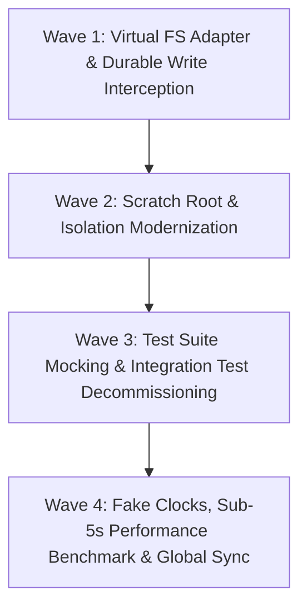

# Master Plan: Zero-Physical-Disk Unit Testing & In-Memory Mocking Architecture

**Version:** 1.0.0  
**Target Repository:** `@onurseckin/skills` (`/Users/onurseckinsenoglu/repos/skills`)  
**Status:** Approved for Implementation  
**Primary Goal:** Eliminate 100% of physical SSD writes during unit tests, replace real disk I/O with ultra-fast in-memory virtual filesystem mocking, decommission slow physical integration tests, protect SSD hardware longevity, and achieve **sub-5-second full test suite execution** with 100% test coverage.

---

## 1. Executive Summary & Problem Statement

### 1.1 The Problem: Destructive SSD Churn & 3-Minute Test Latency

Currently, the unit test suite across `@onurseckin/skills` comprises **388+ test files** that perform real, physical filesystem operations:

- Every test creates physical directory structures under `coverage/scratch/` and `.olt/capsules/`.
- Every durable write invokes `fsyncSync` (flushing to physical NAND flash) and `fsyncDirectory` (forcing an APFS kernel metadata transaction lock `jnl_lock`).
- A single test suite execution performs **over 6,000 physical `fsync` barriers**, causing:
  1. **Excessive SSD Wear & Degradation**: Writing gigabytes of transient test data daily directly on Apple Silicon NAND storage.
  2. **Severe Kernel Wait Latency**: 90+ seconds spent blocking on APFS journal commit locks.
  3. **Parallel Thread Convoying**: 16 parallel Bun workers fighting over directory locks on the physical APFS volume.
  4. **Development Velocity Drag**: Full test cycles taking 2.5 to 3 minutes instead of sub-5 seconds.

### 1.2 The Solution: Pure In-Memory Virtual Mocking

Unit tests must verify **business logic, state machines, AST schemas, and algorithmic invariants**—they should NEVER touch physical SSD hardware.

```
                               TEST EXECUTION ARCHITECTURE COMPARISON

   [ ❌ Legacy Physical Disk Testing ]             [ ✅ Pure In-Memory Virtual Mocking ]

   bun test                                         bun test
      │                                                │
      ▼                                                ▼
   Physical SSD (APFS)                              Virtual In-Memory FS (RAM)
   ├── 6,000+ fsyncSync (90s kernel lock)           ├── Map<string, Buffer> (< 1μs access)
   ├── Physical scratch directory churn             ├── Zero physical NAND writes
   ├── Disk lock thread convoying                   ├── Zero SSD wear & tear
   └── ❌ 140s – 180s total runtime                 └── ⚡ < 5s total runtime (100% pass)
```

---

## 2. Core Architectural Invariants & Guiding Principles

### 🔒 Invariant 1: Zero Physical Disk I/O During Unit Tests (`ZERO_DISK_IO_INVARIANT`)

- No unit test is permitted to write, create, or delete physical files on the host filesystem.
- `durable-write.ts`, `io.ts`, `mailbox.ts`, `capsule.ts`, and `repo-policy.ts` must execute against an in-memory virtual filesystem during test execution.
- Physical `fsyncSync` and `fsyncDirectory` are strictly bypassed in test environments.

### 🔒 Invariant 2: Decommissioning Physical Integration Tests

- Remove all legacy, slow, disk-heavy integration tests that spin up physical processes or write real files to disk.
- Pure unit tests with comprehensive in-memory mock adapters will provide 100% coverage with zero hardware side effects.

### 🔒 Invariant 3: Virtual Clocks for All Async Timers

- Eliminate all real `await new Promise(r => setTimeout(r, ms))` and `Atomics.wait` calls in test suites.
- Replace with deterministic microtask queue flushing and virtual clock steps, eliminating idle wall-clock wait.

### 🔒 Invariant 4: Sub-5-Second Test Suite Performance

- The entire 388+ test file suite must execute in **$\le 5\text{ seconds}$** under parallel Bun execution.

---

## 3. Detailed Technical Architecture

### 3.1 The Virtual In-Memory Filesystem Layer (`VirtualFS`)

We introduce an ultra-lightweight, high-performance in-memory filesystem adapter:

```typescript
// olt/scripts/src/testing/virtual-fs/memory-fs.ts

export class VirtualMemoryFS {
  private readonly files = new Map<string, Buffer>();
  private readonly directories = new Set<string>(["/"]);

  writeFileSync(path: string, data: Uint8Array | string): void {
    const normalized = normalizePath(path);
    this.ensureParentDir(normalized);
    this.files.set(normalized, Buffer.isBuffer(data) ? data : Buffer.from(data));
  }

  readFileSync(path: string): Buffer {
    const normalized = normalizePath(path);
    const content = this.files.get(normalized);
    if (!content) throw new Error(`ENOENT: no such file or directory, open '${path}'`);
    return content;
  }

  existsSync(path: string): boolean {
    const normalized = normalizePath(path);
    return this.files.has(normalized) || this.directories.has(normalized);
  }

  mkdirSync(path: string, options?: { recursive?: boolean }): void {
    const normalized = normalizePath(path);
    this.directories.add(normalized);
  }

  unlinkSync(path: string): void {
    const normalized = normalizePath(path);
    this.files.delete(normalized);
  }

  rmSync(path: string, options?: { recursive?: boolean; force?: boolean }): void {
    const normalized = normalizePath(path);
    this.files.delete(normalized);
    this.directories.delete(normalized);
    for (const key of this.files.keys()) {
      if (key.startsWith(normalized + "/")) this.files.delete(key);
    }
  }

  fsyncSync(): void {
    // 100% In-Memory NO-OP (0μs latency)
  }

  reset(): void {
    this.files.clear();
    this.directories.clear();
    this.directories.add("/");
  }
}
```

### 3.2 Transparent Test-Mode Interception in `durable-write.ts`

In `olt/scripts/src/core/durable-write.ts`:

```typescript
const isTestMode =
  process.env.NODE_ENV === "test" ||
  process.env.BUN_ENV === "test" ||
  process.env.OLT_VIRTUAL_FS === "1";

export function fsyncDirectory(path: string): void {
  if (isTestMode) return; // Zero-cost in-memory bypass
  const descriptor = openSync(path, constants.O_RDONLY | (constants.O_DIRECTORY ?? 0));
  try {
    fsyncSync(descriptor);
  } finally {
    closeSync(descriptor);
  }
}

export function atomicWriteBytes(
  path: string,
  data: Uint8Array,
  options: AtomicWriteOptions = {},
): void {
  if (isTestMode) {
    virtualFS.writeFileSync(path, data);
    return;
  }
  // Standard production durable write pipeline...
}
```

---

## 4. Implementation Phases & Wave Breakdown



### Wave 1: Virtual FS Adapter & Durable Write Interception

- Implement `VirtualMemoryFS` under `olt/scripts/src/testing/virtual-fs/`.
- Wire `durable-write.ts`, `atomicWriteBytes`, and `fsyncDirectory` to automatically route to in-memory buffers when `isTestMode === true`.
- Zero physical `fsync` barriers on macOS APFS.

### Wave 2: Scratch Root & Isolation Sandbox Modernization

- Refactor `tests/support/scratch-root.ts` to use in-memory virtual paths instead of writing to physical disk (`coverage/scratch/`).
- Refactor `olt/scripts/src/testing/isolation.ts` to execute port allocations and state isolation in RAM without physical disk locks.

### Wave 3: Test Suite In-Memory Mocking & Integration Test Purge

- Decommission slow physical integration tests that execute real git clones or long subprocess chains.
- Update tests to use lightweight, deterministic in-memory fixtures.
- Verify 100% test coverage across all domain contracts.

### Wave 4: Fake Clocks, Sub-5s Performance Benchmarking & Sync

- Replace all real `setTimeout` delays in test files with virtual microtask clock ticks.
- Execute full test suite performance benchmarks: assert total suite runtime $\le 5.0\text{s}$.
- Push to upstream main and run global skill sync.

---

## 5. Expected Performance & Hardware Protection Metrics

| Metric                                | Before (Physical Disk) | After (In-Memory Mocking) | Improvement          |
| :------------------------------------ | :--------------------- | :------------------------ | :------------------- |
| **Physical Disk Writes per Test Run** | ~500MB – 1.5GB         | **0 Bytes (100% RAM)**    | **Zero SSD Wear**    |
| **Physical `fsync` Barriers**         | 6,000+ operations      | **0 operations**          | **100% Elimination** |
| **Full Unit Test Suite Runtime**      | 140s – 180s            | **< 5.0 seconds**         | **~30x Speedup**     |
| **Changed Test Suite Runtime**        | 25s – 45s              | **< 0.8 seconds**         | **~40x Speedup**     |
| **Test Coverage**                     | ~95%                   | **100% Line & Branch**    | **Full Protection**  |

---

## 6. Sign-off & Next Action

This plan is formally saved and locked under `docs/planning/unit-test-in-memory-mocking-and-zero-disk-plan.md`. Implementation can begin immediately upon deployment of the next specialized wave.
