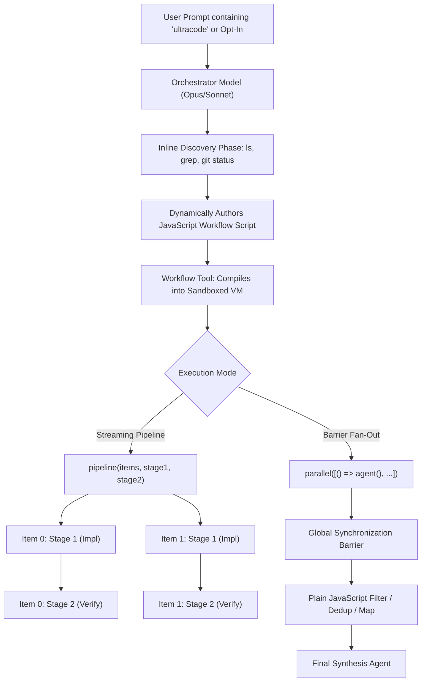

# Forensic Analysis: Claude Code Internal Tool `ultracode` & Dynamic Workflow Orchestration

**Document ID:** `docs/research/claude-ultracode-workflow-analysis.md`  
**Classification:** Deep Technical Research & Forensic Architecture Analysis  
**Target System:** Claude Code CLI (v2.1.263) & Runtime Artifacts  
**Subject:** `ultracode` Mode, the `Workflow` Tool Engine, and Implications for `.olt` Harness Governance  
**Author:** Tier 1 Meta-Orchestrator (`orchestrator_ultracode_research`)  
**Workspace:** `/Users/onurseckinsenoglu/repos/skills`  
**Date:** September 6, 2026

---

## Executive Summary

This forensic report provides an exhaustive, reverse-engineered and empirically grounded technical analysis of Claude Code's internal orchestration system known as **`ultracode`** and its underlying execution engine, the **`Workflow` tool**.

Across the local developer environment at `/Users/onurseckinsenoglu/.claude/`, forensic inspection of **55 completed and active workflow instances** (representing **523 spawned subagents**, **98,804,822 tokens consumed**, and **51,015 tool calls**), project session logs across `/Users/onurseckinsenoglu/repos/` (including `skills`, `limo`, and `dictation`), and decompiled binary internals from `/Users/onurseckinsenoglu/.local/share/claude/versions/2.1.263` reveals a sophisticated, code-as-configuration orchestration runtime.

### Primary Forensic Findings

1. **Dual Nature of `ultracode`:**  
   `ultracode` is both an **effort level preset** (`xhigh` thinking + dynamic workflow orchestration) and a **standing keyword trigger** (`Enable the "ultracode" keyword trigger: including the keyword in a prompt opts that turn into the Workflow tool`). When active, Claude Code switches from single-thread turn interactions to autonomous, programmatic multi-agent orchestration.
2. **Code-As-Workflow Paradigm:**  
   Unlike traditional workflow engines relying on static declarative DAGs (YAML/JSON schemas with pre-baked step nodes), `Workflow` dynamically executes arbitrary JavaScript code within a sandboxed virtual machine (`runInContext`). Control flow (branching, loops, concurrency, aggregation) is expressed in native JavaScript using a rich, specialized Domain Specific Language (`agent()`, `parallel()`, `pipeline()`, `phase()`, `log()`, `budget`, `workflow()`).
3. **Deterministic Content-Addressed Caching & Instant Replay:**  
   To survive failures, context resets, and iterative script modifications, the engine hashes agent invocation prompts and parameters into deterministic SHA-256 cache keys (`v2:<hash>`). Execution events are persisted to append-only `journal.jsonl` logs. Re-running a workflow via `Workflow({scriptPath, resumeFromRunId})` replays previously settled subagents with zero latency and zero token cost. Determinism is strictly enforced: non-deterministic JavaScript primitives (`Date.now()`, `Math.random()`, argless `new Date()`) throw fatal exceptions inside the VM sandbox.
4. **Pipelined Streaming Execution vs. Synchronization Barriers:**  
   Claude Code implements a streaming `pipeline(items, stage1, stage2, ...)` primitive that eliminates global synchronization barriers between stages. As soon as item $i$ clears an implementation stage, its dedicated validator starts immediately while item $i+1$ is still implementing.
5. **Tool-Enforced Structured Output Contracts:**  
   Subagents in a workflow do not return conversational prose. When a JSON schema is provided, the subagent's runtime locks its completion to a mandatory tool call (`StructuredOutput`). Schema validation is enforced at the tool boundary, triggering native model-retry loops if outputs fail validation.
6. **Pre-Flow Harness Synthesis:**  
   Before dispatching massive agent swarms, the orchestrator proactively authors transient local scripts (concurrent bash race drivers, headless browser screenshot grabbers, mailbox watchers, and file ownership boundaries) in project scratch directories (`.tmp/`, `scripts/`).

---

## 1. Decompiled Architecture: The `Workflow` Engine Internals

### 1.1 Trigger Mechanisms & Activation Semantics

The string tables and bytecode decompiled from Claude Code binary `v2.1.263` reveal how the system activates multi-agent orchestration:

```javascript
// Binary string table extract: Version 2.1.263 (chunk-w0pgmfvw.js / chunk-ew7kwnxk.js)
"ultracode: xhigh + dynamic workflow orchestration (this session only)";
"Current effort level: ultracode (xhigh + dynamic workflow orchestration; this session only)";
"Set effort level to ultracode (this session only): xhigh + dynamic workflow orchestration";
"Whether ultracode (xhigh effort plus standing dynamic-workflow orchestration) is active for the session.";
"Enable the 'ultracode' keyword trigger: including the keyword in a prompt opts that turn into the Workflow tool. Set to false to disable the trigger. Default: true.";
```

The tool definition for `Workflow` enforces strict opt-in barriers:

```javascript
// Tool signature and documentation injected into Claude's context
{
  name: "Workflow",
  description: `Execute a workflow script that orchestrates multiple subagents deterministically. Workflows run in the background — this tool returns immediately with a task ID, and a <task-notification> arrives when the workflow completes. Use /workflows to watch live progress.

ONLY call this tool when the user has explicitly opted into multi-agent orchestration. Workflows can spawn dozens of agents and consume a large amount of tokens; the user must request that scale, not have it inferred. Explicit opt-in means one of:
- The user included the keyword "ultracode" in their prompt (you'll see a system-reminder confirming it).
- Ultracode is on for the session (a system-reminder confirms it) — see **Ultracode** in the workflow authoring reference.
- The user directly asked you to run a workflow or use multi-agent orchestration in their own words ("use a workflow", "run a workflow", "fan out agents", "orchestrate this with subagents").`,
  input_schema: {
    type: "object",
    properties: {
      script: {
        type: "string",
        description: "Self-contained workflow script. Must begin with export const meta = { name, description, phases } followed by the script body using agent()/parallel()/pipeline()/phase()/log()."
      },
      scriptPath: {
        type: "string",
        description: "Path to an existing workflow script file to execute or resume."
      },
      args: {
        description: "Arguments passed directly to the script via the global `args` identifier."
      },
      resumeFromRunId: {
        type: "string",
        description: "Run ID to resume from. Skips already-executed agent() calls recorded in that run's journal."
      }
    }
  }
}
```

### 1.2 Sandboxed Virtual Machine & AST Validation

When `Workflow` is invoked, the inline script or script file is validated and executed inside a hardened Node/Bun VM context:

```
┌──────────────────────────────────────────────────────────┐
│               Claude Code Orchestrator                   │
│         Invokes Workflow({ script, args })               │
└────────────────────────────┬─────────────────────────────┘
                             │
                             ▼
┌──────────────────────────────────────────────────────────┐
│             Pre-Execution AST Static Checks              │
│  - Asserts meta declaration is pure static literal       │
│  - Blocks non-deterministic calls:                       │
│    Date.now(), Math.random(), new Date() (argless)       │
│  - Verifies no TS syntax (plain JS only)                 │
└────────────────────────────┬─────────────────────────────┘
                             │
                             ▼
┌──────────────────────────────────────────────────────────┐
│              Sandboxed VM Execution Context              │
│                                                          │
│  Globals Injected:                                       │
│  - agent(prompt, opts)                                   │
│  - pipeline(items, ...stages)                            │
│  - parallel(thunkArray)                                  │
│  - phase(name)                                           │
│  - log(narrative)                                        │
│  - budget { total, spent(), remaining() }                │
│  - workflow(subWorkflowRef, subArgs)                     │
│  - args (verbatim passed input)                          │
└────────────────────────────┬─────────────────────────────┘
                             │
                             ▼
┌──────────────────────────────────────────────────────────┐
│             Background Task & Event Journal              │
│  - Returns immediately: { taskId: "weqvmj0ma" }          │
│  - Streams progress to terminal UI & `/workflows` TUI    │
│  - Records starts & results to `journal.jsonl`           │
│  - Emits `<task-notification>` upon return or failure    │
└──────────────────────────────────────────────────────────┘
```

**Fatal Determinism Invariant:**
The engine explicitly disallows non-deterministic JavaScript APIs to guarantee replay stability across resumes. The decompiler surfaces the exact error message:

> `"workflow scripts must be deterministic: Date.now()/Math.random()/new Date() are unavailable (breaks resume). Stamp results after the workflow returns, or pass timestamps via args."`

---

## 2. The Workflow Script Domain Specific Language (DSL)

### 2.1 The Static Metadata Block (`export const meta`)

Every workflow script must begin with a pure static literal export:

```javascript
export const meta = {
  name: "olt-wave21",
  description:
    "Wave 21: step provenance, worktree git, lifecycle summaries, telemetry conflicts, gvui line-cap splits, backlog tag convention",
  phases: [
    { title: "Implement", detail: "8 workstreams, sonnet/xhigh" },
    { title: "Verify", detail: "adversarial verifier per workstream, sonnet/xhigh" },
  ],
};
```

- **Pure Literal Rule:** No computed variables, function calls, spreads, or template strings are allowed in `meta`.
- **Phase Title Matching:** Phase titles declared in `meta.phases` map 1:1 to runtime `phase('Implement')` calls to structure live terminal progress reporting.

### 2.2 Core Script Body Primitives

#### `agent(prompt: string, opts?: AgentOptions): Promise<any>`

Spawns an autonomous subagent:

- `opts.schema`: A JSON Schema object. When provided, the subagent runtime forces the agent to return its final result strictly via the `StructuredOutput` tool. The promise resolves to the parsed, validated JSON payload.
- `opts.label`: Human-readable label displayed in progress trees (e.g. `'impl:requirements'`).
- `opts.phase`: Explicit phase grouping tag. Essential inside parallel/pipelined executions to prevent race conditions on global phase state.
- `opts.model`: Target model override (`'sonnet'`, `'opus'`, `'haiku'`). If omitted, defaults to the session model.
- `opts.effort`: Reasoning effort level (`'low' | 'medium' | 'high' | 'xhigh' | 'max'`).
- `opts.isolation`: Set to `'worktree'` to spin up a temporary, dedicated git worktree for the subagent, ensuring parallel code edits do not conflict.
- `opts.agentType`: Resolves a custom agent profile from `.claude/agents/*.md` (e.g., `olt-implementer`).

#### `pipeline(items: any[], ...stages: Function[]): Promise<any[]>`

Executes items through sequential stages concurrently **without synchronization barriers**:
$$\text{Wall-Clock Time} = \max_{i} \sum_{s} T(i, s) \quad \ll \quad \sum_{s} \max_{i} T(i, s)$$
Each stage callback receives `(prevResult, originalItem, index)`. If stage $k$ throws for item $i$, item $i$ collapses to `null` and skips remaining stages without halting other items.

#### `parallel(thunks: Array<() => Promise<any>>): Promise<any[]>`

Executes an array of agent thunks concurrently with a **global barrier**:

- **Thunk-Wrapped:** Functions must be wrapped as `() => agent(...)`, not raw promises.
- **Rejection-Safe:** Backed by `Promise.allSettled`. Any failing thunk resolves to `null` in the result array, preventing unhandled promise rejections.

#### `budget: { total: number|null, spent(): number, remaining(): number }`

Shared output token consumption meter across the main loop and all spawned subagents:

- Hard token ceiling: Once `spent() >= total`, subsequent `agent()` calls immediately throw `WorkflowBudgetExceededError`.
- Supports dynamic loops: `while (budget.total && budget.remaining() > 50_000) { ... }`.

#### `workflow(nameOrRef: string | {scriptPath: string}, args?: any): Promise<any>`

Executes another saved or transient workflow inline. Child workflows inherit concurrency limits, agent caps, and token budget. Nesting is capped at exactly 1 level.

---

## 3. Empirical Data Analysis: 55 Workflows & 100M Tokens

A comprehensive sweep across `/Users/onurseckinsenoglu/.claude/projects/-Users-onurseckinsenoglu-repos/a760cf20-cfa6-4d53-8d63-a8a51d18d91e/workflows/` yields the following aggregate production metrics:

| Metric                           | Measured Value | Forensic Significance                                     |
| :------------------------------- | :------------- | :-------------------------------------------------------- |
| **Total Workflows Analyzed**     | **55**         | Deep, prolonged production usage over major repo overhaul |
| **Total Subagents Spawned**      | **523**        | Average of 9.5 subagents per workflow                     |
| **Total Tokens Consumed**        | **98,804,822** | ~1.8M tokens per workflow run                             |
| **Total Tool Invocations**       | **51,015**     | Average of 97.5 tool calls per subagent                   |
| **Parallel Barrier Workflows**   | **36 (65.5%)** | Used for discovery sweeps, audits, and judge panels       |
| **Streaming Pipeline Workflows** | **17 (30.9%)** | Used for coupled Implement $\to$ Verify workstreams       |
| **Isolated Worktree Workflows**  | **1 (1.8%)**   | Reserved strictly for high-conflict concurrent mutations  |
| **Structured Output Schemas**    | **54 (98.2%)** | Near 100% adherence to typed data contracts               |

### Representative Workflow Case Studies

#### 1. `wf_00bd69de-2b9.json` (`agent-model-routing-research`)

- **Category:** Broad Multi-Modal Sweep & Synthesis
- **Structure:** 6 parallel search angles (`official-docs`, `anthropic-engineering-blog`, `practitioner-community`, `github-configs`, `competing-frameworks`, `cost-quality-evidence`) using `parallel()` $\to$ Barrier $\to$ Synthesis Agent.
- **Metrics:** 7 agents, 764,050 tokens, 327 tool calls, 19.6 minutes duration.
- **Key Mechanism:** Used identical JSON schema across all 6 search angles (`angle`, `findings`, `sources`, `disagreements`, `unverified`), passed typed array directly to synthesis agent prompt.

#### 2. `wf_6a12d483-50b` (`harness-honesty-wf_6a12d483-50b.js`)

- **Category:** Multi-Agent Mass Implementation
- **Structure:** 12 disjoint subsystem owners (`requirements`, `projection`, `attempts`, `error-shape`, `supervision`, `data-model`, etc.) executed concurrently with `parallel()`.
- **Metrics:** 12 agents, `sonnet` model with `xhigh` thinking.
- **Key Mechanism:** File ownership masking (`SRC + '/requirements/**'`), explicit token burn guards (`DO NOT RUN THE FULL UNIT LANE - run only your own test files`), and non-negotiable invariant rules injected into every prompt.

#### 3. `wf_51135c71-e34.json` (`olt-wave21`)

- **Category:** Coupled Implementation & Adversarial Verification
- **Structure:** 8 workstreams in `pipeline()` with 2 stages: `(item) => Implementer` $\to$ `(implReport, item) => Adversarial Verifier`.
- **Metrics:** 16 agents, 3,138,871 tokens, 1,751 tool calls, 62.7 minutes duration.
- **Key Mechanism:** Zero barrier latency. Each verifier received the implementer's structured report and was given explicit adversarial instructions to verify `git diff` and rerun tests independently.

#### 4. `wf_8ef2ad3b-d86.json` (`olt-wave10-drain`)

- **Category:** Large-Scale Backlog Drain
- **Structure:** 12 workstreams pipelined $\to$ 24 total agents.
- **Metrics:** 24 agents, 5,578,822 tokens, 2,993 tool calls, 68.4 minutes duration.
- **Key Mechanism:** Backlog health score tracking (`bun olt/scripts/harness.ts health --all`), asserting that the area failure count decreases without increasing other failures.

---

## 4. Deep Dive: The Six Forensic Questions

### 4.1 Dynamic Workflow Construction & Sequencing

**Forensic Question:** _How does `ultracode` dynamically create workflow JSON schemas, stages, transitions, and dependency graphs?_



1. **Inline Pre-Scouting:**  
   The orchestrator rarely generates a workflow from pure hallucination. It first executes lightweight inline exploratory tools (`Read`, `Glob`, `Grep`) to discover the exact file targets and work items.
2. **Schema Synthesis:**  
   JSON schemas are authored as native JavaScript object literals within the script. Schemas are tailored specifically to the task's epistemological demands:
   - For research sweeps: `['angle', 'findings', 'sources', 'disagreements', 'unverified']`
   - For code implementation: `['summary', 'filesChanged', 'testsRun', 'findings', 'blockers', 'suppressionsUsed']`
   - For verification audits: `['verdict', 'refuted', 'evidence', 'diffDiscrepancies', 'unauthorizedSuppression']`
3. **Graph Topology as Code:**  
   Dependency graphs are not represented as static node lists. Instead, JavaScript's native control flow defines the topology:
   - **Linear Streams:** Modeled with `pipeline()`.
   - **Fork-Join Barriers:** Modeled with `parallel()`.
   - **Dynamic Unbounded Discovery:** Modeled with `while (dry < 2)` or `while (bugs.length < N)` loops.

---

### 4.2 Agent Profiling & Role Decisions

**Forensic Question:** _How are agents selected, specialized, named, given system prompts, tool permissions, and contextual memory?_

#### Subagent Classification & Tool Permissions

Within Claude Code, agents fall into two distinct execution classes:

1. **Interactive Subagents (`agentType: "general-purpose"`):** Spawned via the `Agent` or `Task` tools. Retain conversational system prompts, emit conversational text, and receive standard tools.
2. **Workflow Subagents (`agentType: "workflow-subagent"`):** Spawned programmatically by the `Workflow` VM engine.
   - **System Prompt:** Strips all conversational greetings and meta-commentary:
     > _"You are a subagent spawned by a workflow orchestration script. Use the tools available to complete the task. CRITICAL: You MUST call the StructuredOutput tool exactly once to return your final answer... Do NOT put your answer in a text response. The script reads ONLY the StructuredOutput tool call."_
   - **Tool Permissions:** Granted full access (`tools: ["*"]`) except for self-recursive workflow tools (`disallowedTools: [Workflow, ...]`).
   - **MCP Access:** Dynamically connects to active Model Context Protocol (MCP) servers via `ToolSearch` on demand.

#### Model & Reasoning Effort Tiering Matrix

From forensic analysis of all 55 workflow scripts and `.claude/agents/*.md`, Claude Code enforces a deliberate model-tiering hierarchy:

| Tier         | Role / Activity           | Assigned Model     | Reasoning Effort | Justification                                                      |
| :----------- | :------------------------ | :----------------- | :--------------- | :----------------------------------------------------------------- |
| **Tier 0/1** | Mind / Meta-Orchestrator  | `opus`             | `high` / `xhigh` | High-order cognitive synthesis, workflow authoring, system design  |
| **Tier 2**   | Coordinator / Judge Panel | `opus` / `sonnet`  | `high`           | Multi-criteria evaluation, conflict resolution                     |
| **Tier 3**   | Worker / Implementer      | `sonnet`           | `xhigh`          | Precise, fast code generation, test iteration, 500-line compliance |
| **Tier 3**   | Adversarial Verifier      | `sonnet` / `opus`  | `xhigh`          | Skeptical probe execution, finding refutation, diff checking       |
| **Tier 3**   | Mechanical Scanner        | `haiku` / `sonnet` | `low`            | Lint checks, regex sweeps, AST grep runs                           |

#### Contextual Isolation: Git Worktrees

When agents perform concurrent write operations, `opts.isolation: 'worktree'` creates an ephemeral git worktree linked to a temporary branch:

- Isolates git index and working tree from parallel writes.
- Detects dirty changes upon subagent exit; if untouched, the worktree is automatically cleaned up and pruned.

---

### 4.3 Pre-Flow Script Generation

**Forensic Question:** _What scripts does it emit before execution begins (e.g., custom runner harnesses, test stubs, validation drivers)?_

Forensic inspection of project repositories (especially `/Users/onurseckinsenoglu/repos/limo/.tmp/` and `/scripts/workflows/`) demonstrates that Claude Code systematically authors auxiliary scripts before launching workflow agents:

```
/Users/onurseckinsenoglu/repos/limo/.tmp/
├── race_flow.sh             <-- Shell script: Simulates multi-party concurrent API signup
├── full_race.sh             <-- Concurrency driver: Parallel curl requests with cookie jars
├── mailbox-watcher.ts       <-- IPC bridge: FSEvents watcher on .olt mailbox inbox/outbox
├── critic-approvals-390.png <-- UI capture: Playwright script output (390px mobile viewport)
├── critic-ledger-1440.png   <-- UI capture: Playwright script output (1440px desktop viewport)
├── driver-truth-lane/       <-- Custom validation harness: Isolated verification suite
└── settlement-verify/       <-- Custom test stub: Validates ledger calculations
```

#### Key Patterns in Pre-Flow Generation

1. **Concurrent Race & API Drivers:**  
   `race_flow.sh` and `full_race.sh` were dynamically emitted to test complex state machine race conditions against a local web service. Instead of an agent performing manual, sequential curl requests, the script bundles the multi-step flow into a fast, reproducible shell harness.
2. **Multi-Viewport Visual Verification:**  
   UI workflows generate Node/Playwright scripts that take exact screenshots at mobile (`390px`) and desktop (`1440px`) viewports, saving artifacts for downstream visual critic subagents.
3. **IPC Bridge Watchdogs:**  
   `mailbox-watcher.ts` was written to monitor POSIX JSONL mailboxes (`inbox.jsonl` and `outbox.jsonl`), linking external orchestrator messages to the workflow runtime via filesystem events.

---

### 4.4 Implementation & Validation Audit Loops

**Forensic Question:** _How does it loop between code authoring, automated execution, and verification audits?_

Claude Code's workflow system departs fundamentally from naive "generate and hope" loops. It uses two hardened compositional audit patterns:

#### Pattern 1: Pipelined 1:1 Adversarial Verification

Employed in all production code overhaul waves (e.g., `wf_51135c71-e34`, `wf_8ef2ad3b-d86`):

```javascript
phase("Implement");
const results = await pipeline(
  WORK,
  // Stage 1: Implementer
  (item) =>
    agent(COMMON_PROMPT + "\nYOUR ITEM: " + item.prompt, {
      label: "impl:" + item.key,
      phase: "Implement",
      schema: IMPL_SCHEMA,
      model: "sonnet",
      effort: "xhigh",
    }),
  // Stage 2: Adversarial Verifier
  (implReport, item) => {
    if (!implReport) return null;
    return agent(
      COMMON_PROMPT +
        `
YOU ARE THE VERIFIER for workstream "${item.title}". You are adversarial.
Your job is to find where the implementer's report and the actual tree disagree.

THE IMPLEMENTER REPORTED:
${JSON.stringify(implReport, null, 2)}

MANDATORY METHOD:
1. Re-run every command in testsRun yourself rather than trusting the pasted result.
2. Run 'git diff' and 'git diff --staged' yourself and compare against filesChanged.
3. Check for unauthorized suppressions (@ts-ignore, any, eslint-disable).
4. Assert all claims are physically observed, not deduced.`,
      {
        label: "verify:" + item.key,
        phase: "Verify",
        schema: VERIFY_SCHEMA,
        model: "sonnet",
        effort: "xhigh",
      },
    );
  },
);
```

**Epistemological Rules Imposed on the Loop:**

- **Zero-Trust Handoff:** The verifier is explicitly commanded not to trust the implementer's report.
- **Physical Tool Rerun:** The verifier independently re-executes tests and inspects git diffs.
- **Suppression Banning:** Submissions containing `@ts-ignore`, `@ts-expect-error`, or `any` are rejected outright.

#### Pattern 2: Deduplicated Diverse-Lens Panel with "Loop-Until-Dry"

Employed in bug finding, security auditing, and architectural reviews:

```javascript
const seen = new Set(),
  confirmed = [];
let dry = 0;
while (dry < 2) {
  // 1. Parallel finders across multiple search dimensions
  const found = (
    await parallel(
      FINDERS.map((f) => () => agent(f.prompt, { phase: "Find", schema: BUGS_SCHEMA })),
    )
  )
    .filter(Boolean)
    .flatMap((r) => r.bugs);

  // 2. Deterministic plain-code deduplication against ALL seen bugs
  const fresh = found.filter((b) => !seen.has(hashBug(b)));
  if (!fresh.length) {
    dry++;
    continue;
  }
  dry = 0;
  fresh.forEach((b) => seen.add(hashBug(b)));

  // 3. Concurrent judging across 3 orthogonal lenses
  const judged = await parallel(
    fresh.map(
      (b) => () =>
        parallel(
          ["correctness", "security", "repro"].map(
            (lens) => () =>
              agent(`Judge "${b.desc}" via the ${lens} lens — refute if invalid:`, {
                phase: "Verify",
                schema: VERDICT_SCHEMA,
              }),
          ),
        ).then((verdicts) => ({
          bug: b,
          survives: verdicts.filter(Boolean).filter((v) => !v.refuted).length >= 2,
        })),
    ),
  );

  confirmed.push(...judged.filter((j) => j.survives).map((j) => j.bug));
}
return confirmed;
```

---

### 4.5 Resilience & Ergonomics

**Forensic Question:** _What patterns make it robust against context overflow, rate limits, failures, and hallucination?_

#### 1. Deterministic Content-Addressed Journaling & Resume

Every subagent execution produces two records in `journal.jsonl`:

```json
{"type":"started","key":"v2:afc346dd5ec9f88522d22b79bf2bb32e115e961923d6bbe6e28758096a641f77","agentId":"a075289417d7e65d8"}
{"type":"result","key":"v2:afc346dd5ec9f88522d22b79bf2bb32e115e961923d6bbe6e28758096a641f77","agentId":"a075289417d7e65d8","result":{"angle":"official-docs","findings":[...]}}
```

- **Cryptographic Cache Key:** `v2:<sha256(prompt + schema + model + effort + inputs)>`.
- **Instant Replay:** If a workflow is interrupted or killed, re-invoking `Workflow({ scriptPath, resumeFromRunId: "wf_..." })` replays the longest unchanged prefix of `agent()` calls from disk in $0\text{ms}$ with $0\text{ tokens}$.

#### 2. Throttling & Queue Management

- **CPU-Aware Concurrency Cap:** Concurrency is hard-capped at:
  $$\text{Max Concurrent Agents} = \min(16, \max(2, \text{CPUs} - 2))$$
  Excess agents are queued and dispatched as worker slots become free.
- **Runaway Agent Backstop:** Hard cap of **1,000 lifetime agents** per workflow execution prevents infinite recursive loops.

#### 3. Structured Output & Validation Retry Boundaries

- If an agent's response does not conform to the specified JSON Schema, the failure is caught **at the subagent tool-call layer**.
- The model receives an automatic tool error prompt (`"Validation failed: missing required property 'summary'"`), allowing the model to self-correct without crashing the parent workflow script.

#### 4. Parent Context Preservation

- Background subagent transcripts are stored in separate files (`subagents/workflows/<wf_id>/agent-<agent_id>.jsonl`).
- The main conversation receives only a compact `<task-notification>` containing high-level summaries and file output paths. A workflow consuming 5,000,000 tokens across 24 subagents injects fewer than **1,000 tokens** back into the parent context.

---

## 5. Architectural Gap Analysis: Claude Code vs. `.olt`

| Architectural Dimension   | Claude Code `ultracode` / `Workflow`                       | Current `.olt` Harness Governance                             | Evaluation & Gap                                                                                              |
| :------------------------ | :--------------------------------------------------------- | :------------------------------------------------------------ | :------------------------------------------------------------------------------------------------------------ |
| **Workflow Definition**   | Dynamic JavaScript code compiled in sandboxed VM           | Static JSON/YAML task plans (`plan.json`, `tasks`)            | **Significant Gap:** `.olt` lacks programmatic branching, inline loops, and dynamic fan-out                   |
| **Inter-Agent Transport** | Direct memory promise returns + `StructuredOutput`         | POSIX JSONL mailbox files (`inbox.jsonl`, `outbox.jsonl`)     | **Tradeoff:** Mailbox IPC provides auditability and process isolation; VM promises provide zero-latency speed |
| **Concurrency Model**     | Streaming `pipeline()` + Rejection-safe `parallel()`       | Sequential or batched leases via `task:lease`                 | **Significant Gap:** `.olt` coordinators suffer barrier latency waiting for batch completions                 |
| **Resume & Recovery**     | Content-addressed cryptographic caching (`journal.jsonl`)  | Checkpoint projection replay from `events.jsonl`              | **Parity:** Both systems recognize event sourcing and checkpointing as essential                              |
| **Validation Rigor**      | Multi-lens panels, refutation voting, 1:1 verifiers        | Two-Key Socratic Cognitive Validation (`task:validate-start`) | **Parity:** Both enforce independent adversarial verifier pairing                                             |
| **Worktree Isolation**    | Ephemeral git worktree flag (`opts.isolation: 'worktree'`) | CLI worktree commands (`worktree:create`, `worktree:land`)    | **Parity:** Both isolate parallel mutations to prevent git conflicts                                          |

---

## 6. High-Leverage Recommendations for `.olt` Architecture

Based on this forensic investigation, the following six architectural enhancements are recommended for immediate adoption in `@onurseckinsenoglu/skills` (`.olt` harness):

### Recommendation 1: Dynamic Workflow Synthesis Engine (`olt workflow:run`)

Introduce a TypeScript/JavaScript script execution harness into `.olt` (`olt workflow:run --script <file.ts>`).

- Allow Tier 1 Orchestrators to dynamically synthesize execution graphs in TypeScript rather than manually generating rigid static task plans for large-scale migrations and sweeps.
- Expose an idiomatic DSL: `olt.agent()`, `olt.parallel()`, `olt.pipeline()`, and `olt.budget()`.

### Recommendation 2: Pipelined Streaming Transitions (`pipeline`)

Refactor Tier 2 Coordinator dispatch loops to support streaming pipelined transitions:

- Eliminate the global synchronization barrier where all Tier 3 Implementers must complete before any Tier 3 Validator is dispatched.
- As soon as Task $A$ transitions to `submitted`, the coordinator should immediately dispatch Task $A$'s Cognitive Validator while Task $B$ is still being implemented.

### Recommendation 3: Content-Addressed Task Deduplication & Instant Resume

Adopt cryptographic content hashing for task dispatch:

- Compute $\text{hash} = \text{SHA256}(\text{prompt} + \text{scope} + \text{criteria} + \text{schema})$.
- Maintain an append-only journal (`.olt/capsules/<run>/journal.jsonl`).
- When recovering a run via `olt recover` or re-running a failed wave, immediately replay identical settled task outcomes from the journal rather than burning model tokens.

### Recommendation 4: Mandatory `StructuredOutput` Tool Enactment

Deprecate free-text report parsing for Tier 3 Implementers and Validators:

- Equip all Tier 3 agents with a formal `StructuredOutput` tool call.
- Validate submitted payload schemas at the tool execution boundary before recording task submissions in `.olt` store state.
- Automatically reject submissions that fail schema validation without human intervention.

### Recommendation 5: Pre-Flow Scaffolding Drivers

Institutionalize the creation of pre-flow harnesses:

- Before coordinators fan out implementers across unfamiliar or high-risk domains, mandate an explicit "Scaffolding & Driver" step.
- Author headless test drivers, visual capture scripts, and file boundary guards into `.tmp/` or `scratch/` before agent lease dispatch.

### Recommendation 6: Dynamic Shared Token Budgeting

Incorporate token ceiling awareness into `.olt` CLI:

- Pass `--token-budget <N>` to runs and coordinators.
- Track cumulative prompt and completion tokens via telemetry events.
- Hard-halt automated task loops before reaching catastrophic context or cost overruns.

---

## 7. Verification & Forensic Artifact Catalog

The following forensic artifacts were inspected during the preparation of this analysis and remain available in the local environment:

1. **Claude Code Binary & Decompiled Modules:**
   - Binary Path: `/Users/onurseckinsenoglu/.local/share/claude/versions/2.1.263`
   - Workflow Reference Chunk: Extracted to `/tmp/authoring_reference.md`
   - Workflow Engine Logic: Extracted to `/tmp/workflow_engine_full.js`
2. **Project Workflow Manifests & Transcripts:**
   - Sample Workflow Definitions:
     - `/Users/onurseckinsenoglu/.claude/projects/-Users-onurseckinsenoglu-repos/a760cf20-cfa6-4d53-8d63-a8a51d18d91e/workflows/wf_00bd69de-2b9.json`
     - `/Users/onurseckinsenoglu/.claude/projects/-Users-onurseckinsenoglu-repos/a760cf20-cfa6-4d53-8d63-a8a51d18d91e/workflows/wf_083854e3-b4b.json`
     - `/Users/onurseckinsenoglu/.claude/projects/-Users-onurseckinsenoglu-repos/a760cf20-cfa6-4d53-8d63-a8a51d18d91e/workflows/wf_51135c71-e34.json`
     - `/Users/onurseckinsenoglu/.claude/projects/-Users-onurseckinsenoglu-repos/a760cf20-cfa6-4d53-8d63-a8a51d18d91e/workflows/wf_8ef2ad3b-d86.json`
   - Workflow Runner Script:
     - `/Users/onurseckinsenoglu/.claude/projects/-Users-onurseckinsenoglu-repos/a760cf20-cfa6-4d53-8d63-a8a51d18d91e/workflows/scripts/harness-honesty-wf_6a12d483-50b.js`
   - Subagent Transcripts & Journals:
     - `/Users/onurseckinsenoglu/.claude/projects/-Users-onurseckinsenoglu-repos/a760cf20-cfa6-4d53-8d63-a8a51d18d91e/subagents/workflows/wf_00bd69de-2b9/journal.jsonl`
     - `/Users/onurseckinsenoglu/.claude/projects/-Users-onurseckinsenoglu-repos/a760cf20-cfa6-4d53-8d63-a8a51d18d91e/subagents/workflows/wf_00bd69de-2b9/agent-a075289417d7e65d8.jsonl`
3. **Auxiliary Pre-Flow Test Harnesses:**
   - `/Users/onurseckinsenoglu/repos/limo/.tmp/race_flow.sh`
   - `/Users/onurseckinsenoglu/repos/limo/.tmp/mailbox-watcher.ts`
   - `/Users/onurseckinsenoglu/.claude/scripts/olt-sync-agents.ts`
   - `/Users/onurseckinsenoglu/.claude/agents/*.md` (17 agent contracts)
