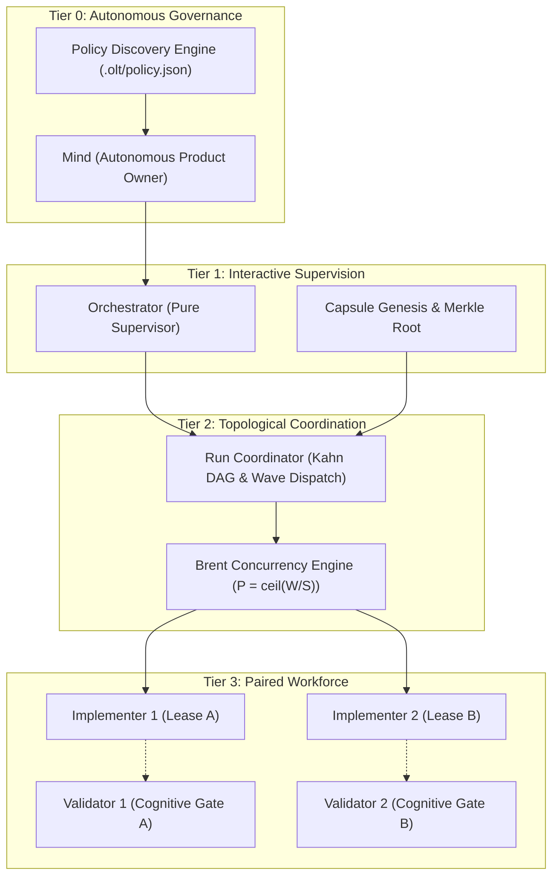

# OLT and Skill Collection Canonical Authoring and Governance Guidelines

[Previous: Repository Root](../../docs/README.md) | [Skill Manifest](../SKILL.md) | [Documentation Hub](../../docs/olt/README.md) | [Next: Book Overview](../../docs/book/README.md)

---

## 1. Executive Charter and Architectural Standards

This document establishes the single canonical Source of Truth (SSoT) for authoring, packaging, orchestrating, testing, and governing AI agent skills and documentation across the `@onurseckin/skills` repository and the **Orchestrating Long Tasks (OLT)** runtime engine.

Every skill, harness tool, agent manifest, and documentation artifact within this repository must adhere to the formal invariants, progressive disclosure contracts, multi-agent hierarchies, and quality gates codified in this standard.

```
+--------------------------------------------------------------------------------------------------+
|                            CANONICAL GOVERNANCE ARCHITECTURE MATRIX                              |
+--------------------------------------------------------------------------------------------------+
|                                                                                                  |
|   +---------------------------+         +---------------------------+                            |
|   | Open Agent Skills Spec    |  --->   | Diataxis Documentation    |                            |
|   | (agentskills.io)          |         | Quadrants (Procida)       |                            |
|   +-------------+-------------+         +-------------+-------------+                            |
|                 |                                     |                                          |
|                 v                                     v                                          |
|   +---------------------------+         +---------------------------+                            |
|   | 4-Tier Agent Hierarchy    |  --->   | Strict Zero Invariants    |                            |
|   | (Mind/Orch/Coord/Workers) |         | (0 any, 0 Suppressions)   |                            |
|   +---------------------------+         +---------------------------+                            |
|                                                                                                  |
+--------------------------------------------------------------------------------------------------+
```

### 1.1 Open Agent Skills Standard Alignment

OLT strictly implements the **Open Agent Skills Standard (`agentskills.io`)** utilizing a three-stage progressive disclosure context pipeline:

1. **Discovery Stage (Metadata)**: At agent startup or workspace indexing, the host platform parses the top-level YAML frontmatter in `SKILL.md` (< 500 tokens). No procedural documentation or script sources are injected into the LLM context.
2. **Activation Stage (Procedural Instructions)**: Upon user trigger or supervisor task assignment, the agent loads the core workflow instructions from `SKILL.md` (< 4,000 tokens).
3. **Execution Stage (Progressive On-Demand References)**: Deep reference manuals (`references/*.md`), role boundaries (`roles/*.md`), and architectural chapters (`docs/book/*.md`) are queried on-demand. CLI harness execution emits concise structured receipts (`HarnessBrief`) to the LLM context (< 150,000 tokens), preventing context window saturation.

```
+-----------------------------------------------------------------------------------------+
|                           PROGRESSIVE DISCLOSURE CONTEXT PIPELINE                       |
+-----------------------------------------------------------------------------------------+
|  [Discovery: SKILL.md Frontmatter] ---> Minimal Startup Footprint (< 500 tokens)        |
|                 |                                                                       |
|                 v                                                                       |
|  [Activation: Procedural Instructions] ---> Loaded on Task Activation (< 4,000 tokens)  |
|                 |                                                                       |
|                 v                                                                       |
|  [Execution: On-Demand References] ---> Progressively Queried Briefs (< 150,000 tokens) |
+-----------------------------------------------------------------------------------------+
```

---

## 2. Diataxis Documentation Architecture Standard

All documentation in this repository is strictly organized according to the **Diataxis Documentation Framework**, systematically dividing information into four distinct quadrants based on user orientation and cognitive intent:

```
+--------------------------------------------------------------------------------------------------+
|                                DIATAXIS DOCUMENTATION QUADRANTS                                  |
+----------------------------------------------+---------------------------------------------------+
|               PRACTICAL ACTION               |               THEORETICAL COGNITION               |
+----------------------------------------------+---------------------------------------------------+
|  TUTORIALS (Learning-Oriented)               |  EXPLANATION (Understanding-Oriented)             |
|  * Step-by-step guided onboarding journeys   |  * Architectural rationale and theoretical proofs |
|  * Executable end-to-end user workflows      |  * Brent concurrency and DAG scheduling theory    |
|  * Minimal, deterministic sandbox exercises  |  * Cryptographic Merkle chaining and flock theory |
|                                              |                                                   |
|  Location: docs/book/01-quickstart-*.md      |  Location: docs/book/02-*.md, docs/book/03-*.md   |
+----------------------------------------------+---------------------------------------------------+
|  HOW-TO GUIDES (Problem-Oriented)            |  REFERENCE (Information-Oriented)                 |
|  * Targeted operational repair recipes       |  * Exhaustive CLI command dictionaries and flags  |
|  * Crash recovery and torn-tail auto-healing |  * JSON Schemas (Draft 2020-12) & agent manifests |
|  * Socratic review repair wave playbooks     |  * HarnessError taxonomy and blunder catalogs     |
|                                              |                                                   |
|  Location: docs/book/08-*.md, 10-*.md        |  Location: docs/book/09-*.md, references/         |
+----------------------------------------------+---------------------------------------------------+
```

### 2.1 Repository Root vs. Skill Internal Documentation Boundaries

To ensure zero context bleed and maintain clean cognitive modularity:

- **Repository Educational Suite (`docs/`):** Reserved for cross-cutting educational manuals, the 10-chapter OLT Book (`docs/book/`), and repository-level indexes (`docs/README.md`).
- **Skill Canonical Directory (`<skill-name>/`):** Every skill contains its own dedicated, self-contained documentation suite:
  - `SKILL.md` — Canonical activation entry point and trigger index with YAML frontmatter.
  - `AGENTS.md` — Complete agent persona catalog, system instructions, and provider dispatch matrix.
  - `references/*.md` — Deep technical protocols, IPC specifications, and host adapters.
  - `checklists/*.md` — Pre-flight, quality assurance, and security checklists.
  - `roles/*.md` — Multi-agent role contracts and supervisory boundaries.
  - `docs/guidelines.md` — The canonical single source of truth guidelines (this document).

> [!IMPORTANT]
> Skill directories must never contain an internal `docs/` folder for ad-hoc operational guides; all technical references belong under `references/`. The only allowed file under `<skill-name>/docs/` is the canonical SSoT `guidelines.md`.

---

## 3. Four-Tier Multi-Agent Hierarchy and Supervisory Bounds

OLT enforces a rigid 4-tier supervisory model designed to prevent context degradation, eliminate self-grading blindspots, and guarantee deterministic task execution.



### 3.1 Tier 0: Autonomous Mind (`mind.yaml`)

- **Role & Scope:** Repository-level autonomous Product Owner operating in continuous background pulse loops (`observe` -> `triage` -> `admit`).
- **Invariants:**
  - Maintains sovereign backlog (`.olt/backlog.jsonl`) and monitors toolchain drift (`policy:check`).
  - Zero direct source code editing authority (`can_edit_files: false`).
  - Dispatches interactive runs via Tier 1 Orchestrator spawning.

### 3.2 Tier 1: Interactive Orchestrator (`orchestrator.yaml`)

- **Role & Scope:** User-facing interactive supervisor and root authority for a single long-running initiative.
- **Invariants:**
  - Establishes cryptographic capsule genesis under `.olt/capsules/<run-id>/` and initializes the Merkle event ledger (`events.jsonl`).
  - Pure supervisor purity: 0 direct file edits (`can_edit_files: false`).
  - Dispatches tasks exclusively through Tier 2 Coordinators; forbidden from directly executing Tier 3 worker tasks.

### 3.3 Tier 2: Run Coordinator (`coordinator.yaml`)

- **Role & Scope:** Topological workflow coordinator responsible for DAG generation, wave execution, and lease arbitration.
- **Invariants:**
  - Computes task dependencies using Kahn's topological sort algorithm and eliminates cycles via Tarjan strongly connected components (SCC) analysis.
  - Allocates parallel execution slots via Brent Concurrency scheduling:
    $$\text{Target Workers } P = \left\lceil \frac{W}{S} \right\rceil$$
    where $W$ is total work effort and $S$ is critical-path span.
  - Grants exclusive write-scope leases to Tier 3 workers and arbitrates heartbeats.

### 3.4 Tier 3: Paired Workforce (Implementers and Validators)

- **Implementers (`implementer.yaml`):**
  - Bound to strictly disjoint write scopes leased via `task:claim`.
  - Authorized to mutate files only within their declared lease (`can_edit_files: true`).
  - Zero cross-scope file mutation; attempts to touch files outside the lease are rejected by harness path guards.
- **Validators (`validator.yaml`):**
  - Independent, adversarial evaluators operating under the **Two-Key Principle** (the implementer cannot grade its own work).
  - **Cognitive Validator Hard-Lock Interlock:** Cognitive validators possess zero command-execution authority (`can_execute_shell: false`, 0 command tools) to guarantee purely objective textual and structural review.
  - **Mechanic Validators (`mechanic-validator.yaml`):** Retain shell execution authority exclusively for running deterministic test suites (`bun test`).

---

## 4. Strict Quality Gates and Invariant Enforcement

Every codebase contribution, harness tool, script, and documentation artifact must satisfy the six non-negotiable invariants:

```
+--------------------------------------------------------------------------------------------------+
|                                    SIX REPOSITORY INVARIANTS                                     |
+-------------------+------------------------------------------+-----------------------------------+
| Invariant         | Strict Requirement                       | Automated Enforcement Gate        |
+-------------------+------------------------------------------+-----------------------------------+
| Type Safety       | Exact 0 TypeScript 'any' or 'as any'     | bun run typecheck                 |
| Zero Suppressions | 0 @ts-ignore, @ts-expect-error, eslint   | bun test tests/unit               |
| Context Sizing    | Prod <= 200 lines, Tests <= 250 lines    | tests/unit/architecture/file-size |
| Zero Leakage      | 0 cross-skill runtime imports            | tests/unit/architecture/isolation |
| Native Runtime    | Native Bun and node:* built-ins only     | tests/unit/architecture/vendor    |
| Capsule Isolation | Ephemeral runtime state in .olt/capsules | tests/unit/docs/doc-separation    |
+-------------------+------------------------------------------+-----------------------------------+
```

### 4.1 Exact Zero TypeScript `any` Types

- TypeScript configuration (`tsconfig.json`) enforces `strict: true`, `noImplicitAny: true`, and `exactOptionalPropertyTypes: true`.
- Dynamic JSON or external payloads must be parsed and validated through explicit TypeScript type guards or schema parsers.

### 4.2 Zero Compiler and Linter Suppressions

- Suppressions including `@ts-ignore`, `@ts-expect-error`, `@ts-nocheck`, `eslint-disable`, and `oxlint-disable` are strictly forbidden in both production source code and test files.
- Type errors must be resolved structurally through proper type contracts and discriminator unions.

### 4.3 Context-Friendly Physical File Sizes

To ensure optimal attention distribution when code is loaded into LLM context windows:

- **Production Source Files:** Maximum 200 physical lines of code per file.
- **Unit and Integration Test Files:** Maximum 250 physical lines of code per file.
- Files approaching these boundaries must be refactored into cohesive modular sub-components within focused subdirectories.

### 4.4 Zero Cross-Skill Runtime Leakage

- Each skill within `<skill-name>/` must be completely self-contained.
- Scripts in `<skill-A>/scripts/` must never import modules or rely on runtime side effects from `<skill-B>/`. Shared utilities must be promoted to `packages/core/` or `packages/shared/`.

### 4.5 Zero Runtime External Dependencies

- All harness tooling and execution scripts must run directly on native `bun` or standard `node:` built-ins (`node:fs`, `node:path`, `node:crypto`, `node:child_process`, `node:os`, `node:url`).
- Zero `npm install` steps are permitted for client runtime activation.

### 4.6 Ephemeral Capsule Isolation and Repository Hygiene

- All active execution state, task logs, heartbeat tokens, and evidence files must live exclusively within ephemeral run capsules under `.olt/capsules/<run-id>/` (or `.capsules/<run-id>/`).
- Writing runtime data to `/tmp` or `.tmp/` is strictly prohibited to prevent cross-run pollution and permission collisions.
- Dynamic task plans must never be committed as static markdown files in repository root or `docs/planning/`.

---

## 5. Documentation Weight and Sizing Envelope Standards

Technical documentation must be substantive, rigorous, and practical, adhering to strict sizing and depth bounds:

```
+--------------------------------------------------------------------------------------------------+
|                               DOCUMENTATION SIZING ENVELOPE BOUNDS                               |
+-------------------+-------------------+----------------------------------------------------------+
| Classification    | Physical Lines    | Governance Policy and Enforcement Rule                   |
+-------------------+-------------------+----------------------------------------------------------+
| Shallow Stub      | < 100 lines       | STRICTLY FORBIDDEN. Merge into cohesive parent chapter.  |
| Minimum Viable    | 100 - 249 lines   | Acceptable only for localized sub-topic leaf nodes.       |
| Target Envelope   | 250 - 800 lines   | OPTIMAL STANDARD. Deep prose, tables, math, and diagrams.|
| Upper Catalog     | 800 - 1,200 lines | ACCEPTABLE for exhaustive CLI / schema catalogs.         |
| Monolith Dump     | > 1,200 lines     | STRICTLY FORBIDDEN. Decompose into modular subtopics.    |
+-------------------+-------------------+----------------------------------------------------------+
```

### 5.1 Document Decomposition Criteria

When a chapter or reference document exceeds 800 lines:

1. Identify independent sub-domains (e.g., CLI subcommands, protocol specifications, error recovery playbooks).
2. Decompose into dedicated sub-documents within a modular sub-folder (e.g., `docs/olt/architecture/14-harness-cli/`).
3. Maintain a clean parent `index.md` that introduces the architecture, summarizes child modules, and provides bidirectional navigation links.
4. Ensure every decomposed child document satisfies the minimum depth requirement (> 250 lines).

### 5.2 Depth and Content Density Directives

- **Conceptual Pseudocode & Interface Contracts:** Replace raw, unannotated code dumps with typed TypeScript interface contracts and step-by-step algorithmic pseudocode.
- **Mathematical Formulations:** Codify theoretical foundations using formal LaTeX notation ($P = \lceil W/S \rceil$, $Z_{\text{leakage}} = 0$, $H(X) = -\sum p(x) \log_2 p(x)$).
- **Visual Artifacts:** Every major chapter must feature at least one high-density ASCII architecture map and one Mermaid lifecycle or state diagram.

---

## 6. Universal Clean 4-Way Navigation Mesh Standard

Every markdown document across the repository documentation suite and skill references must feature a clean, emoji-free 4-way navigation bar at the top (immediately below the H1 header) and at the bottom (footer):

```markdown
[Previous: Descriptive Title](../../docs/README.md) | [Chapter Index](../../docs/olt/index.md) | [All Chapters Index](../../docs/book/README.md) | [Next: Descriptive Title](../../docs/olt/reference/quickstart.md)
```

### 6.1 Navigation Mesh Specifications

- **Previous Link:** Relative link to the preceding sequential document in the book or module sequence.
- **Chapter Index:** Relative link to the current chapter's or section's local index (`index.md`).
- **All Chapters Index:** Relative link to the master book summary (`SUMMARY.md`) or documentation hub (`README.md`).
- **Next Link:** Relative link to the subsequent sequential document.
- **Zero Emojis Invariant:** Emojis are strictly banned from navigation bars, H1-H6 headers, and table headers to ensure clean, high-density technical rendering across diverse markdown parsers and CLI terminals.
- **100% Relative Link Integrity:** All links must resolve relative to the current file's directory. Absolute filesystem paths (`/Users/...`, `C:\...`) are strictly prohibited and caught by automated CI link scrapers.

---

## 7. Multi-Client Provider Descriptors and Packaging

Skills must support universal discovery across heterogeneous AI assistant environments without requiring platform-specific forks:

```
+--------------------------------------------------------------------------------------------------+
|                            MULTI-CLIENT DISCOVERY & DISPATCH MATRIX                              |
+-------------------+-----------------------+------------------------------------------------------+
| Host Platform     | Descriptor Location   | Activation / Dispatch Mechanism                      |
+-------------------+-----------------------+------------------------------------------------------+
| Google Antigravity| agents/antigravity.yaml| Native tool calling via antigravity harness executor  |
| Claude Code       | agents/claude.yaml    | Claude Code prompt hooks and subagent delegation     |
| OpenAI Codex      | agents/codex.yaml     | Custom instructions & assistant function endpoints   |
| Cursor            | agents/cursor.yaml    | System rules and .cursorrules context injection      |
| Universal Fallback| agents/generic.yaml   | Generic CLI subshell execution & standard IPC streams|
+-------------------+-----------------------+------------------------------------------------------+
```

### 7.1 Agent Manifest Frontmatter Schema (`SKILL.md`)

```yaml
---
name: olt
version: 2026.1.0
description: Orchestrating Long Tasks multi-agent harness with topological scheduling and adversarial validation.
license: MIT
compatibility:
  runtimes:
    - bun >= 1.2.0
    - node >= 22.0.0
  hosts:
    - antigravity
    - claude-code
    - codex
    - cursor
    - generic
entrypoints:
  harness: olt/scripts/harness.ts
  orchestrator: olt/agents/orchestrator.yaml
  coordinator: olt/agents/coordinator.yaml
  mind: olt/agents/mind.yaml
---
```

### 7.2 Monorepo Symlink and Environment Synchronization

To distribute skill capabilities to all local client configuration directories, execute the universal synchronization engine:

```bash
bun scripts/sync/index.ts
```

This synchronizes skills, descriptors, and documentation symlinks across `~/.antigravity/skills/`, `~/.claude/skills/`, and `~/.cursor/skills/`.

---

## 8. Contribution, Review Lifecycle, and Conventional Commits

All human engineers and autonomous agents modifying skills or documentation follow a deterministic 8-step contribution pipeline:

```
+--------------------------------------------------------------------------------------------------+
|                                CONTRIBUTION & REVIEW LIFECYCLE                                   |
+--------------------------------------------------------------------------------------------------+
|                                                                                                  |
|   1. Claim Task / Scope       --> Acquire lease via 'harness task:claim'                         |
|   2. Context Boundary Check   --> Verify write-scope bounds & isolation invariants               |
|   3. Author Code / Docs       --> Implement changes within file size & typing budgets            |
|   4. Automated Verification   --> Execute full test runner and strict typecheck                  |
|   5. Socratic Self-Audit      --> Prove counterfactual falsifiability (2-Key Principle)          |
|   6. Staging & Reflog Safety  --> Execute 'git add -A' at atomic milestone boundaries            |
|   7. Task Submission          --> Submit task receipt via 'harness task:submit'                  |
|   8. Conventional Commit      --> Record git commit following conventional commit standards      |
|                                                                                                  |
+--------------------------------------------------------------------------------------------------+
```

### 8.1 Pre-Commit Verification Pipeline

Before submitting any task or committing changes, all verification commands must pass with exit code 0:

```bash
# 1. Execute unit test suite
bun test tests/unit

# 2. Strict TypeScript typechecking (0 any, 0 errors)
bun run typecheck

# 3. Codebase linting (0 suppressions, 0 warnings)
bun run lint

# 4. Format verification
bun run format:check

# 5. Global multi-client synchronization verification
bun scripts/sync/index.ts
```

### 8.2 Conventional Commit Standard

Commits must strictly conform to Conventional Commits formatting:

- `feat(<skill>): Add new capability or agent persona manifest`
- `fix(<skill>): Remediate boundary leak, type defect, or parser bug`
- `docs(<skill>): Update Diataxis documentation, book chapters, or references`
- `test(<skill>): Add falsifiable counterfactual test suite`
- `refactor(<skill>): Modularize subsystem to comply with 200-line limit`
- `chore(<skill>): Update configuration or synchronization metadata`

---

## 9. Governance Summary and Verification Checklist

| Requirement           | Formal Invariant                                         | Verification Mechanism                           |
| :-------------------- | :------------------------------------------------------- | :----------------------------------------------- |
| **Type Safety**       | 0 `any` annotations across all TypeScript files          | `bun run typecheck`                              |
| **Zero Suppressions** | 0 `@ts-ignore`, `@ts-expect-error`, `eslint-disable`     | `bun test tests/unit`                            |
| **File Sizing**       | Prod $\le 200$ lines, Tests $\le 250$ lines              | `tests/unit/architecture/file-size.test.ts`      |
| **Runtime Purity**    | 0 external npm runtime dependencies (native Bun/Node)    | `tests/unit/architecture/vendor-scanner.test.ts` |
| **Scope Confinement** | 0 file mutations outside assigned task write scope       | OLT Harness Lease Enforcer                       |
| **Documentation**     | Strict Diataxis quadrant compliance, 250-800 line sizing | `tests/unit/docs/`                               |
| **Link Integrity**    | 100% relative markdown link resolution, 0 broken links   | Automated Link Scraper Gate                      |
| **Navigation Mesh**   | 4-way top & bottom navigation bars, 0 emojis             | Documentation Linter Gate                        |

---

[Previous: Repository Root](../../docs/README.md) | [Skill Manifest](../SKILL.md) | [Documentation Hub](../../docs/olt/README.md) | [Next: Book Overview](../../docs/book/README.md)

<!-- Revision: 2026.1.0 -->
